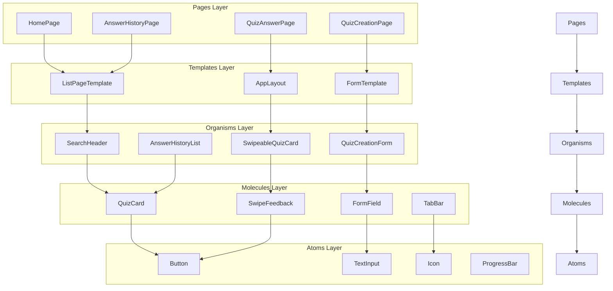

# コンポーネント一覧

## 概要

UI設計で定義されたワイヤーフレームを基に、実装するReactコンポーネントの一覧を定義します。Atomic Designパターンに従い、atoms（原子）、molecules（分子）、organisms（有機体）、templates、pagesに分類します。

## 参照ドキュメント

- [ホームページワイヤーフレーム](../3.01_wireframes/home-page.md)
- [クイズ一覧ページワイヤーフレーム](../3.01_wireframes/quiz-list-page.md)
- [クイズ回答ページワイヤーフレーム](../3.01_wireframes/quiz-answer-page.md)
- [クイズ作成ページワイヤーフレーム](../3.01_wireframes/quiz-creation-page.md)
- [回答履歴ページワイヤーフレーム](../3.01_wireframes/answer-history-page.md)

## Atomic Design分類

### Atoms（原子）

#### アクション・入力系

```typescript
// Button系
interface ButtonProps {
  variant: 'primary' | 'secondary' | 'danger' | 'ghost';
  size: 'sm' | 'md' | 'lg';
  children: React.ReactNode;
  onClick?: () => void;
  disabled?: boolean;
  fullWidth?: boolean;
}

// PrimaryButton: 「開始」「投稿」「完了」等のメインアクション
// SecondaryButton: 「プレビュー」「修正」「キャンセル」等のサブアクション
// DangerButton: 「削除」「終了」等の危険なアクション
// GhostButton: 「スキップ」「後で」等の軽微なアクション
```

```typescript
// Input系
interface TextInputProps {
  value: string;
  onChange: (value: string) => void;
  placeholder?: string;
  maxLength?: number;
  required?: boolean;
  error?: string;
  multiline?: boolean;
  autoResize?: boolean;
}

// TextInput: 単行テキスト入力
// TextAreaInput: 複数行テキスト入力（問題文・解説用）
// SearchInput: 検索用入力フィールド
```

```typescript
// Selection系
interface RadioButtonProps {
  name: string;
  value: string;
  checked: boolean;
  onChange: (value: string) => void;
  children: React.ReactNode;
}

// RadioButton: 正解・不正解選択
// CheckboxButton: タグ選択
// ToggleSwitch: オフライン同期等の設定
```

#### 表示系

```typescript
// Text系
interface TypographyProps {
  variant: 'h1' | 'h2' | 'h3' | 'body' | 'caption' | 'label';
  children: React.ReactNode;
  color?: 'primary' | 'secondary' | 'success' | 'warning' | 'error';
  align?: 'left' | 'center' | 'right';
}

// Heading: 見出し用テキスト
// BodyText: 本文用テキスト
// CaptionText: 説明・補足テキスト
// LabelText: ラベル用テキスト
```

```typescript
// Status系
interface BadgeProps {
  variant: 'success' | 'warning' | 'error' | 'info' | 'neutral';
  size: 'sm' | 'md';
  children: React.ReactNode;
}

// StatusBadge: 「承認待ち」「完了」等のステータス表示
// DifficultyBadge: 難易度星表示
// TagBadge: カテゴリタグ表示
```

```typescript
// Progress系
interface ProgressBarProps {
  current: number;
  total: number;
  variant?: 'linear' | 'circular';
  size?: 'sm' | 'md' | 'lg';
  showLabel?: boolean;
}

// ProgressBar: クイズ進捗・作成進捗表示
// LoadingSpinner: ローディング表示
// CharacterCounter: 文字数カウンター
```

#### アイコン系

```typescript
interface IconProps {
  name: IconName;
  size?: 'xs' | 'sm' | 'md' | 'lg' | 'xl';
  color?: string;
  className?: string;
}

// 使用アイコン一覧
type IconName = 
  | 'search' | 'settings' | 'close' | 'menu'
  | 'play' | 'create' | 'user' | 'history'
  | 'correct' | 'incorrect' | 'skip' | 'previous'
  | 'favorite' | 'share' | 'edit' | 'delete'
  | 'loading' | 'success' | 'warning' | 'error'
  | 'offline' | 'sync' | 'retry' | 'info';

// Icon: 汎用アイコンコンポーネント
// InteractionIcon: スワイプヒント用アイコン
// StatusIcon: ステータス表示用アイコン
```

### Molecules（分子）

#### フォーム関連

```typescript
// FormField: ラベル付き入力フィールド
interface FormFieldProps {
  label: string;
  required?: boolean;
  error?: string;
  hint?: string;
  children: React.ReactNode;
}

// QuestionInput: 問題文入力（文字数カウンタ付き）
// AnswerSelection: 正解・不正解選択
// ExplanationInput: 解説入力（任意・スキップ可能）
// TagSelector: タグ選択（公認タグ + ユーザータグ）
```

#### カード系

```typescript
// QuizCard: クイズ情報表示カード
interface QuizCardProps {
  quiz: {
    id: string;
    title: string;
    questionCount: number;
    difficulty: number;
    tags: string[];
    statistics: {
      averageScore: number;
      attemptCount: number;
    };
  };
  onStart: () => void;
  onPreview: () => void;
  onFavorite: () => void;
}

// HistoryCard: 回答履歴表示カード
// ResultCard: クイズ結果表示カード
// FeatureCard: おすすめクイズ表示カード
```

#### ナビゲーション系

```typescript
// TabBar: 底部ナビゲーション（Play/Create/MyPage）
interface TabBarProps {
  currentTab: 'play' | 'create' | 'mypage';
  onTabChange: (tab: string) => void;
}

// StepIndicator: 作成フロー進捗表示
// BreadcrumbNav: パンくずナビゲーション
// CategoryTabs: カテゴリータブ
```

#### フィードバック系

```typescript
// SwipeFeedback: スワイプ時の視覚フィードバック
interface SwipeFeedbackProps {
  direction: 'left' | 'right' | 'up' | 'down';
  visible: boolean;
  onComplete: () => void;
}

// ResultFeedback: 正解・不正解フィードバック
// LoadingState: ローディング状態表示
// EmptyState: 空状態表示
// ErrorState: エラー状態表示
```

### Organisms（有機体）

#### 検索・フィルタ

```typescript
// SearchHeader: 検索バー + フィルターボタン
interface SearchHeaderProps {
  query: string;
  onQueryChange: (query: string) => void;
  onFilter: () => void;
  resultsCount?: number;
}

// FilterModal: フィルター・ソート設定モーダル
// SearchResults: 検索結果リスト表示
// CategoryFilter: カテゴリフィルタ
```

#### クイズ機能

```typescript
// SwipeableQuizCard: スワイプ操作可能なクイズカード
interface SwipeableQuizCardProps {
  question: {
    id: string;
    question: string;
    correctAnswer: boolean;
    explanation: string;
    difficulty: number;
  };
  onAnswer: (correct: boolean) => void;
  onSkip: () => void;
  onPrevious: () => void;
}

// QuizCreationForm: 4ステップクイズ作成フォーム
// QuizPreview: プレビュー画面
// QuizResults: 結果画面
```

#### 履歴・統計

```typescript
// AnswerHistoryList: 回答履歴一覧
interface AnswerHistoryListProps {
  histories: AnswerHistory[];
  onItemClick: (id: string) => void;
  onFilter: (filters: HistoryFilters) => void;
  onLoadMore: () => void;
}

// StatisticsPanel: 統計情報パネル
// WrongQuestionsCollection: 間違い問題集
// LearningAnalytics: 学習分析チャート
```

#### システム系

```typescript
// OfflineIndicator: オフライン状態表示
// SyncStatus: 同期状態表示
// NetworkError: ネットワークエラー表示
// MaintenanceNotice: メンテナンス告知
```

### Templates（テンプレート）

#### レイアウトテンプレート

```typescript
// AppLayout: アプリ共通レイアウト
interface AppLayoutProps {
  header?: React.ReactNode;
  children: React.ReactNode;
  footer?: React.ReactNode;
  fullScreen?: boolean;
}

// PageTemplate: ページ共通テンプレート
// ModalTemplate: モーダル共通テンプレート
// FormTemplate: フォーム共通テンプレート
```

#### 機能テンプレート

```typescript
// ListPageTemplate: リスト表示ページテンプレート
interface ListPageTemplateProps {
  title: string;
  searchable?: boolean;
  filterable?: boolean;
  children: React.ReactNode;
}

// DetailPageTemplate: 詳細表示ページテンプレート
// CreationPageTemplate: 作成フォームページテンプレート
// ResultsPageTemplate: 結果表示ページテンプレート
```

### Pages（ページ）

#### メインページ

```typescript
// HomePage: ホーム画面（Playタブ）
// QuizListPage: クイズ一覧ページ
// QuizAnswerPage: クイズ回答ページ
// QuizCreationPage: クイズ作成ページ
// AnswerHistoryPage: 回答履歴ページ
```

#### サブページ

```typescript
// SearchResultsPage: 検索結果ページ
// QuizDetailPage: クイズ詳細ページ
// UserProfilePage: ユーザープロフィールページ
// SettingsPage: 設定ページ
// OfflinePage: オフライン専用ページ
```

## コンポーネント間の依存関係

### 依存関係図



## 実装優先度

### 高優先度（MVP必須）

1. **Atoms**: Button, TextInput, Icon, ProgressBar
2. **Molecules**: QuizCard, FormField, TabBar
3. **Organisms**: SwipeableQuizCard, SearchHeader
4. **Templates**: AppLayout, ListPageTemplate
5. **Pages**: HomePage, QuizAnswerPage

### 中優先度（機能完成）

1. **Atoms**: RadioButton, Badge, LoadingSpinner
2. **Molecules**: SwipeFeedback, ResultCard, StepIndicator
3. **Organisms**: QuizCreationForm, FilterModal
4. **Templates**: FormTemplate, DetailPageTemplate
5. **Pages**: QuizCreationPage, QuizListPage

### 低優先度（付加機能）

1. **Atoms**: CheckboxButton, CharacterCounter
2. **Molecules**: HistoryCard, CategoryTabs
3. **Organisms**: AnswerHistoryList, StatisticsPanel
4. **Templates**: ModalTemplate, ResultsPageTemplate
5. **Pages**: AnswerHistoryPage, SearchResultsPage

## 技術仕様

### 共通Props

```typescript
// 全コンポーネント共通
interface CommonProps {
  className?: string;
  testId?: string;
  'aria-label'?: string;
  'aria-describedby'?: string;
}

// インタラクティブコンポーネント共通
interface InteractiveProps extends CommonProps {
  disabled?: boolean;
  loading?: boolean;
  onClick?: (event: React.MouseEvent) => void;
}
```

### スタイリング規約

```typescript
// Tailwind CSS クラス命名規約
const styles = {
  // サイズ系
  sizes: {
    xs: 'text-xs px-2 py-1',
    sm: 'text-sm px-3 py-2',
    md: 'text-base px-4 py-2',
    lg: 'text-lg px-6 py-3',
    xl: 'text-xl px-8 py-4',
  },
  
  // カラー系
  colors: {
    primary: 'bg-blue-600 text-white hover:bg-blue-700',
    secondary: 'bg-gray-600 text-white hover:bg-gray-700',
    success: 'bg-green-600 text-white hover:bg-green-700',
    warning: 'bg-yellow-600 text-white hover:bg-yellow-700',
    error: 'bg-red-600 text-white hover:bg-red-700',
  },
  
  // レスポンシブ
  responsive: {
    mobile: 'block sm:hidden',
    desktop: 'hidden sm:block',
    touch: 'min-h-[44px] min-w-[44px]', // 44px最小タッチサイズ
  }
};
```

### アクセシビリティ要件

```typescript
// アクセシビリティ対応例
const AccessibleButton: React.FC<ButtonProps> = ({
  children,
  onClick,
  disabled,
  'aria-label': ariaLabel,
  ...props
}) => {
  return (
    <button
      type="button"
      onClick={onClick}
      disabled={disabled}
      aria-label={ariaLabel}
      aria-disabled={disabled}
      className={`
        focus:outline-none focus:ring-2 focus:ring-blue-500
        disabled:opacity-50 disabled:cursor-not-allowed
        ${styles.responsive.touch}
      `}
      {...props}
    >
      {children}
    </button>
  );
};
```

## テスト戦略

### Unit Tests

```typescript
// Atoms層のテスト例
describe('Button', () => {
  it('should render with correct variant styles', () => {
    render(<Button variant="primary">Click me</Button>);
    expect(screen.getByRole('button')).toHaveClass('bg-blue-600');
  });

  it('should be disabled when disabled prop is true', () => {
    render(<Button disabled>Click me</Button>);
    expect(screen.getByRole('button')).toBeDisabled();
  });

  it('should call onClick when clicked', () => {
    const handleClick = jest.fn();
    render(<Button onClick={handleClick}>Click me</Button>);
    fireEvent.click(screen.getByRole('button'));
    expect(handleClick).toHaveBeenCalled();
  });
});
```

### Integration Tests

```typescript
// Organisms層のテスト例
describe('SwipeableQuizCard', () => {
  it('should handle swipe gestures correctly', async () => {
    const handleAnswer = jest.fn();
    render(
      <SwipeableQuizCard
        question={mockQuestion}
        onAnswer={handleAnswer}
      />
    );
    
    // スワイプジェスチャーのシミュレーション
    const card = screen.getByTestId('quiz-card');
    fireEvent.touchStart(card, { touches: [{ clientX: 100, clientY: 100 }] });
    fireEvent.touchMove(card, { touches: [{ clientX: 200, clientY: 100 }] });
    fireEvent.touchEnd(card);
    
    await waitFor(() => {
      expect(handleAnswer).toHaveBeenCalledWith(true);
    });
  });
});
```

### Visual Regression Tests

```typescript
// Storybook + Chromatic でのビジュアルテスト
export default {
  title: 'Molecules/QuizCard',
  component: QuizCard,
} as ComponentMeta<typeof QuizCard>;

export const Default: ComponentStory<typeof QuizCard> = (args) => (
  <QuizCard {...args} />
);

export const Loading: ComponentStory<typeof QuizCard> = (args) => (
  <QuizCard {...args} loading />
);

export const Error: ComponentStory<typeof QuizCard> = (args) => (
  <QuizCard {...args} error="エラーが発生しました" />
);
```

## 関連ドキュメント

- [デザインシステム定義](design-system.md)
- [Storybook構築手順](storybook-setup.md)
- [DDD設計との統合](../5.01_integration/ddd-integration.md)

---
**作成工程**: UI設計  
**作成日**: 2025-01-31  
**更新日**: 2025-01-31
