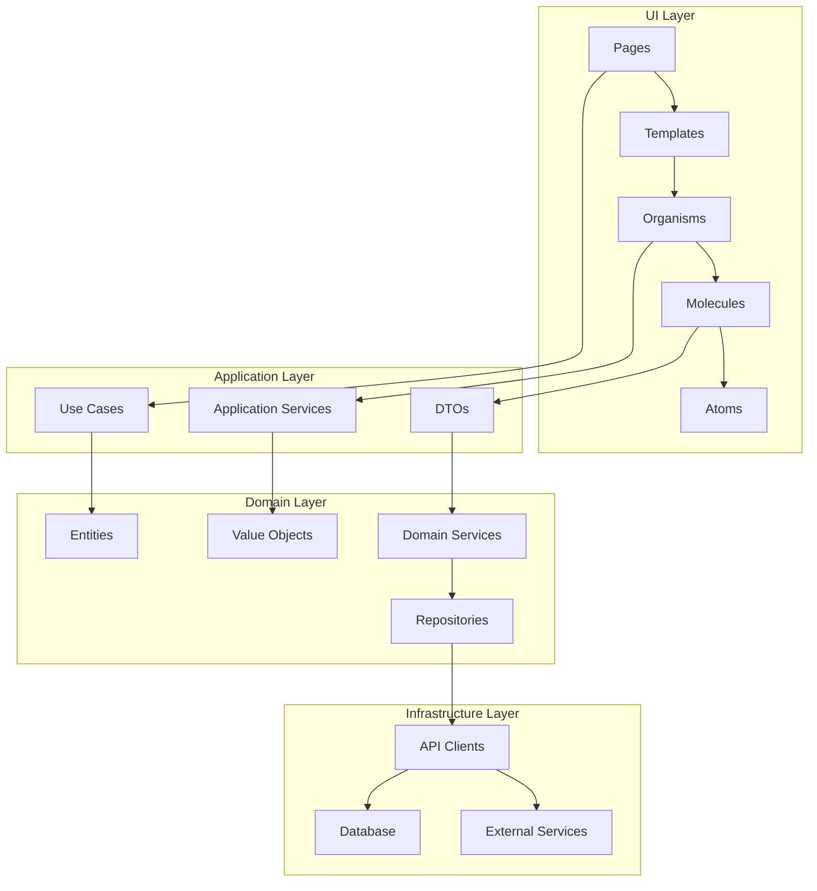

# DDD設計との統合

## 概要

UI設計とDDD（ドメイン駆動設計）の統合方針を定義します。ドメインモデル、境界コンテキスト、エンティティとUIコンポーネントの対応関係を明確化し、実装時の設計整合性を保証します。

## 参照ドキュメント

- [DDD設計成果物](../../ddd-design/README.md)
- [ドメインモデル定義](../../ddd-design/2.01_domain-models/)
- [境界コンテキスト](../../ddd-design/2.02_bounded-contexts/)
- [コンポーネント一覧](../4.01_components/component-inventory.md)

## 統合方針

### 1. レイヤー統合原則



### 2. 境界コンテキスト対応

| 境界コンテキスト | UIコンポーネント | 責務 |
|------------------|------------------|------|
| Quiz Management | SwipeableQuizCard, QuizCreationForm | クイズの表示・作成・管理 |
| Answer Context | AnswerHistoryList, StatisticsPanel | 回答履歴・統計の管理 |
| User Management | UserProfile, SettingsPanel | ユーザー情報管理 |
| Offline Sync Context | OfflineIndicator, SyncStatus | オフライン同期管理 |

## ドメインモデル統合

### Quiz Management Context

#### ドメインエンティティ → UIコンポーネント対応

```typescript
// Domain Entity: Quiz
interface Quiz {
  id: QuizId;
  title: string;
  questions: Question[];
  category: Category;
  difficulty: Difficulty;
  tags: Tag[];
  createdAt: Date;
  approvalStatus: ApprovalStatus;
}

// UI Component Props
interface SwipeableQuizCardProps {
  quiz: {
    id: string;
    title: string;
    questionCount: number;
    difficulty: number;
    tags: string[];
    // Domain → UI transformation
  };
  onAnswer: (correct: boolean) => void; // → AnswerQuestion Use Case
  onSkip: () => void; // → SkipQuestion Use Case
  onPrevious: () => void; // → NavigateToPrevious Use Case
}
```

#### ドメインサービス → UIアクション対応

```typescript
// Domain Service: QuizService
class QuizService {
  validateQuizCreation(quiz: QuizCreationData): ValidationResult;
  calculateDifficulty(questions: Question[]): Difficulty;
  generateQuizSummary(quiz: Quiz): QuizSummary;
}

// UI Component Integration
const QuizCreationForm: React.FC = () => {
  const validateForm = useCallback((formData: QuizFormData) => {
    // Domain Service呼び出し
    const validationResult = quizService.validateQuizCreation(formData);
    return validationResult;
  }, []);

  const handleSubmit = useCallback(async (formData: QuizFormData) => {
    // Use Case経由でDomain Serviceを実行
    await createQuizUseCase.execute(formData);
  }, []);

  return (
    <form onSubmit={handleSubmit}>
      {/* フォーム要素 */}
    </form>
  );
};
```

### Answer Context

#### AnswerSession Entity統合

```typescript
// Domain Entity: AnswerSession
interface AnswerSession {
  id: AnswerSessionId;
  quizId: QuizId;
  userId: UserId;
  answers: Answer[];
  startedAt: Date;
  completedAt?: Date;
  status: SessionStatus;
  statistics: SessionStatistics;
}

// UI Component State
interface QuizAnswerPageState {
  currentQuestion: number;
  totalQuestions: number;
  answers: UserAnswer[];
  sessionId: string;
  startTime: Date;
  // Domain Entity → UI State mapping
}

// Use Case Integration
const QuizAnswerPage: React.FC = () => {
  const [session, setSession] = useState<QuizAnswerPageState>();
  
  const handleAnswer = useCallback(async (answer: boolean) => {
    // Domain Use Case実行
    await recordAnswerUseCase.execute({
      sessionId: session.sessionId,
      questionId: getCurrentQuestionId(),
      answer,
      responseTime: calculateResponseTime(),
    });
    
    // UI State更新
    setSession(prev => updateSessionState(prev, answer));
  }, [session]);

  return (
    <SwipeableQuizCard
      question={getCurrentQuestion()}
      onAnswer={handleAnswer}
    />
  );
};
```

### User Management Context

#### User Entity → UI Props対応

```typescript
// Domain Entity: User
interface User {
  id: UserId;
  profile: UserProfile;
  preferences: UserPreferences;
  statistics: UserStatistics;
  achievements: Achievement[];
}

// UI Component Props
interface UserProfileProps {
  user: {
    name: string;
    avatar?: string;
    totalQuizzes: number;
    averageScore: number;
    streakDays: number;
    // Domain Entity → UI Props transformation
  };
  onUpdateProfile: (profile: UserProfileUpdate) => Promise<void>;
}

// Value Object Integration
interface UserPreferences {
  theme: 'light' | 'dark' | 'system';
  language: 'ja' | 'en';
  notifications: boolean;
  difficulty: DifficultyPreference;
}

// UI Settings Component
const SettingsPanel: React.FC = () => {
  const { preferences, updatePreferences } = useUserPreferences();
  
  const handlePreferenceChange = useCallback(async (
    key: keyof UserPreferences,
    value: any
  ) => {
    // Domain Value Object validation
    const newPreferences = UserPreferences.create({
      ...preferences,
      [key]: value,
    });
    
    if (newPreferences.isValid()) {
      await updateUserPreferencesUseCase.execute(newPreferences);
    }
  }, [preferences]);

  return (
    <div>
      <ThemeSelector
        value={preferences.theme}
        onChange={(theme) => handlePreferenceChange('theme', theme)}
      />
      {/* 他の設定項目 */}
    </div>
  );
};
```

## Use Case統合パターン

### 1. Command Pattern統合

```typescript
// Domain Use Case
interface CreateQuizUseCase {
  execute(command: CreateQuizCommand): Promise<CreateQuizResult>;
}

interface CreateQuizCommand {
  title: string;
  questions: QuestionData[];
  category: string;
  tags: string[];
  explanation?: string;
}

// UI Component Integration
const QuizCreationPage: React.FC = () => {
  const createQuiz = useCreateQuizUseCase();
  
  const handleSubmit = useCallback(async (formData: QuizFormData) => {
    try {
      // UI Form Data → Domain Command transformation
      const command: CreateQuizCommand = {
        title: formData.questionText,
        questions: [
          {
            text: formData.questionText,
            correctAnswer: formData.correctAnswer,
            explanation: formData.explanation,
          }
        ],
        category: formData.selectedCategory,
        tags: formData.selectedTags,
      };
      
      // Use Case実行
      const result = await createQuiz.execute(command);
      
      if (result.success) {
        // 成功時のUI更新
        router.push(`/quiz/${result.quizId}`);
      } else {
        // エラー時のUI更新
        setError(result.error);
      }
    } catch (error) {
      setError('予期しないエラーが発生しました');
    }
  }, [createQuiz]);

  return <QuizCreationForm onSubmit={handleSubmit} />;
};
```

### 2. Query Pattern統合

```typescript
// Domain Query
interface GetQuizListQuery {
  category?: string;
  difficulty?: number;
  tags?: string[];
  limit: number;
  offset: number;
}

interface QuizListResult {
  quizzes: Quiz[];
  totalCount: number;
  hasMore: boolean;
}

// UI Component Integration
const QuizListPage: React.FC = () => {
  const [filters, setFilters] = useState<QuizFilters>({});
  const { data, loading, error, fetchMore } = useQuizListQuery({
    category: filters.category,
    difficulty: filters.difficulty,
    tags: filters.tags,
    limit: 20,
    offset: 0,
  });

  const handleFilterChange = useCallback((newFilters: QuizFilters) => {
    setFilters(newFilters);
    // Query再実行は自動的に行われる
  }, []);

  if (loading) return <LoadingSpinner />;
  if (error) return <ErrorMessage error={error} />;

  return (
    <div>
      <FilterPanel filters={filters} onChange={handleFilterChange} />
      <QuizList
        quizzes={data?.quizzes || []}
        onLoadMore={fetchMore}
        hasMore={data?.hasMore || false}
      />
    </div>
  );
};
```

### 3. Event Handling統合

```typescript
// Domain Events
interface QuizAnsweredEvent {
  sessionId: string;
  questionId: string;
  answer: boolean;
  isCorrect: boolean;
  responseTime: number;
  timestamp: Date;
}

// UI Event Handler
const SwipeableQuizCard: React.FC<SwipeableQuizCardProps> = ({
  question,
  onAnswer,
}) => {
  const handleSwipe = useCallback(async (direction: SwipeDirection) => {
    const answer = direction === 'right';
    const responseTime = Date.now() - questionStartTime;
    
    // Domain Event発行
    const event: QuizAnsweredEvent = {
      sessionId: currentSessionId,
      questionId: question.id,
      answer,
      isCorrect: answer === question.correctAnswer,
      responseTime,
      timestamp: new Date(),
    };
    
    // Use Case経由でEvent処理
    await recordAnswerUseCase.execute(event);
    
    // UI Callback実行
    onAnswer(answer);
  }, [question, onAnswer]);

  return (
    <div className="swipeable-card" onSwipe={handleSwipe}>
      {/* カード内容 */}
    </div>
  );
};
```

## Repository Pattern統合

### 1. データアクセス抽象化

```typescript
// Domain Repository Interface
interface QuizRepository {
  findById(id: QuizId): Promise<Quiz | null>;
  findByCategory(category: Category): Promise<Quiz[]>;
  save(quiz: Quiz): Promise<void>;
  delete(id: QuizId): Promise<void>;
}

// Infrastructure Implementation
class APIQuizRepository implements QuizRepository {
  constructor(private httpClient: HttpClient) {}

  async findById(id: QuizId): Promise<Quiz | null> {
    try {
      const response = await this.httpClient.get(`/api/quizzes/${id.value}`);
      return Quiz.fromAPI(response.data);
    } catch (error) {
      if (error.status === 404) return null;
      throw error;
    }
  }

  async save(quiz: Quiz): Promise<void> {
    const payload = quiz.toAPI();
    await this.httpClient.post('/api/quizzes', payload);
  }
}

// UI Hook Integration
const useQuizRepository = () => {
  const httpClient = useHttpClient();
  return useMemo(() => new APIQuizRepository(httpClient), [httpClient]);
};

const useQuiz = (quizId: string) => {
  const repository = useQuizRepository();
  
  return useQuery({
    queryKey: ['quiz', quizId],
    queryFn: () => repository.findById(new QuizId(quizId)),
    staleTime: 5 * 60 * 1000, // 5分
  });
};
```

### 2. キャッシュ戦略統合

```typescript
// Domain-aware Cache Strategy
class QuizCacheStrategy {
  constructor(
    private localRepository: LocalQuizRepository,
    private remoteRepository: RemoteQuizRepository
  ) {}

  async getQuiz(id: QuizId): Promise<Quiz | null> {
    // ローカルキャッシュ確認
    const cached = await this.localRepository.findById(id);
    if (cached && !cached.isStale()) {
      return cached;
    }

    // リモートから取得
    const remote = await this.remoteRepository.findById(id);
    if (remote) {
      // ローカルキャッシュ更新
      await this.localRepository.save(remote);
      return remote;
    }

    return cached; // スタレでもキャッシュを返す
  }
}

// UI Component Integration
const QuizDetailPage: React.FC<{ quizId: string }> = ({ quizId }) => {
  const { data: quiz, loading, error } = useQuery({
    queryKey: ['quiz', quizId],
    queryFn: () => quizCacheStrategy.getQuiz(new QuizId(quizId)),
    staleTime: 0, // キャッシュ戦略に委任
  });

  if (loading) return <QuizDetailSkeleton />;
  if (error) return <ErrorBoundary error={error} />;
  if (!quiz) return <NotFoundPage />;

  return <QuizDetail quiz={quiz} />;
};
```

## エラーハンドリング統合

### 1. Domain Error → UI Error Mapping

```typescript
// Domain Errors
abstract class DomainError extends Error {
  abstract readonly code: string;
  abstract readonly userMessage: string;
}

class QuizValidationError extends DomainError {
  readonly code = 'QUIZ_VALIDATION_ERROR';
  readonly userMessage = '入力内容に問題があります';
  
  constructor(public readonly violations: ValidationViolation[]) {
    super('Quiz validation failed');
  }
}

class QuizNotFoundError extends DomainError {
  readonly code = 'QUIZ_NOT_FOUND';
  readonly userMessage = 'クイズが見つかりません';
}

// UI Error Boundary
const QuizErrorBoundary: React.FC<{ children: React.ReactNode }> = ({
  children,
}) => {
  return (
    <ErrorBoundary
      FallbackComponent={({ error, resetErrorBoundary }) => {
        if (error instanceof QuizValidationError) {
          return (
            <ValidationErrorDisplay
              violations={error.violations}
              onRetry={resetErrorBoundary}
            />
          );
        }

        if (error instanceof QuizNotFoundError) {
          return <NotFoundErrorDisplay onGoBack={resetErrorBoundary} />;
        }

        return <GenericErrorDisplay error={error} onRetry={resetErrorBoundary} />;
      }}
    >
      {children}
    </ErrorBoundary>
  );
};
```

### 2. フォームバリデーション統合

```typescript
// Domain Validation Rules
class QuizValidationRules {
  static validateTitle(title: string): ValidationResult {
    if (!title || title.trim().length === 0) {
      return { isValid: false, message: 'タイトルは必須です' };
    }
    if (title.length > 100) {
      return { isValid: false, message: 'タイトルは100文字以内で入力してください' };
    }
    return { isValid: true };
  }

  static validateQuestion(question: string): ValidationResult {
    if (!question || question.trim().length === 0) {
      return { isValid: false, message: '問題文は必須です' };
    }
    if (question.length < 10) {
      return { isValid: false, message: '問題文は10文字以上で入力してください' };
    }
    if (question.length > 500) {
      return { isValid: false, message: '問題文は500文字以内で入力してください' };
    }
    return { isValid: true };
  }
}

// UI Form Integration
const QuizCreationForm: React.FC = () => {
  const {
    register,
    handleSubmit,
    formState: { errors },
    setError,
  } = useForm<QuizFormData>({
    resolver: yupResolver(
      yup.object({
        title: yup
          .string()
          .test('domain-validation', (value) => {
            const result = QuizValidationRules.validateTitle(value || '');
            return result.isValid || result.message;
          }),
        question: yup
          .string()
          .test('domain-validation', (value) => {
            const result = QuizValidationRules.validateQuestion(value || '');
            return result.isValid || result.message;
          }),
      })
    ),
  });

  const onSubmit = handleSubmit(async (data) => {
    try {
      await createQuizUseCase.execute(data);
    } catch (error) {
      if (error instanceof QuizValidationError) {
        error.violations.forEach((violation) => {
          setError(violation.field as keyof QuizFormData, {
            message: violation.message,
          });
        });
      }
    }
  });

  return (
    <form onSubmit={onSubmit}>
      <input
        {...register('title')}
        placeholder="クイズのタイトル"
      />
      {errors.title && <span>{errors.title.message}</span>}
      
      <textarea
        {...register('question')}
        placeholder="問題文を入力"
      />
      {errors.question && <span>{errors.question.message}</span>}
      
      <button type="submit">作成</button>
    </form>
  );
};
```

## パフォーマンス最適化統合

### 1. Domain-aware Memoization

```typescript
// Domain Entity Memoization
const useQuizMemo = (quiz: Quiz) => {
  return useMemo(() => ({
    id: quiz.id.value,
    title: quiz.title,
    questionCount: quiz.questions.length,
    difficulty: quiz.difficulty.value,
    tags: quiz.tags.map(tag => tag.value),
    // 重い計算をメモ化
    estimatedTime: quiz.calculateEstimatedTime(),
    statistics: quiz.calculateStatistics(),
  }), [quiz.id.value, quiz.version]); // Domain Entity versionで更新制御
};

// Component Integration
const QuizCard: React.FC<{ quiz: Quiz }> = ({ quiz }) => {
  const memoizedQuiz = useQuizMemo(quiz);
  
  return (
    <div className="quiz-card">
      <h3>{memoizedQuiz.title}</h3>
      <p>{memoizedQuiz.questionCount}問・推定{memoizedQuiz.estimatedTime}分</p>
      <div>
        {memoizedQuiz.tags.map(tag => (
          <span key={tag} className="tag">#{tag}</span>
        ))}
      </div>
    </div>
  );
};
```

### 2. Lazy Loading統合

```typescript
// Domain-based Code Splitting
const QuizAnswerPage = lazy(() => 
  import('./QuizAnswerPage').then(module => ({
    default: module.QuizAnswerPage
  }))
);

const QuizCreationPage = lazy(() =>
  import('./QuizCreationPage').then(module => ({
    default: module.QuizCreationPage
  }))
);

// Route Configuration
const AppRouter: React.FC = () => {
  return (
    <Router>
      <Routes>
        <Route
          path="/quiz/:id/answer"
          element={
            <Suspense fallback={<QuizAnswerSkeleton />}>
              <QuizErrorBoundary>
                <QuizAnswerPage />
              </QuizErrorBoundary>
            </Suspense>
          }
        />
        <Route
          path="/quiz/create"
          element={
            <Suspense fallback={<QuizCreationSkeleton />}>
              <QuizErrorBoundary>
                <QuizCreationPage />
              </QuizErrorBoundary>
            </Suspense>
          }
        />
      </Routes>
    </Router>
  );
};
```

## テスト統合戦略

### 1. Domain-UI Integration Tests

```typescript
// Integration Test
describe('Quiz Creation Integration', () => {
  it('should create quiz through complete flow', async () => {
    // Mock Domain Services
    const mockQuizRepository = createMockQuizRepository();
    const mockQuizService = createMockQuizService();
    
    // Render Component with DI
    render(
      <DependencyProvider
        quizRepository={mockQuizRepository}
        quizService={mockQuizService}
      >
        <QuizCreationPage />
      </DependencyProvider>
    );

    // User Interaction
    await userEvent.type(
      screen.getByPlaceholderText('問題文を入力'),
      '地球は太陽系で最も大きな惑星である。'
    );
    
    await userEvent.click(screen.getByLabelText('不正解'));
    
    await userEvent.type(
      screen.getByPlaceholderText('解説を入力'),
      '実際には木星が最も大きな惑星です。'
    );

    await userEvent.click(screen.getByText('投稿する'));

    // Domain Layer Verification
    expect(mockQuizService.validateQuizCreation).toHaveBeenCalledWith({
      question: '地球は太陽系で最も大きな惑星である。',
      correctAnswer: false,
      explanation: '実際には木星が最も大きな惑星です。',
    });

    expect(mockQuizRepository.save).toHaveBeenCalledWith(
      expect.objectContaining({
        question: expect.objectContaining({
          text: '地球は太陽系で最も大きな惑星である。',
          correctAnswer: false,
        }),
      })
    );

    // UI State Verification
    expect(screen.getByText('投稿完了！')).toBeInTheDocument();
  });
});
```

### 2. E2E Test Integration

```typescript
// E2E Test
describe('Quiz Answer Flow E2E', () => {
  it('should complete quiz answering flow', async () => {
    // Seed test data
    await seedDatabase({
      quizzes: [testQuiz],
      users: [testUser],
    });

    // Navigate to quiz
    await page.goto(`/quiz/${testQuiz.id}/answer`);

    // Swipe interactions
    const quizCard = page.locator('[data-testid="quiz-card"]');
    
    // Right swipe (correct)
    await quizCard.swipe('right');
    await expect(page.locator('.success-feedback')).toBeVisible();
    
    // Left swipe (incorrect)
    await quizCard.swipe('left');
    await expect(page.locator('.error-feedback')).toBeVisible();

    // Complete quiz
    await page.waitForSelector('.completion-screen');
    
    // Verify results saved
    const session = await getAnswerSession(testUser.id, testQuiz.id);
    expect(session.answers).toHaveLength(testQuiz.questions.length);
    expect(session.status).toBe('completed');
  });
});
```

## 実装チェックリスト

### Phase 1: 基盤統合

- [ ] Repository Pattern実装
- [ ] Use Case Layer統合
- [ ] Error Handling統合
- [ ] Validation統合

### Phase 2: コンポーネント統合

- [ ] SwipeableQuizCard → Quiz Entity統合
- [ ] QuizCreationForm → CreateQuiz Use Case統合
- [ ] AnswerHistoryList → AnswerSession統合
- [ ] StatisticsPanel → UserStatistics統合

### Phase 3: 高度な統合

- [ ] Event Sourcing統合
- [ ] CQRS Pattern統合
- [ ] Domain Events → UI Notifications
- [ ] Offline Sync統合

### Phase 4: 最適化統合

- [ ] Performance Monitoring統合
- [ ] Cache Strategy統合
- [ ] Lazy Loading統合
- [ ] Bundle Optimization

## 関連ドキュメント

- [コンポーネント一覧](../4.01_components/component-inventory.md)
- [デザインシステム定義](../4.01_components/design-system.md)
- [MCP/LLM自動化設定](mcp-automation.md)
- [DDD設計成果物](../../ddd-design/README.md)

---
**作成工程**: UI設計  
**作成日**: 2025-01-31  
**更新日**: 2025-01-31
