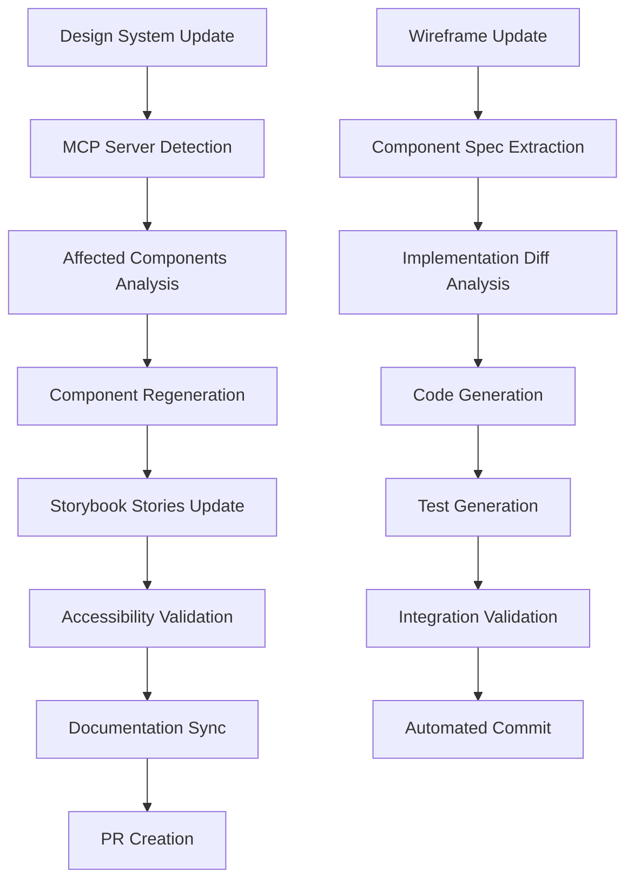
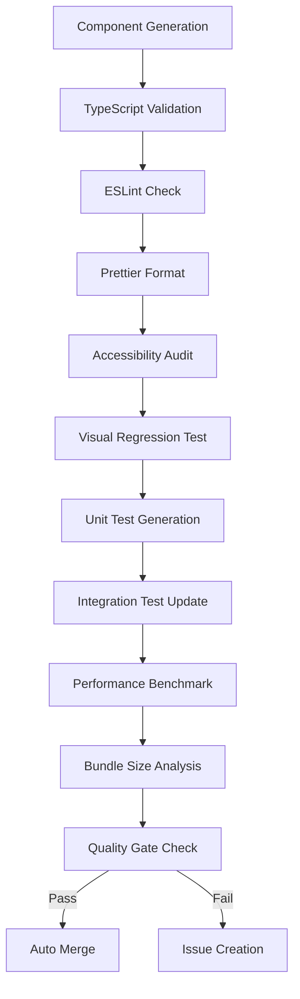
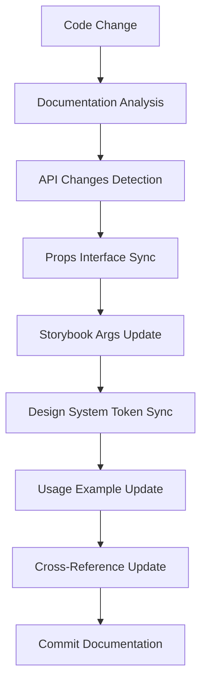

# MCP/LLM自動化設定

## 概要

Your QuizアプリのUI開発・保守における、MCP（Model Context Protocol）とLLM（Large Language Model）を活用した自動化システムの設計・運用設定です。コンポーネント生成、ドキュメント更新、テスト作成、品質チェックの自動化を実現します。

## 参照ドキュメント

- [コンポーネント一覧](../4.01_components/component-inventory.md)
- [デザインシステム定義](../4.01_components/design-system.md)
- [DDD設計との統合](ddd-integration.md)
- [UI設計ガイドライン](../../../instructions/shared/workflow/04.01_ui-design.md)

## MCP設定

### 1. MCPサーバー設定

#### mcp-server.json

```json
{
  "mcpVersion": "2024-11-05",
  "servers": {
    "ui-design-assistant": {
      "command": "node",
      "args": ["./scripts/mcp-ui-server.js"],
      "env": {
        "NODE_ENV": "development",
        "DESIGN_SYSTEM_PATH": "./docs/project/ui-design",
        "COMPONENT_PATH": "./src/components",
        "STORYBOOK_PATH": "./.storybook"
      }
    },
    "component-generator": {
      "command": "python",
      "args": ["./scripts/component-generator.py"],
      "env": {
        "TEMPLATES_PATH": "./templates/components",
        "OUTPUT_PATH": "./src/components"
      }
    },
    "documentation-sync": {
      "command": "node",
      "args": ["./scripts/docs-sync.js"],
      "env": {
        "DOCS_ROOT": "./docs",
        "COMPONENT_ROOT": "./src/components"
      }
    }
  }
}
```

### 2. UIデザインアシスタントサーバー

#### scripts/mcp-ui-server.js

```javascript
import { Server } from '@modelcontextprotocol/sdk/server/index.js';
import { StdioServerTransport } from '@modelcontextprotocol/sdk/server/stdio.js';
import { 
  CallToolRequestSchema,
  ListToolsRequestSchema,
} from '@modelcontextprotocol/sdk/types.js';
import fs from 'fs/promises';
import path from 'path';

class UIDesignAssistant {
  constructor() {
    this.server = new Server(
      {
        name: 'ui-design-assistant',
        version: '1.0.0',
      },
      {
        capabilities: {
          tools: {},
        },
      }
    );

    this.setupToolHandlers();
  }

  setupToolHandlers() {
    // ツール一覧の提供
    this.server.setRequestHandler(ListToolsRequestSchema, async () => ({
      tools: [
        {
          name: 'generate-component',
          description: 'Generate React component from design spec',
          inputSchema: {
            type: 'object',
            properties: {
              componentName: {
                type: 'string',
                description: 'Name of the component to generate'
              },
              componentType: {
                type: 'string',
                enum: ['atom', 'molecule', 'organism', 'template', 'page'],
                description: 'Atomic design category'
              },
              designSpec: {
                type: 'object',
                description: 'Design specification from wireframes'
              }
            },
            required: ['componentName', 'componentType', 'designSpec']
          }
        },
        {
          name: 'update-design-system',
          description: 'Update design system tokens',
          inputSchema: {
            type: 'object',
            properties: {
              tokenType: {
                type: 'string',
                enum: ['color', 'typography', 'spacing', 'animation']
              },
              tokens: {
                type: 'object',
                description: 'Token definitions'
              }
            },
            required: ['tokenType', 'tokens']
          }
        },
        {
          name: 'validate-accessibility',
          description: 'Validate component accessibility',
          inputSchema: {
            type: 'object',
            properties: {
              componentPath: {
                type: 'string',
                description: 'Path to component file'
              }
            },
            required: ['componentPath']
          }
        },
        {
          name: 'generate-storybook-stories',
          description: 'Generate Storybook stories from component',
          inputSchema: {
            type: 'object',
            properties: {
              componentPath: {
                type: 'string',
                description: 'Path to component file'
              },
              componentName: {
                type: 'string',
                description: 'Component name'
              }
            },
            required: ['componentPath', 'componentName']
          }
        },
        {
          name: 'sync-ddd-integration',
          description: 'Sync component with DDD design',
          inputSchema: {
            type: 'object',
            properties: {
              componentName: {
                type: 'string',
                description: 'Component name'
              },
              boundedContext: {
                type: 'string',
                description: 'DDD bounded context'
              }
            },
            required: ['componentName', 'boundedContext']
          }
        }
      ]
    }));

    // ツール実行ハンドラー
    this.server.setRequestHandler(CallToolRequestSchema, async (request) => {
      const { name, arguments: args } = request.params;

      switch (name) {
        case 'generate-component':
          return await this.generateComponent(args);
        case 'update-design-system':
          return await this.updateDesignSystem(args);
        case 'validate-accessibility':
          return await this.validateAccessibility(args);
        case 'generate-storybook-stories':
          return await this.generateStorybookStories(args);
        case 'sync-ddd-integration':
          return await this.syncDDDIntegration(args);
        default:
          throw new Error(`Unknown tool: ${name}`);
      }
    });
  }

  async generateComponent({ componentName, componentType, designSpec }) {
    try {
      // テンプレート読み込み
      const templatePath = `./templates/${componentType}.tsx.template`;
      const template = await fs.readFile(templatePath, 'utf-8');

      // コンポーネント生成
      const componentCode = this.processTemplate(template, {
        componentName,
        designSpec,
        timestamp: new Date().toISOString(),
      });

      // ファイル保存
      const outputDir = `./src/components/${componentType}s/${componentName}`;
      await fs.mkdir(outputDir, { recursive: true });
      await fs.writeFile(
        path.join(outputDir, `${componentName}.tsx`),
        componentCode
      );

      // インデックスファイル生成
      const indexCode = `export { ${componentName} } from './${componentName}';`;
      await fs.writeFile(
        path.join(outputDir, 'index.ts'),
        indexCode
      );

      return {
        content: [
          {
            type: 'text',
            text: `✅ Component ${componentName} generated successfully in ${outputDir}`
          }
        ]
      };
    } catch (error) {
      return {
        content: [
          {
            type: 'text',
            text: `❌ Error generating component: ${error.message}`
          }
        ],
        isError: true
      };
    }
  }

  async updateDesignSystem({ tokenType, tokens }) {
    try {
      const designSystemPath = './docs/project/ui-design/4.01_components/design-system.md';
      const content = await fs.readFile(designSystemPath, 'utf-8');

      // デザイントークン更新
      const updatedContent = this.updateDesignTokens(content, tokenType, tokens);
      await fs.writeFile(designSystemPath, updatedContent);

      // Tailwind設定更新
      await this.updateTailwindConfig(tokenType, tokens);

      return {
        content: [
          {
            type: 'text',
            text: `✅ Design system updated for ${tokenType} tokens`
          }
        ]
      };
    } catch (error) {
      return {
        content: [
          {
            type: 'text',
            text: `❌ Error updating design system: ${error.message}`
          }
        ],
        isError: true
      };
    }
  }

  async validateAccessibility({ componentPath }) {
    try {
      const componentCode = await fs.readFile(componentPath, 'utf-8');
      
      // アクセシビリティ検証
      const violations = await this.checkAccessibility(componentCode);
      
      if (violations.length === 0) {
        return {
          content: [
            {
              type: 'text',
              text: '✅ No accessibility violations found'
            }
          ]
        };
      } else {
        return {
          content: [
            {
              type: 'text',
              text: `⚠️ Found ${violations.length} accessibility violations:\n${violations.map(v => `- ${v.rule}: ${v.message}`).join('\n')}`
            }
          ]
        };
      }
    } catch (error) {
      return {
        content: [
          {
            type: 'text',
            text: `❌ Error validating accessibility: ${error.message}`
          }
        ],
        isError: true
      };
    }
  }

  async generateStorybookStories({ componentPath, componentName }) {
    try {
      const componentCode = await fs.readFile(componentPath, 'utf-8');
      
      // Props interface抽出
      const propsInterface = this.extractPropsInterface(componentCode);
      
      // Storybook Stories生成
      const storiesCode = this.generateStoriesCode(componentName, propsInterface);
      
      // ファイル保存
      const storiesPath = componentPath.replace('.tsx', '.stories.tsx');
      await fs.writeFile(storiesPath, storiesCode);

      return {
        content: [
          {
            type: 'text',
            text: `✅ Storybook stories generated at ${storiesPath}`
          }
        ]
      };
    } catch (error) {
      return {
        content: [
          {
            type: 'text',
            text: `❌ Error generating stories: ${error.message}`
          }
        ],
        isError: true
      };
    }
  }

  async syncDDDIntegration({ componentName, boundedContext }) {
    try {
      // DDD設計ドキュメント読み込み
      const dddPath = `./docs/project/ddd-design/2.02_bounded-contexts/${boundedContext}.md`;
      const dddContent = await fs.readFile(dddPath, 'utf-8');
      
      // エンティティ・UseCase抽出
      const entities = this.extractEntities(dddContent);
      const useCases = this.extractUseCases(dddContent);
      
      // 統合コード生成
      const integrationCode = this.generateIntegrationCode(componentName, entities, useCases);
      
      // hooks/integration ディレクトリに保存
      const integrationPath = `./src/hooks/integration/use${componentName}Integration.ts`;
      await fs.writeFile(integrationPath, integrationCode);

      return {
        content: [
          {
            type: 'text',
            text: `✅ DDD integration generated for ${componentName} in ${boundedContext} context`
          }
        ]
      };
    } catch (error) {
      return {
        content: [
          {
            type: 'text',
            text: `❌ Error syncing DDD integration: ${error.message}`
          }
        ],
        isError: true
      };
    }
  }

  processTemplate(template, variables) {
    return template.replace(/\{\{(\w+)\}\}/g, (match, key) => {
      return variables[key] || match;
    });
  }

  updateDesignTokens(content, tokenType, tokens) {
    // Markdown内のデザイントークン更新ロジック
    const tokenSection = this.findTokenSection(content, tokenType);
    const updatedSection = this.updateTokenSection(tokenSection, tokens);
    return content.replace(tokenSection, updatedSection);
  }

  async updateTailwindConfig(tokenType, tokens) {
    const configPath = './tailwind.config.js';
    // Tailwind設定更新ロジック
  }

  async checkAccessibility(componentCode) {
    // アクセシビリティ検証ロジック
    const violations = [];
    
    // ARIA属性チェック
    if (!componentCode.includes('aria-label') && componentCode.includes('button')) {
      violations.push({
        rule: 'button-name',
        message: 'Button elements should have an accessible name'
      });
    }

    // カラーコントラストチェック
    if (componentCode.includes('text-gray-400')) {
      violations.push({
        rule: 'color-contrast',
        message: 'Low contrast color detected'
      });
    }

    return violations;
  }

  extractPropsInterface(componentCode) {
    const interfaceMatch = componentCode.match(/interface\s+(\w+Props)\s*{([^}]+)}/);
    if (!interfaceMatch) return null;
    
    return {
      name: interfaceMatch[1],
      properties: this.parseInterfaceProperties(interfaceMatch[2])
    };
  }

  generateStoriesCode(componentName, propsInterface) {
    return `import type { Meta, StoryObj } from '@storybook/react';
import { ${componentName} } from './${componentName}';

const meta = {
  title: '${this.getComponentCategory(componentName)}/${componentName}',
  component: ${componentName},
  parameters: {
    layout: 'centered',
  },
  tags: ['autodocs'],
} satisfies Meta<typeof ${componentName}>;

export default meta;
type Story = StoryObj<typeof meta>;

export const Default: Story = {
  args: {
    ${this.generateDefaultArgs(propsInterface)}
  },
};
`;
  }

  extractEntities(dddContent) {
    const entityMatches = dddContent.match(/interface\s+(\w+)\s*{([^}]+)}/g) || [];
    return entityMatches.map(match => {
      const nameMatch = match.match(/interface\s+(\w+)/);
      return nameMatch ? nameMatch[1] : null;
    }).filter(Boolean);
  }

  extractUseCases(dddContent) {
    const useCaseMatches = dddContent.match(/class\s+(\w+UseCase)/g) || [];
    return useCaseMatches.map(match => {
      const nameMatch = match.match(/class\s+(\w+UseCase)/);
      return nameMatch ? nameMatch[1] : null;
    }).filter(Boolean);
  }

  generateIntegrationCode(componentName, entities, useCases) {
    return `import { useCallback, useMemo } from 'react';
${entities.map(entity => `import { ${entity} } from '@/domain/entities/${entity}';`).join('\n')}
${useCases.map(useCase => `import { ${useCase} } from '@/application/usecases/${useCase}';`).join('\n')}

export const use${componentName}Integration = () => {
  ${useCases.map(useCase => `const ${useCase.replace('UseCase', '').toLowerCase()} = use${useCase}();`).join('\n  ')}

  const handleAction = useCallback(async (action: string, data: any) => {
    switch (action) {
      ${useCases.map(useCase => `case '${useCase.replace('UseCase', '').toLowerCase()}':
        return await ${useCase.replace('UseCase', '').toLowerCase()}.execute(data);`).join('\n      ')}
      default:
        throw new Error(\`Unknown action: \${action}\`);
    }
  }, [${useCases.map(useCase => useCase.replace('UseCase', '').toLowerCase()).join(', ')}]);

  return {
    handleAction,
  };
};`;
  }

  async run() {
    const transport = new StdioServerTransport();
    await this.server.connect(transport);
    console.error('UI Design Assistant MCP server running on stdio');
  }
}

const server = new UIDesignAssistant();
server.run().catch(console.error);
```

### 3. コンポーネントテンプレート

#### templates/atom.tsx.template

```typescript
import React from 'react';
import { cn } from '@/lib/utils';

interface {{componentName}}Props {
  className?: string;
  children?: React.ReactNode;
  // Generated on {{timestamp}}
}

export const {{componentName}}: React.FC<{{componentName}}Props> = ({
  className,
  children,
  ...props
}) => {
  return (
    <div
      className={cn(
        // Base styles from design system
        'inline-flex items-center justify-center',
        // Design system tokens
        'text-sm font-medium',
        'px-4 py-2',
        'rounded-md',
        'transition-colors',
        // Focus states
        'focus-visible:outline-none focus-visible:ring-2 focus-visible:ring-primary-500',
        // Custom className
        className
      )}
      {...props}
    >
      {children}
    </div>
  );
};

{{componentName}}.displayName = '{{componentName}}';
```

#### templates/molecule.tsx.template

```typescript
import React, { useState, useCallback } from 'react';
import { cn } from '@/lib/utils';

interface {{componentName}}Props {
  className?: string;
  onAction?: (action: string, data: any) => void;
  // Generated on {{timestamp}}
}

export const {{componentName}}: React.FC<{{componentName}}Props> = ({
  className,
  onAction,
  ...props
}) => {
  const [state, setState] = useState();

  const handleAction = useCallback((action: string, data: any) => {
    onAction?.(action, data);
  }, [onAction]);

  return (
    <div
      className={cn(
        // Molecule container styles
        'flex flex-col space-y-4',
        'p-4',
        'bg-white rounded-lg shadow-sm',
        'border border-gray-200',
        className
      )}
      {...props}
    >
      {/* Molecule content */}
    </div>
  );
};

{{componentName}}.displayName = '{{componentName}}';
```

## LLM統合設定

### 1. Claude Code統合

#### .claude/ui-design-agent.md

```markdown
# UI Design Agent Instructions

You are a UI design specialist for the Your Quiz application. Your role is to:

1. **Component Generation**: Generate React components based on wireframes and design system
2. **Design System Maintenance**: Keep design tokens and documentation up-to-date
3. **Accessibility Compliance**: Ensure all components meet WCAG 2.1 AA standards
4. **DDD Integration**: Align UI components with domain models and use cases

## Design Principles

Follow these principles when working on UI components:

- **Mobile-First**: All designs start with 375px mobile viewport
- **Tinder UI**: Swipe-based interactions for quiz answering
- **Atomic Design**: Components organized as atoms, molecules, organisms, templates, pages
- **Accessibility**: WCAG 2.1 AA compliance required
- **Performance**: Target ≤100ms interaction response times

## Component Generation Process

When generating components:

1. Analyze wireframe specifications
2. Extract design requirements from design system
3. Generate TypeScript interfaces with proper typing
4. Include accessibility attributes (ARIA labels, roles, etc.)
5. Add responsive design with Tailwind CSS classes
6. Create Storybook stories with all variants
7. Generate integration hooks for DDD use cases

## Design System Tokens

Always use design system tokens:
- Colors: Use semantic color names (primary, success, error, etc.)
- Typography: Use typography scale (h1, h2, body, caption)
- Spacing: Use 8px-based spacing scale
- Animations: Use predefined easing and duration values

## Code Generation Templates

Use these patterns:

```typescript
// Component interface
interface ComponentNameProps {
  // Required props
  requiredProp: string;
  
  // Optional props with defaults
  variant?: 'primary' | 'secondary';
  size?: 'sm' | 'md' | 'lg';
  
  // Event handlers
  onAction?: (data: ActionData) => void;
  
  // Common props
  className?: string;
  children?: React.ReactNode;
  
  // Accessibility
  'aria-label'?: string;
  'aria-describedby'?: string;
}

// Component implementation
export const ComponentName: React.FC<ComponentNameProps> = ({
  requiredProp,
  variant = 'primary',
  size = 'md',
  onAction,
  className,
  children,
  'aria-label': ariaLabel,
  ...props
}) => {
  return (
    <element
      className={cn(
        // Base styles
        'base-classes',
        // Variants
        variant === 'primary' && 'primary-classes',
        variant === 'secondary' && 'secondary-classes',
        // Sizes
        size === 'sm' && 'sm-classes',
        size === 'md' && 'md-classes',
        size === 'lg' && 'lg-classes',
        // Custom
        className
      )}
      aria-label={ariaLabel}
      {...props}
    >
      {children}
    </element>
  );
};
```text

```text

### 2. GitHub Actions統合

#### .github/workflows/ui-automation.yml

```yaml
name: UI Automation

on:
  push:
    paths:
      - 'docs/project/ui-design/**'
      - 'src/components/**'
  pull_request:
    paths:
      - 'docs/project/ui-design/**'
      - 'src/components/**'

jobs:
  component-sync:
    runs-on: ubuntu-latest
    steps:
      - uses: actions/checkout@v4
      - uses: actions/setup-node@v4
        with:
          node-version: '18'
      
      - name: Install dependencies
        run: npm ci
      
      - name: Run MCP UI Design Assistant
        run: |
          npm run mcp:ui-design -- \
            --action sync-components \
            --source docs/project/ui-design \
            --target src/components
      
      - name: Generate missing Storybook stories
        run: |
          npm run mcp:ui-design -- \
            --action generate-stories \
            --components src/components
      
      - name: Validate accessibility
        run: |
          npm run mcp:ui-design -- \
            --action validate-a11y \
            --components src/components
      
      - name: Update documentation
        run: |
          npm run mcp:ui-design -- \
            --action update-docs \
            --design-system docs/project/ui-design/4.01_components/design-system.md \
            --components src/components
      
      - name: Commit automated changes
        if: github.event_name == 'push'
        run: |
          git config --local user.email "action@github.com"
          git config --local user.name "GitHub Action"
          git add -A
          git diff --staged --quiet || git commit -m "🤖 Auto-update UI components and documentation
          
          Generated by MCP UI Design Assistant
          
          - Synced components with design system
          - Generated missing Storybook stories  
          - Validated accessibility compliance
          - Updated documentation"
          git push

  storybook-deploy:
    runs-on: ubuntu-latest
    needs: component-sync
    if: github.ref == 'refs/heads/main'
    steps:
      - uses: actions/checkout@v4
      - uses: actions/setup-node@v4
        with:
          node-version: '18'
      
      - name: Install dependencies
        run: npm ci
      
      - name: Build Storybook
        run: npm run build-storybook
      
      - name: Deploy to GitHub Pages
        uses: peaceiris/actions-gh-pages@v3
        with:
          github_token: ${{ secrets.GITHUB_TOKEN }}
          publish_dir: ./storybook-static
```

### 3. VS Code統合

#### .vscode/ui-design.code-snippets

```json
{
  "Generate Component from Wireframe": {
    "prefix": "mcp-component",
    "body": [
      "// MCP Component Generation",
      "// Run: npm run mcp:ui-design -- --action generate-component --name ${1:ComponentName} --type ${2|atom,molecule,organism,template,page|} --spec ${3:wireframe-spec.json}",
      ""
    ],
    "description": "Generate component using MCP UI Design Assistant"
  },
  "Update Design System": {
    "prefix": "mcp-design-system",
    "body": [
      "// MCP Design System Update",
      "// Run: npm run mcp:ui-design -- --action update-design-system --token-type ${1|color,typography,spacing,animation|} --tokens ${2:tokens.json}",
      ""
    ],
    "description": "Update design system tokens using MCP"
  },
  "Validate Accessibility": {
    "prefix": "mcp-a11y",
    "body": [
      "// MCP Accessibility Validation",
      "// Run: npm run mcp:ui-design -- --action validate-accessibility --component ${1:component-path}",
      ""
    ],
    "description": "Validate component accessibility using MCP"
  }
}
```

## 自動化ワークフロー

### 1. デザイン変更検出



### 2. 品質保証フロー



### 3. ドキュメント同期フロー



## 実装ガイドライン

### 1. MCP Server開発

```typescript
// MCP Server Base Class
abstract class MCPServerBase {
  protected server: Server;
  
  constructor(name: string, version: string) {
    this.server = new Server(
      { name, version },
      { capabilities: { tools: {} } }
    );
    this.setupHandlers();
  }
  
  abstract setupHandlers(): void;
  
  protected async validateInput(schema: any, input: any): Promise<boolean> {
    // Input validation logic
  }
  
  protected async handleError(error: Error): Promise<ErrorResponse> {
    return {
      content: [{ type: 'text', text: `Error: ${error.message}` }],
      isError: true
    };
  }
}

// UI Design Server Implementation
class UIDesignServer extends MCPServerBase {
  setupHandlers() {
    this.server.setRequestHandler(ListToolsRequestSchema, async () => ({
      tools: this.getAvailableTools()
    }));
    
    this.server.setRequestHandler(CallToolRequestSchema, async (request) => {
      return await this.executeToolCommand(request.params);
    });
  }
  
  private getAvailableTools() {
    return [
      // Tool definitions
    ];
  }
  
  private async executeToolCommand(params: any) {
    // Tool execution logic
  }
}
```

### 2. コンポーネント生成器

```python
# Python Component Generator
import json
import os
from typing import Dict, Any
from jinja2 import Template

class ComponentGenerator:
    def __init__(self, templates_path: str, output_path: str):
        self.templates_path = templates_path
        self.output_path = output_path
        self.design_system = self.load_design_system()
    
    def generate_component(self, spec: Dict[str, Any]) -> str:
        template_path = f"{self.templates_path}/{spec['type']}.tsx.j2"
        
        with open(template_path, 'r') as f:
            template = Template(f.read())
        
        # Generate component code
        component_code = template.render(
            name=spec['name'],
            props=spec['props'],
            design_system=self.design_system,
            accessibility=spec.get('accessibility', {}),
            responsive=spec.get('responsive', {})
        )
        
        # Write to file
        output_dir = f"{self.output_path}/{spec['type']}s/{spec['name']}"
        os.makedirs(output_dir, exist_ok=True)
        
        with open(f"{output_dir}/{spec['name']}.tsx", 'w') as f:
            f.write(component_code)
        
        return output_dir
    
    def load_design_system(self) -> Dict[str, Any]:
        # Load design system tokens
        pass
    
    def validate_accessibility(self, component_code: str) -> List[str]:
        # Accessibility validation
        pass
```

### 3. ドキュメント同期スクリプト

```javascript
// Documentation Synchronization
const fs = require('fs').promises;
const path = require('path');

class DocumentationSync {
  constructor(docsRoot, componentRoot) {
    this.docsRoot = docsRoot;
    this.componentRoot = componentRoot;
  }

  async syncAll() {
    const components = await this.findComponents();
    
    for (const component of components) {
      await this.syncComponent(component);
    }
    
    await this.updateComponentInventory(components);
  }

  async syncComponent(componentPath) {
    const componentCode = await fs.readFile(componentPath, 'utf-8');
    const componentName = path.basename(componentPath, '.tsx');
    
    // Extract component metadata
    const metadata = this.extractMetadata(componentCode);
    
    // Update Storybook stories
    await this.updateStorybookStories(componentPath, metadata);
    
    // Update component documentation
    await this.updateComponentDocs(componentName, metadata);
  }

  extractMetadata(componentCode) {
    return {
      props: this.extractPropsInterface(componentCode),
      accessibility: this.extractAccessibilityFeatures(componentCode),
      designTokens: this.extractDesignTokens(componentCode),
    };
  }

  async updateStorybookStories(componentPath, metadata) {
    // Storybook stories update logic
  }

  async updateComponentDocs(componentName, metadata) {
    // Component documentation update logic
  }

  async updateComponentInventory(components) {
    // Component inventory update logic
  }
}
```

## パフォーマンス監視

### 1. 自動化パフォーマンス測定

```typescript
// Performance Monitoring
interface PerformanceMetrics {
  generationTime: number;
  bundleSize: number;
  accessibilityScore: number;
  testCoverage: number;
}

class AutomationPerformanceMonitor {
  private metrics: PerformanceMetrics[] = [];

  async measureGeneration(operation: () => Promise<void>): Promise<number> {
    const start = performance.now();
    await operation();
    const end = performance.now();
    return end - start;
  }

  async measureBundleImpact(componentPath: string): Promise<number> {
    // Bundle size analysis
    const bundleAnalysis = await this.analyzeBundleSize(componentPath);
    return bundleAnalysis.sizeIncrease;
  }

  async generateReport(): Promise<string> {
    return `
## Automation Performance Report

- Average generation time: ${this.getAverageGenerationTime()}ms
- Bundle size impact: ${this.getAverageBundleImpact()}KB
- Accessibility compliance: ${this.getAccessibilityScore()}%
- Test coverage: ${this.getTestCoverage()}%
    `;
  }
}
```

### 2. 品質メトリクス

```yaml
# .github/workflows/quality-metrics.yml
name: Quality Metrics

on:
  schedule:
    - cron: '0 0 * * *' # Daily at midnight
  workflow_dispatch:

jobs:
  collect-metrics:
    runs-on: ubuntu-latest
    steps:
      - uses: actions/checkout@v4
      
      - name: Collect automation metrics
        run: |
          npm run mcp:collect-metrics > metrics.json
      
      - name: Generate quality report
        run: |
          npm run mcp:quality-report --input metrics.json --output quality-report.md
      
      - name: Update quality dashboard
        run: |
          npm run mcp:update-dashboard --report quality-report.md
      
      - name: Notify if quality degradation
        if: failure()
        uses: actions/github-script@v6
        with:
          script: |
            github.rest.issues.create({
              owner: context.repo.owner,
              repo: context.repo.repo,
              title: 'Quality Metrics Alert',
              body: 'Automated quality metrics indicate degradation. Please review.'
            });
```

## トラブルシューティング

### よくある問題と解決策

#### 1. MCP Server接続エラー

```bash
# MCP Server Debug Mode
DEBUG=mcp:* npm run mcp:ui-design

# Connection Test
npm run mcp:test-connection
```

#### 2. コンポーネント生成失敗

```javascript
// Debug Component Generation
const debugGeneration = async (spec) => {
  try {
    console.log('Generation spec:', JSON.stringify(spec, null, 2));
    const result = await generateComponent(spec);
    console.log('Generation result:', result);
  } catch (error) {
    console.error('Generation error:', error.stack);
    // Fallback to manual generation
    await manualGenerationPrompt(spec);
  }
};
```

#### 3. ドキュメント同期エラー

```bash
# Manual Documentation Sync
npm run mcp:docs-sync --verbose --dry-run

# Fix Broken References
npm run mcp:fix-references --target docs/project/ui-design
```

## 関連ドキュメント

- [コンポーネント一覧](../4.01_components/component-inventory.md)
- [デザインシステム定義](../4.01_components/design-system.md)
- [Storybook構築手順](../4.01_components/storybook-setup.md)
- [DDD設計との統合](ddd-integration.md)

---
**作成工程**: UI設計  
**作成日**: 2025-01-31  
**更新日**: 2025-01-31
