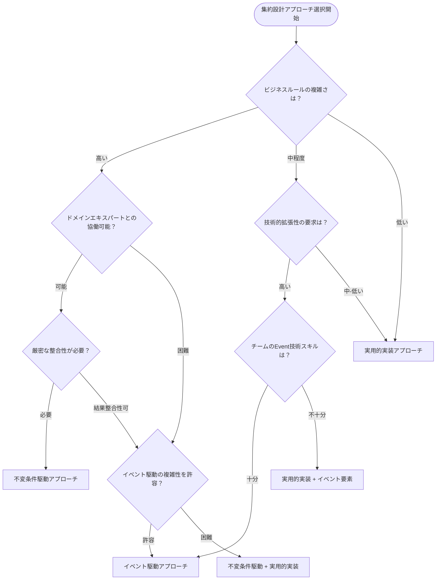

# 集約と集約ルート定義フォーマット：3アプローチ比較と推奨案

## 目的

- DDD 2024年ベストプラクティスに基づく3つの集約設計アプローチを包括的に比較し、プロジェクトの特性・チーム・要件に応じた最適なフォーマット選択指針と統合活用戦略を提供する

## 遵守事項

- 各アプローチの特徴・利点・欠点を客観的に評価する
- プロジェクト特性に基づく選択基準を明確化する
- 実装チームのスキルレベルと開発体制を考慮する
- 長期的な保守性と進化可能性を重視する
- ハイブリッドアプローチの可能性を検討する

## アウトプット出力先

### 基本方針

集約設計アプローチ比較成果物は、DDD設計ガイドラインの中核として、`docs/project/ddd-design/aggregate-design/` ディレクトリに体系的に整理し、設計判断の根拠と実装指針を提供する。

### 出力先ディレクトリ構造

```text
docs/project/ddd-design/aggregate-design/
├── README.md                                    # アプローチ概要とナビゲーション
├── comparison/                                  # アプローチ比較分析
│   ├── approaches-comparison-matrix.md          # 詳細比較マトリクス
│   ├── selection-criteria.md                   # 選択基準・判断指針
│   └── decision-framework.md                   # 意思決定フレームワーク
├── approaches/                                  # 個別アプローチ詳細
│   ├── invariant-driven-approach.md            # 不変条件駆動アプローチ
│   ├── event-driven-approach.md                # イベント駆動統合アプローチ
│   └── pragmatic-implementation-approach.md    # 実用的実装最適化アプローチ
├── hybrid-strategies/                           # ハイブリッド戦略
│   ├── mixed-approach-guidelines.md            # 混合アプローチ指針
│   └── evolution-path.md                       # アプローチ進化パス
└── implementation-guides/                       # 実装ガイド
    ├── quick-start-guide.md                    # クイックスタートガイド
    ├── migration-strategies.md                 # 既存システム移行戦略
    └── best-practices.md                       # 実装ベストプラクティス
```

## 3アプローチ詳細比較

### アプローチ1：不変条件駆動設計アプローチ

#### 核心思想
**「不変条件が集約設計を決定する」** - ビジネスルールと整合性要件を基点とした設計

#### 主要特徴
- ビジネス不変条件の詳細分析から集約境界を導出
- 真の不変条件vs結果整合性の明確な区別
- トランザクション境界の最適化
- 業務専門家との密接な協働

#### 設計プロセス重点項目

| フェーズ | 重点項目 | 成果物 | 工数配分 |
|---------|---------|--------|----------|
| **不変条件分析** | ビジネスルール詳細化、制約分類 | 不変条件マトリクス、依存関係図 | 30% |
| **境界決定** | トランザクション分析、整合性要件 | 集約境界仕様、責任分担表 | 25% |
| **実装設計** | 検証ロジック、エラーハンドリング | 実装仕様書、バリデーション戦略 | 25% |
| **協調設計** | 集約間協調、結果整合性戦略 | 統合パターン仕様、補償ロジック | 20% |

#### 適用評価基準

```markdown
## 適用適合性チェックリスト

### 高適合（推奨適用）
- [ ] 複雑なビジネスルールが多数存在する
- [ ] データ整合性が業務上極めて重要
- [ ] ドメインエキスパートとの協働が可能
- [ ] 規制・コンプライアンス要件が厳格
- [ ] 長期運用での変更頻度が高い

### 中適合（条件付き適用）
- [ ] ビジネスルールは存在するが比較的単純
- [ ] 整合性要件はあるが許容範囲がある
- [ ] ドメイン知識の文書化が充実している
- [ ] 開発チームのDDDスキルが中級以上

### 低適合（適用非推奨）
- [ ] CRUD中心のシンプルな業務
- [ ] データ整合性要件が緩い
- [ ] ドメインエキスパートとの協働が困難
- [ ] 開発スピードを最優先する必要がある
```

### アプローチ2：イベント駆動統合アプローチ

#### 核心思想
**「ドメインイベントが集約間の疎結合を実現する」** - イベント中心の設計による拡張性とレジリエンス

#### 主要特徴
- Event Stormingベースの集約抽出
- Two-Phase Event Publication Pattern
- Event Sourcing・CQRS・Sagaパターン統合
- 非同期・疎結合アーキテクチャ

#### 設計プロセス重点項目

| フェーズ | 重点項目 | 成果物 | 工数配分 |
|---------|---------|--------|----------|
| **イベント発見** | Event Storming、境界イベント特定 | イベントカタログ、フロー図 | 20% |
| **集約抽出** | イベント凝集度分析、責任分離 | 集約候補定義、境界仕様 | 20% |
| **イベント設計** | 発行パターン、配信保証設計 | イベントスキーマ、発行戦略 | 25% |
| **統合設計** | CQRS・Saga・Event Sourcing統合 | 統合アーキテクチャ、実装指針 | 35% |

#### 技術成熟度要件

```markdown
## 技術スタック成熟度評価

### 必須技術要件（高）
| 技術領域 | 必要レベル | 評価項目 | 習得期間目安 |
|---------|-----------|----------|-------------|
| **Event Sourcing** | 中級以上 | イベントストア設計、スナップショット戦略 | 2-3ヶ月 |
| **Message Queue** | 中級以上 | 配信保証、DLQ、監視 | 1-2ヶ月 |
| **非同期処理** | 上級 | 競合制御、順序保証、障害対応 | 3-4ヶ月 |

### 推奨技術要件（中）
| 技術領域 | 必要レベル | 評価項目 | 習得期間目安 |
|---------|-----------|----------|-------------|
| **CQRS** | 中級 | 読み書き分離、プロジェクション設計 | 1-2ヶ月 |
| **Saga Pattern** | 中級 | プロセス管理、補償ロジック | 2-3ヶ月 |
| **監視・観測性** | 中級 | 分散トレーシング、メトリクス収集 | 1ヶ月 |
```

### アプローチ3：実用的実装最適化アプローチ

#### 核心思想
**「実装効率と保守性を重視した実践的DDD」** - 理論と実装のバランスを取った現実的解決策

#### 主要特徴
- TypeScript型安全性を活用した実装最適化
- 段階的バリデーション戦略
- 性能要件駆動の設計判断
- 進化的設計・長期保守性重視

#### 設計プロセス重点項目

| フェーズ | 重点項目 | 成果物 | 工数配分 |
|---------|---------|--------|----------|
| **実装分析** | 技術制約、性能要件、チームスキル分析 | 実装制約仕様、技術選定理由書 | 15% |
| **型設計** | TypeScript型システム、インターフェース設計 | 型定義、実装テンプレート | 25% |
| **最適化設計** | 性能最適化、キャッシュ戦略、監視設計 | 最適化仕様、監視戦略 | 30% |
| **保守性設計** | 進化戦略、リファクタリング安全網、移行計画 | 保守計画、進化ロードマップ | 30% |

#### 実装効率評価指標

```markdown
## 実装効率評価メトリクス

### 開発速度指標
| 指標 | 目標値 | 測定方法 | 改善アクション |
|------|--------|----------|----------------|
| **集約実装時間** | < 2日/集約 | 工数記録 | テンプレート整備 |
| **テスト実装時間** | < 1日/集約 | 自動化程度 | テストジェネレータ導入 |
| **バグ修正時間** | < 4時間/件 | 障害対応記録 | 型安全性強化 |
| **新機能追加時間** | < 1週間/機能 | 機能単位計測 | アーキテクチャ改善 |

### 品質指標
| 指標 | 目標値 | 測定方法 | 改善アクション |
|------|--------|----------|----------------|
| **型エラー率** | < 0.1% | コンパイル時 | Strict設定強化 |
| **ランタイムエラー率** | < 0.01% | 本番監視 | バリデーション強化 |
| **テストカバレッジ** | > 90% | 自動測定 | テスト戦略見直し |
| **性能劣化率** | < 5%/リリース | 継続監視 | 性能テスト自動化 |
```

## 包括的比較マトリクス

### 設計観点別比較

```markdown
## 設計特性比較

| 評価観点 | 不変条件駆動 | イベント駆動 | 実用的実装 | 重み | 評価基準 |
|----------|-------------|-------------|-----------|------|----------|
| **ビジネス整合性** | ★★★★★ | ★★★★☆ | ★★★☆☆ | 20% | ビジネスルール表現力 |
| **技術的拡張性** | ★★★☆☆ | ★★★★★ | ★★★★☆ | 15% | 将来要件への対応力 |
| **実装効率** | ★★☆☆☆ | ★★☆☆☆ | ★★★★★ | 25% | 開発速度・コスト |
| **保守性** | ★★★★☆ | ★★★☆☆ | ★★★★★ | 20% | 長期保守の容易さ |
| **学習コスト** | ★★★☆☆ | ★☆☆☆☆ | ★★★★☆ | 10% | チーム習得容易さ |
| **性能** | ★★★☆☆ | ★★☆☆☆ | ★★★★★ | 10% | レスポンス・スループット |

### 総合評価スコア
- **不変条件駆動**: 3.7/5.0 (ビジネス重視型)
- **イベント駆動**: 3.4/5.0 (拡張性重視型)  
- **実用的実装**: 4.1/5.0 (バランス重視型)
```

### プロジェクト特性別適用推奨度

```markdown
## プロジェクト特性別推奨度

| プロジェクト特性 | 不変条件駆動 | イベント駆動 | 実用的実装 | 推奨理由 |
|------------------|-------------|-------------|-----------|----------|
| **金融・決済システム** | ★★★★★ | ★★★☆☆ | ★★★☆☆ | 厳密な整合性要件 |
| **ECサイト** | ★★★☆☆ | ★★★★★ | ★★★★☆ | 複雑なワークフロー |
| **CMS・ブログ** | ★★☆☆☆ | ★★★☆☆ | ★★★★★ | シンプルなCRUD中心 |
| **IoT・リアルタイム** | ★★☆☆☆ | ★★★★★ | ★★★☆☆ | 大量イベント処理 |
| **企業内システム** | ★★★★☆ | ★★☆☆☆ | ★★★★★ | 安定性・保守性重視 |
| **スタートアップMVP** | ★★☆☆☆ | ★☆☆☆☆ | ★★★★★ | 開発速度最優先 |
| **大規模マイクロサービス** | ★★★☆☆ | ★★★★★ | ★★★☆☆ | サービス間疎結合 |
| **レガシー移行** | ★★★★☆ | ★★☆☆☆ | ★★★★★ | 段階的移行可能性 |
```

### チーム特性別適用推奨度

```markdown
## チーム特性別推奨度

### 開発チームスキルレベル
| スキルレベル | 不変条件駆動 | イベント駆動 | 実用的実装 | 学習支援要件 |
|-------------|-------------|-------------|-----------|--------------|
| **初級（DDD初心者）** | ★☆☆☆☆ | ★☆☆☆☆ | ★★★★☆ | 基礎研修2-3ヶ月 |
| **中級（DDD基礎理解）** | ★★★☆☆ | ★★☆☆☆ | ★★★★★ | 実践研修1-2ヶ月 |
| **上級（DDD実践経験）** | ★★★★★ | ★★★★☆ | ★★★★★ | 最新手法キャッチアップ |
| **エキスパート** | ★★★★★ | ★★★★★ | ★★★★☆ | アプローチ組み合わせ |

### 組織体制
| 体制特性 | 不変条件駆動 | イベント駆動 | 実用的実装 | 体制要件 |
|----------|-------------|-------------|-----------|----------|
| **少数精鋭（2-5名）** | ★★★☆☆ | ★★☆☆☆ | ★★★★★ | フルスタック能力 |
| **中規模チーム（6-15名）** | ★★★★☆ | ★★★★☆ | ★★★★★ | 役割分担明確化 |
| **大規模組織（16名以上）** | ★★★★★ | ★★★★★ | ★★★☆☆ | アーキテクト専任 |
| **分散チーム** | ★★☆☆☆ | ★★★★☆ | ★★★★☆ | 非同期コミュニケーション |
| **ドメインエキスパート同席** | ★★★★★ | ★★★★☆ | ★★★☆☆ | 定期ワークショップ |
```

## 推奨選択戦略

### 基本選択フローチャート



### ハイブリッドアプローチ戦略

#### 戦略1：段階的進化アプローチ

```markdown
## Phase-Based Evolution Strategy

### Phase 1: 実用的実装ベース（0-6ヶ月）
- **目標**: 基本機能の迅速な実装とチーム習熟
- **アプローチ**: 実用的実装最適化アプローチ
- **重点**: TypeScript型安全性、基本的な集約設計
- **成果物**: 動作するMVP、基本的な集約境界

### Phase 2: ビジネスルール強化（6-12ヶ月）
- **目標**: ビジネスルールの精密化と不変条件の導入
- **アプローチ**: 実用的実装 + 不変条件駆動要素
- **重点**: 詳細な不変条件分析、検証ロジック強化
- **成果物**: 堅牢な業務ルール実装、包括的バリデーション

### Phase 3: イベント駆動統合（12-18ヶ月）
- **目標**: 拡張性とレジリエンスの向上
- **アプローチ**: 成熟したイベント駆動パターンの選択的導入
- **重点**: 重要な境界でのイベント導入、非同期処理最適化
- **成果物**: ハイブリッド・拡張性に優れたアーキテクチャ
```

#### 戦略2：集約別アプローチ選択

```markdown
## Aggregate-Specific Approach Selection

### Core Domain（中核ドメイン）
- **推奨**: 不変条件駆動アプローチ
- **理由**: ビジネス価値が高く、厳密性が必要
- **例**: 決済処理、在庫管理、セキュリティ認証

### Supporting Domain（支援ドメイン）
- **推奨**: 実用的実装アプローチ
- **理由**: 安定性と効率性を重視
- **例**: ユーザー管理、設定管理、レポート生成

### Generic Domain（汎用ドメイン）
- **推奨**: 実用的実装アプローチまたは既製品利用
- **理由**: 差別化要因でないため効率優先
- **例**: 認証システム、ログ管理、メール送信

### Integration-Heavy Domain（統合重要ドメイン）
- **推奨**: イベント駆動アプローチ
- **理由**: 外部システムとの疎結合が重要
- **例**: 外部API連携、データ同期、通知システム
```

## 実装ガイドライン統合

### 統一実装基準

```markdown
## Unified Implementation Standards

### 共通実装要件（全アプローチ）
1. **型安全性**: TypeScript厳密設定必須
2. **エラーハンドリング**: Result型パターンの統一使用
3. **テスト**: 集約単位での包括的テストカバレッジ
4. **監視**: 基本的な性能・エラーメトリクス収集
5. **文書化**: 集約責任・境界の明文化

### アプローチ固有追加要件
- **不変条件駆動**: ビジネスルール検証の完全自動化
- **イベント駆動**: イベント配信の信頼性保証
- **実用的実装**: 段階的リファクタリングの継続実施

### 品質ゲート基準
| チェック項目 | 不変条件駆動 | イベント駆動 | 実用的実装 |
|-------------|-------------|-------------|-----------|
| **コンパイル成功率** | 100% | 100% | 100% |
| **単体テストカバレッジ** | >95% | >90% | >85% |
| **統合テスト成功率** | 100% | >98% | >95% |
| **性能劣化許容度** | <2% | <5% | <3% |
| **ドキュメント整備率** | >95% | >90% | >85% |
```

## 完了判定基準

### 必須要件
- 3つのアプローチが詳細に分析・比較されていること
- プロジェクト特性に基づく選択基準が明確になっていること
- チーム特性を考慮した推奨度が評価されていること
- ハイブリッドアプローチの戦略が提示されていること
- 実装ガイドラインが統合されていること

### 品質要件
- 客観的な評価基準による比較が行われていること
- 実際のプロジェクトでの適用可能性が考慮されていること
- 長期的な保守・進化の観点が含まれていること
- 技術的制約と組織的制約の両方が考慮されていること

### 文書品質要件
- 出力先ディレクトリ構造に従って適切にファイルが分割されていること
- 作成対象が実際のファイルとして出力されていること
- Markdownのlintルールに従っていない記述が少ないこと
- 意思決定に必要な情報が網羅的に整理されていること

## 完了後

- アウトプットを全てリストアップし、ユーザーからのレビューを受ける

---

## 推奨：プロジェクト開始時の判断フレームワーク

### Step 1: プロジェクト特性評価（10分）
1. ビジネスルール複雑度の評価
2. 技術的拡張性要求の確認
3. 性能・可用性要件の明確化
4. 規制・コンプライアンス要件の確認

### Step 2: チーム・組織特性評価（10分）
1. チームのDDD・技術スキルレベル確認
2. ドメインエキスパートとの協働可能性評価
3. 開発期間・予算制約の確認
4. 長期保守体制の評価

### Step 3: アプローチ選択（15分）
1. 比較マトリクスによる定量評価
2. フローチャートによる基本選択
3. ハイブリッド戦略の必要性検討
4. リスク・制約要因の最終確認

### Step 4: 実装計画策定（15分）
1. 選択アプローチの詳細実装方針決定
2. 段階的導入計画の作成
3. 品質ゲート・評価基準の設定
4. チーム教育・支援計画の立案

**合計所要時間**: 約50分で集約設計アプローチの戦略的意思決定が完了