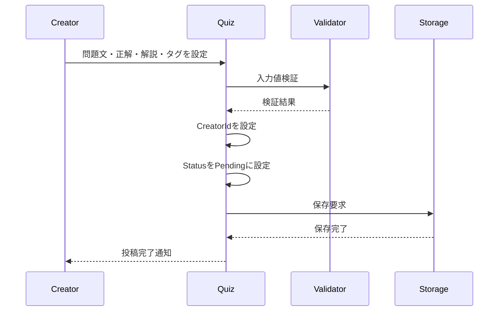
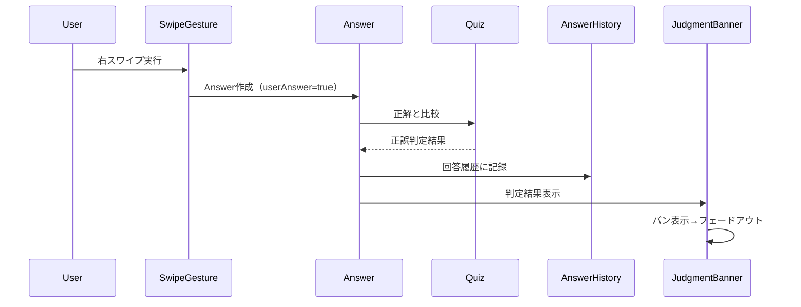
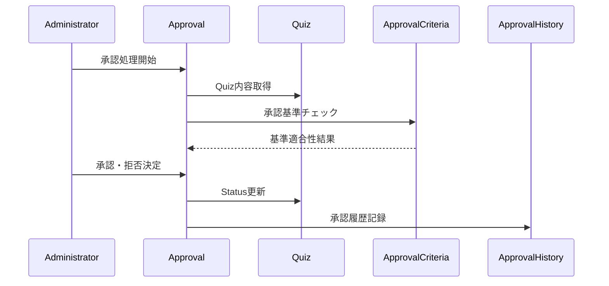
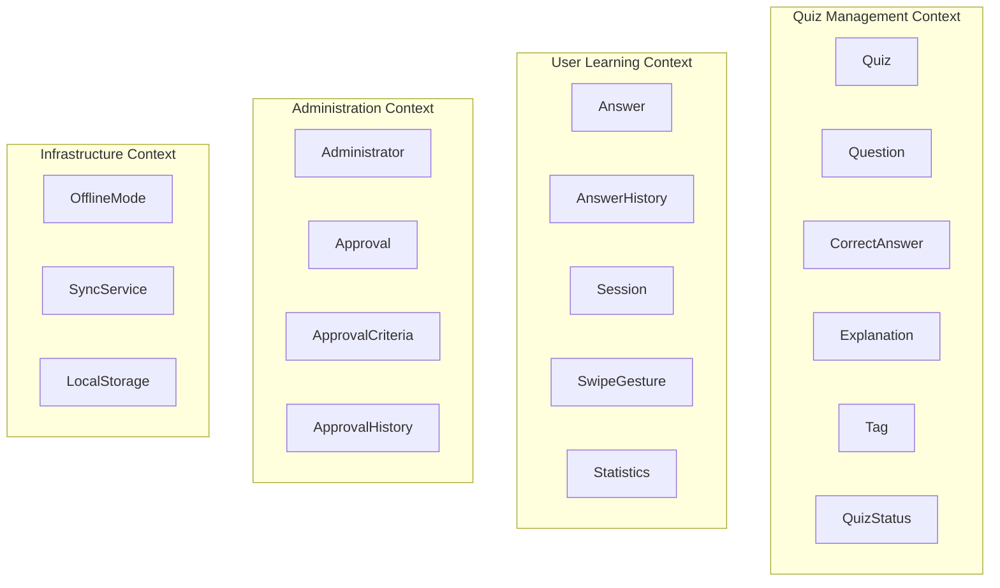
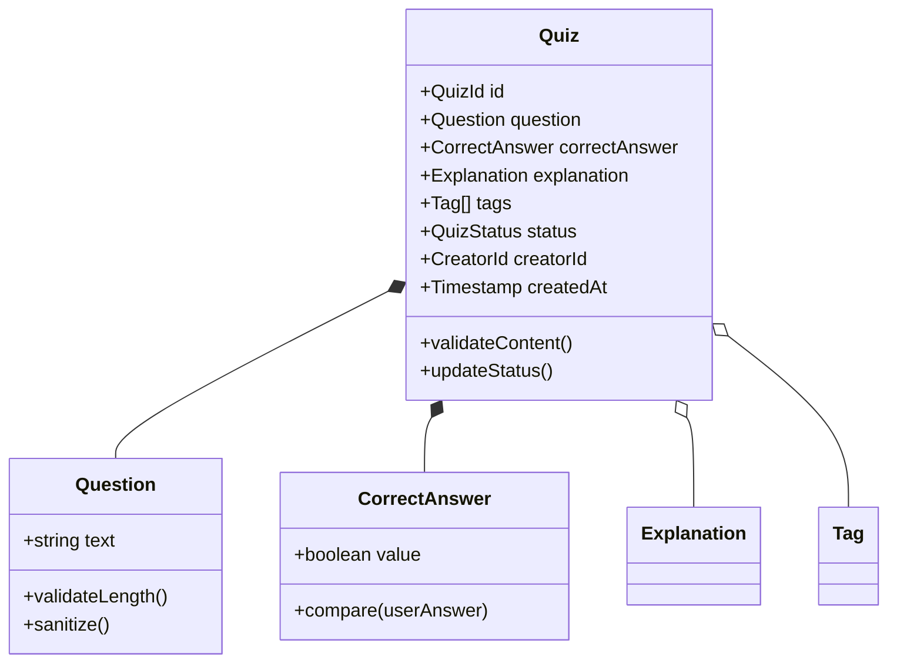
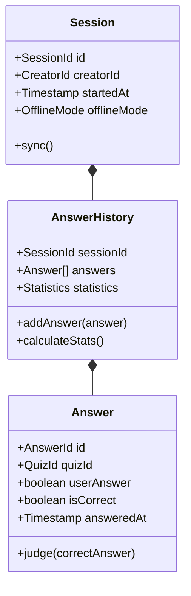
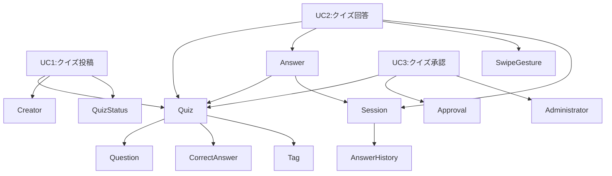
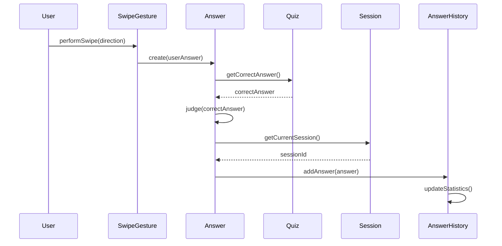

# 案2: ユースケース駆動抽出型

## フォーマット概要

ユースケースを起点としてドメインオブジェクトを抽出・分析する手法。各ユースケースで「何が」「どのように」関与するかを分析し、ユースケース間の共通ドメインと固有ドメインを特定してドメインモデルを構築。

## 構成

```markdown
# ドメインオブジェクト抽出・分析（ユースケース駆動）

## ユースケース一覧と優先度
### 主要ユースケース特定
### ビジネス価値による優先度設定

## ユースケース別ドメイン分析
### UC別の参加者・概念・振る舞い抽出
### ドメイン間の相互作用パターン

## 横断分析
### ユースケース間の共通ドメイン特定
### 固有ドメインと共通ドメインの分離

## ドメイン統合モデル
### 全ユースケースを統合したドメインモデル
### ドメイン間の依存関係・制約
```

## サンプル実装

```markdown
# ドメインオブジェクト抽出・分析（ユースケース駆動）

## ユースケース一覧と優先度

### 主要ユースケース特定
**分析対象**: user-stories, requirements, success-scenarios

| ID | ユースケース名 | 概要 | ビジネス価値 | 優先度 | 分析対象仕様 |
|----|---------------|------|-------------|--------|-------------|
| **UC1** | クイズ投稿 | 匿名ユーザーがクイズを作成・投稿する | 高（コンテンツ供給） | 🔴 高 | user-story#L11, success#L26-L46 |
| **UC2** | クイズ回答 | ユーザーがスワイプでクイズに回答する | 最高（核心価値） | 🔴 最高 | user-story#L11, success#L3-L25 |
| **UC3** | クイズ承認 | 管理者が投稿クイズを承認・拒否する | 高（品質保証） | 🔴 高 | requirements#L20-L21 |
| **UC4** | 回答履歴確認 | ユーザーが過去の回答履歴を確認する | 中（継続利用） | 🟡 中 | success#L47-L65 |
| **UC5** | タグ絞り込み | ユーザーがタグでクイズを絞り込む | 中（利便性） | 🟡 中 | success#L3-L15 |
| **UC6** | オフライン利用 | ネットワーク断線時もクイズ利用を継続 | 中（可用性） | 🟡 中 | success#L66-L84 |

### ビジネス価値による優先度設定
1. **最高優先**: UC2（クイズ回答）- アプリの核心価値
2. **高優先**: UC1（クイズ投稿）, UC3（クイズ承認）- 価値提供の基盤
3. **中優先**: UC4-UC6 - 利便性・継続利用のための機能

## ユースケース別ドメイン分析

### UC1: クイズ投稿

#### 参加者・概念・振る舞い抽出
**アクター**: 匿名ユーザー（Creator）

**参加ドメイン概念**:
- **Quiz**: 投稿されるクイズエンティティ
- **Question**: 問題文（500文字制限）
- **CorrectAnswer**: 正解（◯×）
- **Explanation**: 解説（1000文字制限・任意）
- **Tag**: 分類タグ（任意・複数）
- **Creator**: 匿名投稿者
- **CreatorId**: salt付きハッシュ識別子
- **QuizStatus**: 承認状態（投稿時は'pending'）

**主要振る舞い**:


**ビジネスルール**:

- Question: 必須、500文字以内、HTMLサニタイズ
- CorrectAnswer: 必須、◯×の2択
- Explanation: 任意、1000文字以内
- Creator: salt付きハッシュで匿名識別
- Status: 投稿時は必ず'pendingApproval'

#### ドメイン間相互作用

- **Creator → Quiz**: 作成関係（1対多）
- **Creator → CreatorId**: 識別関係（1対1）
- **Quiz → Question**: 包含関係（1対1、必須）
- **Quiz → CorrectAnswer**: 包含関係（1対1、必須）
- **Quiz → Explanation**: 包含関係（1対0..1、任意）
- **Quiz → Tag**: 関連関係（多対多）

---

### UC2: クイズ回答

#### 参加者・概念・振る舞い抽出

**アクター**: 匿名ユーザー（User）

**参加ドメイン概念**:

- **Quiz**: 回答対象のクイズ（承認済みのみ）
- **Question**: 表示される問題文
- **CorrectAnswer**: 正誤判定の基準
- **SwipeGesture**: ユーザーのスワイプ操作
- **Answer**: ユーザーの回答記録
- **AnswerResult**: 正誤判定結果
- **Session**: ユーザーセッション
- **AnswerHistory**: 回答履歴
- **JudgmentBanner**: 正誤判定UI表示

**主要振る舞い**:



**ビジネスルール**:

- SwipeGesture: 右=◯、左=×、Tinder UI形式
- Answer: 回答と同時に正誤判定実行
- AnswerHistory: indexedDBに永続保存
- Quiz: 承認済み状態のみ回答可能
- JudgmentBanner: バン表示後2秒でフェードアウト

#### ドメイン間相互作用

- **User → SwipeGesture**: 操作関係
- **SwipeGesture → Answer**: 生成関係
- **Answer → Quiz**: 参照関係（正誤判定）
- **Answer → Session**: 所属関係
- **Session → AnswerHistory**: 集約関係
- **Answer → JudgmentBanner**: 表示トリガー関係

---

### UC3: クイズ承認

#### 参加者・概念・振る舞い抽出

**アクター**: 管理者（Administrator）

**参加ドメイン概念**:

- **Administrator**: 承認権限を持つユーザー
- **Quiz**: 承認対象のクイズ（pending状態）
- **Approval**: 承認処理のドメインサービス
- **ApprovalCriteria**: 承認基準
- **ApprovalResult**: 承認・拒否の結果
- **ApprovalHistory**: 承認履歴
- **QuizStatus**: クイズの承認状態

**主要振る舞い**:



**ビジネスルール**:

- Administrator: 管理者権限必須
- ApprovalCriteria: 内容適切性チェック（詳細要確認）
- QuizStatus: pending → approved/rejected
- ApprovalHistory: 承認者・日時・理由を記録

#### ドメイン間相互作用

- **Administrator → Approval**: 実行関係
- **Approval → Quiz**: 評価対象関係
- **Approval → ApprovalCriteria**: 利用関係
- **Approval → QuizStatus**: 更新関係
- **Approval → ApprovalHistory**: 記録関係

---

### UC4: 回答履歴確認

#### 参加者・概念・振る舞い抽出

**アクター**: ユーザー

**参加ドメイン概念**:

- **User**: 履歴確認ユーザー
- **AnswerHistory**: 回答履歴集約
- **Answer**: 個別の回答記録
- **Quiz**: 回答対象だったクイズ
- **HistoryView**: 履歴表示UI
- **Statistics**: 統計情報（正答率等）

**ビジネスルール**:

- AnswerHistory: ブラウザローカルに永続保存
- Answer: 問題文・回答・正誤・日時を記録
- Statistics: 総回答数・正答率を算出

---

### UC5: タグ絞り込み

#### 参加者・概念・振る舞い抽出

**アクター**: ユーザー

**参加ドメイン概念**:

- **User**: 絞り込み実行ユーザー
- **Tag**: 絞り込み条件
- **Filter**: 絞り込み処理
- **Quiz**: 絞り込み対象
- **QuizList**: 絞り込み結果

**ビジネスルール**:

- Tag: クイズに複数設定可能
- Filter: 承認済みクイズのみ対象
- QuizList: タグ一致するクイズ一覧

---

### UC6: オフライン利用

#### 参加者・概念・振る舞い抽出

**アクター**: ユーザー

**参加ドメイン概念**:

- **User**: オフライン利用ユーザー
- **OfflineMode**: オフライン状態管理
- **LocalStorage**: ローカルデータ保存
- **SyncService**: 同期処理サービス
- **Quiz**: 事前ダウンロード済みクイズ
- **Answer**: ローカル保存される回答

**ビジネスルール**:

- OfflineMode: ネットワーク断線検出で自動移行
- LocalStorage: 事前ダウンロード済みデータで動作
- SyncService: オンライン復旧時に自動同期

## 横断分析

### ユースケース間の共通ドメイン特定

#### 高頻度共通ドメイン（コアドメイン）

| ドメイン | 関与UC | 重要度 | 共通振る舞い |
|----------|--------|--------|-------------|
| **Quiz** | UC1,UC2,UC3,UC4,UC5 | ✅ 超高 | 作成・表示・承認・検索・回答対象 |
| **Answer** | UC2,UC4,UC6 | ✅ 高 | 回答記録・履歴管理・オフライン保存 |
| **User/Creator** | UC1,UC2,UC4,UC5,UC6 | ✅ 高 | 匿名識別・操作実行・セッション管理 |

#### 中頻度共通ドメイン（サポートドメイン）

| ドメイン | 関与UC | 重要度 | 共通振る舞い |
|----------|--------|--------|-------------|
| **Tag** | UC1,UC5 | 🔶 中 | クイズ分類・絞り込み検索 |
| **Session** | UC2,UC4,UC6 | 🔶 中 | セッション管理・履歴管理・同期制御 |
| **QuizStatus** | UC1,UC2,UC3 | 🔶 中 | 状態管理・公開制御 |

#### 低頻度・固有ドメイン（専門ドメイン）

| ドメイン | 関与UC | 重要度 | 特化振る舞い |
|----------|--------|--------|-------------|
| **Approval** | UC3 | 🟡 専門 | 承認処理のみ |
| **SwipeGesture** | UC2 | 🟡 専門 | スワイプ回答のみ |
| **OfflineMode** | UC6 | 🟡 専門 | オフライン処理のみ |

### 固有ドメインと共通ドメインの分離

#### 境界づけられたコンテキスト候補



## ドメイン統合モデル

### 全ユースケース統合後のドメインモデル

#### コアドメイン（Quiz集約）



#### サポートドメイン（Learning集約）



### ドメイン間の依存関係・制約

#### 依存関係マップ



#### 重要な制約

1. **UC1 → UC3 → UC2**: クイズ投稿→承認→回答の順序制約
2. **Quiz.status == 'approved'**: UC2でのクイズ回答前提条件
3. **Creator.anonymous == true**: 全UCで匿名性保持必須
4. **Answer → Quiz**: 削除されたQuizへの回答は無効

### ユースケース実現のためのドメイン協調

#### UC2（クイズ回答）の詳細協調



## 実装への示唆

### 集約設計

1. **Quiz集約**: UC1,UC2,UC3,UC5で共通利用
2. **LearningSession集約**: UC2,UC4,UC6で学習状態管理
3. **Approval集約**: UC3専用、管理機能

### ドメインサービス

1. **QuizApprovalService**: UC3の承認ロジック
2. **AnswerJudgmentService**: UC2の正誤判定ロジック
3. **OfflineSyncService**: UC6の同期ロジック

### リポジトリ設計

1. **QuizRepository**: UC別の検索条件対応
2. **AnswerRepository**: セッション単位、履歴管理
3. **SessionRepository**: 匿名ユーザーセッション管理

```

## 利点・欠点

### 利点
- ✅ **ユースケース中心**: ビジネス価値の高いドメインを優先特定
- ✅ **実用性**: 実際のユースケース実現に直結したドメインモデル
- ✅ **優先度明確**: ビジネス価値による開発優先度設定
- ✅ **境界明確**: ユースケース分析から自然な境界づけられたコンテキスト導出

### 欠点
- ❌ **ユースケース依存**: ユースケース定義の品質に依存
- ❌ **分析工数**: 全ユースケースの詳細分析が必要
- ❌ **見落としリスク**: ユースケース横断の重要ドメインを見落とす可能性

## 適用場面
- ユースケース仕様が充実している場合
- ビジネス価値による優先度設定が重要
- 段階的な実装・リリースを計画する場合
- ユースケース実現を最優先する場合
