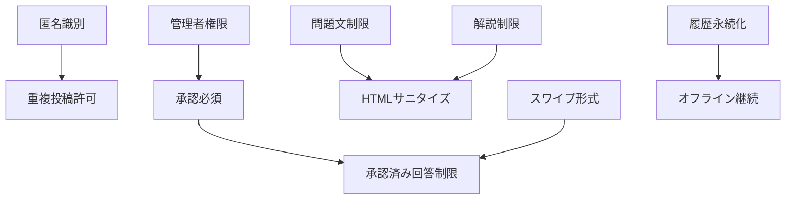

# 案5: ビジネスルール中心分析型

## フォーマット概要

ビジネスルール・制約・不変条件を最優先として、それらを実現・保証するドメインオブジェクトを特定する手法。ルールの責任所在を明確化し、ルール間の依存関係・優先度を分析して集約境界を設定。

## 構成

```markdown
# ドメインオブジェクト抽出・分析（ビジネスルール中心）

## ビジネスルール洗い出し
### specifications分析からのルール抽出
### ルールの分類（制約・不変条件・業務フロー・計算ルール）

## ルール責任分析
### ルールを守る責任者の特定
### ルール検証・実行のタイミング

## ルール間関係分析
### ルール間の依存関係・優先度
### 競合・矛盾するルールの特定

## 集約境界設定
### 不変条件から見た集約設計
### ルール整合性保証の範囲

## ドメインオブジェクト抽出
### ルール実現のために必要なオブジェクト
### ルール検証・実行の責任分散
```

## サンプル実装

```markdown
# ドメインオブジェクト抽出・分析（ビジネスルール中心）

## ビジネスルール洗い出し

### specifications分析からのルール抽出
**分析対象**: user-stories, requirements, success-scenarios

| ルールID | ルール名 | 内容 | 発見箇所 | 分類 | 重要度 |
|----------|----------|------|----------|------|--------|
| **BR001** | 問題文文字数制限 | 問題文は500文字以内 | requirements#L11 | 制約 | 🔴 高 |
| **BR002** | 解説文字数制限 | 解説は1000文字以内 | requirements#L13 | 制約 | 🟡 中 |
| **BR003** | 正解形式制限 | 正解は◯×の2択のみ | requirements#L12 | 制約 | 🔴 高 |
| **BR004** | 承認必須 | クイズは管理者承認後のみ公開 | requirements#L20 | 業務フロー | 🔴 最高 |
| **BR005** | 匿名識別 | 作成者はsalt付きハッシュで識別 | requirements#L22 | 制約 | 🔴 高 |
| **BR006** | 重複投稿許可 | 同一作成者・同一問題でも投稿可能 | requirements#L15 | 業務フロー | 🟡 中 |
| **BR007** | HTMLサニタイズ | 入力内容のHTMLタグ除去必須 | requirements#L16 | 制約 | 🔴 高 |
| **BR008** | スワイプ操作形式 | 右=◯、左=×のスワイプのみ | requirements#L41 | 制約 | 🔴 高 |
| **BR009** | 履歴永続化 | 回答履歴はindexedDBに永続保存 | success#L24 | 制約 | 🟡 中 |
| **BR010** | オフライン継続 | ネットワーク断線時も動作継続 | success#L70 | 業務フロー | 🟡 中 |
| **BR011** | 管理者権限 | 承認・拒否は管理者のみ実行可能 | requirements#L20 | 制約 | 🔴 最高 |
| **BR012** | 承認済み回答制限 | 承認済みクイズのみ回答可能 | success#L8 | 不変条件 | 🔴 最高 |

### ルールの分類

#### 制約ルール（Constraint Rules）- データ品質保証
- **BR001**: 問題文文字数制限（500文字）
- **BR002**: 解説文字数制限（1000文字）
- **BR003**: 正解形式制限（◯×2択）
- **BR005**: 匿名識別（salt付きハッシュ）
- **BR007**: HTMLサニタイズ（XSS対策）
- **BR008**: スワイプ操作形式（右◯左×）
- **BR009**: 履歴永続化（indexedDB）
- **BR011**: 管理者権限（承認・拒否権限）

#### 不変条件（Invariant Rules）- システム整合性保証
- **BR004**: 承認必須（公開前承認必要）
- **BR012**: 承認済み回答制限（未承認への回答禁止）

#### 業務フローールール（Business Flow Rules）- プロセス制御
- **BR006**: 重複投稿許可（同一問題の複数投稿）
- **BR010**: オフライン継続（ネットワーク独立動作）

#### 計算ルール（Calculation Rules）- 値の導出
- （クイズアプリでは該当なし、将来的に正答率計算等）

## ルール責任分析

### ルールを守る責任者の特定

#### BR001: 問題文文字数制限（500文字以内）
**責任者**: `Question`値オブジェクト
**検証タイミング**: インスタンス生成時
**実行場所**: `Question.create()` メソッド
**違反時の動作**: `ValidationError` 例外発生

```typescript
class Question {
  private constructor(private readonly text: string) {
    this.validateLength(); // BR001実行
  }
  
  public static create(text: string): Question {
    return new Question(text); // ここで検証実行
  }
  
  private validateLength(): void {
    if (this.text.length > 500) {
      throw new ValidationError('問題文は500文字以内である必要があります');
    }
  }
}
```

#### BR004: 承認必須（管理者承認後のみ公開）

**責任者**: `Quiz`エンティティ + `ApprovalService`
**検証タイミング**: 公開時、回答時
**実行場所**: `Quiz.isAvailableForAnswer()`, `ApprovalService.approve()`
**違反時の動作**: 公開拒否、回答拒否

```typescript
class Quiz {
  public isAvailableForAnswer(): boolean {
    return this.status === QuizStatus.Approved; // BR004 & BR012実行
  }
  
  public approve(administrator: Administrator): void {
    this.validateAdministratorPermission(administrator); // BR011実行
    this.status = QuizStatus.Approved; // BR004実現
  }
}

class ApprovalService {
  public approve(quizId: QuizId, administrator: Administrator): void {
    const quiz = this.quizRepository.findById(quizId);
    quiz.approve(administrator); // BR004 & BR011実行
    this.quizRepository.save(quiz);
  }
}
```

#### BR005: 匿名識別（salt付きハッシュ）

**責任者**: `CreatorId`値オブジェクト + `CreatorIdentificationService`
**検証タイミング**: 作成者識別時
**実行場所**: `CreatorId.generate()`, `CreatorIdentificationService.identify()`
**違反時の動作**: 識別失敗、作成権限なし

```typescript
class CreatorId {
  private constructor(private readonly hashedValue: string) {}
  
  public static generate(deviceInfo: DeviceInfo, salt: string): CreatorId {
    const hash = this.generateSaltedHash(deviceInfo, salt); // BR005実行
    return new CreatorId(hash);
  }
  
  private static generateSaltedHash(deviceInfo: DeviceInfo, salt: string): string {
    // salt付きハッシュ生成（BR005の具体的実装）
    return sha256(deviceInfo.toString() + salt);
  }
}
```

#### BR008: スワイプ操作形式（右◯左×）

**責任者**: `SwipeGesture`値オブジェクト
**検証タイミング**: スワイプ検出時
**実行場所**: `SwipeGesture.interpret()`
**違反時の動作**: 操作無効化

```typescript
class SwipeGesture {
  public interpret(): boolean {
    // BR008実行：右=true(◯)、左=false(×)
    if (this.direction === SwipeDirection.Right) {
      return true; // ◯
    } else if (this.direction === SwipeDirection.Left) {
      return false; // ×
    } else {
      throw new InvalidOperationError('有効なスワイプ操作ではありません');
    }
  }
}
```

### ルール検証・実行のタイミング

#### タイミング分類

##### 1. 生成時検証（Creation Time）

- **BR001**: 問題文文字数制限
- **BR002**: 解説文字数制限
- **BR003**: 正解形式制限
- **BR005**: 匿名識別
- **BR007**: HTMLサニタイズ

##### 2. 状態変更時検証（State Change Time）

- **BR004**: 承認必須（状態変更時）
- **BR011**: 管理者権限（承認操作時）

##### 3. 利用時検証（Usage Time）

- **BR012**: 承認済み回答制限（回答時）
- **BR008**: スワイプ操作形式（操作時）

##### 4. 継続的検証（Continuous）

- **BR009**: 履歴永続化（データ保存時）
- **BR010**: オフライン継続（ネットワーク状態変化時）

## ルール間関係分析

### ルール間の依存関係・優先度

#### 依存関係マップ



#### 優先度階層

##### Tier 1: システム整合性（最高優先度）

- **BR004**: 承認必須
- **BR011**: 管理者権限
- **BR012**: 承認済み回答制限

##### Tier 2: セキュリティ・品質（高優先度）

- **BR001**: 問題文文字数制限
- **BR003**: 正解形式制限
- **BR005**: 匿名識別
- **BR007**: HTMLサニタイズ
- **BR008**: スワイプ操作形式

##### Tier 3: ユーザビリティ・利便性（中優先度）

- **BR002**: 解説文字数制限
- **BR006**: 重複投稿許可
- **BR009**: 履歴永続化
- **BR010**: オフライン継続

### 競合・矛盾するルールの特定

#### 潜在的競合ルール

##### 競合1: 重複投稿許可 vs 品質管理

- **BR006**: 重複投稿許可（同一問題の複数投稿を許可）
- **BR004**: 承認必須（品質管理のため承認が必要）
- **競合内容**: 重複投稿により承認負荷が増加
- **解決方針**: 承認時に重複チェックを行い、明らかな重複は拒否

##### 競合2: オフライン継続 vs 承認済み制限

- **BR010**: オフライン継続（ネットワーク断線時も動作）
- **BR012**: 承認済み回答制限（承認済みのみ回答可能）
- **競合内容**: オフライン時は最新の承認状態を確認できない
- **解決方針**: 事前ダウンロード時に承認済みクイズのみを対象とする

##### 競合3: 匿名識別 vs 履歴永続化

- **BR005**: 匿名識別（プライバシー保護）
- **BR009**: 履歴永続化（学習記録保持）
- **競合内容**: 匿名性と履歴の永続化のバランス
- **解決方針**: デバイスローカルでの履歴保存、個人特定不可能な形式

## 集約境界設定

### 不変条件から見た集約設計

#### 集約1: Quiz集約

**保護する不変条件**:

- **BR001**: 問題文は500文字以内
- **BR002**: 解説は1000文字以内
- **BR003**: 正解は◯×の2択
- **BR004**: 承認状態の整合性
- **BR007**: 入力内容のサニタイズ

**集約境界の根拠**:

- これらのルールは密接に関連し、同時に満たされる必要がある
- Quiz作成・更新時に一貫して検証が必要
- 他の集約からは参照のみ、変更は不可

```typescript
class QuizAggregate {
  private quiz: Quiz;
  private question: Question;
  private correctAnswer: CorrectAnswer;
  private explanation?: Explanation;
  private tags: Tag[];
  
  public create(quizData: CreateQuizData, creator: CreatorId): void {
    // BR001, BR002, BR003, BR007を同時実行
    this.question = Question.create(quizData.question); // BR001, BR007
    this.correctAnswer = CorrectAnswer.create(quizData.correctAnswer); // BR003
    this.explanation = quizData.explanation 
      ? Explanation.create(quizData.explanation) // BR002, BR007
      : undefined;
    
    this.quiz = Quiz.create({
      question: this.question,
      correctAnswer: this.correctAnswer,
      explanation: this.explanation,
      tags: this.tags,
      creator: creator,
      status: QuizStatus.PendingApproval // BR004
    });
  }
  
  public approve(administrator: Administrator): void {
    // BR004, BR011を同時実行
    this.quiz.validateAdministratorPermission(administrator); // BR011
    this.quiz.approve(); // BR004
  }
}
```

#### 集約2: LearningSession集約

**保護する不変条件**:

- **BR008**: スワイプ操作形式（右◯左×）
- **BR009**: 履歴永続化
- **BR010**: オフライン継続性
- **BR012**: 承認済みクイズのみ回答可能

**集約境界の根拠**:

- 学習セッション内での回答の整合性保証
- オフライン・オンライン状態での一貫した動作
- セッション単位での履歴管理

```typescript
class LearningSessionAggregate {
  private session: Session;
  private answerHistory: AnswerHistory;
  private offlineMode: OfflineMode;
  
  public processAnswer(
    gesture: SwipeGesture, 
    quiz: Quiz, 
    timestamp: Date
  ): AnswerResult {
    // BR008: スワイプ形式検証
    const userAnswer = gesture.interpret(); // BR008実行
    
    // BR012: 承認済みクイズ確認
    if (!quiz.isAvailableForAnswer()) { // BR012実行
      throw new BusinessRuleViolationError('承認済みクイズのみ回答可能です');
    }
    
    // 回答記録
    const answer = Answer.create({
      quizId: quiz.id,
      userAnswer: userAnswer,
      isCorrect: quiz.judge(userAnswer),
      answeredAt: timestamp
    });
    
    // BR009: 履歴永続化
    this.answerHistory.addAnswer(answer); // BR009実行
    this.persistHistory(); // BR009実行
    
    return new AnswerResult(answer, quiz);
  }
  
  private persistHistory(): void {
    // BR009, BR010: オフライン対応も含めた永続化
    if (this.offlineMode.isOnline()) {
      this.syncToRemote();
    }
    this.saveToLocal(); // BR009実行
  }
}
```

#### 集約3: Identity集約

**保護する不変条件**:

- **BR005**: 匿名識別（salt付きハッシュ）
- **BR006**: 重複投稿許可（同一作成者の識別）

**集約境界の根拠**:

- 作成者の識別情報の一意性・匿名性保証
- デバイス変更時の継続性制御

```typescript
class IdentityAggregate {
  private creator: Creator;
  private creatorId: CreatorId;
  private deviceInfo: DeviceInfo;
  
  public generateCreatorIdentity(deviceInfo: DeviceInfo): CreatorId {
    // BR005: salt付きハッシュによる匿名識別
    const salt = this.generateSalt();
    const creatorId = CreatorId.generate(deviceInfo, salt); // BR005実行
    
    this.creator = Creator.create(creatorId, deviceInfo);
    this.creatorId = creatorId;
    this.deviceInfo = deviceInfo;
    
    return creatorId;
  }
  
  public canSubmitQuiz(quizData: QuizData): boolean {
    // BR006: 重複投稿許可の確認
    // 同一作成者による同一問題でも投稿可能
    return true; // BR006により常に許可
  }
}
```

### ルール整合性保証の範囲

#### 集約内整合性（Strong Consistency）

- **同一トランザクション内**で全ルールを検証・実行
- **即座の整合性**保証
- **ロールバック**による原子性確保

#### 集約間整合性（Eventual Consistency）

- **ドメインイベント**による結果整合性
- **サーガパターン**による長期実行プロセス
- **補償アクション**によるエラー時復旧

```typescript
// 集約内整合性の例
class QuizAggregate {
  public create(quizData: CreateQuizData): void {
    const transaction = this.startTransaction();
    
    try {
      // BR001, BR002, BR003, BR007を同時実行
      this.validateAllRules(quizData);
      this.createQuizEntity(quizData);
      
      transaction.commit(); // 全ルール成功時のみコミット
    } catch (error) {
      transaction.rollback(); // 1つでも失敗時はロールバック
      throw error;
    }
  }
}

// 集約間整合性の例
class QuizApprovalSaga {
  public async handleQuizApproved(event: QuizApprovedEvent): Promise<void> {
    try {
      // 他集約への影響（結果整合性）
      await this.updatePublicQuizList(event.quizId);
      await this.notifyCreator(event.creatorId);
      await this.updateStatistics(event.quizId);
    } catch (error) {
      // 補償アクション
      await this.revertQuizApproval(event.quizId);
    }
  }
}
```

## ドメインオブジェクト抽出

### ルール実現のために必要なオブジェクト

#### ルール実行オブジェクト（Rule Executors）

| ルールID | 実行オブジェクト | 責任 | インターフェース |
|----------|----------------|------|-----------------|
| **BR001-BR003** | Question, CorrectAnswer, Explanation | 入力値制約実行 | `validate(): ValidationResult` |
| **BR004** | Quiz, ApprovalService | 承認状態管理 | `approve(): void`, `isApproved(): boolean` |
| **BR005** | CreatorId, CreatorIdentificationService | 匿名識別実行 | `generate(): CreatorId`, `verify(): boolean` |
| **BR007** | InputSanitizer | HTMLサニタイズ実行 | `sanitize(input: string): string` |
| **BR008** | SwipeGesture | スワイプ解釈実行 | `interpret(): boolean` |
| **BR009** | AnswerHistory, PersistenceService | 履歴永続化実行 | `persist(): void`, `restore(): AnswerHistory` |

#### ルール検証オブジェクト（Rule Validators）

| ルールカテゴリ | 検証オブジェクト | 責任 | 検証タイミング |
|-------------|-----------------|------|---------------|
| **制約ルール** | ConstraintValidator | 値・形式の制約チェック | 値生成時 |
| **不変条件** | InvariantChecker | システム整合性チェック | 状態変更前後 |
| **業務フロー** | BusinessFlowValidator | プロセス整合性チェック | 処理実行前 |
| **権限ルール** | PermissionChecker | 権限・認可チェック | 操作実行前 |

```typescript
// 制約ルール検証
class ConstraintValidator {
  public validateQuestion(text: string): ValidationResult {
    const results: ValidationResult[] = [];
    
    // BR001: 文字数制限
    if (text.length > 500) {
      results.push(ValidationResult.error('問題文は500文字以内'));
    }
    
    // BR007: HTMLサニタイズチェック
    if (this.containsHtmlTags(text)) {
      results.push(ValidationResult.warning('HTMLタグが検出されました'));
    }
    
    return ValidationResult.combine(results);
  }
}

// 不変条件チェック
class InvariantChecker {
  public checkQuizApprovalInvariant(quiz: Quiz): InvariantResult {
    // BR004 & BR012: 承認状態の整合性
    if (quiz.isPublic() && !quiz.isApproved()) {
      return InvariantResult.violation('未承認クイズは公開できません');
    }
    
    return InvariantResult.satisfied();
  }
}

// 業務フロー検証
class BusinessFlowValidator {
  public validateQuizSubmissionFlow(
    creator: Creator, 
    quizData: QuizData
  ): FlowValidationResult {
    // BR006: 重複投稿許可の確認
    const duplicateAllowed = this.checkDuplicateSubmissionAllowed(creator, quizData);
    
    if (!duplicateAllowed.isAllowed && duplicateAllowed.strictMode) {
      return FlowValidationResult.blocked('重複投稿は許可されていません');
    }
    
    return FlowValidationResult.allowed();
  }
}
```

### ルール検証・実行の責任分散

#### 責任分散の原則

##### 1. 単一責任の原則（Single Responsibility）

- 各オブジェクトは1つのルールカテゴリのみ担当
- ルール実行と検証の責任分離
- 値オブジェクトは自身の制約のみ保証

##### 2. オープン・クローズの原則（Open/Closed）

- 新しいルール追加時は拡張のみ（既存コード修正なし）
- ルール検証インターフェースの標準化
- プラガブルなルール実行機構

##### 3. 依存性逆転の原則（Dependency Inversion）

- 高レベルルール（業務フロー）は低レベルルール（制約）に依存しない
- ルール実行者はルール定義に依存、逆は禁止
- インターフェースによる疎結合

#### 実装パターン

##### パターン1: ルール実行の委譲

```typescript
class Quiz {
  private constructor(
    private readonly question: Question,
    private readonly correctAnswer: CorrectAnswer,
    private status: QuizStatus
  ) {}
  
  public static create(data: CreateQuizData): Quiz {
    // 制約ルールは値オブジェクトに委譲
    const question = Question.create(data.question); // BR001, BR007
    const correctAnswer = CorrectAnswer.create(data.correctAnswer); // BR003
    
    // 業務フローはサービスに委譲
    const initialStatus = QuizCreationService.determineInitialStatus(); // BR004
    
    return new Quiz(question, correctAnswer, initialStatus);
  }
  
  public approve(administrator: Administrator): void {
    // 権限チェックはサービスに委譲
    PermissionService.checkApprovalPermission(administrator); // BR011
    
    // 状態変更は自身が実行
    this.status = QuizStatus.Approved; // BR004
  }
}
```

##### パターン2: ルール検証のチェーン

```typescript
class RuleValidationChain {
  private validators: RuleValidator[] = [];
  
  public addValidator(validator: RuleValidator): void {
    this.validators.push(validator);
  }
  
  public validate(target: any): ValidationResult {
    const results: ValidationResult[] = [];
    
    for (const validator of this.validators) {
      const result = validator.validate(target);
      results.push(result);
      
      // 高優先度ルール違反時は即座に停止
      if (result.isCriticalFailure()) {
        break;
      }
    }
    
    return ValidationResult.combine(results);
  }
}

// 使用例
const quizValidationChain = new RuleValidationChain();
quizValidationChain.addValidator(new ConstraintValidator()); // BR001-BR003
quizValidationChain.addValidator(new SecurityValidator()); // BR007
quizValidationChain.addValidator(new BusinessRuleValidator()); // BR004-BR006

const validationResult = quizValidationChain.validate(quiz);
```

##### パターン3: ルール実行のイベント駆動

```typescript
class RuleExecutionEventBus {
  public async executeRule(ruleId: string, context: RuleExecutionContext): Promise<void> {
    const event = new RuleExecutionRequestedEvent(ruleId, context);
    await this.eventBus.publish(event);
  }
}

class BR004_ApprovalRuleHandler implements RuleExecutionHandler {
  public async handle(event: RuleExecutionRequestedEvent): Promise<void> {
    if (event.ruleId === 'BR004') {
      const quiz = event.context.target as Quiz;
      const administrator = event.context.actor as Administrator;
      
      // BR004: 承認必須ルールの実行
      quiz.approve(administrator);
      
      // 実行結果のイベント発行
      await this.eventBus.publish(new RuleExecutedEvent('BR004', quiz.id));
    }
  }
}
```

## 実装への示唆

### ビジネスルール中心設計の原則

#### 1. ルールファーストアプローチ

- **ルール定義**から設計を開始
- **制約から責任**への自然な導出
- **ビジネス価値**との直接的な対応

#### 2. ルール実行の可視性

- **ルール違反**の明確なエラーメッセージ
- **ルール実行履歴**の追跡可能性
- **ルール変更**の影響範囲分析

#### 3. ルールの進化対応

- **新ルール追加**の容易さ
- **既存ルール変更**の影響最小化
- **ルール間競合**の早期発見

### TypeScript実装ガイドライン

#### ルール表現の型安全性

```typescript
// ルール定義の型安全性
type BusinessRule<T> = {
  id: string;
  description: string;
  validate: (target: T) => ValidationResult;
  execute?: (target: T) => void;
};

const BR001_QuestionLengthRule: BusinessRule<string> = {
  id: 'BR001',
  description: '問題文は500文字以内',
  validate: (question: string) => {
    return question.length <= 500 
      ? ValidationResult.success() 
      : ValidationResult.error('問題文は500文字以内である必要があります');
  }
};

// ルール適用の型安全性
class RuleEngine {
  public applyRules<T>(target: T, rules: BusinessRule<T>[]): ValidationResult {
    const results = rules.map(rule => rule.validate(target));
    return ValidationResult.combine(results);
  }
}
```

#### 不変条件の実装

```typescript
// 集約での不変条件保証
abstract class AggregateRoot {
  protected invariants: InvariantRule[] = [];
  
  protected checkInvariants(): void {
    for (const invariant of this.invariants) {
      const result = invariant.check(this);
      if (!result.isSatisfied()) {
        throw new InvariantViolationError(invariant.description, result.violation);
      }
    }
  }
  
  protected addInvariant(invariant: InvariantRule): void {
    this.invariants.push(invariant);
  }
}

class QuizAggregate extends AggregateRoot {
  constructor() {
    super();
    
    // BR004, BR012の不変条件を登録
    this.addInvariant(new ApprovalInvariant());
    this.addInvariant(new AnswerabilityInvariant());
  }
  
  public changeStatus(newStatus: QuizStatus): void {
    const oldStatus = this.status;
    this.status = newStatus;
    
    try {
      this.checkInvariants(); // 不変条件チェック
    } catch (error) {
      this.status = oldStatus; // ロールバック
      throw error;
    }
  }
}
```

```

## 利点・欠点

### 利点
- ✅ **ビジネス重視**: ビジネスルールが設計の中心
- ✅ **整合性保証**: ルール違反の早期検出・防止
- ✅ **保守性**: ルール変更時の影響範囲明確
- ✅ **テスタビリティ**: ルール単位でのテスト設計
- ✅ **監査性**: ルール実行履歴の追跡

### 欠点
- ❌ **複雑性**: ルール間関係の複雑化
- ❌ **パフォーマンス**: ルール検証のオーバーヘッド
- ❌ **過度設計**: 簡単なルールの過度な抽象化
- ❌ **ルール競合**: 矛盾するルールの調整困難

## 適用場面
- ビジネスルールが複雑・頻繁に変更される場合
- コンプライアンス・監査要件が厳しい場合
- データ品質・整合性が最重要な場合
- ルールベースシステム・エキスパートシステム
- 規制が厳しい業界（金融・医療・法律等）
