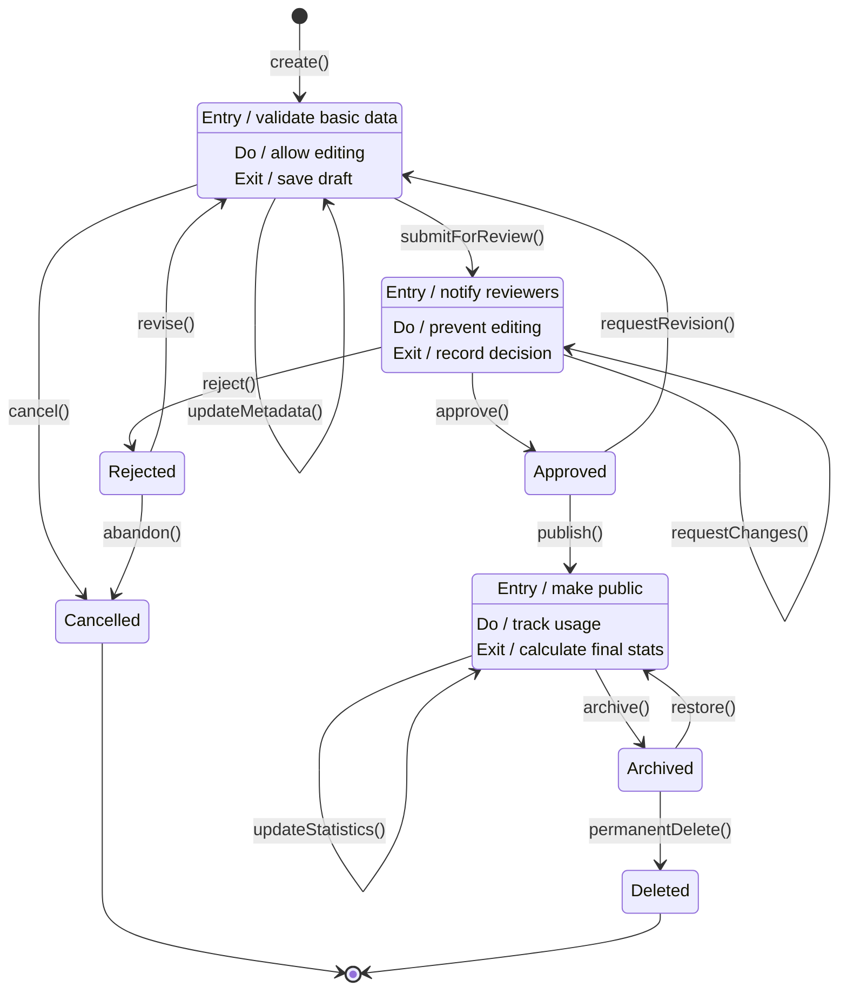
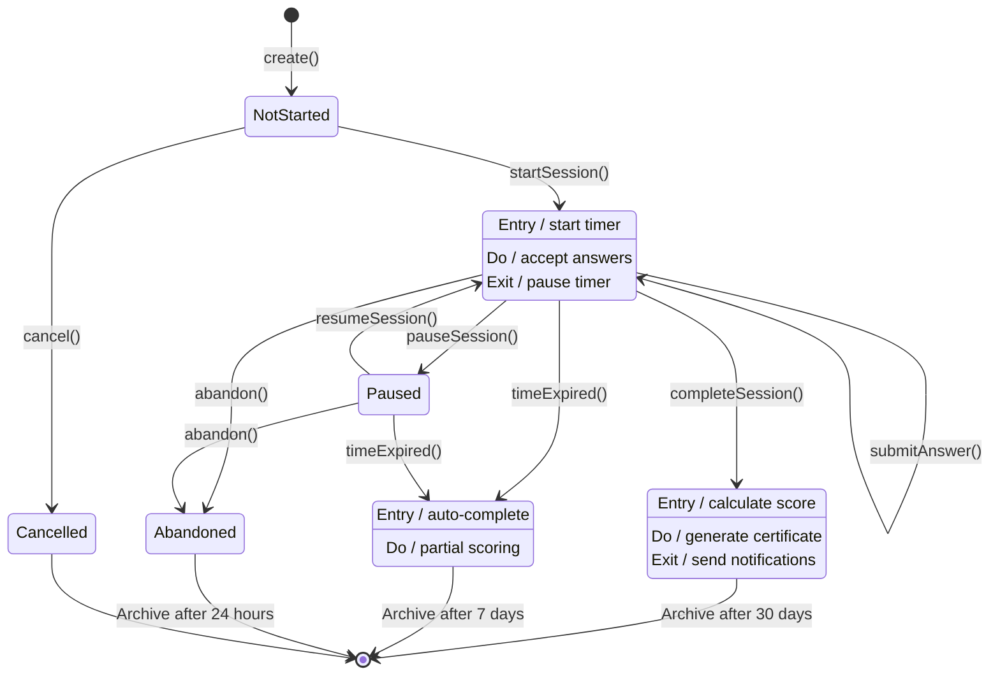
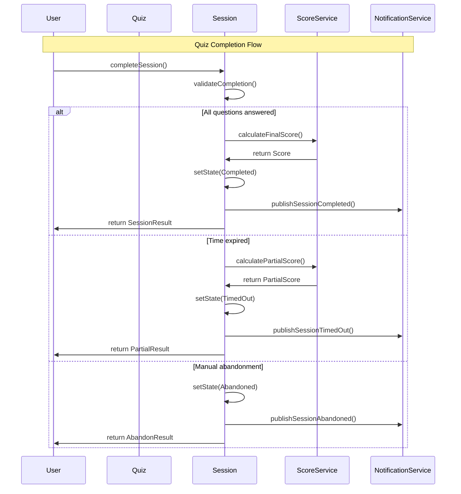
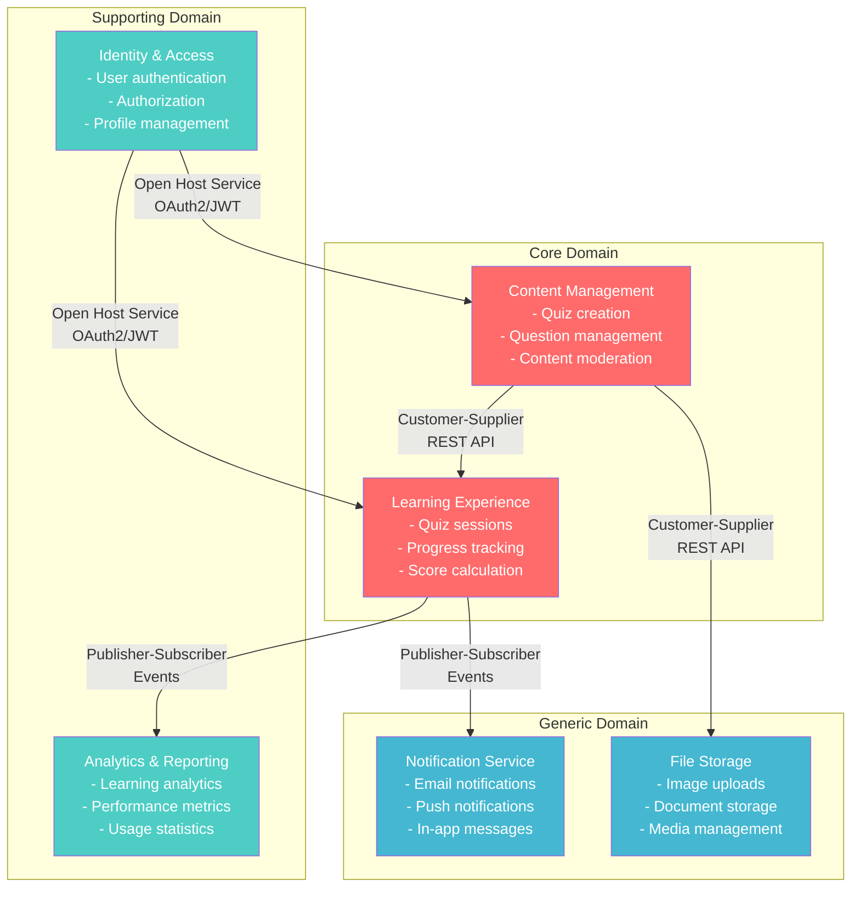
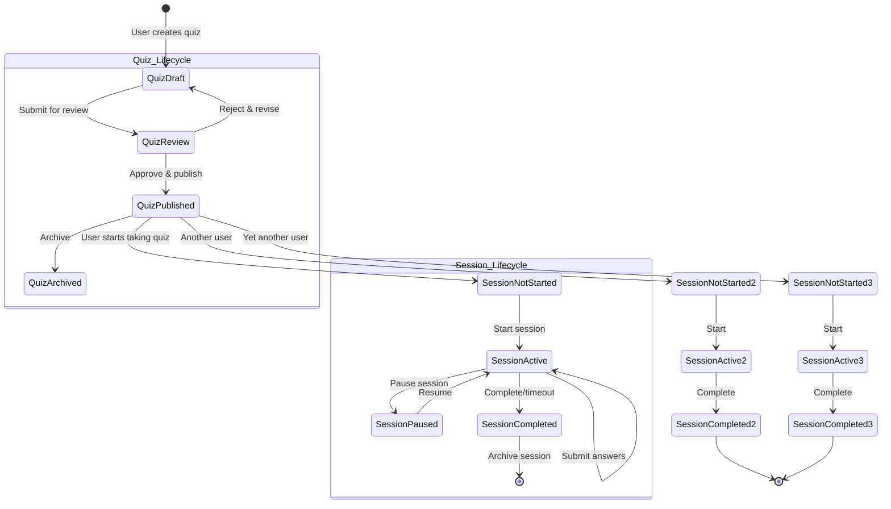

# モデル設計（最終成果物）フォーマット案1：図表駆動統合アプローチ

## フォーマットの概要

DDD 2024年のベストプラクティスに基づき、**4つの核心的な図表（ドメインモデル図・集約図・コンテキストマップ・状態遷移図）を中心とした視覚的モデル表現**によってドメイン知識を統合し、ステークホルダー間の共通理解を促進する図表中心のアプローチ。

## 記載項目テンプレート

### 1. ドメインモデル図（Domain Model Diagram）

#### 包括的ドメインモデル図作成

```markdown
## Comprehensive Domain Model Diagram

### Domain Model Overview

```mermaid
classDiagram
    %% Core Entities
    class Quiz {
        +QuizId id
        +QuizTitle title
        +QuizDescription description
        +QuizCategory category
        +DifficultyLevel difficulty
        +QuizStatus status
        +UserId createdBy
        +Date createdAt
        +Date publishedAt
        +addQuestion(Question) Result~void, DomainError~
        +publish() Result~void, DomainError~
        +archive() Result~void, DomainError~
        +isPublishable() boolean
    }
    
    class Question {
        +QuestionId id
        +QuestionText text
        +QuestionType type
        +Points points
        +TimeLimit timeLimit
        +List~Option~ options
        +CorrectAnswer correctAnswer
        +validateAnswer(Answer) boolean
    }
    
    class QuizSession {
        +QuizSessionId id
        +UserId userId
        +QuizId quizId
        +Date startTime
        +Date endTime
        +SessionStatus status
        +Map~QuestionId, Answer~ answers
        +Score score
        +submitAnswer(QuestionId, AnswerData) Result~void~
        +complete() Result~SessionResult~
    }
    
    class User {
        +UserId id
        +UserName name
        +Email email
        +UserRole role
        +UserPreferences preferences
        +createQuiz(QuizData) Result~Quiz~
        +takeQuiz(QuizId) Result~QuizSession~
    }
    
    %% Value Objects
    class QuizTitle {
        <<ValueObject>>
        +string value
        +validate() ValidationResult
        +equals(QuizTitle) boolean
    }
    
    class Score {
        <<ValueObject>>
        +number rawScore
        +number percentage
        +number correctAnswers
        +number totalQuestions
        +Date calculatedAt
    }
    
    class Answer {
        <<ValueObject>>
        +QuestionId questionId
        +AnswerData data
        +Date submittedAt
        +boolean isCorrect
    }
    
    %% Domain Services  
    class ScoreCalculationService {
        <<DomainService>>
        +calculateScore(QuizSession, Quiz) Result~Score~
        +calculatePartialScore(List~Answer~) PartialScore
    }
    
    class ContentValidationService {
        <<DomainService>>
        +validateQuizContent(Quiz) ValidationResult
        +moderateContent(Content) ModerationResult
    }
    
    %% Relationships
    Quiz ||--o{ Question : contains
    User ||--o{ Quiz : creates
    User ||--o{ QuizSession : takes
    QuizSession }o--|| Quiz : references
    QuizSession ||--o{ Answer : contains
    Question ||--o{ Answer : receives
    
    Quiz ||--|| QuizTitle : has
    QuizSession ||--|| Score : has
    
    ScoreCalculationService ..> QuizSession : calculates
    ScoreCalculationService ..> Quiz : uses
    ContentValidationService ..> Quiz : validates
```

### Entity Specification Matrix

| Entity | Identity | Lifecycle | Key Behaviors | Business Rules | Relationships |
|--------|----------|-----------|---------------|----------------|---------------|
| **Quiz** | QuizId (UUID) | Create→Review→Publish→Archive | Create, AddQuestion, Publish | Min 1 question to publish | 1:N with Questions |
| **Question** | QuestionId (UUID) | Create→Validate→Activate | Validate, UpdateContent | Text required, valid options | N:1 with Quiz |
| **QuizSession** | SessionId (UUID) | Start→InProgress→Complete | SubmitAnswer, Pause, Complete | One answer per question | N:1 with Quiz, User |
| **User** | UserId (UUID) | Register→Active→Inactive | CreateQuiz, TakeQuiz, ManageProfile | Unique email, role-based access | 1:N with Quiz, Session |

### Value Object Design Specifications

| Value Object | Properties | Validation Rules | Immutability Level | Usage Context |
|--------------|------------|------------------|-------------------|---------------|
| **QuizTitle** | value: string | 1-200 chars, non-empty | Immutable | Quiz identification |
| **Score** | rawScore, percentage, metadata | 0-100%, calculated values | Immutable | Session results |
| **Answer** | questionId, data, timestamp | Question exists, valid format | Immutable | User responses |
| **Email** | address: string | Valid email format, unique | Immutable | User identification |
```

### 2. 集約図（Aggregate Diagram）

#### 詳細集約構造図

```markdown
## Detailed Aggregate Structure Diagrams

### Quiz Aggregate Root

```mermaid
graph TB
    subgraph "Quiz Aggregate"
        QuizRoot[Quiz - Aggregate Root]
        QuizTitle[QuizTitle - VO]
        QuizDesc[QuizDescription - VO] 
        Category[QuizCategory - VO]
        Status[QuizStatus - VO]
        
        subgraph "Question Collection"
            Q1[Question 1 - Entity]
            Q2[Question 2 - Entity]
            Q3[Question N - Entity]
        end
        
        subgraph "Question Components"
            QText[QuestionText - VO]
            QType[QuestionType - VO] 
            Options[Options Collection - VO]
            CorrectAns[CorrectAnswer - VO]
        end
        
        subgraph "Metadata"
            CreatedBy[CreatedBy - VO]
            CreatedAt[CreatedAt - VO]
            Version[Version - VO]
        end
    end
    
    %% Relationships within aggregate
    QuizRoot ||--|| QuizTitle
    QuizRoot ||--|| QuizDesc
    QuizRoot ||--|| Category
    QuizRoot ||--|| Status
    QuizRoot ||--o{ Q1
    QuizRoot ||--o{ Q2  
    QuizRoot ||--o{ Q3
    QuizRoot ||--|| CreatedBy
    QuizRoot ||--|| CreatedAt
    QuizRoot ||--|| Version
    
    Q1 ||--|| QText
    Q1 ||--|| QType
    Q1 ||--|| Options
    Q1 ||--|| CorrectAns
    
    %% Aggregate Boundary
    classDef aggregateRoot fill:#ff9999,stroke:#333,stroke-width:3px
    classDef entity fill:#99ccff,stroke:#333,stroke-width:2px
    classDef valueObject fill:#99ff99,stroke:#333,stroke-width:1px
    
    class QuizRoot aggregateRoot
    class Q1,Q2,Q3 entity
    class QuizTitle,QuizDesc,Category,Status,QText,QType,Options,CorrectAns,CreatedBy,CreatedAt,Version valueObject
```

### QuizSession Aggregate Root

```mermaid
graph TB
    subgraph "QuizSession Aggregate"
        SessionRoot[QuizSession - Aggregate Root]
        SessionId[SessionId - VO]
        UserId[UserId - VO]
        QuizId[QuizId - VO]
        TimeData[TimeData - VO]
        SessionStatus[SessionStatus - VO]
        
        subgraph "Answer Collection"
            A1[Answer 1 - Entity]
            A2[Answer 2 - Entity]
            A3[Answer N - Entity]
        end
        
        subgraph "Answer Components"
            QId[QuestionId - VO]
            AData[AnswerData - VO]
            Timestamp[Timestamp - VO]
            IsCorrect[IsCorrect - VO]
        end
        
        subgraph "Result Data"
            Score[Score - VO]
            Progress[Progress - VO]
            Completion[CompletionData - VO]
        end
    end
    
    %% Relationships within aggregate
    SessionRoot ||--|| SessionId
    SessionRoot ||--|| UserId
    SessionRoot ||--|| QuizId
    SessionRoot ||--|| TimeData
    SessionRoot ||--|| SessionStatus
    SessionRoot ||--o{ A1
    SessionRoot ||--o{ A2
    SessionRoot ||--o{ A3
    SessionRoot ||--|| Score
    SessionRoot ||--|| Progress
    SessionRoot ||--|| Completion
    
    A1 ||--|| QId
    A1 ||--|| AData
    A1 ||--|| Timestamp
    A1 ||--|| IsCorrect
    
    %% Aggregate Boundary
    classDef aggregateRoot fill:#ff9999,stroke:#333,stroke-width:3px
    classDef entity fill:#99ccff,stroke:#333,stroke-width:2px  
    classDef valueObject fill:#99ff99,stroke:#333,stroke-width:1px
    
    class SessionRoot aggregateRoot
    class A1,A2,A3 entity
    class SessionId,UserId,QuizId,TimeData,SessionStatus,QId,AData,Timestamp,IsCorrect,Score,Progress,Completion valueObject
```

### Aggregate Interaction Matrix

| Source Aggregate | Target Aggregate | Interaction Type | Data Exchange | Consistency Level | Integration Pattern |
|------------------|------------------|------------------|---------------|-------------------|-------------------|
| **QuizSession** | **Quiz** | Read-only Query | Quiz metadata, questions | Eventual | Repository Query |
| **QuizSession** | **User** | Identity Verification | User ID validation | Strong | Synchronous Check |
| **Quiz** | **User** | Ownership Check | Creator validation | Strong | Identity Service |
| **Statistics** | **QuizSession** | Event Subscription | Completion events | Eventual | Event Handler |

### Aggregate Design Principles Compliance

| Principle | Quiz Aggregate | QuizSession Aggregate | Compliance Level | Notes |
|-----------|----------------|----------------------|------------------|-------|
| **Single Responsibility** | Content management | Session management | ✅ High | Clear separation |
| **Consistency Boundary** | Quiz + Questions | Session + Answers | ✅ High | Transactional unity |
| **Identity References** | Uses UserID reference | Uses QuizID reference | ✅ High | No direct object refs |
| **Size Limitation** | Max 50 questions | Max session answers | ✅ High | Reasonable size |
| **Invariant Protection** | Publication rules | Answer uniqueness | ✅ High | Business rules enforced |
```

### 3. コンテキストマップ（Context Map）

#### 戦略的コンテキストマップ

```markdown
## Strategic Context Map

### Complete Context Mapping

```mermaid
graph TB
    %% Core Domain Contexts
    subgraph "Core Domain"
        LearningCtx[Learning Experience Context]
        ContentCtx[Content Management Context]
    end
    
    %% Supporting Domain Contexts
    subgraph "Supporting Domain"  
        IdentityCtx[Identity & Access Context]
        AnalyticsCtx[Analytics & Reporting Context]
        NotificationCtx[Notification Context]
    end
    
    %% Generic Domain Contexts
    subgraph "Generic Domain"
        PaymentCtx[Payment Processing Context]
        EmailCtx[Email Service Context]
        FileCtx[File Storage Context]
    end
    
    %% External Systems
    subgraph "External Systems"
        LMS[Learning Management System]
        SocialAuth[Social Authentication]
        PaymentGateway[Payment Gateway]
        CloudStorage[Cloud Storage]
    end
    
    %% Context Relationships
    ContentCtx -->|Customer-Supplier| LearningCtx
    IdentityCtx -->|Open Host Service| LearningCtx
    IdentityCtx -->|Open Host Service| ContentCtx
    LearningCtx -->|Customer-Supplier| AnalyticsCtx
    LearningCtx -->|Publisher-Subscriber| NotificationCtx
    ContentCtx -->|Publisher-Subscriber| NotificationCtx
    
    %% Generic Service Relationships
    IdentityCtx -->|Anti-Corruption Layer| SocialAuth
    PaymentCtx -->|Conformist| PaymentGateway
    NotificationCtx -->|Customer-Supplier| EmailCtx
    ContentCtx -->|Customer-Supplier| FileCtx
    FileCtx -->|Conformist| CloudStorage
    
    %% External Integration
    LearningCtx -.->|Published Language| LMS
    AnalyticsCtx -.->|Published Language| LMS
    
    classDef coreContext fill:#ff9999,stroke:#333,stroke-width:3px
    classDef supportingContext fill:#99ccff,stroke:#333,stroke-width:2px
    classDef genericContext fill:#99ff99,stroke:#333,stroke-width:1px
    classDef externalSystem fill:#ffcc99,stroke:#333,stroke-width:1px,stroke-dasharray: 5 5
    
    class LearningCtx,ContentCtx coreContext
    class IdentityCtx,AnalyticsCtx,NotificationCtx supportingContext  
    class PaymentCtx,EmailCtx,FileCtx genericContext
    class LMS,SocialAuth,PaymentGateway,CloudStorage externalSystem
```

### Context Relationship Detail Matrix

| Context A | Context B | Pattern | Direction | Integration | SLA | Change Management |
|-----------|-----------|---------|-----------|-------------|-----|-------------------|
| **Content** | **Learning** | Customer-Supplier | Content → Learning | REST API + Events | 99.9%, <100ms | API versioning |
| **Identity** | **Learning** | Open Host Service | Identity → Learning | OAuth2 + JWT | 99.95%, <50ms | Backward compatibility |
| **Learning** | **Analytics** | Customer-Supplier | Learning → Analytics | Event streaming | 99.5%, <1s | Schema evolution |
| **Learning** | **Notification** | Publisher-Subscriber | Learning → Notification | Message queue | 99%, <5s | Message versioning |
| **Payment** | **Gateway** | Conformist | Payment → Gateway | HTTPS API | 99.9%, <2s | Gateway compliance |

### Context Evolution Strategy

| Context | Current State | Target State | Evolution Path | Timeline | Dependencies |
|---------|---------------|--------------|----------------|----------|--------------|
| **Learning** | Monolithic module | Microservice | Extract to service | 6 months | Identity service ready |
| **Content** | Shared database | Dedicated DB | Database extraction | 4 months | Data migration tools |
| **Analytics** | Batch processing | Real-time streaming | Event-driven architecture | 8 months | Message infrastructure |
| **Identity** | Custom auth | OAuth2 provider | Standards compliance | 3 months | Security audit |

### Team Topology Alignment

| Context | Team | Team Type | Interaction Mode | Cognitive Load | Communication Frequency |
|---------|------|-----------|------------------|----------------|------------------------|
| **Learning** | Learning Team | Stream-aligned | Collaboration | High | Daily |
| **Content** | Content Team | Stream-aligned | X-as-a-Service | Medium | Weekly |
| **Identity** | Platform Team | Platform | X-as-a-Service | Low | Monthly |
| **Analytics** | Data Team | Complicated-subsystem | Facilitating | High | Bi-weekly |
```

### 4. 状態遷移図（State Transition Diagram）

#### 包括的状態遷移モデル

```markdown
## Comprehensive State Transition Diagrams

### Quiz Lifecycle State Machine



### QuizSession State Machine



### State Transition Business Rules Matrix

| Entity | Current State | Trigger | Next State | Pre-conditions | Post-conditions | Side Effects |
|--------|---------------|---------|------------|----------------|-----------------|--------------|
| **Quiz** | Draft | publish() | Published | Min 1 question, approved content | Publicly available | Search indexing, notifications |
| **Quiz** | Published | archive() | Archived | Owner/admin permission | Hidden from public | Remove from search |
| **Session** | Active | submitAnswer() | Active | Valid question, no previous answer | Answer recorded | Progress update |
| **Session** | Active | complete() | Completed | All questions answered OR time up | Final score calculated | Certificate generation |

### Complex State Transition Scenarios



### State Persistence and Recovery Strategy

| State Category | Persistence Strategy | Recovery Method | Consistency Check | Error Handling |
|----------------|---------------------|-----------------|-------------------|----------------|
| **Quiz States** | Event sourcing | Replay events | State validation | Compensating actions |
| **Session States** | Snapshot + events | Last snapshot + delta | Timer validation | Auto-recovery |
| **Transient States** | In-memory only | Re-derive from persistent | Business rule check | Graceful degradation |
| **Error States** | Error log + rollback | Manual intervention | Data integrity check | Alert + manual fix |
```

---

## サンプル実装：クイズアプリケーション図表統合

### 1. 統合ドメインモデル図（クイズアプリ）

```mermaid
classDiagram
    %% Core Aggregates
    class Quiz {
        +QuizId id
        +QuizTitle title
        +QuizDescription description
        +QuizCategory category
        +DifficultyLevel difficulty
        +QuizStatus status
        +UserId createdBy
        +Date createdAt
        +List~Question~ questions
        +addQuestion(Question) Result
        +publish() Result
        +isPublishable() boolean
    }
    
    class QuizSession {
        +QuizSessionId id
        +UserId userId
        +QuizId quizId
        +Date startTime
        +SessionStatus status
        +Map~QuestionId,Answer~ answers
        +Score score
        +submitAnswer(QuestionId, AnswerData) Result
        +complete() Result
    }
    
    class Question {
        +QuestionId id
        +QuestionText text
        +QuestionType type
        +List~Option~ options
        +CorrectAnswer correctAnswer
        +Points points
        +validateAnswer(Answer) boolean
    }
    
    class User {
        +UserId id
        +UserName name
        +Email email
        +UserRole role
        +createQuiz(QuizData) Result
        +takeQuiz(QuizId) Result
    }
    
    %% Value Objects
    class Score {
        <<ValueObject>>
        +number rawScore
        +number percentage
        +Date calculatedAt
    }
    
    class Answer {
        <<ValueObject>>
        +QuestionId questionId
        +AnswerData data
        +boolean isCorrect
    }
    
    %% Domain Services
    class ScoreCalculationService {
        <<DomainService>>
        +calculateScore(QuizSession, Quiz) Score
    }
    
    %% Relationships
    Quiz ||--o{ Question
    User ||--o{ Quiz : creates
    User ||--o{ QuizSession : takes
    QuizSession }o--|| Quiz : references
    QuizSession ||--o{ Answer
    
    ScoreCalculationService ..> QuizSession
    ScoreCalculationService ..> Quiz
```

### 2. 集約構造図（Quiz集約詳細）

```mermaid
graph TB
    subgraph "Quiz Aggregate Boundary"
        QuizRoot[Quiz - Aggregate Root<br/>+QuizId id<br/>+QuizTitle title<br/>+QuizStatus status<br/>+publish(): Result<br/>+addQuestion(): Result]
        
        subgraph "Questions Collection"
            Q1[Question 1<br/>+QuestionId id<br/>+QuestionText text<br/>+QuestionType type]
            Q2[Question 2<br/>+QuestionId id<br/>+QuestionText text<br/>+QuestionType type]
            QN[Question N<br/>+QuestionId id<br/>+QuestionText text<br/>+QuestionType type]
        end
        
        subgraph "Value Objects"
            Title[QuizTitle<br/>+string value<br/>+validate()]
            Desc[QuizDescription<br/>+string value]
            Category[QuizCategory<br/>+CategoryType type]
            Status[QuizStatus<br/>+StatusType type]
        end
        
        subgraph "Question Value Objects"
            QText[QuestionText<br/>+string value]
            QType[QuestionType<br/>+TypeEnum type]
            Options[Options<br/>+List~Option~ options]
        end
    end
    
    QuizRoot ||--|| Title
    QuizRoot ||--|| Desc
    QuizRoot ||--|| Category
    QuizRoot ||--|| Status
    QuizRoot ||--o{ Q1
    QuizRoot ||--o{ Q2
    QuizRoot ||--o{ QN
    
    Q1 ||--|| QText
    Q1 ||--|| QType
    Q1 ||--|| Options
    
    classDef aggregateRoot fill:#ff6b6b,color:#fff
    classDef entity fill:#4ecdc4,color:#fff
    classDef valueObject fill:#45b7d1,color:#fff
    
    class QuizRoot aggregateRoot
    class Q1,Q2,QN entity
    class Title,Desc,Category,Status,QText,QType,Options valueObject
```

### 3. クイズアプリケーション コンテキストマップ



### 4. クイズ・セッション統合状態遷移図



---

## フォーマットの特徴

### 利点
- **視覚的理解**: 複雑なドメイン構造を直感的に理解可能
- **コミュニケーション促進**: ステークホルダー間の共通言語として機能
- **実装指針**: 図表から直接実装構造を導出可能
- **保守性**: 変更の影響範囲を視覚的に把握しやすい
- **文書化効率**: 図表中心で文書作成・更新が効率的
- **品質担保**: 構造的な矛盾や設計問題を早期発見

### 欠点
- **詳細情報不足**: 図表だけでは実装詳細が不十分
- **複雑性限界**: 非常に複雑なドメインでは図表が煩雑
- **ツール依存**: 図表作成・更新にツールスキルが必要
- **バージョン管理**: 図表の差分管理が困難
- **同期負荷**: コードと図表の同期維持にコストがかかる

### 適用場面
- **視覚的理解重視**: ステークホルダーとの共通理解が重要
- **中規模システム**: 適度な複雑さで図表が効果的
- **チーム協働**: 複数チーム・職種間でのコミュニケーション
- **アーキテクチャ設計**: システム全体構造の把握が必要
- **教育・研修**: DDD概念の教育や新メンバーのオンボーディング
- **レビュー・監査**: 設計品質の客観的評価が必要