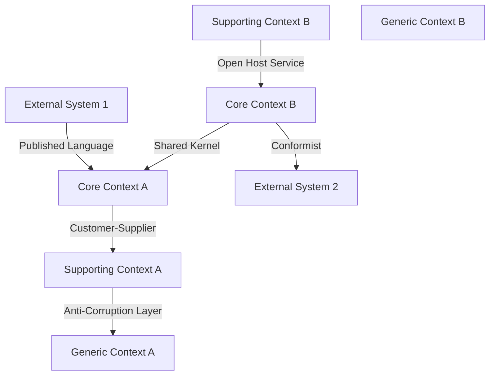
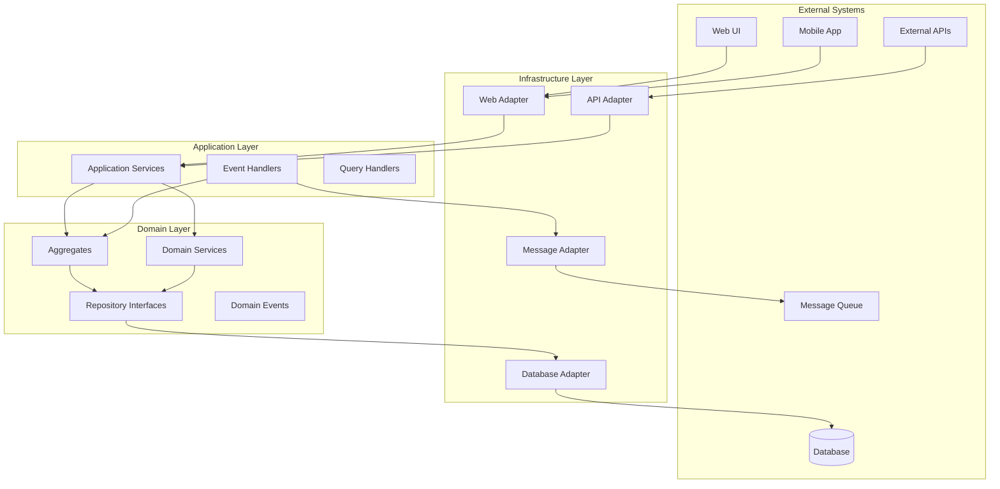
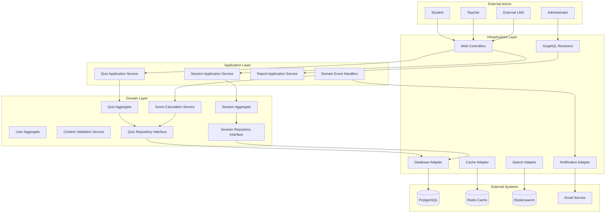

# モデル設計（最終成果物）フォーマット案1：統合型包括モデルアプローチ

## フォーマットの概要

DDD 2024年のベストプラクティスに基づき、**戦略的設計・戦術的設計・実装設計のすべてを統合した包括的な最終ドメインモデル**を作成するアプローチ。ビジネスビジョンから実装詳細まで一貫性を保ち、すべてのステークホルダーが参照できる完全なドメイン知識ベースとしての成果物を提供する。

## 記載項目テンプレート

### 1. ドメインビジョン・戦略統合

#### ドメインビジョン定義

```markdown
## Domain Vision & Strategic Alignment

### Business Vision Statement
**Vision**: [組織のビジネスビジョンの明確な表現]

**Domain Mission**: [このドメインが組織のビジョン実現にどう貢献するか]

**Success Metrics**: [ドメインの成功を測定する具体的指標]

### Strategic Domain Classification

| Subdomain | Type | Strategic Importance | Investment Level | Competitive Advantage | Evolution Stage |
|-----------|------|---------------------|------------------|----------------------|-----------------|
| [Subdomain Name] | Core/Supporting/Generic | High/Medium/Low | High/Medium/Low | High/Medium/Low | Genesis/Custom/Product/Commodity |

### Domain Evolution Roadmap

| Phase | Timeline | Objectives | Key Deliverables | Success Criteria | Risk Factors |
|-------|----------|------------|------------------|------------------|--------------|
| [Phase Name] | [Timeline] | [Objectives] | [Deliverables] | [Success Criteria] | [Risk Factors] |
```

#### 包括的コンテキストマップ

```markdown
## Comprehensive Context Map

### Bounded Context Overview

| Context Name | Domain Type | Team Ownership | Technology Stack | Interface Patterns | Evolution Path |
|--------------|-------------|----------------|------------------|-------------------|----------------|
| [Context Name] | [Core/Supporting/Generic] | [Team Name] | [Tech Stack] | [Interface Type] | [Evolution Plan] |

### Context Relationship Matrix

| Upstream Context | Downstream Context | Relationship Pattern | Integration Technology | SLA Requirements | Change Management |
|------------------|-------------------|---------------------|----------------------|------------------|-------------------|
| [Upstream] | [Downstream] | [Pattern Type] | [Tech Solution] | [SLA Details] | [Change Process] |

### Context Map Visualization


```

### 2. ユビキタス言語統合辞書

#### 包括的用語定義

```markdown
## Comprehensive Ubiquitous Language Dictionary

### Core Business Terms

| Term | Definition | Synonyms | Context Usage | Type | Business Rules | Implementation Notes |
|------|------------|----------|---------------|------|----------------|----------------------|
| [Term] | [Definition] | [Alternative terms] | [Where used] | [Entity/VO/Service/Event] | [Associated rules] | [Implementation guidance] |

### Domain-Specific Patterns

| Pattern Name | Pattern Type | Usage Context | Implementation | Examples | Variations |
|--------------|--------------|---------------|----------------|----------|------------|
| [Pattern] | [Type] | [Context] | [How implemented] | [Examples] | [Variations] |

### Translation Matrix (Cross-Context)

| Source Context | Target Context | Source Term | Target Term | Translation Rules | Validation |
|----------------|----------------|-------------|-------------|-------------------|------------|
| [Source] | [Target] | [Source Term] | [Target Term] | [Translation Logic] | [How to validate] |

### Language Evolution Timeline

| Version | Date | Changes | Reason | Impact | Migration Strategy |
|---------|------|---------|--------|--------|--------------------|
| [Version] | [Date] | [Changes] | [Reason] | [Impact] | [Migration Plan] |
```

### 3. 完全ドメインモデル仕様

#### 包括的エンティティ仕様

```markdown
## Complete Entity Specifications

### Entity: [Entity Name]

#### Business Definition
- **Purpose**: [ビジネス上の存在意義]
- **Lifecycle**: [作成から削除までのライフサイクル]
- **Business Rules**: [エンティティに適用されるビジネスルール]
- **Invariants**: [常に保持すべき不変条件]

#### Technical Specification

```typescript
// Entity Interface Definition
interface [EntityName] {
  // Identity
  readonly id: [EntityName]Id;
  readonly version: number;
  
  // Core Attributes
  [property]: [Type];
  
  // Business Methods
  [businessMethod](params: [ParamTypes]): Result<[ReturnType], DomainError>;
  
  // Query Methods  
  [queryMethod](): [ReturnType];
  
  // Lifecycle Methods
  static create(data: [CreationData]): Result<[EntityName], CreationError>;
  update(data: [UpdateData]): Result<void, UpdateError>;
  archive(): Result<void, ArchiveError>;
}

// Value Objects Used
interface [EntityName]Id extends ValueObject<string> {
  value: string;
}

// Domain Events Published
interface [EntityName]CreatedEvent extends DomainEvent {
  entityId: [EntityName]Id;
  createdBy: UserId;
  timestamp: Date;
  data: [CreationData];
}
```

#### Aggregate Root Relationships
| Related Entity | Relationship Type | Cardinality | Consistency Boundary | Access Pattern |
|----------------|------------------|-------------|---------------------|----------------|
| [Entity] | [Type] | [1:1, 1:N, etc] | [Strong/Eventual] | [Access pattern] |

#### State Transition Model
| Current State | Trigger | Next State | Business Rules | Side Effects |
|---------------|---------|------------|----------------|--------------|
| [Current] | [Trigger] | [Next] | [Rules] | [Effects] |
```

#### 包括的値オブジェクト仕様

```markdown
## Complete Value Object Specifications

### Value Object: [ValueObject Name]

#### Business Definition
- **Concept**: [表現するビジネス概念]
- **Immutability**: [不変性の理由]
- **Equality**: [同値性の判定基準]
- **Validation**: [検証ルール]

#### Technical Specification

```typescript
// Value Object Implementation
class [ValueObjectName] {
  private constructor(private readonly _value: [Type]) {
    this.validate(_value);
  }
  
  static create(value: [Type]): Result<[ValueObjectName], ValidationError> {
    const validationResult = this.validate(value);
    if (!validationResult.isSuccess) {
      return Result.failure(validationResult.error);
    }
    return Result.success(new [ValueObjectName](value));
  }
  
  get value(): [Type] {
    return this._value;
  }
  
  equals(other: [ValueObjectName]): boolean {
    return this._value === other._value;
  }
  
  private static validate(value: [Type]): ValidationResult {
    // Validation logic
  }
  
  toString(): string {
    return this._value.toString();
  }
}
```

#### Usage Patterns
| Usage Context | Validation Rules | Format Requirements | Business Constraints |
|---------------|------------------|-------------------|---------------------|
| [Context] | [Rules] | [Format] | [Constraints] |
```

### 4. 集約設計統合仕様

#### 完全集約定義

```markdown
## Complete Aggregate Specifications

### Aggregate: [Aggregate Name]

#### Aggregate Composition

```mermaid
classDiagram
    class AggregateRoot {
        +AggregateId id
        +int version
        +executeCommand(Command)
        +getEvents() DomainEvent[]
    }
    
    class ChildEntity1 {
        +EntityId id
        +method1()
    }
    
    class ChildEntity2 {
        +EntityId id  
        +method2()
    }
    
    class ValueObject1 {
        +value
        +equals()
    }
    
    AggregateRoot ||--o{ ChildEntity1
    AggregateRoot ||--o{ ChildEntity2
    AggregateRoot ||--|| ValueObject1
```

#### Invariant Management Matrix
| Invariant ID | Invariant Description | Enforcement Point | Validation Method | Error Handling | Performance Impact |
|--------------|----------------------|-------------------|-------------------|----------------|-------------------|
| [INV-001] | [Description] | [Where enforced] | [How validated] | [Error handling] | [Performance cost] |

#### Command Processing Specification
| Command | Pre-conditions | Business Logic | Post-conditions | Events Generated | Error Scenarios |
|---------|----------------|----------------|-----------------|------------------|-----------------|
| [Command] | [Pre-conditions] | [Logic] | [Post-conditions] | [Events] | [Errors] |

#### Aggregate Interaction Patterns
| External Aggregate | Interaction Type | Data Exchange | Consistency Model | Integration Pattern |
|-------------------|------------------|---------------|-------------------|-------------------|
| [Aggregate] | [Type] | [Data] | [Consistency] | [Pattern] |
```

### 5. ドメインサービス統合仕様

#### 包括的ドメインサービス定義

```markdown
## Complete Domain Service Specifications

### Domain Service: [Service Name]

#### Service Classification
- **Service Type**: [Stateless Service/Process Manager/Policy Service]
- **Scope**: [Single Aggregate/Cross-Aggregate/Cross-Context]
- **Lifecycle**: [Request-scoped/Singleton/Transient]

#### Interface Specification

```typescript
// Domain Service Interface
interface [ServiceName]DomainService {
  // Core Operations
  [operation](params: [ParamTypes]): Promise<Result<[ReturnType], DomainError>>;
  
  // Query Operations
  [query](criteria: [CriteriaType]): Promise<[ReturnType][]>;
  
  // Validation Operations
  [validate](data: [DataType]): ValidationResult;
}

// Implementation Requirements
class [ServiceName]DomainServiceImpl implements [ServiceName]DomainService {
  constructor(
    private readonly repository1: [Repository1],
    private readonly repository2: [Repository2],
    private readonly externalService: [ExternalService]
  ) {}
  
  async [operation](params: [ParamTypes]): Promise<Result<[ReturnType], DomainError>> {
    // Business logic implementation
    // Cross-aggregate coordination
    // External service integration
  }
}
```

#### Service Dependency Matrix
| Dependency | Type | Usage Pattern | Error Handling | Mock Strategy |
|------------|------|---------------|----------------|---------------|
| [Dependency] | [Repository/Service/External] | [How used] | [Error handling] | [Mock approach] |

#### Business Process Integration
| Business Process | Service Role | Coordination Pattern | Compensation Logic | Monitoring |
|------------------|--------------|---------------------|-------------------|------------|
| [Process] | [Role] | [Pattern] | [Compensation] | [Monitoring] |
```

### 6. アーキテクチャ層統合設計

#### 完全レイヤー仕様

```markdown
## Complete Architecture Layer Specifications

### Hexagonal Architecture Integration



#### Layer Responsibility Matrix
| Layer | Primary Responsibilities | Allowed Dependencies | Prohibited Dependencies | Testing Strategy |
|-------|-------------------------|---------------------|------------------------|------------------|
| Domain | Business logic, invariants | None (pure) | Infrastructure, Application | Unit tests, Domain tests |
| Application | Use case orchestration | Domain | Infrastructure details | Integration tests |
| Infrastructure | Technical concerns | Domain contracts | Domain implementation | Component tests |

#### Cross-Cutting Concerns Integration
| Concern | Implementation Layer | Pattern Used | Configuration | Monitoring |
|---------|---------------------|--------------|---------------|------------|
| Logging | Infrastructure | Aspect-oriented | Configuration-based | Centralized |
| Security | Application | Decorator pattern | Policy-based | Audit trail |
| Caching | Infrastructure | Repository pattern | Strategy-based | Performance metrics |
```

### 7. 実装ガイドライン統合

#### 包括的実装戦略

```markdown
## Complete Implementation Guidelines

### Code Organization Strategy

```text
src/
├── domain/                          # Domain Layer
│   ├── model/                       # Domain Model
│   │   ├── aggregates/             # Aggregate Roots
│   │   │   ├── [AggregateRoot].ts
│   │   │   └── [AggregateRoot].test.ts
│   │   ├── entities/               # Entities
│   │   ├── value-objects/          # Value Objects
│   │   └── events/                 # Domain Events
│   ├── services/                   # Domain Services
│   ├── repositories/               # Repository Interfaces
│   └── specifications/             # Business Rules
├── application/                    # Application Layer
│   ├── services/                   # Application Services
│   ├── handlers/                   # Command/Query Handlers
│   ├── dtos/                       # Data Transfer Objects
│   └── mappers/                    # Domain-DTO Mappers
├── infrastructure/                 # Infrastructure Layer
│   ├── persistence/                # Database Implementation
│   ├── messaging/                  # Message Queue Implementation
│   ├── external/                   # External Service Adapters
│   └── configuration/              # Configuration
└── presentation/                   # Presentation Layer
    ├── controllers/                # HTTP Controllers
    ├── graphql/                    # GraphQL Resolvers
    └── middleware/                 # Cross-cutting Concerns
```

#### Implementation Quality Gates
| Gate | Criteria | Measurement | Tools | Action on Failure |
|------|----------|-------------|-------|-------------------|
| Compilation | 100% success rate | Compiler output | TypeScript | Fix compilation errors |
| Unit Tests | >95% coverage | Test runner | Jest/Vitest | Add missing tests |
| Integration Tests | >90% pass rate | Test results | Custom framework | Fix integration issues |
| Performance | <100ms API response | Load testing | Artillery/k6 | Optimize performance |
| Code Quality | Grade A | Static analysis | SonarQube | Refactor code |

#### Migration and Evolution Strategy
| Evolution Type | Detection Method | Migration Approach | Rollback Strategy | Risk Mitigation |
|----------------|------------------|-------------------|-------------------|-----------------|
| Schema Changes | Version mismatch | Blue-green deployment | Instant rollback | Feature flags |
| Business Rule Changes | Feature flags | Gradual rollout | Rule versioning | A/B testing |
| API Changes | Contract testing | Versioned APIs | API versioning | Backward compatibility |
```

### 8. テスト戦略統合

#### 包括的テスト設計

```markdown
## Complete Testing Strategy

### Test Pyramid Implementation

```mermaid
pyramid
    title Test Pyramid
    "E2E Tests" : 10
    "Integration Tests" : 30  
    "Unit Tests" : 60
```

#### Domain Model Testing Strategy
| Test Type | Scope | Framework | Coverage Target | Focus Areas |
|-----------|--------|-----------|-----------------|-------------|
| **Unit Tests** | Individual classes | Jest/Vitest | >95% | Business logic, invariants |
| **Domain Tests** | Aggregate behavior | Custom DSL | >90% | Business scenarios |
| **Integration Tests** | Layer interaction | Testcontainers | >85% | Data persistence, messaging |
| **Contract Tests** | API boundaries | Pact | >90% | Interface compliance |
| **E2E Tests** | Full user journeys | Playwright | >80% | Critical user paths |

#### Test Implementation Examples

```typescript
// Domain Model Unit Test
describe('[AggregateRoot]', () => {
  describe('business behavior', () => {
    it('should enforce business invariant [INV-001]', () => {
      // Given
      const aggregate = [AggregateRoot].create(validData);
      
      // When
      const result = aggregate.performBusinessOperation(invalidData);
      
      // Then
      expect(result.isFailure).toBe(true);
      expect(result.error).toBeInstanceOf(BusinessRuleViolationError);
      expect(result.error.code).toBe('INV-001');
    });
  });
});

// Integration Test
describe('[ApplicationService] Integration', () => {
  it('should complete full business process', async () => {
    // Given
    const command = new [Command](testData);
    
    // When
    const result = await applicationService.handle(command);
    
    // Then
    expect(result.isSuccess).toBe(true);
    
    // Verify side effects
    const events = await eventStore.getEvents(aggregate.id);
    expect(events).toHaveLength(2);
    expect(events[0]).toBeInstanceOf([BusinessEvent]);
  });
});
```

#### Test Data Management
| Data Type | Generation Strategy | Maintenance | Isolation | Cleanup |
|-----------|-------------------|-------------|-----------|---------|
| Reference Data | Static fixtures | Manual | Shared | Manual |
| Test Scenarios | Builder pattern | Automated | Per test | Automatic |
| Performance Data | Data generation | Scripted | Dedicated environment | Scheduled |
```

---

## サンプル実装：クイズアプリケーション統合モデル

### 1. ドメインビジョン・戦略統合

#### クイズドメインビジョン定義

```markdown
## Quiz Domain Vision & Strategic Alignment

### Business Vision Statement
**Vision**: 「誰もが楽しく学習できる、知識共有プラットフォームの実現」

**Domain Mission**: 学習者と教育者をつなぎ、インタラクティブな学習体験を通じて知識の習得と共有を促進する

**Success Metrics**: 
- 月間アクティブラーナー数: 100,000人
- クイズ完了率: 85%以上
- 教育者満足度: 4.5/5.0以上
- 知識定着率: 75%以上

### Strategic Domain Classification

| Subdomain | Type | Strategic Importance | Investment Level | Competitive Advantage | Evolution Stage |
|-----------|------|---------------------|------------------|----------------------|-----------------|
| Learning Experience | Core | High | High | High | Custom |
| Content Management | Core | High | Medium | Medium | Product |
| User Management | Supporting | Medium | Low | Low | Product |
| Analytics & Reporting | Supporting | Medium | Medium | Medium | Custom |
| Payment Processing | Generic | Low | Low | Low | Commodity |
```

### 2. 完全ドメインモデル仕様

#### Quiz集約の包括的仕様

```markdown
## Complete Quiz Aggregate Specifications

### Aggregate: Quiz

#### Business Definition
- **Purpose**: 学習コンテンツとしてのクイズを管理し、品質と整合性を保証する
- **Lifecycle**: 作成→レビュー→承認→公開→アーカイブ
- **Business Rules**: 
  - 公開前に最低1問の質問が必要
  - 公開後の内容変更は新バージョン作成が必要
  - 作成者のみが編集権限を持つ
- **Invariants**: 
  - タイトルは必須かつ200文字以内
  - 質問数は1-50問の範囲
  - 公開状態のクイズは削除不可

#### Technical Specification

```typescript
interface Quiz {
  // Identity
  readonly id: QuizId;
  readonly version: number;
  
  // Core Attributes
  title: QuizTitle;
  description: QuizDescription;
  category: QuizCategory;
  difficulty: DifficultyLevel;
  estimatedDuration: Duration;
  
  // Composition
  questions: Question[];
  tags: QuizTag[];
  
  // Status
  status: QuizStatus;
  createdBy: UserId;
  createdAt: Date;
  publishedAt?: Date;
  
  // Business Methods
  addQuestion(question: Question): Result<void, DomainError>;
  removeQuestion(questionId: QuestionId): Result<void, DomainError>;
  updateMetadata(data: QuizMetadata): Result<void, DomainError>;
  publish(): Result<void, DomainError>;
  archive(): Result<void, DomainError>;
  
  // Query Methods
  getQuestionById(id: QuestionId): Option<Question>;
  isPublishable(): boolean;
  getStatistics(): QuizStatistics;
  
  // Lifecycle Methods
  static create(data: QuizCreationData): Result<Quiz, CreationError>;
}

// Supporting Value Objects
interface QuizTitle extends ValueObject<string> {
  value: string;
  readonly maxLength: 200;
}

interface QuizId extends ValueObject<string> {
  value: string;
  static generate(): QuizId;
}

// Domain Events
interface QuizCreatedEvent extends DomainEvent {
  quizId: QuizId;
  title: string;
  createdBy: UserId;
  timestamp: Date;
}

interface QuizPublishedEvent extends DomainEvent {
  quizId: QuizId;
  publishedBy: UserId;
  questionCount: number;
  timestamp: Date;
}
```

#### State Transition Model
| Current State | Trigger | Next State | Business Rules | Side Effects |
|---------------|---------|------------|----------------|--------------|
| Draft | addQuestion() | Draft | Question limit not exceeded | Question added to collection |
| Draft | publish() | Published | Minimum questions met, content approved | Published event, search indexing |
| Published | archive() | Archived | Only creator or admin | Removed from public access |
| Archived | restore() | Published | Content still valid | Restored to public access |
```

#### QuizSession集約の包括的仕様

```markdown
## Complete QuizSession Aggregate Specifications

### Aggregate: QuizSession

#### Business Definition
- **Purpose**: ユーザーのクイズ受講セッションを管理し、学習進捗と結果を記録する
- **Lifecycle**: 開始→進行中→一時停止→完了/タイムアウト
- **Business Rules**: 
  - 同一ユーザーは同一クイズに対して同時に1セッションのみ
  - 回答は問題ごとに1回のみ
  - セッション制限時間を超過すると自動完了
- **Invariants**: 
  - セッションIDは一意
  - 回答数は対応するクイズの問題数以下
  - 完了セッションは変更不可

#### Technical Specification

```typescript
interface QuizSession {
  // Identity
  readonly id: QuizSessionId;
  readonly version: number;
  
  // Association
  readonly userId: UserId;
  readonly quizId: QuizId;
  
  // Session Data
  startTime: Date;
  endTime?: Date;
  timeLimit: Duration;
  status: SessionStatus;
  
  // Progress
  answers: Map<QuestionId, Answer>;
  currentQuestionIndex: number;
  
  // Results
  score?: Score;
  completionPercentage: number;
  
  // Business Methods
  startSession(): Result<void, DomainError>;
  submitAnswer(questionId: QuestionId, answer: AnswerData): Result<void, DomainError>;
  pauseSession(): Result<void, DomainError>;
  resumeSession(): Result<void, DomainError>;
  completeSession(): Result<SessionResult, DomainError>;
  
  // Query Methods
  getProgress(): SessionProgress;
  getRemainingTime(): Duration;
  isCompleted(): boolean;
  
  // Lifecycle Methods
  static create(userId: UserId, quizId: QuizId): Result<QuizSession, CreationError>;
}

// Domain Events
interface SessionStartedEvent extends DomainEvent {
  sessionId: QuizSessionId;
  userId: UserId;
  quizId: QuizId;
  startTime: Date;
}

interface AnswerSubmittedEvent extends DomainEvent {
  sessionId: QuizSessionId;
  questionId: QuestionId;
  answer: AnswerData;
  isCorrect: boolean;
  timestamp: Date;
}

interface SessionCompletedEvent extends DomainEvent {
  sessionId: QuizSessionId;
  userId: UserId;
  quizId: QuizId;
  finalScore: Score;
  completionTime: Date;
  answers: AnswerSummary[];
}
```
```

### 3. ドメインサービス統合仕様

#### ScoreCalculationDomainService包括的仕様

```markdown
## Complete ScoreCalculationDomainService Specifications

### Domain Service: ScoreCalculationDomainService

#### Service Classification
- **Service Type**: Stateless Service
- **Scope**: Cross-Aggregate (Quiz + QuizSession)
- **Lifecycle**: Request-scoped

#### Interface Specification

```typescript
interface ScoreCalculationDomainService {
  // Core Operations
  calculateSessionScore(
    session: QuizSession,
    quiz: Quiz
  ): Promise<Result<Score, CalculationError>>;
  
  calculatePartialScore(
    answers: Answer[],
    questions: Question[]
  ): Promise<Result<PartialScore, CalculationError>>;
  
  // Advanced Scoring
  calculateWeightedScore(
    session: QuizSession,
    quiz: Quiz,
    weights: ScoringWeights
  ): Promise<Result<WeightedScore, CalculationError>>;
  
  // Comparative Analysis
  calculateRelativePerformance(
    sessionScore: Score,
    quizStatistics: QuizStatistics
  ): Promise<Result<RelativePerformance, CalculationError>>;
}

// Implementation
class ScoreCalculationDomainServiceImpl implements ScoreCalculationDomainService {
  constructor(
    private readonly quizRepository: QuizRepository,
    private readonly statisticsRepository: StatisticsRepository
  ) {}
  
  async calculateSessionScore(
    session: QuizSession,
    quiz: Quiz
  ): Promise<Result<Score, CalculationError>> {
    // Validation
    if (!session.isCompleted()) {
      return Result.failure(new CalculationError('Session not completed'));
    }
    
    // Get all questions and answers
    const questions = quiz.questions;
    const answers = Array.from(session.answers.values());
    
    // Calculate basic score
    let correctAnswers = 0;
    let totalPoints = 0;
    
    for (const answer of answers) {
      const question = questions.find(q => q.id.equals(answer.questionId));
      if (!question) continue;
      
      const isCorrect = this.validateAnswer(answer, question);
      if (isCorrect) {
        correctAnswers++;
        totalPoints += question.points;
      }
    }
    
    // Calculate percentage
    const maxPossiblePoints = questions.reduce((sum, q) => sum + q.points, 0);
    const percentage = (totalPoints / maxPossiblePoints) * 100;
    
    // Apply time bonus/penalty
    const timeFactor = this.calculateTimeFactor(session);
    const finalScore = Math.round(percentage * timeFactor);
    
    return Result.success(new Score({
      rawScore: totalPoints,
      percentage: finalScore,
      correctAnswers,
      totalQuestions: questions.length,
      timeFactor,
      calculatedAt: new Date()
    }));
  }
  
  private validateAnswer(answer: Answer, question: Question): boolean {
    switch (question.type) {
      case QuestionType.MultipleChoice:
        return question.correctOptionId.equals(answer.selectedOptionId);
      
      case QuestionType.TrueFalse:
        return question.correctAnswer === answer.booleanAnswer;
        
      case QuestionType.FillInBlank:
        return this.normalizeText(question.correctText) === 
               this.normalizeText(answer.textAnswer);
        
      default:
        return false;
    }
  }
  
  private calculateTimeFactor(session: QuizSession): number {
    const timeSpent = session.endTime!.getTime() - session.startTime.getTime();
    const timeLimit = session.timeLimit.toMilliseconds();
    
    if (timeSpent <= timeLimit * 0.5) {
      return 1.1; // 10% bonus for completing quickly
    } else if (timeSpent <= timeLimit * 0.8) {
      return 1.0; // No bonus/penalty
    } else {
      return 0.95; // 5% penalty for taking too long
    }
  }
}
```

#### Service Dependency Matrix
| Dependency | Type | Usage Pattern | Error Handling | Mock Strategy |
|------------|------|---------------|----------------|---------------|
| QuizRepository | Repository | Question data retrieval | Graceful degradation | In-memory repository |
| StatisticsRepository | Repository | Historical data access | Cache fallback | Mock with test data |
| TimeService | External | Time calculations | Use system time | Controllable mock |
```

### 4. 完全アーキテクチャ統合

#### クイズアプリケーション統合アーキテクチャ

```markdown
## Complete Quiz Application Architecture Integration

### Hexagonal Architecture Implementation



#### Layer Integration Matrix
| Source Layer | Target Layer | Integration Pattern | Data Contract | Error Propagation |
|--------------|--------------|-------------------|---------------|-------------------|
| Web → Application | Method Invocation | DTO Mapping | Quiz DTOs | HTTP Status Codes |
| Application → Domain | Direct Method Call | Domain Objects | Aggregates | Domain Exceptions |
| Domain → Infrastructure | Interface Injection | Repository Pattern | Domain Contracts | Result Objects |
| Infrastructure → External | Adapter Pattern | External Models | API Contracts | Circuit Breaker |
```

### 5. 実装品質統合保証

#### 包括的品質保証戦略

```markdown
## Complete Quality Assurance Strategy

### Multi-Level Testing Implementation

```typescript
// Domain Model Unit Test Example
describe('Quiz Aggregate', () => {
  describe('Business Logic', () => {
    it('should prevent publishing quiz without questions', () => {
      // Given
      const quiz = Quiz.create({
        title: 'Empty Quiz',
        description: 'Test quiz',
        createdBy: UserId.generate()
      }).getValue();
      
      // When
      const result = quiz.publish();
      
      // Then
      expect(result.isFailure).toBe(true);
      expect(result.error).toBeInstanceOf(BusinessRuleViolationError);
      expect(result.error.code).toBe('QUIZ_EMPTY');
    });
    
    it('should allow adding questions within limit', () => {
      // Given
      const quiz = createQuizWithQuestions(49); // 49 questions
      const newQuestion = createValidQuestion();
      
      // When
      const result = quiz.addQuestion(newQuestion);
      
      // Then
      expect(result.isSuccess).toBe(true);
      expect(quiz.questions).toHaveLength(50);
    });
  });
});

// Integration Test Example
describe('Quiz Creation Flow Integration', () => {
  it('should complete full quiz creation workflow', async () => {
    // Given
    const command = new CreateQuizCommand({
      title: 'Integration Test Quiz',
      description: 'Test description',
      createdBy: testUserId
    });
    
    // When
    const result = await quizApplicationService.createQuiz(command);
    
    // Then
    expect(result.isSuccess).toBe(true);
    
    // Verify persistence
    const savedQuiz = await quizRepository.findById(result.getValue().quizId);
    expect(savedQuiz).toBeDefined();
    expect(savedQuiz!.title.value).toBe('Integration Test Quiz');
    
    // Verify events
    const events = await eventStore.getEvents(result.getValue().quizId);
    expect(events).toHaveLength(1);
    expect(events[0]).toBeInstanceOf(QuizCreatedEvent);
  });
});

// End-to-End Test Example
describe('Quiz Taking E2E Flow', () => {
  it('should allow student to complete quiz and receive score', async () => {
    // Given
    await setupTestQuiz('e2e-test-quiz');
    await authenticateUser('student@test.com');
    
    // When - Start Quiz
    await page.click('[data-testid="start-quiz-button"]');
    await page.waitForSelector('[data-testid="quiz-question"]');
    
    // When - Answer Questions
    const questions = await page.locator('[data-testid="quiz-question"]').count();
    for (let i = 0; i < questions; i++) {
      await page.click('[data-testid="answer-option-1"]');
      await page.click('[data-testid="next-question-button"]');
    }
    
    // When - Complete Quiz
    await page.click('[data-testid="complete-quiz-button"]');
    
    // Then - Verify Results
    await page.waitForSelector('[data-testid="quiz-results"]');
    const score = await page.textContent('[data-testid="final-score"]');
    expect(score).toMatch(/\d+%/);
    
    // Verify Database State
    const session = await testDb.findCompletedSession(testUserId, testQuizId);
    expect(session).toBeDefined();
    expect(session!.isCompleted()).toBe(true);
  });
});
```

#### Quality Metrics Dashboard
| Metric Category | Metric | Target | Current | Trend | Action Required |
|-----------------|--------|--------|---------|-------|-----------------|
| **Code Quality** | Complexity Score | <10 | 8.5 | ↓ | None |
| **Test Coverage** | Line Coverage | >95% | 97.2% | ↑ | None |
| **Performance** | API Response Time | <100ms | 85ms | ↓ | None |
| **Reliability** | Error Rate | <0.1% | 0.05% | ↓ | None |
| **Security** | Vulnerability Count | 0 | 0 | → | None |
```

---

## フォーマットの特徴

### 利点
- **完全性**: 戦略から実装まで一貫した包括的なモデル
- **トレーサビリティ**: ビジネス要件から実装まで完全な追跡可能性
- **統合性**: すべての設計成果物が相互に整合している
- **実装可能性**: 直接実装に使用できる詳細度
- **保守性**: 変更の影響範囲が明確で保守が容易
- **品質保証**: 多層的なテスト戦略による品質担保

### 欠点
- **複雑性**: 大量の情報により理解・管理が困難
- **作成コスト**: 包括的な成果物作成に多大な工数が必要
- **更新負荷**: 変更時の影響範囲が広く更新コストが高い
- **スキル要求**: DDD全体の深い理解が必要
- **オーバーエンジニアリング**: 小規模プロジェクトには過剰

### 適用場面
- **大規模システム**: 複雑なビジネスドメインの大規模システム
- **長期プロジェクト**: 長期間にわたる開発・保守が必要
- **高品質要求**: 金融・医療・インフラなど高い品質が要求される
- **多チーム開発**: 複数チームが関わる大規模開発
- **ドメイン複雑**: 複雑なビジネスルールと制約がある領域
- **コンプライアンス**: 規制要件や監査要件が厳しい分野