# モデル設計（最終成果物）フォーマット案2：ヘキサゴナルアーキテクチャ統合アプローチ

## フォーマットの概要

DDD 2024年のベストプラクティスに基づき、**ヘキサゴナルアーキテクチャ（ポート&アダプターパターン）を明確に分離し、Core Domain・Application Layer・Ports・Adaptersでの4つの核心図表の役割と責任を体系化**したヘキサゴナル中心の設計アプローチ。テスタビリティと外部依存の分離を重視する。

## 記載項目テンプレート

### 1. ヘキサゴナル統合ドメインモデル図

#### ヘキサゴナルアーキテクチャ統合モデル

```markdown
## Hexagonal Architecture Integrated Domain Model

### Port & Adapter Domain Model Structure

```mermaid
graph TB
    %% Core Domain (Center)
    subgraph "Core Domain"
        direction TB
        Aggregates[Aggregates<br/>- Quiz<br/>- QuizSession<br/>- AnswerHistory]
        Entities[Entities<br/>- Question<br/>- Answer<br/>- Progress]
        ValueObjects[Value Objects<br/>- QuizTitle<br/>- Score<br/>- Duration]
        DomainServices[Domain Services<br/>- ScoreCalculationService<br/>- ValidationService]
        DomainEvents[Domain Events<br/>- QuizCreated<br/>- SessionCompleted<br/>- AnswerSubmitted]
    end
    
    %% Application Layer
    subgraph "Application Layer"
        direction TB
        UseCases[Use Cases<br/>- CreateQuizUseCase<br/>- StartSessionUseCase<br/>- SubmitAnswerUseCase]
        AppServices[Application Services<br/>- QuizApplicationService<br/>- SessionApplicationService]
        EventHandlers[Event Handlers<br/>- ScoreEventHandler<br/>- NotificationEventHandler]
    end
    
    %% Primary Ports (入力ポート)
    subgraph "Primary Ports"
        direction TB
        CommandPorts[🎯 Command Ports<br/>- CreateQuizPort<br/>- StartSessionPort<br/>- SubmitAnswerPort]
        QueryPorts[🔍 Query Ports<br/>- GetQuizPort<br/>- GetSessionPort<br/>- GetHistoryPort]
        AuthPorts[🔐 Auth Ports<br/>- AuthenticationPort<br/>- AuthorizationPort]
    end
    
    %% Secondary Ports (出力ポート)
    subgraph "Secondary Ports"
        direction TB
        RepositoryPorts[💾 Repository Ports<br/>- QuizRepositoryPort<br/>- SessionRepositoryPort<br/>- HistoryRepositoryPort]
        ExternalPorts[🌐 External Ports<br/>- NotificationPort<br/>- StoragePort<br/>- CachePort]
        EventPorts[📢 Event Ports<br/>- EventPublisherPort<br/>- EventSubscriberPort]
    end
    
    %% Primary Adapters (Driving Adapters)
    subgraph "Primary Adapters"
        direction TB
        WebAdapters[🌐 Web Adapters<br/>- REST Controllers<br/>- GraphQL Resolvers<br/>- WebSocket Handlers]
        CLIAdapters[⌨️  CLI Adapters<br/>- Command Handlers<br/>- Script Runners]
        ScheduleAdapters[⏰ Schedule Adapters<br/>- Cron Jobs<br/>- Timer Triggers]
    end
    
    %% Secondary Adapters (Driven Adapters)
    subgraph "Secondary Adapters"
        direction TB
        PersistenceAdapters[📄 Persistence Adapters<br/>- Database Adapter<br/>- File System Adapter<br/>- Cache Adapter]
        ExternalAdapters[🔗 External Adapters<br/>- HTTP Client Adapter<br/>- Message Queue Adapter<br/>- Storage Service Adapter]
        InfraAdapters[🏗️ Infrastructure Adapters<br/>- Event Bus Adapter<br/>- Logging Adapter<br/>- Monitoring Adapter]
    end
    
    %% Primary Flow (左から右)
    WebAdapters --> CommandPorts
    WebAdapters --> QueryPorts
    CLIAdapters --> CommandPorts
    ScheduleAdapters --> CommandPorts
    
    CommandPorts --> UseCases
    QueryPorts --> UseCases
    AuthPorts --> UseCases
    
    UseCases --> Aggregates
    UseCases --> DomainServices
    AppServices --> UseCases
    
    %% Secondary Flow (右から左)
    UseCases --> RepositoryPorts
    DomainServices --> RepositoryPorts
    EventHandlers --> ExternalPorts
    DomainEvents --> EventPorts
    
    RepositoryPorts --> PersistenceAdapters
    ExternalPorts --> ExternalAdapters
    EventPorts --> InfraAdapters
    
    %% Internal Domain Relationships
    Aggregates --> ValueObjects
    Aggregates --> DomainEvents
    DomainServices --> Aggregates
    
    %% Styling
    classDef coreStyle fill:#e1f5fe,stroke:#01579b,stroke-width:3px
    classDef appStyle fill:#f3e5f5,stroke:#4a148c,stroke-width:2px
    classDef primaryPortStyle fill:#fff3e0,stroke:#e65100,stroke-width:2px
    classDef secondaryPortStyle fill:#e8f5e8,stroke:#1b5e20,stroke-width:2px
    classDef primaryAdapterStyle fill:#fce4ec,stroke:#880e4f,stroke-width:2px
    classDef secondaryAdapterStyle fill:#f1f8e9,stroke:#33691e,stroke-width:2px

    class Aggregates,Entities,ValueObjects,DomainServices,DomainEvents coreStyle
    class UseCases,AppServices,EventHandlers appStyle
    class CommandPorts,QueryPorts,AuthPorts primaryPortStyle
    class RepositoryPorts,ExternalPorts,EventPorts secondaryPortStyle
    class WebAdapters,CLIAdapters,ScheduleAdapters primaryAdapterStyle
    class PersistenceAdapters,ExternalAdapters,InfraAdapters secondaryAdapterStyle
```



### Hexagonal Component Responsibility Matrix

| Component | Primary Responsibility | Domain Model Role | Dependencies | Test Strategy |
|-----------|----------------------|-------------------|--------------|---------------|
| **Core Domain** | Business logic | Entity/VO/Service definition | None (pure) | Unit tests, Domain tests |
| **Application Layer** | Use case orchestration | Business flow coordination | Core Domain only | Integration tests |
| **Primary Ports** | Input interface | Command/Query definition | Application contracts | Contract tests |
| **Secondary Ports** | Output interface | Infrastructure abstraction | Domain contracts | Mock implementations |
| **Primary Adapters** | Input transformation | External to internal conversion | Primary Ports | Adapter tests |
| **Secondary Adapters** | Output implementation | Infrastructure implementation | Secondary Ports | Integration tests |

### Cross-Component Model Mapping

| Domain Concept | Primary Adapter | Primary Port | Application Layer | Core Domain | Secondary Port | Secondary Adapter |
|----------------|-----------------|--------------|-------------------|-------------|----------------|-------------------|
| **Quiz** | QuizController | CreateQuizPort | CreateQuizUseCase | Quiz Aggregate | QuizRepositoryPort | DatabaseAdapter |
| **QuizSession** | SessionController | StartSessionPort | StartSessionUseCase | QuizSession Aggregate | SessionRepositoryPort | CacheAdapter |
| **Score** | ScoreAPI | GetScorePort | CalculateScoreUseCase | Score Value Object | ScoreRepositoryPort | StorageAdapter |
| **History** | HistoryAPI | GetHistoryPort | GetHistoryUseCase | AnswerHistory Aggregate | HistoryRepositoryPort | DatabaseAdapter |
```

### 2. ポート別集約図

#### Core Domain集約詳細設計

```mermaid
graph TB
    subgraph "Core Domain - Pure Business Logic"
        subgraph "Quiz Aggregate"
            QuizRoot[Quiz Aggregate Root<br/>========================<br/>+QuizId id<br/>+QuizTitle title<br/>+QuizStatus status<br/>+List~Question~ questions<br/>========================<br/>+addQuestion(Question) Result<br/>+publish() Result<br/>+validatePublishability() boolean]
            
            Question[Question Entity<br/>================<br/>+QuestionId id<br/>+QuestionText text<br/>+QuestionType type<br/>+Points points<br/>================<br/>+validateAnswer(Answer) boolean]
            
            QuizTitle[QuizTitle Value Object<br/>=======================<br/>+string value<br/>+int maxLength: 200<br/>=======================<br/>+validate() ValidationResult<br/>+equals(QuizTitle) boolean]
            
            QuizStatus[QuizStatus Value Object<br/>========================<br/>+StatusEnum value<br/>========================<br/>+canTransitionTo(Status) boolean]
        end
        
        subgraph "QuizSession Aggregate"  
            SessionRoot[QuizSession Aggregate Root<br/>============================<br/>+QuizSessionId id<br/>+UserId userId<br/>+QuizId quizId<br/>+SessionStatus status<br/>+Map~QuestionId,Answer~ answers<br/>============================<br/>+submitAnswer(QuestionId, AnswerData) Result<br/>+complete() Result<br/>+calculateProgress() Progress]
            
            Answer[Answer Entity<br/>===============<br/>+QuestionId questionId<br/>+AnswerData data<br/>+Date submittedAt<br/>===============<br/>+isCorrect() boolean]
            
            Score[Score Value Object<br/>==================<br/>+int rawScore<br/>+float percentage<br/>+Date calculatedAt<br/>==================<br/>+equals(Score) boolean]
        end
        
        subgraph "Domain Services"
            ScoreService[ScoreCalculationService<br/>==========================<br/>+calculateScore(QuizSession, Quiz) Result~Score~<br/>+calculatePartialScore(List~Answer~) PartialScore<br/>+applyTimePenalty(Score, Duration) Score]
            
            ValidationService[ContentValidationService<br/>============================<br/>+validateQuizContent(Quiz) ValidationResult<br/>+checkContentPolicy(Content) PolicyResult<br/>+moderateContent(Content) ModerationResult]
        end
    end
    
    %% Port Connections (Conceptual)
    subgraph "Port Interfaces"
        direction LR
        InputPorts[Primary Ports<br/>Command/Query interfaces<br/>pointing to Use Cases]
        OutputPorts[Secondary Ports<br/>Repository/External interfaces<br/>implemented by Adapters]
    end
    
    %% Aggregate Internal Relationships
    QuizRoot ||--o{ Question
    QuizRoot ||--|| QuizTitle
    QuizRoot ||--|| QuizStatus
    
    SessionRoot ||--o{ Answer
    SessionRoot ||--|| Score
    
    %% Domain Service Dependencies
    ScoreService ..> SessionRoot : calculates
    ScoreService ..> QuizRoot : uses
    ValidationService ..> QuizRoot : validates
    
    %% Port Connection Indicators
    QuizRoot -.-> InputPorts : accessed via
    SessionRoot -.-> InputPorts : accessed via
    ScoreService -.-> OutputPorts : uses
    ValidationService -.-> OutputPorts : uses
    
    classDef aggregateRoot fill:#ff6b6b,color:#fff,stroke:#333,stroke-width:3px
    classDef entity fill:#4ecdc4,color:#fff,stroke:#333,stroke-width:2px
    classDef valueObject fill:#45b7d1,color:#fff,stroke:#333,stroke-width:1px
    classDef domainService fill:#96ceb4,color:#fff,stroke:#333,stroke-width:2px
    classDef portInterface fill:#f8bbd9,color:#333,stroke:#333,stroke-width:2px
    
    class QuizRoot,SessionRoot aggregateRoot
    class Question,Answer entity
    class QuizTitle,QuizStatus,Score valueObject
    class ScoreService,ValidationService domainService
    class InputPorts,OutputPorts portInterface
```

#### Application Layer統合

```mermaid
graph TB
    subgraph "Application Layer - Use Case Orchestration"
        subgraph "Quiz Management Use Cases"
            CreateQuizUC[Create Quiz Use Case<br/>========================<br/>Input: CreateQuizCommand<br/>Output: QuizCreatedResult<br/>========================<br/>1. Validate via Primary Port<br/>2. Create Quiz aggregate<br/>3. Save via Secondary Port<br/>4. Publish domain events]
            
            PublishQuizUC[Publish Quiz Use Case<br/>========================<br/>Input: PublishQuizCommand<br/>Output: QuizPublishedResult<br/>========================<br/>1. Load via Secondary Port<br/>2. Validate publishability<br/>3. Update status<br/>4. Notify via Secondary Port]
        end
        
        subgraph "Session Management Use Cases"
            StartSessionUC[Start Session Use Case<br/>==========================<br/>Input: StartSessionCommand<br/>Output: SessionStartedResult<br/>==========================<br/>1. Validate via Primary Port<br/>2. Check via Secondary Port<br/>3. Create new session<br/>4. Initialize progress]
            
            SubmitAnswerUC[Submit Answer Use Case<br/>==========================<br/>Input: SubmitAnswerCommand<br/>Output: AnswerSubmittedResult<br/>==========================<br/>1. Load via Secondary Port<br/>2. Validate answer format<br/>3. Record answer<br/>4. Update progress]
        end
        
        subgraph "Port Coordination"
            PortCoordinator[Port Coordinator<br/>============================<br/>Manages port interactions<br/>Handles cross-cutting concerns<br/>Coordinates transaction boundaries<br/>Manages error propagation]
        end
    end
    
    %% Port Relationships
    subgraph "Port Layer"
        PrimaryPorts[Primary Ports<br/>Input interfaces]
        SecondaryPorts[Secondary Ports<br/>Output interfaces]
    end
    
    %% Use Case Dependencies  
    PortCoordinator --> CreateQuizUC
    PortCoordinator --> PublishQuizUC
    PortCoordinator --> StartSessionUC
    PortCoordinator --> SubmitAnswerUC
    
    %% Port Dependencies
    CreateQuizUC --> PrimaryPorts : receives from
    CreateQuizUC --> SecondaryPorts : calls to
    PublishQuizUC --> PrimaryPorts : receives from
    PublishQuizUC --> SecondaryPorts : calls to
    StartSessionUC --> PrimaryPorts : receives from
    StartSessionUC --> SecondaryPorts : calls to
    SubmitAnswerUC --> PrimaryPorts : receives from
    SubmitAnswerUC --> SecondaryPorts : calls to
    
    %% Cross-Service Dependencies
    StartSessionUC -.-> CreateQuizUC : Quiz validation
    SubmitAnswerUC -.-> StartSessionUC : Session validation
    
    classDef useCase fill:#feca57,color:#fff
    classDef coordinator fill:#48dbfb,color:#fff
    classDef portLayer fill:#e8f5e8,color:#333
    
    class CreateQuizUC,PublishQuizUC,StartSessionUC,SubmitAnswerUC useCase
    class PortCoordinator coordinator
    class PrimaryPorts,SecondaryPorts portLayer
```

### 3. ヘキサゴナルコンテキストマップ

#### モジュール間ヘキサゴナル統合マップ

```markdown
## Hexagonal Module Integration Map

### Module-to-Hexagon Mapping

```mermaid
graph TB
    %% External Systems Layer
    subgraph "External Systems"
        WebBrowser[Web Browser]
        LocalStorage[Local Storage]
        FutureAuth[Future Auth System]
        FutureNotification[Future Notification]
    end
    
    %% Primary Adapters Layer
    subgraph "Primary Adapters"
        WebAdapter[Web Interface Adapter<br/>- HTTP Controllers<br/>- REST API handlers<br/>- Request validation]
        
        ScheduleAdapter[Schedule Adapter<br/>- Cron job handlers<br/>- Batch processing<br/>- Background tasks]
    end
    
    %% Primary Ports Layer
    subgraph "Primary Ports"
        QuizManagementPorts[Quiz Management Ports<br/>- CreateQuizPort<br/>- PublishQuizPort<br/>- GetQuizPort]
        
        SessionPorts[Session Ports<br/>- StartSessionPort<br/>- SubmitAnswerPort<br/>- GetProgressPort]
        
        HistoryPorts[History Ports<br/>- SaveHistoryPort<br/>- GetHistoryPort<br/>- GetStatisticsPort]
    end
    
    %% Application Layer
    subgraph "Application Layer"
        QuizAppModule[Quiz Management Module<br/>- Quiz use cases<br/>- Content validation<br/>- Publishing workflows]
        
        SessionAppModule[Session Management Module<br/>- Session orchestration<br/>- Progress tracking<br/>- Score calculation coordination]
        
        HistoryAppModule[History Module<br/>- Answer history management<br/>- Statistics generation<br/>- Data analysis]
    end
    
    %% Core Domain
    subgraph "Core Domain"
        QuizDomain[Quiz Domain<br/>- Quiz aggregate<br/>- Question entities<br/>- Validation services]
        
        SessionDomain[Session Domain<br/>- QuizSession aggregate<br/>- Answer entities<br/>- Progress value objects]
        
        HistoryDomain[History Domain<br/>- AnswerHistory aggregate<br/>- Statistics value objects<br/>- Analysis services]
        
        SharedDomain[Shared Domain<br/>- Common value objects<br/>- Shared services<br/>- Domain events]
    end
    
    %% Secondary Ports Layer
    subgraph "Secondary Ports"
        PersistencePorts[Persistence Ports<br/>- QuizRepositoryPort<br/>- SessionRepositoryPort<br/>- HistoryRepositoryPort]
        
        ExternalServicePorts[External Service Ports<br/>- StorageServicePort<br/>- NotificationServicePort<br/>- AuthServicePort]
        
        CacheServicePorts[Cache Service Ports<br/>- SessionCachePort<br/>- ContentCachePort<br/>- StatisticsCachePort]
    end
    
    %% Secondary Adapters Layer
    subgraph "Secondary Adapters"
        StorageAdapters[Storage Adapters<br/>- Browser Storage Adapter<br/>- IndexedDB Adapter<br/>- File System Adapter]
        
        ExternalAdapters[External Service Adapters<br/>- Future Auth Adapter<br/>- Future Notification Adapter<br/>- HTTP Client Adapter]
        
        CacheAdapters[Cache Adapters<br/>- Memory Cache Adapter<br/>- Browser Cache Adapter<br/>- Redis Adapter (future)]
    end
    
    %% External to Primary Adapters
    WebBrowser --> WebAdapter
    LocalStorage -.-> WebAdapter
    
    %% Primary Adapters to Primary Ports
    WebAdapter --> QuizManagementPorts
    WebAdapter --> SessionPorts
    WebAdapter --> HistoryPorts
    ScheduleAdapter --> HistoryPorts
    
    %% Primary Ports to Application
    QuizManagementPorts --> QuizAppModule
    SessionPorts --> SessionAppModule
    HistoryPorts --> HistoryAppModule
    
    %% Application to Domain
    QuizAppModule --> QuizDomain
    SessionAppModule --> SessionDomain
    HistoryAppModule --> HistoryDomain
    
    %% Domain to Shared
    QuizDomain --> SharedDomain
    SessionDomain --> SharedDomain
    HistoryDomain --> SharedDomain
    
    %% Application to Secondary Ports
    QuizAppModule --> PersistencePorts
    SessionAppModule --> PersistencePorts
    HistoryAppModule --> PersistencePorts
    SessionAppModule --> CacheServicePorts
    HistoryAppModule --> ExternalServicePorts
    
    %% Secondary Ports to Secondary Adapters
    PersistencePorts --> StorageAdapters
    ExternalServicePorts --> ExternalAdapters
    CacheServicePorts --> CacheAdapters
    
    %% Secondary Adapters to External
    StorageAdapters --> LocalStorage
    ExternalAdapters -.-> FutureAuth
    ExternalAdapters -.-> FutureNotification
    
    classDef external fill:#e17055,color:#fff
    classDef primaryAdapter fill:#fd79a8,color:#fff
    classDef primaryPort fill:#fdcb6e,color:#fff
    classDef application fill:#6c5ce7,color:#fff
    classDef domain fill:#00b894,color:#fff
    classDef secondaryPort fill:#55a3ff,color:#fff
    classDef secondaryAdapter fill:#26de81,color:#fff
    
    class WebBrowser,LocalStorage,FutureAuth,FutureNotification external
    class WebAdapter,ScheduleAdapter primaryAdapter
    class QuizManagementPorts,SessionPorts,HistoryPorts primaryPort
    class QuizAppModule,SessionAppModule,HistoryAppModule application
    class QuizDomain,SessionDomain,HistoryDomain,SharedDomain domain
    class PersistencePorts,ExternalServicePorts,CacheServicePorts secondaryPort
    class StorageAdapters,ExternalAdapters,CacheAdapters secondaryAdapter
```

### Hexagonal Module Responsibility Matrix

| Module | Primary Adapters | Primary Ports | Application Layer | Core Domain | Secondary Ports | Secondary Adapters |
|--------|------------------|---------------|-------------------|-------------|----------------|-------------------|
| **Quiz Management** | Quiz Controllers | Quiz Command/Query Ports | Quiz Use Cases | Quiz Aggregate | Quiz Repository Port | Storage Adapters |
| **Session Management** | Session Controllers | Session Command/Query Ports | Session Use Cases | QuizSession Aggregate | Session Repository Port | Cache Adapters |
| **History Management** | History APIs | History Query Ports | History Use Cases | AnswerHistory Aggregate | History Repository Port | Storage Adapters |
| **Shared Services** | Common Middleware | Auth/Event Ports | Cross-cutting Services | Shared Value Objects | External Service Ports | External Adapters |

### Port Communication Patterns

| From Component | To Component | Communication Pattern | Data Contract | Error Handling | Testing Strategy |
|----------------|--------------|----------------------|---------------|----------------|------------------|
| Primary Adapter → Primary Port | Interface call | Command/Query objects | Port contracts | Port exceptions | Contract tests |
| Primary Port → Application | Method invocation | Use case commands | Application DTOs | Use case exceptions | Integration tests |
| Application → Core Domain | Direct method calls | Domain objects | Aggregates/VOs | Domain exceptions | Unit tests |
| Application → Secondary Port | Interface injection | Repository pattern | Domain contracts | Result objects | Mock tests |
| Secondary Port → Secondary Adapter | Implementation | External models | Adapter contracts | Infrastructure exceptions | Adapter tests |
```

### 4. ヘキサゴナル統合状態遷移図

#### Port & Adapter状態遷移統合モデル

```markdown
## Hexagonal State Transition Model

### Multi-Component State Coordination


### Cross-Component State Dependencies

| Trigger Component | Target Component | State Transition | Dependency Type | Rollback Strategy |
|-------------------|------------------|------------------|-----------------|-------------------|
| Primary Adapter | Primary Port | Request → Command | Synchronous | Return error response |
| Primary Port | Application | Command → Use Case | Synchronous | Return port error |
| Application | Core Domain | Use Case → Business Logic | Synchronous | Return domain error |
| Application | Secondary Port | Use Case → Repository Operation | Synchronous | Transaction rollback |
| Secondary Port | Secondary Adapter | Repository → External Operation | Synchronous/Async | Retry + circuit breaker |

### Error State Propagation in Hexagonal Flow


### Hexagonal State Monitoring

| Component | State Metrics | Monitoring Strategy | Alert Thresholds | Recovery Actions |
|-----------|---------------|-------------------|------------------|------------------|
| **Primary Adapters** | Request rate, Response time | HTTP metrics, APM tools | >2s response, >5% errors | Load balancing, rate limiting |
| **Primary Ports** | Command throughput, Validation errors | Custom metrics, logs | >10% validation failures | Input sanitization, contract updates |
| **Application Layer** | Use case execution time, Transaction failures | Application logs, traces | >1s execution, >1% failures | Circuit breaker, graceful degradation |
| **Core Domain** | Business rule violations, Aggregate operations | Domain events, audit logs | >1% rule violations | Manual review, business rule updates |
| **Secondary Ports** | Repository call frequency, External service calls | Database metrics, external API metrics | >100ms DB calls, >2s external calls | Connection pooling, caching |
| **Secondary Adapters** | Infrastructure connections, External system health | Infrastructure monitoring, health checks | >80% connection usage, external timeouts | Auto-scaling, fallback services |
```

---

## サンプル実装：クイズアプリケーション ヘキサゴナル統合

### 1. ヘキサゴナル統合ドメインモデル（クイズアプリ）

```mermaid
graph TB
    %% Core Domain
    subgraph "Core Domain"
        Quiz[Quiz Aggregate<br/>+QuizId id<br/>+QuizTitle title<br/>+List~Question~ questions<br/>+publish(): Result]
        QuizSession[QuizSession Aggregate<br/>+SessionId id<br/>+UserId userId<br/>+submitAnswer(): Result]
        AnswerHistory[AnswerHistory Aggregate<br/>+HistoryId id<br/>+CompletedSessions sessions<br/>+generateStatistics(): Result]
        ScoreService[ScoreCalculationService<br/>+calculateScore(Session, Quiz): Score]
    end
    
    %% Application Layer
    subgraph "Application Layer"
        CreateQuizUC[CreateQuizUseCase<br/>+execute(CreateQuizCommand): Result]
        StartSessionUC[StartSessionUseCase<br/>+execute(StartSessionCommand): Result]
        GetHistoryUC[GetHistoryUseCase<br/>+execute(GetHistoryQuery): Result]
    end
    
    %% Primary Ports
    subgraph "Primary Ports"
        QuizCommandPort[QuizCommandPort<br/>+createQuiz(CreateQuizCommand)<br/>+publishQuiz(PublishQuizCommand)]
        SessionCommandPort[SessionCommandPort<br/>+startSession(StartSessionCommand)<br/>+submitAnswer(SubmitAnswerCommand)]
        HistoryQueryPort[HistoryQueryPort<br/>+getHistory(GetHistoryQuery)<br/>+getStatistics(GetStatisticsQuery)]
    end
    
    %% Secondary Ports
    subgraph "Secondary Ports"
        QuizRepositoryPort[QuizRepositoryPort<br/>+save(Quiz)<br/>+findById(QuizId)]
        SessionRepositoryPort[SessionRepositoryPort<br/>+save(QuizSession)<br/>+findByUserId(UserId)]
        CachePort[CachePort<br/>+store(key, value)<br/>+retrieve(key)]
    end
    
    %% Primary Adapters
    subgraph "Primary Adapters"
        WebController[Web Controllers<br/>+QuizController<br/>+SessionController<br/>+HistoryController]
        CLIHandler[CLI Handlers<br/>+ImportQuizHandler<br/>+ExportHistoryHandler]
    end
    
    %% Secondary Adapters
    subgraph "Secondary Adapters"
        BrowserStorageAdapter[Browser Storage Adapter<br/>+LocalStorageAdapter<br/>+IndexedDBAdapter]
        CacheAdapter[Cache Adapter<br/>+MemoryCacheAdapter<br/>+BrowserCacheAdapter]
    end
    
    %% Primary Flow
    WebController --> QuizCommandPort
    WebController --> SessionCommandPort
    WebController --> HistoryQueryPort
    CLIHandler --> QuizCommandPort
    
    QuizCommandPort --> CreateQuizUC
    SessionCommandPort --> StartSessionUC
    HistoryQueryPort --> GetHistoryUC
    
    CreateQuizUC --> Quiz
    StartSessionUC --> QuizSession
    GetHistoryUC --> AnswerHistory
    
    %% Secondary Flow
    CreateQuizUC --> QuizRepositoryPort
    StartSessionUC --> SessionRepositoryPort
    StartSessionUC --> CachePort
    GetHistoryUC --> SessionRepositoryPort
    
    QuizRepositoryPort --> BrowserStorageAdapter
    SessionRepositoryPort --> BrowserStorageAdapter
    CachePort --> CacheAdapter
    
    %% Domain Services
    StartSessionUC --> ScoreService
    ScoreService --> Quiz
    ScoreService --> QuizSession
```

### 2. ポート別集約詳細（Quiz集約）

```mermaid
graph TB
    subgraph "Core Domain - Quiz Aggregate"
        QuizAR[Quiz Aggregate Root<br/>================================<br/>Core Domain Responsibility:<br/>- Business rule enforcement<br/>- Quiz content validation<br/>- Publication control<br/>================================<br/>+addQuestion(Question): Result<br/>+publish(): Result<br/>+validatePublishability(): boolean]
        
        Question[Question Entity<br/>==================<br/>Core Domain Responsibility:<br/>- Question content validation<br/>- Answer validation logic<br/>==================<br/>+validateAnswer(Answer): boolean<br/>+calculatePoints(): Points]
        
        QuizTitle[QuizTitle Value Object<br/>==========================<br/>Core Domain Responsibility:<br/>- Title format validation<br/>- Length constraints<br/>==========================<br/>+validate(): ValidationResult]
    end
    
    subgraph "Primary Ports - Input Interface"
        CreateQuizPort[Create Quiz Port<br/>===========================<br/>Port Responsibility:<br/>- Command interface definition<br/>- Input validation contracts<br/>- Use case abstraction<br/>===========================<br/>+createQuiz(CreateQuizCommand): Result<br/>+validateCommand(Command): ValidationResult]
        
        PublishQuizPort[Publish Quiz Port<br/>============================<br/>Port Responsibility:<br/>- Publication command interface<br/>- Authorization contracts<br/>- Business flow abstraction<br/>============================<br/>+publishQuiz(PublishQuizCommand): Result<br/>+checkPublishPermission(UserId): boolean]
    end
    
    subgraph "Application Layer - Use Case Orchestration"
        CreateQuizUC[Create Quiz Use Case<br/>===========================<br/>Application Responsibility:<br/>- Business process orchestration<br/>- Cross-cutting concerns<br/>- Transaction coordination<br/>===========================<br/>1. Validate command via port<br/>2. Create aggregate<br/>3. Save via repository port<br/>4. Publish events]
    end
    
    subgraph "Secondary Ports - Output Interface"
        QuizRepositoryPort[Quiz Repository Port<br/>============================<br/>Port Responsibility:<br/>- Persistence abstraction<br/>- Query interface definition<br/>- Domain contract enforcement<br/>============================<br/>+save(Quiz): Result<br/>+findById(QuizId): Option~Quiz~<br/>+findByCreator(UserId): List~Quiz~]
        
        EventPublisherPort[Event Publisher Port<br/>==============================<br/>Port Responsibility:<br/>- Event publishing abstraction<br/>- Async communication interface<br/>- Integration contract<br/>==============================<br/>+publish(DomainEvent): Result<br/>+publishBatch(List~DomainEvent~): Result]
    end
    
    subgraph "Secondary Adapters - Infrastructure Implementation"
        StorageAdapter[Storage Adapter<br/>============================<br/>Adapter Responsibility:<br/>- Concrete storage implementation<br/>- Data format conversion<br/>- Error handling<br/>============================<br/>+save(QuizData): Result<br/>+load(QuizId): Option~QuizData~<br/>+query(Criteria): List~QuizData~]
        
        EventAdapter[Event Adapter<br/>==========================<br/>Adapter Responsibility:<br/>- Event delivery implementation<br/>- Message formatting<br/>- Retry logic<br/>==========================<br/>+send(Event): Result<br/>+sendBatch(Events): Result]
    end
    
    %% Port to Application Dependencies
    CreateQuizPort --> CreateQuizUC : delegates to
    PublishQuizPort --> CreateQuizUC : delegates to
    
    %% Application to Domain Dependencies
    CreateQuizUC --> QuizAR : creates and manipulates
    
    %% Application to Secondary Port Dependencies
    CreateQuizUC --> QuizRepositoryPort : persists via
    CreateQuizUC --> EventPublisherPort : publishes via
    
    %% Secondary Port to Adapter Dependencies
    QuizRepositoryPort --> StorageAdapter : implemented by
    EventPublisherPort --> EventAdapter : implemented by
    
    %% Domain Internal Dependencies
    QuizAR ||--o{ Question : contains
    QuizAR ||--|| QuizTitle : has
    
    classDef domain fill:#6c5ce7,color:#fff
    classDef primaryPort fill:#fdcb6e,color:#fff
    classDef application fill:#55a3ff,color:#fff
    classDef secondaryPort fill:#26de81,color:#fff
    classDef adapter fill:#00b894,color:#fff
    
    class QuizAR,Question,QuizTitle domain
    class CreateQuizPort,PublishQuizPort primaryPort
    class CreateQuizUC application
    class QuizRepositoryPort,EventPublisherPort secondaryPort
    class StorageAdapter,EventAdapter adapter
```

### 3. ヘキサゴナルコンテキストマップ（クイズアプリ）


### 4. ヘキサゴナル状態遷移統合（クイズセッション）

