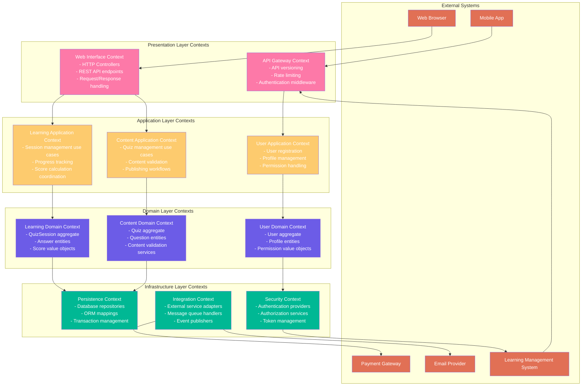
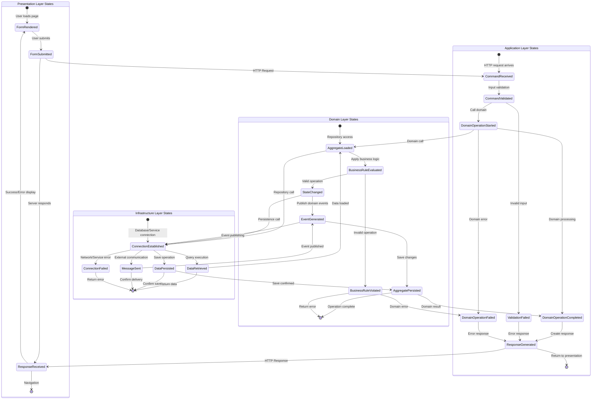
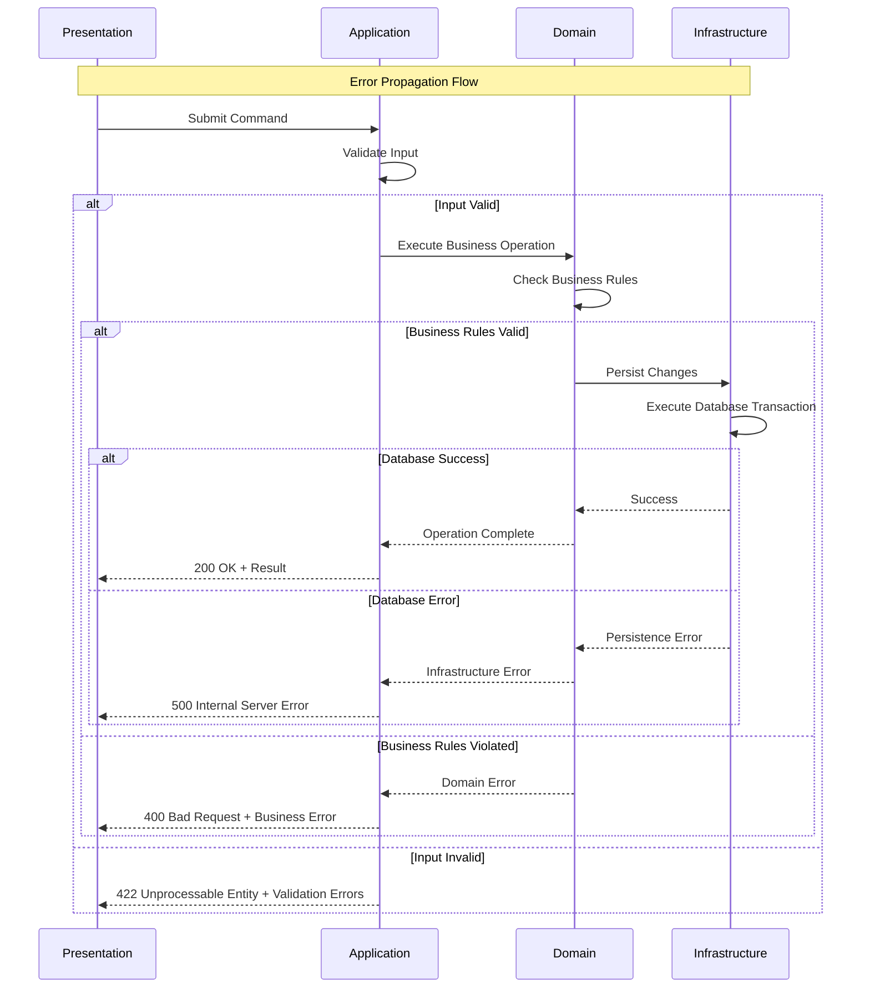
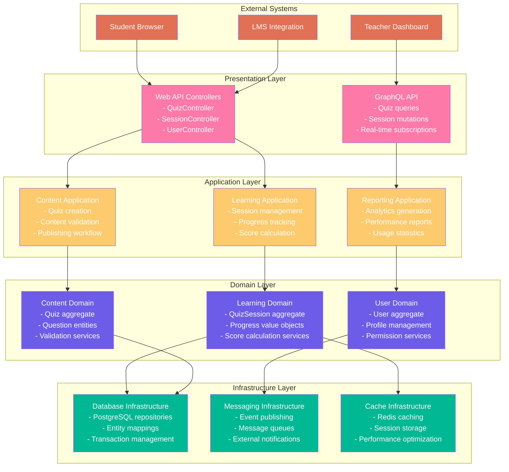
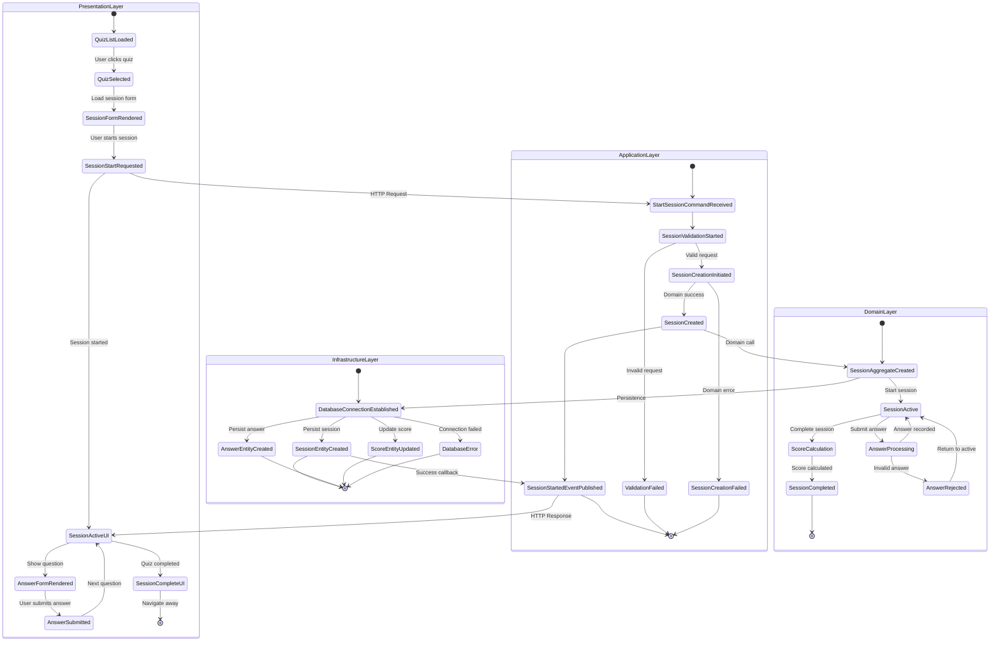

# モデル設計（最終成果物）フォーマット案2：レイヤードアーキテクチャ統合アプローチ

## フォーマットの概要

DDD 2024年のベストプラクティスに基づき、**4層アーキテクチャ（プレゼンテーション・アプリケーション・ドメイン・インフラストラクチャ）を明確に分離し、各層での4つの核心図表の役割と責任を体系化**したレイヤー中心の設計アプローチ。実装の責任分離と保守性を重視する。

## 記載項目テンプレート

### 1. レイヤー統合ドメインモデル図

#### 4層アーキテクチャ統合モデル

```markdown
## 4-Layer Architecture Integrated Domain Model

### Layer-Aware Domain Model Structure

```mermaid
graph TB
    %% Presentation Layer
    subgraph "Presentation Layer"
        WebController[Web Controllers<br/>- QuizController<br/>- SessionController<br/>- UserController]
        DTOs[Data Transfer Objects<br/>- QuizDTO<br/>- SessionDTO<br/>- UserDTO]
        ViewModels[View Models<br/>- QuizViewModel<br/>- SessionViewModel]
    end
    
    %% Application Layer  
    subgraph "Application Layer"
        AppServices[Application Services<br/>- QuizApplicationService<br/>- SessionApplicationService<br/>- UserApplicationService]
        CommandHandlers[Command Handlers<br/>- CreateQuizHandler<br/>- StartSessionHandler<br/>- SubmitAnswerHandler]
        QueryHandlers[Query Handlers<br/>- QuizQueryHandler<br/>- SessionQueryHandler<br/>- ReportQueryHandler]
        AppDTOs[Application DTOs<br/>- CreateQuizCommand<br/>- StartSessionCommand<br/>- SubmitAnswerCommand]
    end
    
    %% Domain Layer
    subgraph "Domain Layer"
        Aggregates[Aggregates<br/>- Quiz<br/>- QuizSession<br/>- User]
        Entities[Entities<br/>- Question<br/>- Answer<br/>- UserProfile]
        ValueObjects[Value Objects<br/>- QuizTitle<br/>- Score<br/>- Email]
        DomainServices[Domain Services<br/>- ScoreCalculationService<br/>- ContentValidationService]
        Repositories[Repository Interfaces<br/>- QuizRepository<br/>- SessionRepository<br/>- UserRepository]
        DomainEvents[Domain Events<br/>- QuizCreated<br/>- SessionCompleted<br/>- UserRegistered]
    end
    
    %% Infrastructure Layer
    subgraph "Infrastructure Layer"
        RepoImpl[Repository Implementations<br/>- PostgresQuizRepository<br/>- PostgresSessionRepository]
        ExternalServices[External Service Adapters<br/>- EmailServiceAdapter<br/>- PaymentServiceAdapter]
        Messaging[Messaging Infrastructure<br/>- EventPublisher<br/>- MessageHandler]
        Persistence[Persistence Models<br/>- QuizEntity (ORM)<br/>- SessionEntity (ORM)]
    end
    
    %% Layer Dependencies (Top to Bottom Only)
    WebController --> AppServices
    WebController --> DTOs
    AppServices --> CommandHandlers
    AppServices --> QueryHandlers
    CommandHandlers --> Aggregates
    CommandHandlers --> DomainServices
    QueryHandlers --> Repositories
    Aggregates --> ValueObjects
    Aggregates --> DomainEvents
    DomainServices --> Repositories
    Repositories --> RepoImpl
    RepoImpl --> Persistence
    DomainEvents --> Messaging
    ExternalServices --> Messaging
    
    classDef presentation fill:#ff6b6b,color:#fff
    classDef application fill:#4ecdc4,color:#fff
    classDef domain fill:#45b7d1,color:#fff
    classDef infrastructure fill:#96ceb4,color:#fff
    
    class WebController,DTOs,ViewModels presentation
    class AppServices,CommandHandlers,QueryHandlers,AppDTOs application
    class Aggregates,Entities,ValueObjects,DomainServices,Repositories,DomainEvents domain
    class RepoImpl,ExternalServices,Messaging,Persistence infrastructure
```

### Layer Responsibility Matrix

| Layer | Primary Responsibility | Domain Model Role | Allowed Dependencies | Prohibited Dependencies |
|-------|----------------------|-------------------|---------------------|------------------------|
| **Presentation** | UI/API interface | DTO transformation, input validation | Application layer only | Domain, Infrastructure direct access |
| **Application** | Use case orchestration | Command/Query coordination | Domain layer, Infrastructure contracts | Infrastructure implementations |
| **Domain** | Business logic | Core model definition | None (pure domain) | Any external dependencies |
| **Infrastructure** | Technical concerns | Persistence, external integration | Domain contracts only | Domain business logic |

### Cross-Layer Model Mapping

| Domain Concept | Presentation Layer | Application Layer | Domain Layer | Infrastructure Layer |
|----------------|-------------------|-------------------|--------------|---------------------|
| **Quiz** | QuizDTO, QuizViewModel | CreateQuizCommand, QuizQuery | Quiz Aggregate | QuizEntity (ORM) |
| **QuizSession** | SessionDTO, SessionViewModel | StartSessionCommand, SessionQuery | QuizSession Aggregate | SessionEntity (ORM) |
| **Score** | ScoreDisplay, ScoreDTO | ScoreCalculationResult | Score Value Object | ScoreData (JSON) |
| **User** | UserProfileDTO | UserCommand, UserQuery | User Aggregate | UserEntity (ORM) |
```

### 2. レイヤー別集約図

#### ドメイン層集約詳細設計

```mermaid
graph TB
    subgraph "Domain Layer - Pure Business Logic"
        subgraph "Quiz Aggregate"
            QuizRoot[Quiz Aggregate Root<br/>========================<br/>+QuizId id<br/>+QuizTitle title<br/>+QuizStatus status<br/>+List~Question~ questions<br/>========================<br/>+addQuestion(Question) Result<br/>+publish() Result<br/>+validatePublishability() boolean]
            
            Question[Question Entity<br/>================<br/>+QuestionId id<br/>+QuestionText text<br/>+QuestionType type<br/>+Points points<br/>================<br/>+validateAnswer(Answer) boolean]
            
            QuizTitle[QuizTitle Value Object<br/>=======================<br/>+string value<br/>+int maxLength: 200<br/>=======================<br/>+validate() ValidationResult<br/>+equals(QuizTitle) boolean]
            
            QuizStatus[QuizStatus Value Object<br/>========================<br/>+StatusEnum value<br/>========================<br/>+canTransitionTo(Status) boolean]
        end
        
        subgraph "QuizSession Aggregate"  
            SessionRoot[QuizSession Aggregate Root<br/>============================<br/>+QuizSessionId id<br/>+UserId userId<br/>+QuizId quizId<br/>+SessionStatus status<br/>+Map~QuestionId,Answer~ answers<br/>============================<br/>+submitAnswer(QuestionId, AnswerData) Result<br/>+complete() Result<br/>+calculateProgress() Progress]
            
            Answer[Answer Entity<br/>===============<br/>+QuestionId questionId<br/>+AnswerData data<br/>+Date submittedAt<br/>===============<br/>+isCorrect() boolean]
            
            Score[Score Value Object<br/>==================<br/>+int rawScore<br/>+float percentage<br/>+Date calculatedAt<br/>==================<br/>+equals(Score) boolean]
        end
        
        subgraph "Domain Services"
            ScoreService[ScoreCalculationService<br/>==========================<br/>+calculateScore(QuizSession, Quiz) Result~Score~<br/>+calculatePartialScore(List~Answer~) PartialScore<br/>+applyTimePenalty(Score, Duration) Score]
            
            ValidationService[ContentValidationService<br/>============================<br/>+validateQuizContent(Quiz) ValidationResult<br/>+checkContentPolicy(Content) PolicyResult<br/>+moderateContent(Content) ModerationResult]
        end
    end
    
    %% Aggregate Internal Relationships
    QuizRoot ||--o{ Question
    QuizRoot ||--|| QuizTitle
    QuizRoot ||--|| QuizStatus
    
    SessionRoot ||--o{ Answer
    SessionRoot ||--|| Score
    
    %% Domain Service Dependencies
    ScoreService ..> SessionRoot : calculates
    ScoreService ..> QuizRoot : uses
    ValidationService ..> QuizRoot : validates
    
    classDef aggregateRoot fill:#ff6b6b,color:#fff,stroke:#333,stroke-width:3px
    classDef entity fill:#4ecdc4,color:#fff,stroke:#333,stroke-width:2px
    classDef valueObject fill:#45b7d1,color:#fff,stroke:#333,stroke-width:1px
    classDef domainService fill:#96ceb4,color:#fff,stroke:#333,stroke-width:2px
    
    class QuizRoot,SessionRoot aggregateRoot
    class Question,Answer entity
    class QuizTitle,QuizStatus,Score valueObject
    class ScoreService,ValidationService domainService
```

#### アプリケーション層集約統合

```mermaid
graph TB
    subgraph "Application Layer - Use Case Orchestration"
        subgraph "Quiz Management Use Cases"
            CreateQuizUC[Create Quiz Use Case<br/>========================<br/>Input: CreateQuizCommand<br/>Output: QuizCreatedResult<br/>========================<br/>1. Validate command<br/>2. Create Quiz aggregate<br/>3. Save via repository<br/>4. Publish domain events]
            
            PublishQuizUC[Publish Quiz Use Case<br/>========================<br/>Input: PublishQuizCommand<br/>Output: QuizPublishedResult<br/>========================<br/>1. Load Quiz aggregate<br/>2. Validate publishability<br/>3. Update status<br/>4. Trigger notifications]
        end
        
        subgraph "Session Management Use Cases"
            StartSessionUC[Start Session Use Case<br/>==========================<br/>Input: StartSessionCommand<br/>Output: SessionStartedResult<br/>==========================<br/>1. Validate user permissions<br/>2. Check existing sessions<br/>3. Create new session<br/>4. Initialize progress]
            
            SubmitAnswerUC[Submit Answer Use Case<br/>==========================<br/>Input: SubmitAnswerCommand<br/>Output: AnswerSubmittedResult<br/>==========================<br/>1. Load active session<br/>2. Validate answer format<br/>3. Record answer<br/>4. Update progress]
        end
        
        subgraph "Application Services Coordination"
            QuizAppService[Quiz Application Service<br/>============================<br/>Coordinates quiz-related use cases<br/>Manages cross-cutting concerns<br/>Handles transaction boundaries]
            
            SessionAppService[Session Application Service<br/>===============================<br/>Coordinates session-related use cases<br/>Manages session lifecycle<br/>Handles scoring integration]
        end
    end
    
    %% Use Case Dependencies  
    QuizAppService --> CreateQuizUC
    QuizAppService --> PublishQuizUC
    SessionAppService --> StartSessionUC
    SessionAppService --> SubmitAnswerUC
    
    %% Cross-Service Dependencies
    StartSessionUC -.-> QuizAppService : Quiz validation
    SubmitAnswerUC -.-> QuizAppService : Question validation
    
    classDef useCase fill:#feca57,color:#fff
    classDef appService fill:#48dbfb,color:#fff
    
    class CreateQuizUC,PublishQuizUC,StartSessionUC,SubmitAnswerUC useCase
    class QuizAppService,SessionAppService appService
```

### 3. レイヤードコンテキストマップ

#### 層間コンテキスト統合マップ

```markdown
## Layered Context Integration Map

### Layer-to-Context Mapping



### Context-Layer Responsibility Matrix

| Context | Presentation | Application | Domain | Infrastructure | External Integration |
|---------|--------------|-------------|--------|----------------|---------------------|
| **Learning** | Session UI, Progress display | Session orchestration | QuizSession aggregate | Session persistence | Progress synchronization |
| **Content** | Quiz editor, Content forms | Content workflows | Quiz aggregate | Content storage | Content moderation APIs |
| **User** | Profile UI, Auth forms | User management | User aggregate | User persistence | Identity providers |
| **Security** | Auth middleware | Permission checks | Authorization rules | Token storage | OAuth providers |

### Layer Communication Patterns

| From Layer | To Layer | Communication Pattern | Data Contract | Error Handling | Performance |
|------------|----------|----------------------|---------------|----------------|-------------|
| Presentation → Application | Method invocation | DTO mapping | Commands/Queries | HTTP status codes | <50ms |
| Application → Domain | Direct method calls | Domain objects | Aggregates | Domain exceptions | <10ms |
| Domain → Infrastructure | Interface injection | Repository pattern | Domain contracts | Result objects | <100ms |
| Infrastructure → External | Adapter pattern | External models | API contracts | Circuit breaker | <2000ms |
```

### 4. レイヤー統合状態遷移図

#### 層間状態遷移統合モデル

```markdown
## Layer-Integrated State Transition Model

### Multi-Layer State Coordination



### Cross-Layer State Dependencies

| Trigger Layer | Target Layer | State Transition | Dependency Type | Rollback Strategy |
|---------------|--------------|------------------|-----------------|-------------------|
| Presentation | Application | Form Submit → Command Process | Synchronous | Display error |
| Application | Domain | Command → Business Operation | Synchronous | Return domain error |
| Domain | Infrastructure | State Change → Persistence | Synchronous | Transaction rollback |
| Infrastructure | External | Data Change → Notification | Asynchronous | Retry + DLQ |

### Error State Propagation



### Layer-Specific State Monitoring

| Layer | State Metrics | Monitoring Tools | Alert Thresholds | Recovery Actions |
|-------|---------------|------------------|------------------|------------------|
| **Presentation** | Response time, Error rate | APM tools | >2s response, >5% errors | Load balancer failover |
| **Application** | Command throughput, Validation errors | Custom metrics | >1000 req/s, >10% validation failures | Circuit breaker activation |
| **Domain** | Business rule violations, Aggregate operations | Domain events | >1% rule violations | Manual review process |
| **Infrastructure** | Database connections, External service calls | Infrastructure monitoring | >80% connection usage, >5s external calls | Scale resources, fallback services |
```

---

## サンプル実装：クイズアプリケーション レイヤード統合

### 1. 4層統合ドメインモデル（クイズアプリ）

```mermaid
graph TB
    %% Presentation Layer
    subgraph "Presentation Layer"
        QuizController[QuizController<br/>+createQuiz(CreateQuizRequest)<br/>+publishQuiz(PublishQuizRequest)<br/>+getQuiz(QuizId)]
        SessionController[SessionController<br/>+startSession(StartSessionRequest)<br/>+submitAnswer(SubmitAnswerRequest)<br/>+getSessionStatus(SessionId)]
        QuizDTO[QuizDTO<br/>+id: string<br/>+title: string<br/>+questions: QuestionDTO[]]
        SessionDTO[SessionDTO<br/>+id: string<br/>+quizId: string<br/>+status: string<br/>+score: number]
    end
    
    %% Application Layer
    subgraph "Application Layer"
        QuizAppService[QuizApplicationService<br/>+createQuiz(CreateQuizCommand)<br/>+publishQuiz(PublishQuizCommand)]
        SessionAppService[SessionApplicationService<br/>+startSession(StartSessionCommand)<br/>+submitAnswer(SubmitAnswerCommand)]
        CreateQuizHandler[CreateQuizCommandHandler<br/>+handle(CreateQuizCommand)]
        StartSessionHandler[StartSessionCommandHandler<br/>+handle(StartSessionCommand)]
    end
    
    %% Domain Layer
    subgraph "Domain Layer"
        Quiz[Quiz Aggregate<br/>+QuizId id<br/>+QuizTitle title<br/>+List~Question~ questions<br/>+publish(): Result]
        QuizSession[QuizSession Aggregate<br/>+SessionId id<br/>+UserId userId<br/>+submitAnswer(): Result]
        ScoreService[ScoreCalculationService<br/>+calculateScore(Session, Quiz): Score]
        QuizRepo[QuizRepository Interface<br/>+save(Quiz)<br/>+findById(QuizId)]
    end
    
    %% Infrastructure Layer
    subgraph "Infrastructure Layer"
        PostgresQuizRepo[PostgresQuizRepository<br/>+save(Quiz)<br/>+findById(QuizId)]
        QuizEntity[QuizEntity (ORM)<br/>+id: UUID<br/>+title: String<br/>+questions: QuestionEntity[]]
        EventPublisher[DomainEventPublisher<br/>+publish(DomainEvent)]
    end
    
    %% Dependencies (Top-Down Only)
    QuizController --> QuizAppService
    SessionController --> SessionAppService
    QuizAppService --> CreateQuizHandler
    SessionAppService --> StartSessionHandler
    CreateQuizHandler --> Quiz
    StartSessionHandler --> QuizSession
    Quiz --> ScoreService
    ScoreService --> QuizRepo
    QuizRepo <|-- PostgresQuizRepo
    PostgresQuizRepo --> QuizEntity
    Quiz --> EventPublisher
```

### 2. レイヤー別集約詳細（Quiz集約）

```mermaid
graph TB
    subgraph "Domain Layer - Quiz Aggregate"
        QuizAR[Quiz Aggregate Root<br/>================================<br/>Domain Responsibility:<br/>- Business rule enforcement<br/>- State consistency<br/>- Invariant protection<br/>================================<br/>+addQuestion(Question): Result<br/>+publish(): Result<br/>+validatePublishability(): boolean]
        
        Question[Question Entity<br/>==================<br/>Domain Responsibility:<br/>- Question validation<br/>- Answer checking<br/>==================<br/>+validateAnswer(Answer): boolean<br/>+calculatePoints(): Points]
        
        QuizTitle[QuizTitle Value Object<br/>==========================<br/>Domain Responsibility:<br/>- Title validation<br/>- Format enforcement<br/>==========================<br/>+validate(): ValidationResult]
    end
    
    subgraph "Application Layer - Quiz Coordination"
        CreateQuizUC[Create Quiz Use Case<br/>===========================<br/>Application Responsibility:<br/>- Transaction coordination<br/>- Cross-aggregate orchestration<br/>- Event publishing<br/>===========================<br/>1. Validate command<br/>2. Create aggregate<br/>3. Save via repository<br/>4. Publish events]
        
        PublishQuizUC[Publish Quiz Use Case<br/>============================<br/>Application Responsibility:<br/>- Business process coordination<br/>- External service integration<br/>- State transition management<br/>============================<br/>1. Load aggregate<br/>2. Validate business rules<br/>3. Update state<br/>4. Notify stakeholders]
    end
    
    subgraph "Infrastructure Layer - Quiz Persistence"
        QuizRepository[PostgresQuizRepository<br/>============================<br/>Infrastructure Responsibility:<br/>- Data persistence<br/>- Query optimization<br/>- Transaction management<br/>============================<br/>+save(Quiz): void<br/>+findById(QuizId): Quiz<br/>+findByCreator(UserId): Quiz[]]
        
        QuizEntity[QuizEntity (JPA/Hibernate)<br/>==============================<br/>Infrastructure Responsibility:<br/>- ORM mapping<br/>- Database schema alignment<br/>- Relationship management<br/>==============================<br/>@Entity, @Table annotations<br/>Bidirectional relationships]
    end
    
    %% Layer Dependencies
    CreateQuizUC --> QuizAR : Creates and manipulates
    PublishQuizUC --> QuizAR : Loads and updates
    QuizAR --> QuizRepository : Interface dependency
    QuizRepository --> QuizEntity : ORM mapping
    
    QuizAR ||--o{ Question : Composition
    QuizAR ||--|| QuizTitle : Value Object
    
    classDef domain fill:#6c5ce7,color:#fff
    classDef application fill:#fdcb6e,color:#fff
    classDef infrastructure fill:#00b894,color:#fff
    
    class QuizAR,Question,QuizTitle domain
    class CreateQuizUC,PublishQuizUC application
    class QuizRepository,QuizEntity infrastructure
```

### 3. レイヤードコンテキストマップ（クイズアプリ）



### 4. 層間状態遷移統合（クイズセッション）



---

## フォーマットの特徴

### 利点
- **責任分離**: 各層の役割が明確で保守性が高い
- **実装指針**: レイヤー構造から直接実装アーキテクチャを導出
- **テスト容易性**: 層ごとの独立したテストが可能
- **技術変更耐性**: インフラ層の変更がドメイン層に影響しない
- **チーム分担**: 層ごとに異なるチームが並行開発可能
- **スケーラビリティ**: 層ごとの独立したスケーリングが可能

### 欠点
- **複雑性**: 4層構造により設計・実装が複雑化
- **パフォーマンス**: 層間通信によるオーバーヘッド
- **DTOマッピング**: 層間でのデータ変換コストが高い
- **過度な抽象化**: 小規模システムには過剰な構造
- **学習コスト**: チーム全体での層設計理解が必要

### 適用場面
- **大規模システム**: 複数チームでの並行開発が必要
- **長期保守**: 技術変更への耐性が重要
- **企業システム**: 安定性と保守性を重視
- **レガシー統合**: 既存システムとの統合が必要
- **コンプライアンス**: 監査や規制対応が必要
- **技術多様性**: 異なる技術スタックの統合が必要