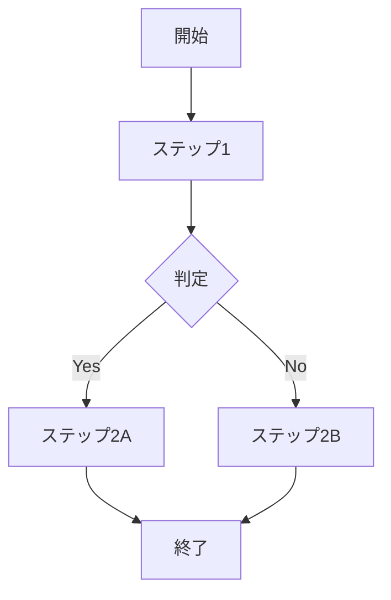
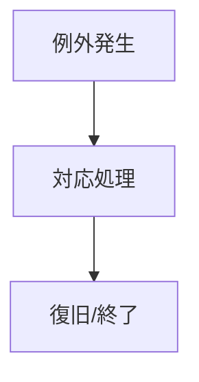
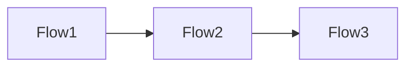
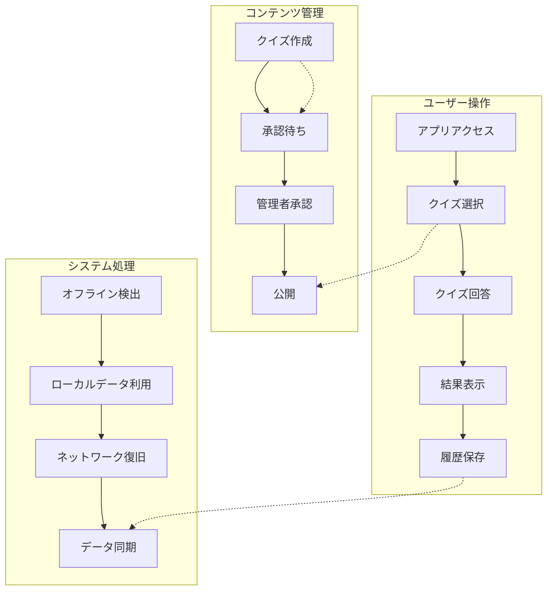
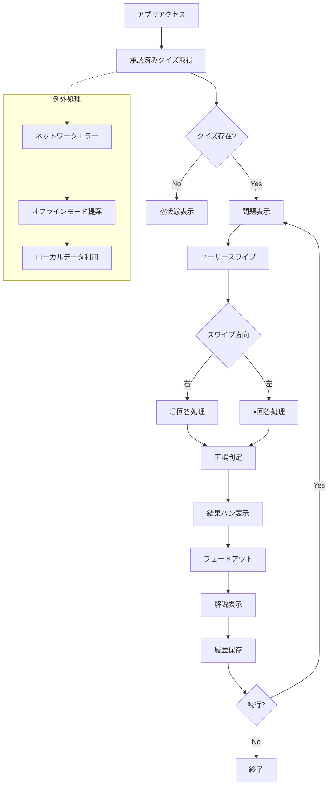
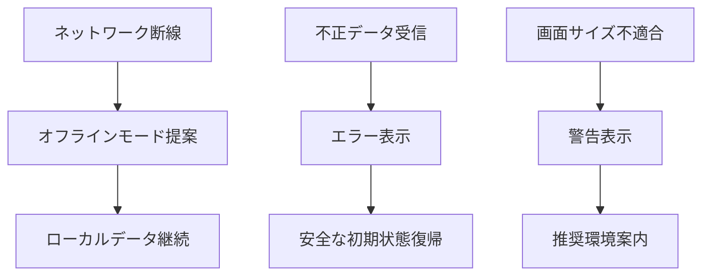
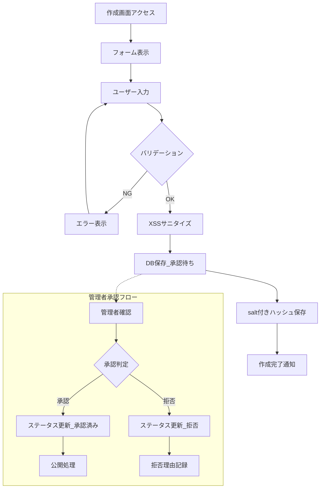
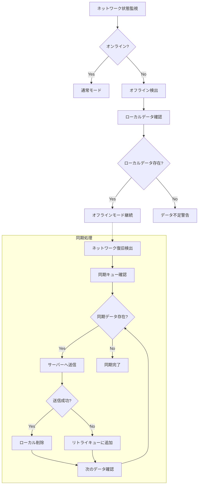
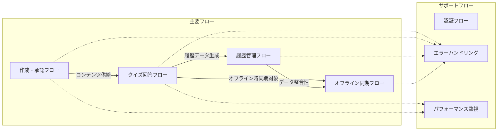

# 案2: フロー図中心型

## フォーマット概要

Mermaidフロー図による視覚的なフロー表現と、各ステップの4WH1情報をマトリックス形式で管理する手法。フロー全体の理解と詳細情報の両立を図る。

## 構成

```markdown
# ユーザー操作・業務フロー整理

## 全体フロー図



## ステップ詳細マトリックス

| Step ID | Who | What | When | Where | Why | How | 重要度 | 処理方式 | 頻度 |
|---------|-----|------|------|-------|-----|-----|--------|----------|------|
| A | | | | | | | | | |
| B | | | | | | | | | |

## 例外フロー



## フロー間関係図



```

## サンプル実装

```markdown
# ユーザー操作・業務フロー整理 - クイズアプリケーション

## 全体システムフロー図



---

## 1. クイズ回答フロー

### フロー図



### ステップ詳細マトリックス

| Step ID | Who | What | When | Where | Why | How | 重要度 | 処理方式 | 頻度 |
|---------|-----|------|------|-------|-----|-----|--------|----------|------|
| **A** | 匿名ユーザー | アプリケーションアクセス | 学習したい時 | スマホブラウザ | 学習効率向上 | URL直接アクセス | 高 | リアルタイム | 100回/日 |
| **B** | システム | 承認済みクイズデータ取得 | アクセス時 | API | コンテンツ提供 | REST API呼び出し | 高 | リアルタイム | 100回/日 |
| **D** | システム | 問題文・選択肢表示 | データ取得後 | スマホ画面 | UX提供 | Tinder風UI描画 | 高 | リアルタイム | 100回/日 |
| **F** | 匿名ユーザー | スワイプ操作実行 | 回答決定時 | スマホ画面 | 回答表明 | タッチジェスチャー | 高 | リアルタイム | 200回/日 |
| **H/I** | システム | 回答データ処理 | スワイプ時 | アプリケーション | 回答記録 | boolean値保存 | 高 | リアルタイム | 200回/日 |
| **J** | システム | 正誤判定処理 | 回答後即座 | アプリケーション | 学習効果提供 | 正解データ比較 | 高 | リアルタイム | 200回/日 |
| **K** | システム | 結果アニメーション | 判定後即座 | スマホ画面 | 即座フィードバック | CSS/JS アニメーション | 中 | リアルタイム | 200回/日 |
| **M** | システム | 解説コンテンツ表示 | アニメーション後 | スマホ画面 | 学習深化 | 解説データ描画 | 中 | リアルタイム | 200回/日 |
| **N** | システム | 回答履歴永続化 | 解説表示時 | IndexedDB | 学習記録 | ローカルDB保存 | 中 | リアルタイム | 200回/日 |

### 例外フロー



---

## 2. クイズ作成・承認フロー

### フロー図



### ステップ詳細マトリックス

| Step ID | Who | What | When | Where | Why | How | 重要度 | 処理方式 | 頻度 |
|---------|-----|------|------|-------|-----|-----|--------|----------|------|
| **A** | 一般ユーザー | 作成画面アクセス | クイズ投稿時 | スマホブラウザ | コンテンツ投稿 | 作成ボタン押下 | 高 | リアルタイム | 10回/日 |
| **C** | 一般ユーザー | 問題文・解説・タグ入力 | フォーム表示後 | 入力フォーム | クイズ作成 | フォーム入力 | 高 | リアルタイム | 10回/日 |
| **D** | システム | 入力データバリデーション | 送信時 | アプリケーション | データ品質保証 | zod等でバリデーション | 高 | リアルタイム | 10回/日 |
| **F** | システム | XSS対策サニタイズ | バリデーション後 | サーバー | セキュリティ対策 | HTMLタグ除去 | 高 | リアルタイム | 10回/日 |
| **G** | システム | 承認待ち状態でDB保存 | サニタイズ後 | データベース | コンテンツ管理 | SQL INSERT | 高 | リアルタイム | 10回/日 |
| **H** | システム | 作成者識別ハッシュ保存 | DB保存後 | ブラウザ | 匿名識別 | salt付きハッシュ | 中 | リアルタイム | 10回/日 |
| **J** | 管理者 | 投稿内容確認 | 不定期 | 管理画面/DB | 品質管理 | 手動確認 | 高 | バッチ | 5回/日 |
| **L** | 管理者 | 承認処理実行 | 確認後 | 管理画面/DB | コンテンツ公開 | ステータス更新 | 高 | バッチ | 8回/日 |

---

## 3. オフライン同期フロー

### フロー図



### ステップ詳細マトリックス

| Step ID | Who | What | When | Where | Why | How | 重要度 | 処理方式 | 頻度 |
|---------|-----|------|------|-------|-----|-----|--------|----------|------|
| **A** | システム | ネットワーク状態監視 | 常時 | ServiceWorker | 接続状態把握 | navigator.onLine | 中 | リアルタイム | 継続的 |
| **D** | システム | オフライン状態検出 | 断線時 | ServiceWorker | モード切替 | ネットワークイベント | 中 | リアルタイム | 不定期 |
| **E** | システム | ローカルデータ存在確認 | オフライン時 | IndexedDB | 利用可能性判定 | DB クエリ | 中 | リアルタイム | 不定期 |
| **G** | システム | オフラインモード継続 | データ確認後 | アプリケーション | UX維持 | ローカルデータ利用 | 中 | リアルタイム | 不定期 |
| **I** | システム | ネットワーク復旧検出 | 復旧時 | ServiceWorker | 同期開始判断 | 接続イベント | 中 | リアルタイム | 不定期 |
| **J** | システム | 同期待ちデータ確認 | 復旧時 | IndexedDB | 同期対象特定 | 未同期フラグ検索 | 中 | バッチ | 不定期 |
| **L** | システム | サーバーへデータ送信 | 同期処理中 | REST API | データ整合性確保 | HTTP POST | 中 | バッチ | 不定期 |
| **P** | システム | リトライキュー管理 | 送信失敗時 | IndexedDB | 再送保証 | 指数バックオフ | 中 | バッチ | 不定期 |

---

## フロー間関係図



## 重要度・頻度マトリックス

| フロー | 最高重要度ステップ | 最高頻度ステップ | 技術的難易度 | 実装優先度 |
|--------|-------------------|------------------|-------------|------------|
| **クイズ回答** | スワイプ処理 (H/I) | スワイプ処理 (200回/日) | 中 | 1 |
| **作成・承認** | XSSサニタイズ (F) | 作成画面アクセス (10回/日) | 高 | 2 |
| **履歴管理** | データ永続化 | データ表示 (50回/日) | 低 | 3 |
| **オフライン同期** | 同期処理 (L) | 状態監視 (継続的) | 高 | 4 |

## 監視・メトリクス設定

### リアルタイム監視対象

- API応答時間 (ステップB: <100ms)
- UI反応時間 (ステップF→G: <200ms)
- アニメーション品質 (ステップK: 60fps)

### バッチ処理監視対象

- 承認処理頻度 (ステップL: 8回/日)
- 同期成功率 (ステップL: >95%)
- エラー発生率 (各フロー: <1%)

```

## 利点・欠点

### 利点
- ✅ フロー全体の視覚的理解が容易
- ✅ ステップ間の関係性が明確
- ✅ マトリックス形式で詳細情報が整理される
- ✅ 例外処理とメインフローの分離が明確

### 欠点  
- ❌ 複雑なフローでは図が見づらくなる
- ❌ マトリックスが大きくなると保守が困難
- ❌ 図とマトリックスの同期が必要

## 適用場面
- フローの視覚的理解が重要
- ステップ単位での詳細管理が必要
- チーム内での共有・レビューが頻繁
- フロー間の関係性把握が重要
