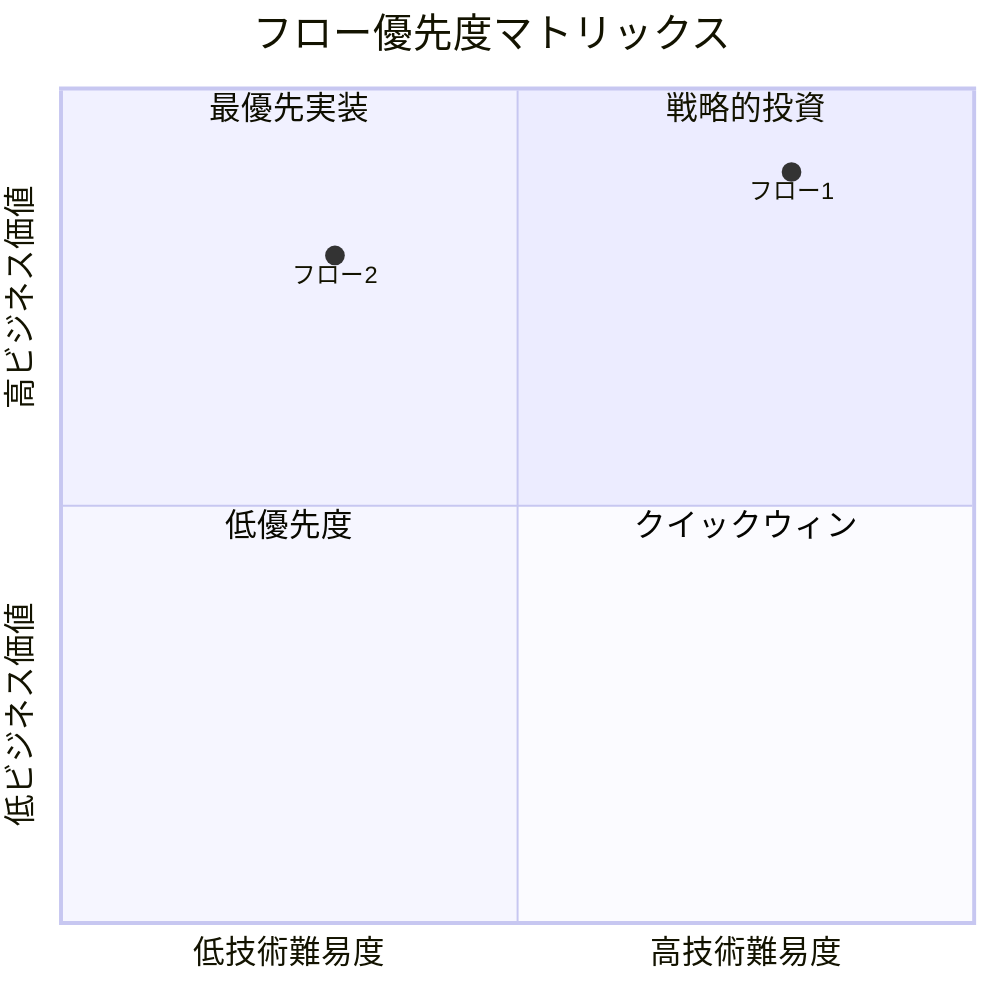
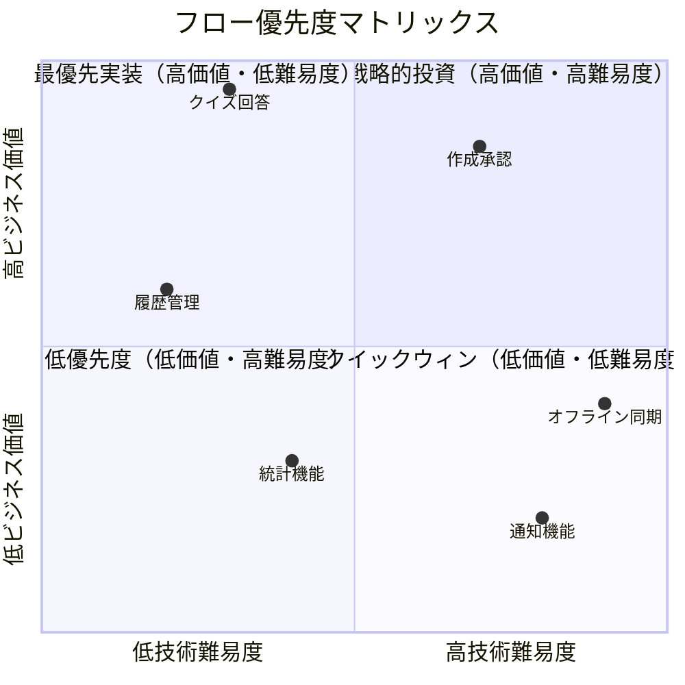

# 案4: 業務価値マトリックス型

## フォーマット概要

ビジネス価値・技術的重要度の2軸でフローを評価し、開発優先度の決定とROI最適化を支援する手法。リソースが限られた環境での意思決定に適している。

## 構成

```markdown
# ユーザー操作・業務フロー整理

## 業務価値マトリックス



## フロー評価詳細

| フロー名 | ビジネス価値 | 技術難易度 | 実装工数 | ROI | 優先度 | 実装時期 |
|----------|-------------|------------|----------|-----|--------|----------|
| フロー1 | 高(9) | 中(5) | 20h | 4.5 | P1 | Phase1 |
| フロー2 | 中(6) | 低(3) | 8h | 7.5 | P2 | Phase1 |

## 4WH1分析（優先度順）

### P1: [フロー名]

| 要素 | 詳細 | ビジネス価値への寄与 |
|------|------|---------------------|
| **Who** | | |
| **What** | | |
| **When** | | |
| **Where** | | |
| **Why** | | |
| **How** | | |

### 価値測定指標

- KPI1: 目標値
- KPI2: 目標値

### 実装判断

- **Go/No-Go判定**: Go
- **判定理由**: ROI高、技術リスク低
- **成功条件**: 具体的成功指標

```

## サンプル実装

```markdown
# ユーザー操作・業務フロー整理 - クイズアプリケーション

## 業務価値マトリックス



---

## フロー評価詳細

### 評価基準説明

#### ビジネス価値評価（1-10点）

- **9-10点**: ビジネス継続に必須、収益に直結
- **7-8点**: 顧客満足度・競合優位性に重要
- **5-6点**: ユーザー体験向上、効率化に寄与
- **3-4点**: 運用改善、将来の基盤
- **1-2点**: 付加価値、nice-to-have

#### 技術難易度評価（1-10点）

- **9-10点**: 新技術習得必須、高リスク
- **7-8点**: 複雑な設計・実装、中リスク
- **5-6点**: 標準的実装、既知の技術
- **3-4点**: 基本的CRUD、低リスク
- **1-2点**: 設定変更レベル、リスクなし

---

## 優先度ランキング

| 順位 | フロー名 | ビジネス価値 | 技術難易度 | 実装工数 | ROI | 実装時期 | 判定 |
|------|----------|-------------|------------|----------|-----|----------|------|
| **1** | **クイズ回答フロー** | 高(9.5) | 低(3) | 40h | **12.7** | Phase1-Week1 | ✅ Go |
| **2** | **履歴管理フロー** | 中(6) | 低(2) | 16h | **18.8** | Phase1-Week2 | ✅ Go |
| **3** | **作成・承認フロー** | 高(8.5) | 高(7) | 60h | **7.1** | Phase1-Week3-4 | ✅ Go |
| **4** | **統計機能** | 低(3) | 中(4) | 24h | **6.3** | Phase2 | 🔶 Defer |
| **5** | **オフライン同期** | 中(4) | 高(9) | 80h | **2.0** | Phase3 | 🔶 Defer |
| **6** | **通知機能** | 低(2) | 高(8) | 40h | **1.3** | 未定 | ❌ No-Go |

### ROI計算式

```
ROI = (ビジネス価値点 × 想定利用頻度) / (実装工数 × 技術難易度係数)

技術難易度係数:
- 1-3点: 0.5（低リスク）
- 4-6点: 1.0（標準）  
- 7-10点: 2.0（高リスク）
```

---

## 4WH1分析（優先度順）

### P1: クイズ回答フロー（ROI: 12.7）

| 要素 | 詳細 | ビジネス価値への寄与 |
|------|------|---------------------|
| **Who** | 匿名ユーザー（メインターゲット100%） | 全ユーザーが利用、直接的収益貢献 |
| **What** | ◯×クイズ回答、結果表示、次問題遷移 | コア機能、滞在時間・リピート率向上 |
| **When** | 学習時（想定：1日3回 × 100ユーザー） | 高頻度利用でエンゲージメント最大化 |
| **Where** | スマートフォンブラウザ（PWA） | ターゲット環境100%対応 |
| **Why** | 学習効率向上、手軽な知識確認 | 顧客価値直結、口コミ・拡散効果 |
| **How** | Tinder風スワイプUI、アニメーション | 差別化要素、UX競合優位性 |

#### 価値測定指標

- **DAU（日次アクティブユーザー）**: 目標100人 → Phase2で300人
- **セッション時間**: 目標5分/回 → 10分/回に改善
- **回答完了率**: 目標80% → 90%に改善
- **リピート率**: 目標60% → 80%に改善

#### 実装判断

- **Go/No-Go判定**: ✅ **Go（最優先）**
- **判定理由**: ROI最高、技術リスク低、MVPに必須
- **成功条件**: 回答完了率80%以上、API応答時間100ms以内
- **リスク**: 低（既知技術、UI実装のみ）

---

### P2: 履歴管理フロー（ROI: 18.8）

| 要素 | 詳細 | ビジネス価値への寄与 |
|------|------|---------------------|
| **Who** | 匿名ユーザー（学習継続志向80%） | 学習継続→長期利用→価値向上 |
| **What** | 回答履歴表示、詳細確認、再回答 | リテンション向上、学習効果可視化 |
| **When** | 学習振り返り時（週2-3回利用想定） | 定期利用パターン確立 |
| **Where** | 履歴画面（IndexedDB）、オフライン対応 | データ永続化、継続性確保 |
| **Why** | 学習進捗確認、復習効率化 | 教育効果向上→サービス価値向上 |
| **How** | リスト表示、検索・フィルタ、統計表示 | 使いやすさ→満足度向上 |

#### 価値測定指標

- **履歴利用率**: 目標50% → 70%
- **復習実行率**: 目標30% → 50%
- **週次継続率**: 目標40% → 60%

#### 実装判断

- **Go/No-Go判定**: ✅ **Go（第2優先）**
- **判定理由**: ROI高、実装簡単、ユーザー体験向上大
- **成功条件**: 履歴利用率50%以上
- **リスク**: 極低（基本的CRUD操作）

---

### P3: 作成・承認フロー（ROI: 7.1）

| 要素 | 詳細 | ビジネス価値への寄与 |
|------|------|---------------------|
| **Who** | 一般ユーザー（投稿者5%）、管理者（品質管理） | コンテンツ供給源、品質担保 |
| **What** | 問題作成、承認プロセス、公開管理 | コンテンツ増加→サービス価値向上 |
| **When** | 投稿：随時、承認：週2-3回 | コンテンツ更新頻度確保 |
| **Where** | 作成フォーム、管理画面（将来）、DB直接操作 | UGC（User Generated Content）基盤 |
| **Why** | コンテンツ拡充、ユーザー参加促進 | 長期成長、コミュニティ形成 |
| **How** | フォーム入力、XSS対策、承認ワークフロー | セキュリティ、品質確保 |

#### 価値測定指標

- **月次投稿数**: 目標50問 → 100問
- **承認率**: 目標80% → 安定維持
- **投稿ユーザー率**: 目標5% → 8%

#### 実装判断

- **Go/No-Go判定**: ✅ **Go（必須機能）**
- **判定理由**: コンテンツ供給に必須、技術難易度管理可能
- **成功条件**: 月次50問投稿、承認プロセス安定運用
- **リスク**: 中（セキュリティ対策、承認フロー設計）

---

### P4: 統計機能（ROI: 6.3）

| 要素 | 詳細 | ビジネス価値への寄与 |
|------|------|---------------------|
| **Who** | 管理者（運用改善）、ユーザー（学習分析） | 運用効率化、ユーザー満足度向上 |
| **What** | 利用統計、パフォーマンス分析、学習分析 | データドリブン運用、改善指針 |
| **When** | 管理者：週次確認、ユーザー：月次確認 | 定期的な改善サイクル |
| **Where** | 管理ダッシュボード、ユーザー統計画面 | 情報可視化 |
| **Why** | サービス改善、ユーザー体験向上 | 中長期成長支援 |
| **How** | データ集計、グラフ表示、トレンド分析 | 意思決定支援 |

#### 実装判断

- **Go/No-Go判定**: 🔶 **Defer（Phase2で検討）**
- **判定理由**: 価値中程度、MVPに必須でない
- **条件**: ユーザー数300人達成後に実装検討

---

### P5: オフライン同期（ROI: 2.0）

| 要素 | 詳細 | ビジネス価値への寄与 |
|------|------|---------------------|
| **Who** | システム（自動）、すべてのユーザー（恩恵） | UX向上、利用可能性拡大 |
| **What** | ネットワーク断線時の継続利用、データ同期 | 利便性向上、差別化要素 |
| **When** | ネットワーク不安定時（10-20%のケース） | 特定状況での価値提供 |
| **Where** | ServiceWorker、IndexedDB、Background Sync | 技術的インフラ |
| **Why** | ユーザー体験向上、競合差別化 | 付加価値、技術力アピール |
| **How** | PWA技術、オフラインファースト設計 | 高度な技術実装 |

#### 実装判断

- **Go/No-Go判定**: 🔶 **Defer（Phase3で検討）**
- **判定理由**: 価値限定的、技術的難易度高、ROI低
- **条件**: 基本機能安定後、リソース余裕時に検討

---

### P6: 通知機能（ROI: 1.3）

#### 実装判断

- **Go/No-Go判定**: ❌ **No-Go**
- **判定理由**: 価値低、技術難易度高、優先度低い
- **代替案**: メール通知、SNS連携で十分

---

## Phase別実装計画

### Phase 1: MVP（4週間）

**目標**: 基本的なクイズサービスとして機能

| Week | フロー | 工数 | 担当 | 成功指標 |
|------|------|------|------|----------|
| **1** | クイズ回答フロー | 40h | フルスタック | 回答完了率80% |
| **2** | 履歴管理フロー | 16h | フロントエンド | 履歴利用率50% |
| **3-4** | 作成・承認フロー | 60h | フルスタック | 月次50問投稿 |

**Phase1成功指標**:

- DAU: 50人以上
- 月次投稿数: 50問以上  
- ユーザー満足度: 4.0/5.0以上

### Phase 2: 成長期（6週間）

**目標**: ユーザー体験向上、運用効率化

- 統計機能実装
- UI/UX改善
- パフォーマンス最適化
- SEO対策

**Phase2成功指標**:

- DAU: 200人以上
- 月次投稿数: 150問以上
- リピート率: 70%以上

### Phase 3: 拡張期（8週間）

**目標**: 差別化要素追加、技術的優位性確立

- オフライン同期機能
- 高度な検索機能
- ソーシャル機能
- API公開

## ROI監視・改善

### 測定フレームワーク

```
実際ROI = (実現した価値) / (実際の実装コスト)

価値測定:
- 定量: DAU増加、セッション時間、収益
- 定性: ユーザー満足度、ブランド価値

コスト測定:
- 開発工数（時間単価 × 工数）
- 運用コスト（サーバー、保守）
- 機会損失（他機能を作らなかったコスト）
```

### 改善プロセス

1. **月次レビュー**: 各フローのROI実績確認
2. **優先度再評価**: 新たな価値発見、技術環境変化への対応
3. **Phase計画見直し**: ROI実績に基づく計画調整
4. **リソース再配分**: 高ROIフローへのリソース集中

## 意思決定ガイドライン

### Go判定基準

- ROI > 5.0: 積極的実装
- ROI 3.0-5.0: 条件付き実装
- ROI < 3.0: 延期・中止検討

### 例外判定基準

- 法的要件: ROIに関わらず実装必須
- セキュリティ: 高優先度で実装
- 技術負債解消: 長期ROI考慮で判定

### リスク許容度

- 高価値・高リスク: 段階的実装でリスク軽減
- 低価値・高リスク: 原則実装しない
- 低価値・低リスク: 余剰リソース時のみ実装

```

## 利点・欠点

### 利点
- ✅ ビジネス価値に基づく客観的優先度決定
- ✅ ROI計算で投資対効果が明確
- ✅ リソース配分の最適化が可能
- ✅ ステークホルダーへの説明が容易

### 欠点
- ❌ ビジネス価値の定量化が困難な場合がある
- ❌ 短期的ROIに偏重する可能性
- ❌ 技術的負債や基盤投資を軽視しがち
- ❌ 価値評価の主観性

## 適用場面
- リソースが限られた環境
- 複数機能の優先度決定が必要
- ROI重視の開発方針
- ステークホルダーへの説明責任が重要
