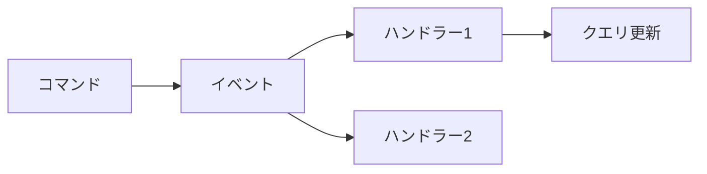
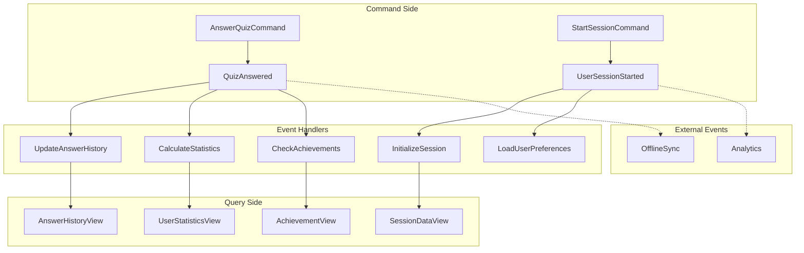
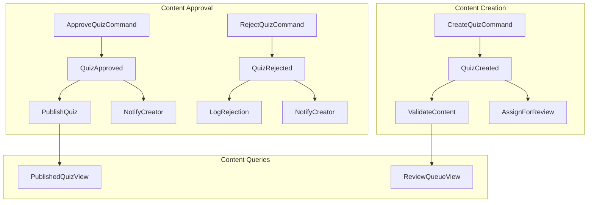
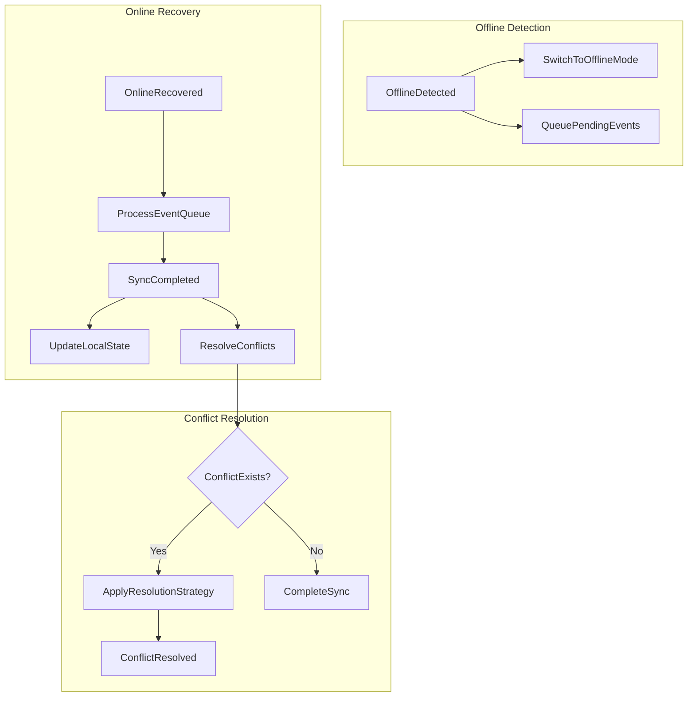

# 案5: イベント駆動分析型

## フォーマット概要

ドメインイベントを起点としたフロー分析手法。イベント・コマンド・クエリの分離によりCQRS/Event Sourcingアーキテクチャに対応し、非同期処理設計を支援する。

## 構成

```markdown
# ユーザー操作・業務フロー整理

## ドメインイベント一覧

| イベント名 | 発生条件 | データ | 重要度 | 処理方式 | 頻度 |
|------------|----------|--------|--------|----------|------|
| UserAnswered | ユーザー回答時 | userId, quizId, answer, timestamp | 高 | リアルタイム | 200回/日 |

## イベントフロー図



## コマンド・クエリ・イベント分析

### Command: [コマンド名]

| 要素 | 詳細 |
|------|------|
| **Who** | 実行者 |
| **What** | 実行内容 |
| **When** | 実行タイミング |
| **Validation** | バリデーションルール |
| **Side Effects** | 発生するイベント |

### Event: [イベント名]

| 要素 | 詳細 |
|------|------|
| **Trigger** | 発生トリガー |
| **Payload** | イベントデータ |
| **Handlers** | 処理ハンドラー |
| **Downstream** | 後続イベント |

### Query: [クエリ名]

| 要素 | 詳細 |
|------|------|
| **Purpose** | 用途 |
| **Data Source** | データソース |
| **Performance** | パフォーマンス要件 |

```

## サンプル実装

```markdown
# ユーザー操作・業務フロー整理 - クイズアプリケーション

## ドメインイベント一覧

| イベント名 | 発生条件 | データ | 重要度 | 処理方式 | 頻度 | 保持期間 |
|------------|----------|--------|--------|----------|------|----------|
| **QuizAnswered** | ユーザーがクイズに回答 | userId, quizId, answer, isCorrect, timestamp | 高 | リアルタイム | 200回/日 | 永続 |
| **QuizCreated** | 新しいクイズが作成 | quizId, creatorHash, content, status=pending | 高 | リアルタイム | 10回/日 | 永続 |
| **QuizApproved** | 管理者がクイズを承認 | quizId, adminId, approvedAt, decision | 高 | 準リアルタイム | 8回/日 | 永続 |
| **QuizRejected** | 管理者がクイズを拒否 | quizId, adminId, rejectedAt, reason | 中 | 準リアルタイム | 2回/日 | 永続 |
| **UserSessionStarted** | ユーザーがアプリにアクセス | sessionId, userId, startedAt, device | 中 | リアルタイム | 100回/日 | 30日 |
| **OfflineDetected** | オフライン状態検出 | userId, detectedAt, lastSyncAt | 中 | リアルタイム | 20回/日 | 7日 |
| **SyncCompleted** | オフライン同期完了 | userId, syncedAt, syncedEvents, conflicts | 中 | バッチ | 15回/日 | 7日 |
| **HistoryViewed** | 履歴画面表示 | userId, viewedAt, filter | 低 | リアルタイム | 50回/日 | 1日 |

---

## イベントフロー図

### メインフロー: クイズ回答


### コンテンツ管理フロー



### システムフロー: オフライン同期



---

## コマンド・クエリ・イベント分析

### Command: AnswerQuizCommand

| 要素 | 詳細 |
|------|------|
| **Who** | 匿名ユーザー（セッション識別） |
| **What** | クイズ回答実行（◯または×） |
| **When** | ユーザーがスワイプ操作実行時 |
| **Where** | スマートフォンブラウザ |
| **Why** | 学習目的、知識確認 |
| **How** | REST API POST /quiz/{id}/answer |
| **Validation** | quizId存在確認、answer値検証、レート制限 |
| **Side Effects** | QuizAnswered イベント発生 |
| **処理方式** | リアルタイム（100ms以内） |
| **頻度** | 200回/日 |

#### バリデーションルール

```typescript
interface AnswerQuizCommand {
  quizId: string;        // 必須、存在する承認済みクイズ
  answer: boolean;       // 必須、true(◯) or false(×)
  sessionId: string;     // 必須、有効なセッション
  timestamp: Date;       // 必須、クライアント時刻
}

// ビジネスルール
- クイズは承認済み（approved=true）である必要
- 同一セッションからのレート制限: 1req/sec
- 回答は重複可能（仕様）
```

---

### Event: QuizAnswered

| 要素 | 詳細 |
|------|------|
| **Trigger** | AnswerQuizCommand成功実行後 |
| **Payload** | userId, quizId, answer, isCorrect, timestamp, sessionId |
| **Handlers** | UpdateAnswerHistory, CalculateStatistics, CheckAchievements |
| **Downstream** | なし（リーフイベント） |
| **Persistence** | EventStore（永続保存） |
| **Ordering** | timestamp順序保証 |
| **Replay** | 可能（統計再計算、履歴復元用） |

#### イベントペイロード

```typescript
interface QuizAnsweredEvent {
  eventId: string;       // UUID
  eventType: 'QuizAnswered';
  aggregateId: string;   // userId
  version: number;       // イベントバージョン
  timestamp: Date;       // 発生時刻
  data: {
    userId: string;
    quizId: string;
    answer: boolean;
    isCorrect: boolean;
    responseTime: number; // ミリ秒
    sessionId: string;
  };
  metadata: {
    source: 'web-app';
    userAgent: string;
    ip: string;
  };
}
```

#### イベントハンドラー

##### Handler 1: UpdateAnswerHistory

- **目的**: 回答履歴の更新（Read Model）
- **処理**: IndexedDB/サーバーDBへの履歴レコード追加
- **処理方式**: リアルタイム（イベント受信即座）
- **エラーハンドリング**: リトライ3回、失敗時はDLQ送信

##### Handler 2: CalculateStatistics

- **目的**: ユーザー統計情報の更新
- **処理**: 正答率、回答数、学習時間の集計更新
- **処理方式**: 準リアルタイム（5秒バッチ）
- **エラーハンドリング**: 統計不整合時は再計算実行

##### Handler 3: CheckAchievements

- **目的**: 達成度チェック、バッジ付与
- **処理**: 連続正解、回答数等の達成条件確認
- **処理方式**: 非同期（低優先度）
- **エラーハンドリング**: 失敗時はスキップ（非必須機能）

---

### Command: CreateQuizCommand

| 要素 | 詳細 |
|------|------|
| **Who** | 一般ユーザー（匿名、salt付きハッシュ識別） |
| **What** | 新規クイズ作成（問題文、正解、解説、タグ） |
| **When** | ユーザーが作成フォーム送信時 |
| **Where** | スマートフォンブラウザ |
| **Why** | コンテンツ投稿、コミュニティ貢献 |
| **How** | REST API POST /quiz |
| **Validation** | 文字数制限、XSS対策、スパム防止 |
| **Side Effects** | QuizCreated イベント発生 |
| **処理方式** | リアルタイム（500ms以内） |
| **頻度** | 10回/日 |

#### バリデーションルール

```typescript
interface CreateQuizCommand {
  content: {
    question: string;    // 必須、1-500文字
    answer: boolean;     // 必須
    explanation?: string; // 任意、1000文字以内
    tags?: string[];     // 任意、5個まで
  };
  creatorHash: string;   // salt付きハッシュ
}

// ビジネスルール
- 問題文: 必須、500文字以内、HTMLタグ禁止
- 解説: 任意、1000文字以内、HTMLタグ禁止
- タグ: 任意、最大5個、日本語・英数字のみ
- スパム制限: 同一creatorHashから10投稿/時間以内
```

---

### Event: QuizCreated

| 要素 | 詳細 |
|------|------|
| **Trigger** | CreateQuizCommand成功実行後 |
| **Payload** | quizId, creatorHash, content, status, timestamp |
| **Handlers** | ValidateContent, AssignForReview, NotifyModerators |
| **Downstream** | QuizApproved または QuizRejected |
| **Persistence** | EventStore（永続保存） |

#### イベントハンドラー

##### Handler 1: ValidateContent

- **目的**: コンテンツの自動検証
- **処理**: NGワード検出、文字数再確認、重複チェック
- **判定結果**: auto-approve, needs-review, auto-reject

##### Handler 2: AssignForReview

- **目的**: 承認待ちキューへの追加
- **処理**: 管理者への通知、レビュー優先度設定

---

### Query: AnswerHistoryView

| 要素 | 詳細 |
|------|------|
| **Purpose** | 回答履歴の表示・検索 |
| **Data Source** | QuizAnswered イベントから構築されるRead Model |
| **Performance** | 表示: <100ms、検索: <200ms |
| **Freshness** | リアルタイム更新（EventHandler経由） |
| **Caching** | IndexedDB（クライアント）+ Redis（サーバー） |
| **Pagination** | 仮想スクロール、50件ずつ読み込み |

#### データ構造

```typescript
interface AnswerHistoryView {
  userId: string;
  entries: AnswerHistoryEntry[];
  statistics: {
    totalAnswers: number;
    correctAnswers: number;
    accuracyRate: number;
    averageResponseTime: number;
  };
}

interface AnswerHistoryEntry {
  quizId: string;
  questionText: string;
  userAnswer: boolean;
  correctAnswer: boolean;
  isCorrect: boolean;
  answeredAt: Date;
  responseTime: number;
  tags: string[];
}
```

---

### Query: ReviewQueueView

| 要素 | 詳細 |
|------|------|
| **Purpose** | 管理者向け承認待ちクイズ一覧 |
| **Data Source** | QuizCreated イベント（status=pending） |
| **Performance** | <300ms |
| **Freshness** | 準リアルタイム（30秒以内） |
| **Filtering** | 日付、カテゴリ、優先度でフィルタ可能 |

---

## イベント設計パターン

### 1. Event Sourcing パターン

```typescript
// イベントストア設計
interface EventStore {
  save(events: DomainEvent[]): Promise<void>;
  getEvents(aggregateId: string, fromVersion?: number): Promise<DomainEvent[]>;
  getEventsByType(eventType: string, from: Date, to: Date): Promise<DomainEvent[]>;
}

// 集約再構築
class QuizAggregate {
  static fromHistory(events: DomainEvent[]): QuizAggregate {
    const aggregate = new QuizAggregate();
    events.forEach(event => aggregate.apply(event));
    return aggregate;
  }
}
```

### 2. CQRS パターン

```typescript
// コマンド側（書き込み）
interface CommandHandler<T> {
  handle(command: T): Promise<DomainEvent[]>;
}

// クエリ側（読み取り）
interface QueryHandler<Q, R> {
  handle(query: Q): Promise<R>;
}

// 分離されたデータストア
- Command Store: EventStore（正規化、整合性重視）
- Query Store: ReadModel（非正規化、パフォーマンス重視）
```

### 3. Saga パターン（長期実行プロセス）

```typescript
// 承認プロセスSaga
class QuizApprovalSaga {
  on(event: QuizCreated) {
    // 自動バリデーション開始
    this.scheduleCommand(new ValidateQuizCommand(event.quizId));
  }
  
  on(event: ValidationCompleted) {
    if (event.result === 'needs-human-review') {
      this.scheduleCommand(new AssignToModeratorCommand(event.quizId));
    } else {
      this.scheduleCommand(new AutoApproveCommand(event.quizId));
    }
  }
}
```

## 非同期処理設計

### イベント配信方式

1. **In-Process**: 同一プロセス内での即座処理
2. **Message Queue**: Redis/RabbitMQ経由の非同期配信
3. **Event Bus**: プロセス間通信、分散システム対応

### 処理保証レベル

- **At-least-once**: メッセージ重複可能、冪等性必須
- **Exactly-once**: 重複排除、トランザクション制御
- **At-most-once**: 失敗時は再送なし、ベストエフォート

### エラーハンドリング戦略

```typescript
// リトライ設定
interface RetryPolicy {
  maxAttempts: number;    // 最大試行回数
  backoffStrategy: 'exponential' | 'linear' | 'fixed';
  initialDelay: number;   // 初回遅延（ms）
  maxDelay: number;      // 最大遅延（ms）
}

// Dead Letter Queue
interface DLQHandler {
  handle(failedEvent: DomainEvent, error: Error): Promise<void>;
  // 失敗イベントの保存、アラート送信、手動復旧用
}
```

## パフォーマンス考慮事項

### イベントストア最適化

- **Snapshotting**: 長い履歴の圧縮、復元時間短縮
- **Partitioning**: 時系列・ユーザー別分割
- **Indexing**: イベントタイプ、タイムスタンプでインデックス

### Read Model最適化

- **Materialized Views**: 事前計算済みビュー
- **Caching**: Redis、CDN活用
- **Denormalization**: 結合処理削減

### スケーラビリティ対応

- **Event Sharding**: ユーザーID別シャーディング
- **CQRS Scale-out**: Read/Write別スケーリング
- **Event Replay**: システム拡張時の履歴再処理

```

## 利点・欠点

### 利点
- ✅ イベント履歴による完全な監査ログ
- ✅ 時系列分析・統計処理に最適
- ✅ CQRS/Event Sourcingアーキテクチャ対応
- ✅ 非同期処理設計の指針となる
- ✅ システム間の疎結合実現

### 欠点
- ❌ 技術的複雑性が高い
- ❌ イベント設計の学習コストが大きい
- ❌ デバッグ・トラブルシューティングが困難
- ❌ 小規模システムでは過剰設計の可能性

## 適用場面
- イベント駆動アーキテクチャ採用時
- 監査ログ・時系列分析が重要
- CQRS/Event Sourcingパターン使用
- 非同期処理・分散システム設計
- 高可用性・スケーラビリティが必要
