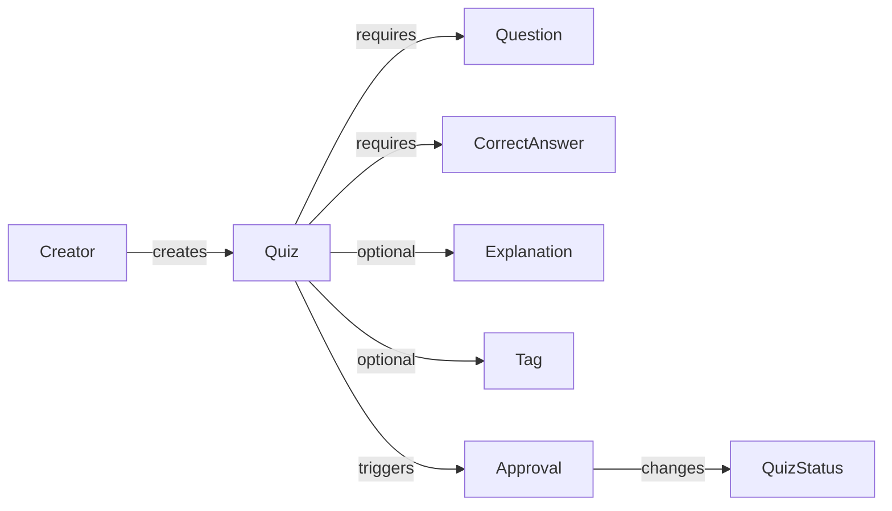
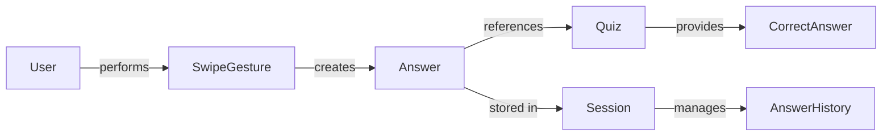
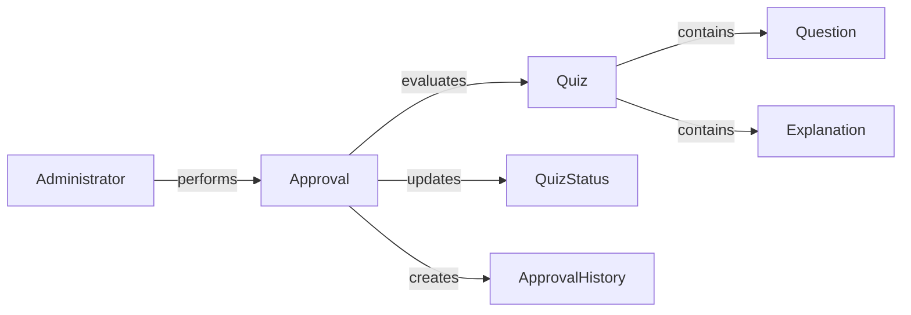
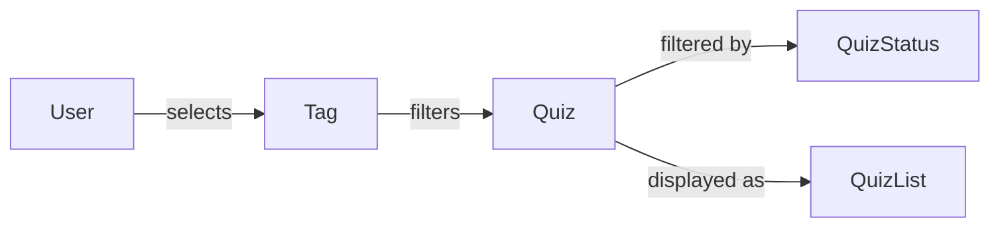
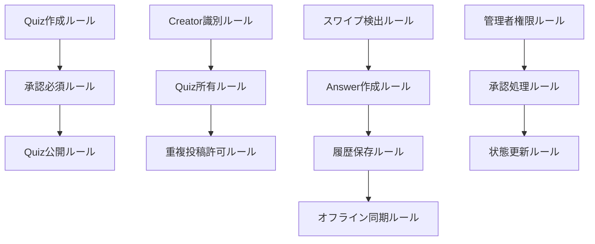

# 案1: 振る舞い・責任マトリックス型

## フォーマット概要

ドメインオブジェクトの振る舞い・責任・関係性を中心とした分析手法。各ドメインが「何をするか」「何に責任を持つか」「他とどう関係するか」をマトリックス形式で整理し、ビジネスロジックの所在を明確化。

## 構成

```markdown
# ドメインオブジェクト抽出・分析

## ドメイン概念抽出
### specifications分析からの概念抽出
### 名詞・動詞・形容詞の分類

## 振る舞い・責任分析マトリックス
| ドメイン | 主要振る舞い | ビジネス責任 | 関連するユースケース | 他ドメインとの関係 |
|----------|-------------|-------------|-------------------|------------------|

## ユースケース-ドメイン関係図
### ユースケース別の関与ドメイン
### ドメイン間の協調パターン

## ビジネスルール所在マップ
### ドメイン別ビジネスルール
### ルール間の依存関係
```

## サンプル実装

```markdown
# ドメインオブジェクト抽出・分析

## ドメイン概念抽出

### specifications分析からの概念抽出
**情報源**: user-stories, requirements, success-scenarios

| 抽出元 | 発見概念 | 品詞分類 | 初期理解 |
|--------|----------|----------|----------|
| user-story-quiz.md#L11 | クイズ | 名詞 | ◯×形式の問題 |
| user-story-quiz.md#L5 | 匿名ユーザー | 名詞 | ログイン不要のユーザー |
| user-story-quiz.md#L6 | 管理者 | 名詞 | 承認権限を持つユーザー |
| requirements-quiz.md#L11 | 問題文 | 名詞 | 500文字以内のテキスト |
| requirements-quiz.md#L20 | 承認 | 名詞/動詞 | 管理者による可否判定 |
| success-quiz.md#L15 | 右スワイプ | 動詞 | ◯選択の操作 |
| success-quiz.md#L24 | 回答履歴 | 名詞 | ユーザーの過去回答記録 |

### 名詞・動詞・形容詞の分類
**ドメインオブジェクト候補**:
- **名詞系**: Quiz, User, Creator, Administrator, Question, Answer, Tag, History
- **動詞系**: Submit, Approve, Answer, Swipe, Sync, Filter
- **形容詞系**: Anonymous, Approved, Pending, Correct, Offline

## 振る舞い・責任分析マトリックス

| ドメイン | 主要振る舞い | ビジネス責任 | 関連するユースケース | 他ドメインとの関係 |
|----------|-------------|-------------|-------------------|------------------|
| **Quiz** | • 問題を提示する<br>• 回答を受け取る<br>• 正誤を判定する<br>• 承認状態を管理する | • 問題の整合性保証<br>• 回答の正誤判定<br>• 承認フローの状態管理<br>• コンテンツ品質の維持 | • クイズ投稿<br>• クイズ回答<br>• クイズ承認<br>• 履歴確認 | Creator(作成関係)<br>Answer(回答関係)<br>Approval(承認関係)<br>Tag(分類関係) |
| **Creator** | • クイズを作成する<br>• 匿名識別を管理する<br>• 投稿権限を持つ | • 匿名性の保持<br>• クイズ品質の確保<br>• 重複投稿の管理<br>• 作成者の識別 | • クイズ投稿<br>• 作成者識別<br>• 重複投稿許可 | Quiz(作成関係)<br>CreatorId(識別関係)<br>Session(セッション関係) |
| **Answer** | • 回答を記録する<br>• 正誤を保存する<br>• 履歴を管理する<br>• 統計を提供する | • 回答の正確な記録<br>• 履歴の永続化<br>• プライバシー保護<br>• 学習進捗の追跡 | • クイズ回答<br>• 履歴確認<br>• 統計表示<br>• オフライン同期 | Quiz(回答対象)<br>User(回答者)<br>Session(セッション関係) |
| **Approval** | • 承認判定を行う<br>• 承認状態を変更する<br>• 拒否理由を記録する<br>• 承認履歴を管理する | • 品質管理<br>• 不適切コンテンツ排除<br>• 承認基準の適用<br>• 透明性の確保 | • クイズ承認<br>• 承認拒否<br>• 承認履歴確認 | Quiz(承認対象)<br>Administrator(承認者)<br>ApprovalHistory(履歴関係) |
| **Tag** | • クイズを分類する<br>• 検索を支援する<br>• 絞り込みを可能にする | • 分類の一貫性<br>• 検索性の向上<br>• ユーザビリティ向上 | • タグ設定<br>• タグ絞り込み<br>• タグ検索 | Quiz(分類関係)<br>Filter(絞り込み関係) |
| **Session** | • ユーザーセッションを管理する<br>• オフライン状態を追跡する<br>• 同期処理を制御する | • セッション継続性<br>• オフライン対応<br>• データ整合性<br>• 匿名ユーザー識別 | • セッション開始<br>• オフライン利用<br>• データ同期 | Creator(識別関係)<br>Answer(セッション関係)<br>Sync(同期関係) |
| **SwipeGesture** | • スワイプ操作を検出する<br>• 回答に変換する<br>• UI反応を制御する | • 直感的操作の実現<br>• 操作の正確な検出<br>• UX品質の保証 | • スワイプ回答<br>• UI操作 | Answer(回答関係)<br>UI(表示関係) |

## ユースケース-ドメイン関係図

### ユースケース別の関与ドメイン

#### UC1: クイズ投稿

**関与ドメイン**: Creator, Quiz, Question, CorrectAnswer, Explanation, Tag, Approval, QuizStatus

#### UC2: クイズ回答

**関与ドメイン**: User, SwipeGesture, Answer, Quiz, CorrectAnswer, Session, AnswerHistory

#### UC3: クイズ承認

**関与ドメイン**: Administrator, Approval, Quiz, Question, Explanation, QuizStatus, ApprovalHistory

#### UC4: タグ絞り込み

**関与ドメイン**: User, Tag, Quiz, QuizStatus, QuizList

### ドメイン間の協調パターン

#### パターン1: 作成-承認フロー
```
Creator → Quiz → Approval → QuizStatus → PublicAccess
```
- Creator がQuizを作成
- Quiz がApprovalを要求
- Approval がQuizStatusを更新
- QuizStatus が公開可否を決定

#### パターン2: 回答-記録フロー
```
User → SwipeGesture → Answer → Quiz → Session → AnswerHistory
```
- User がSwipeGestureを実行
- SwipeGesture がAnswerを生成
- Answer がQuizを参照して正誤判定
- Session がAnswerHistoryに記録

#### パターン3: 検索-絞り込みフロー
```
User → Tag → Filter → Quiz → QuizStatus → ResultSet
```
- User がTagを選択
- Tag がFilterを適用
- Filter がQuiz集合を絞り込み
- QuizStatus が公開状態をチェック
- ResultSet として結果を返却

## ビジネスルール所在マップ

### ドメイン別ビジネスルール

#### Quiz（クイズ）
**所有するビジネスルール**:
1. **問題文制約**: 500文字以内、HTMLサニタイズ必須
2. **解説制約**: 1000文字以内、任意項目
3. **正解形式**: ◯×の2択のみ
4. **承認必須**: 管理者承認後のみ公開
5. **重複許可**: 同一作成者・同一問題でも投稿可能

**根拠**: requirements-quiz.md#L10-L16, L20

#### Creator（作成者）
**所有するビジネスルール**:
1. **匿名識別**: salt付きハッシュによる識別
2. **ログイン不要**: 個人情報収集なし
3. **デバイス識別**: ブラウザローカルストレージ使用
4. **作成権限**: すべての匿名ユーザーが作成可能

**根拠**: requirements-quiz.md#L22, user-story-quiz.md#L5

#### Answer（回答）
**所有するビジネスルール**:
1. **履歴永続化**: indexedDBでの永続保存
2. **オフライン対応**: ネットワーク断線時も動作継続
3. **同期処理**: オンライン復旧時の自動同期
4. **プライバシー**: 匿名での履歴管理

**根拠**: success-quiz.md#L24, requirements-quiz.md#L35

#### Approval（承認）
**所有するビジネスルール**:
1. **管理者権限**: 管理者のみ承認・拒否可能
2. **個別判定**: クイズごとの個別審査
3. **承認基準**: 内容適切性チェック（詳細要確認）
4. **拒否理由**: 拒否時の理由記録

**根拠**: requirements-quiz.md#L20-L21

#### SwipeGesture（スワイプ操作）
**所有するビジネスルール**:
1. **Tinder UI**: 右スワイプ=◯、左スワイプ=×
2. **操作閾値**: 一定距離以上のスワイプで有効
3. **即座実行**: スワイプ完了と同時に回答確定
4. **モバイル専用**: タッチデバイスでのみ動作

**根拠**: requirements-quiz.md#L41, user-story-quiz.md#L23

### ルール間の依存関係

#### 依存関係マップ


#### 重要な制約関係
1. **Quiz → Approval**: Quiz作成は必ずApproval待ち状態で開始
2. **Creator → Quiz**: 匿名Creatorでも制限なくQuiz作成可能
3. **Answer → Quiz**: 承認済みQuizのみ回答対象
4. **SwipeGesture → Answer**: スワイプ操作のみがAnswer作成トリガー

### ビジネス価値との対応

| ドメイン | ビジネス価値 | 価値実現の責任 |
|----------|-------------|--------------|
| **Quiz** | 学習効果の最大化 | 問題品質の保証、適切な難易度設定 |
| **Creator** | 参加障壁の最小化 | 匿名性確保、簡単な投稿プロセス |
| **Answer** | 学習継続性の確保 | 履歴管理、オフライン対応 |
| **Approval** | コンテンツ品質の保証 | 不適切内容の排除、品質基準の維持 |
| **SwipeGesture** | 操作体験の向上 | 直感的操作、高速回答 |

## 実装への示唆

### 集約設計の方向性
1. **Quiz集約**: Quiz + Question + CorrectAnswer + Explanation + Tag
2. **LearningSession集約**: Answer + AnswerHistory + Session
3. **Approval集約**: Approval + ApprovalHistory + QuizStatus

### ドメインサービス候補
1. **QuizApprovalService**: 承認処理の複雑なロジック
2. **CreatorIdentificationService**: 匿名作成者の識別・管理
3. **AnswerSyncService**: オフライン-オンライン間の同期処理

### リポジトリ設計指針
1. **QuizRepository**: 承認状態による検索、タグ絞り込み
2. **AnswerRepository**: セッション単位、履歴管理
3. **ApprovalRepository**: 承認待ち一覧、承認履歴
```

## 利点・欠点

### 利点
- ✅ **ビジネス中心**: 振る舞い・責任からドメインを特定
- ✅ **関係性明確**: ドメイン間の協調パターンが可視化
- ✅ **実装指針**: 集約・サービス設計への具体的示唆
- ✅ **価値対応**: ビジネス価値とドメイン責任の対応明確

### 欠点
- ❌ **分析負荷**: 振る舞い・責任の詳細分析が必要
- ❌ **文書量**: 包括的な分析で文書が肥大化
- ❌ **更新コスト**: ビジネスルール変更時の影響範囲大

## 適用場面
- ビジネスロジックが複雑なドメイン
- ドメイン間の関係性が重要な場合
- 実装設計への具体的指針が必要
- ビジネス価値とドメイン設計の対応を重視