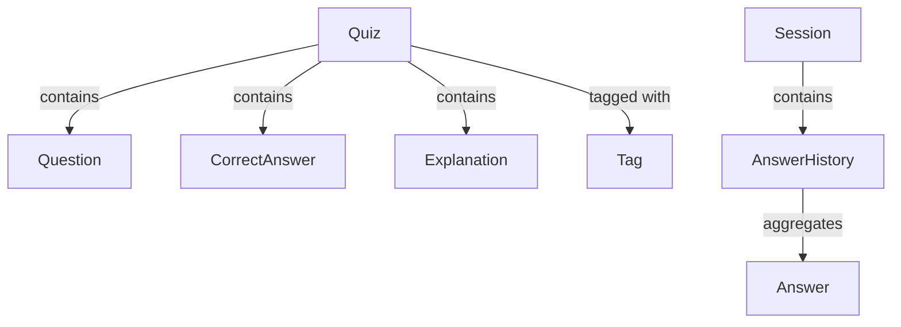
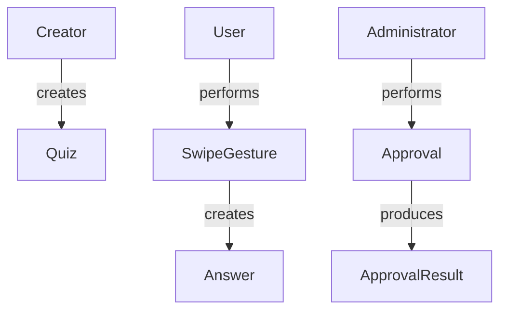
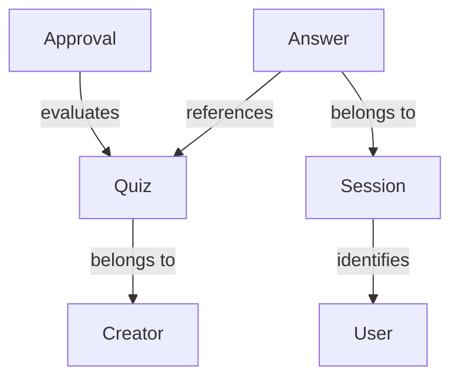
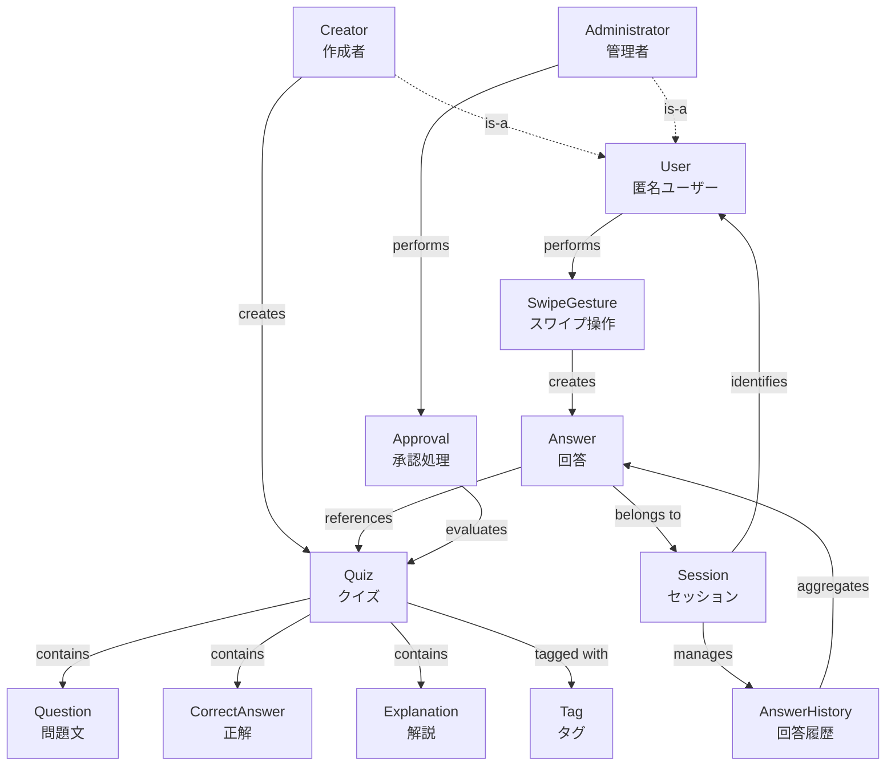
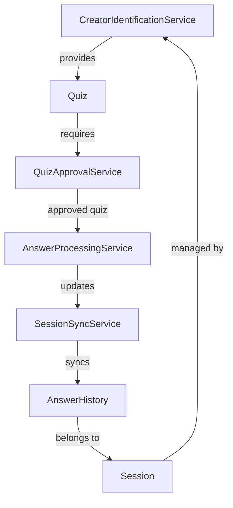

# 案3: 概念マップ型

## フォーマット概要

ドメイン概念を中心に置き、概念間の関係性（is-a, has-a, uses, creates等）をマップ形式で可視化してドメインモデルを構築。概念の階層構造と依存関係を明確化し、関係性から自然なドメインサービス候補を特定。

## 構成

```markdown
# ドメインオブジェクト抽出・分析（概念マップ型）

## 概念抽出
### specifications分析からの概念リストアップ
### 概念の初期分類（エンティティ候補・値オブジェクト候補・サービス候補）

## 概念関係マップ
### 関係性の分類（包含・参照・作成・使用・継承等）
### Mermaid図による関係性可視化

## 概念階層分析
### 抽象度レベル別の概念整理
### 概念の依存方向・制御フロー

## ビジネスルール帰属分析
### 概念別の責任・制約の特定
### 関係性から見えるドメインサービス候補

## ドメインサービス抽出
### 概念間協調が必要な処理の特定
### サービス候補の責任・インターフェース設計
```

## サンプル実装

```markdown
# ドメインオブジェクト抽出・分析（概念マップ型）

## 概念抽出

### specifications分析からの概念リストアップ
**分析対象**: user-stories, requirements, success-scenarios

| 概念名 | 発見箇所 | 初期理解 | 関係性ヒント | 抽象度 |
|--------|----------|----------|-------------|--------|
| **Quiz** | user-story#L11 | ◯×形式の問題 | 作成者・回答者・承認者と関係 | 🔴 高 |
| **Question** | requirements#L11 | 500文字以内の問題文 | Quizに包含される | 🟡 中 |
| **Creator** | user-story#L18 | クイズ作成者 | Quizを作成する | 🔴 高 |
| **User** | user-story#L5 | 匿名ユーザー | Quizに回答する | 🔴 高 |
| **Administrator** | user-story#L6 | 管理者 | Quizを承認する | 🔴 高 |
| **Answer** | success#L20 | ユーザーの回答 | Quiz・Userと関係 | 🔴 高 |
| **CorrectAnswer** | requirements#L12 | ◯×の正解 | Quizに包含、Answerと比較 | 🟡 中 |
| **Explanation** | requirements#L13 | 解説文 | Quizに包含 | 🟡 中 |
| **Tag** | requirements#L14 | 分類ラベル | Quizと多対多関係 | 🟡 中 |
| **Approval** | requirements#L20 | 承認処理 | Quiz・Administratorが関与 | 🟢 低 |
| **SwipeGesture** | success#L15 | スワイプ操作 | Answerを作成する | 🟢 低 |
| **AnswerHistory** | success#L24 | 回答履歴 | Answerを集約 | 🟡 中 |
| **Session** | success#L70 | ユーザーセッション | User・Answerを管理 | 🟡 中 |

### 概念の初期分類
**エンティティ候補** (高抽象度・独立性あり):
- Quiz, Creator, User, Administrator, Answer, Session

**値オブジェクト候補** (中抽象度・包含関係):
- Question, CorrectAnswer, Explanation, Tag

**サービス候補** (低抽象度・処理中心):
- Approval, SwipeGesture, AnswerHistory（集約候補でもある）

## 概念関係マップ

### 関係性の分類

#### 包含関係 (has-a / contains)


#### 作成関係 (creates / produces)


#### 参照関係 (references / uses)


#### 継承関係 (is-a)

```mermaid
graph TD
    Creator -.->|is-a| User
    Administrator -.->|is-a| User
    
    %% 値オブジェクトã®å‹éšå±¤
    TextContent -.->|specialized by| Question
    TextContent -.->|specialized by| Explanation
    Identifier -.->|specialized by| CreatorId
    Identifier -.->|specialized by| QuizId
```


### 統合概念関係マップ


## 概念階層分析

### 抽象度レベル別の概念整理

#### Level 3: 高抽象度（ビジネス概念・エンティティ）
| 概念 | 責任 | 独立性 | ライフサイクル |
|------|------|--------|---------------|
| **Quiz** | 問題提示・正誤判定・状態管理 | ✅ 高 | 投稿→承認→公開→削除 |
| **User** | システム利用・操作実行 | ✅ 高 | アクセス→操作→離脱 |
| **Creator** | クイズ作成・投稿 | ✅ 高 | 識別→作成→投稿継続 |
| **Administrator** | システム管理・承認処理 | ✅ 高 | ログイン→承認業務→ログアウト |
| **Answer** | 回答記録・統計生成 | ✅ 高 | 作成→記録→統計集約 |
| **Session** | セッション管理・識別 | ✅ 高 | 開始→継続→終了・同期 |

#### Level 2: 中抽象度（値オブジェクト・集約コンポーネント）
| 概念 | 責任 | 親エンティティ | バリデーション |
|------|------|-------------|---------------|
| **Question** | 問題文表現・制約保証 | Quiz | 500文字制限・サニタイズ |
| **CorrectAnswer** | 正解表現・比較処理 | Quiz | ◯×の2択制約 |
| **Explanation** | 解説表現・表示制御 | Quiz | 1000文字制限・任意 |
| **Tag** | 分類表現・検索支援 | Quiz（多対多） | 正規化・重複排除 |
| **AnswerHistory** | 履歴管理・統計計算 | Session | 永続化・プライバシー |

#### Level 1: 低抽象度（サービス・操作・UI）
| 概念 | 責任 | トリガー | 結果 |
|------|------|----------|------|
| **SwipeGesture** | スワイプ検出・回答変換 | ユーザー操作 | Answer生成 |
| **Approval** | 承認判定・状態変更 | 管理者操作 | Quiz状態更新 |
| **Filter** | 絞り込み処理・結果生成 | 検索要求 | 絞り込み結果 |
| **Sync** | オフライン同期・整合性保証 | ネットワーク復旧 | データ統合 |

### 概念の依存方向・制御フロー

#### 依存方向（上位→下位）
```
Level 3 (エンティティ) → Level 2 (値オブジェクト) → Level 1 (サービス・操作)
```

#### 制御フロー例（クイズ回答）
```
User → SwipeGesture → Answer → Quiz → CorrectAnswer → Session → AnswerHistory
```

**制御の流れ**:
1. User（L3）がSwipeGesture（L1）を実行
2. SwipeGestureがAnswer（L3）を生成
3. AnswerがQuiz（L3）のCorrectAnswer（L2）と比較
4. 結果がSession（L3）のAnswerHistory（L2）に記録

## ビジネスルール帰属分析

### 概念別の責任・制約の特定

#### Quiz（クイズ）
**所有ビジネスルール**:
- **内容制約**: Question(500文字)、Explanation(1000文字)
- **形式制約**: CorrectAnswer(◯×のみ)
- **品質制約**: 承認必須、サニタイズ処理
- **公開制約**: 承認済みのみ回答可能

**関係性から導出される責任**:
- Creator → Quiz: 作成者の投稿権限管理
- Quiz → Tag: 分類整合性の保証
- Quiz → Answer: 回答可能状態の制御

#### Answer（回答）
**所有ビジネスルール**:
- **記録制約**: 必須項目（Quiz参照、正誤、時刻）
- **履歴制約**: 永続化、プライバシー保護
- **統計制約**: 集計可能性、匿名性

**関係性から導出される責任**:
- SwipeGesture → Answer: 操作の正確な変換
- Answer → Quiz: 承認済みクイズのみ回答
- Answer → Session: セッション整合性保証

#### Session（セッション）
**所有ビジネスルール**:
- **識別制約**: 匿名ユーザーの一意識別
- **継続制約**: オフライン継続、自動同期
- **履歴制約**: 回答履歴の集約管理

**関係性から導出される責任**:
- User → Session: 匿名識別の信頼性
- Session → AnswerHistory: 履歴完全性保証
- Session → Sync: 同期タイミング制御

### 関係性から見えるドメインサービス候補

#### 概念間協調パターンからの抽出

##### パターン1: Quiz作成-承認協調
```
Creator → Quiz → Approval → Administrator
```
**抽出されるサービス**: `QuizApprovalService`
- 責任: 承認フロー制御、承認基準適用、状態遷移管理
- 協調する概念: Quiz, Approval, Administrator, ApprovalHistory

##### パターン2: 回答-判定-記録協調
```
SwipeGesture → Answer → Quiz → Session
```
**抽出されるサービス**: `AnswerProcessingService`
- 責任: 回答処理、正誤判定、履歴記録、統計更新
- 協調する概念: SwipeGesture, Answer, Quiz, Session, AnswerHistory

##### パターン3: セッション-同期協調
```
Session → AnswerHistory → Sync → RemoteStorage
```
**抽出されるサービス**: `SessionSyncService`
- 責任: オフライン-オンライン同期、データ整合性、競合解決
- 協調する概念: Session, AnswerHistory, OfflineStorage, RemoteStorage

## ドメインサービス抽出

### 概念間協調が必要な処理の特定

#### 1. QuizApprovalService（クイズ承認サービス）
**協調する概念**:
- Quiz: 承認対象の取得・状態更新
- Administrator: 承認者の権限確認
- ApprovalCriteria: 承認基準の適用
- ApprovalHistory: 承認履歴の記録

**責任**:
```typescript
interface QuizApprovalService {
  // 承認基準チェック
  checkApprovalCriteria(quiz: Quiz): ApprovalCriteria;
  
  // 承認実行
  approveQuiz(quizId: QuizId, administrator: Administrator, reason?: string): ApprovalResult;
  
  // 承認拒否
  rejectQuiz(quizId: QuizId, administrator: Administrator, reason: string): ApprovalResult;
  
  // 承認履歴取得
  getApprovalHistory(quizId: QuizId): ApprovalHistory[];
}
```

#### 2. AnswerProcessingService（回答処理サービス）
**協調する概念**:
- SwipeGesture: 操作の解釈・変換
- Answer: 回答オブジェクトの生成
- Quiz: 正誤判定の実行
- Session: 履歴への記録
- Statistics: 統計情報の更新

**責任**:
```typescript
interface AnswerProcessingService {
  // スワイプ操作から回答処理
  processSwipeAnswer(gesture: SwipeGesture, quiz: Quiz, session: Session): AnswerResult;
  
  // 正誤判定実行
  judgeAnswer(userAnswer: boolean, quiz: Quiz): JudgmentResult;
  
  // 履歴記録
  recordAnswer(answer: Answer, session: Session): void;
  
  // 統計更新
  updateStatistics(session: Session): Statistics;
}
```

#### 3. CreatorIdentificationService（作成者識別サービス）
**協調する概念**:
- Creator: 作成者の識別・管理
- CreatorId: ハッシュ生成・検証
- Session: デバイス識別情報
- Quiz: 作成者との紐付け

**責任**:
```typescript
interface CreatorIdentificationService {
  // 作成者識別情報生成
  generateCreatorId(deviceInfo: DeviceInfo): CreatorId;
  
  // 作成者の検証
  verifyCreator(creatorId: CreatorId): boolean;
  
  // 匿名性の保証
  ensureAnonymity(creator: Creator): void;
  
  // 重複投稿の許可判定
  allowDuplicateSubmission(creator: Creator, quiz: Quiz): boolean;
}
```

#### 4. SessionSyncService（セッション同期サービス）
**協調する概念**:
- Session: 同期対象セッション
- AnswerHistory: 同期対象履歴
- OfflineStorage: ローカルデータ
- RemoteStorage: サーバーデータ
- ConflictResolver: 競合解決

**責任**:
```typescript
interface SessionSyncService {
  // オフライン検出
  detectOfflineMode(): boolean;
  
  // データ同期実行
  syncSession(session: Session): SyncResult;
  
  // 競合解決
  resolveConflicts(localData: AnswerHistory, remoteData: AnswerHistory): AnswerHistory;
  
  // 同期状態管理
  getSyncStatus(session: Session): SyncStatus;
}
```

### サービス候補の責任・インターフェース設計

#### サービス間の協調関係


#### 集約境界への影響
**サービス設計から見える集約境界**:

1. **Quiz集約**: Quiz + Question + CorrectAnswer + Explanation + Tag
   - サービス: QuizApprovalService（外部サービス）
   
2. **LearningSession集約**: Session + AnswerHistory + Answer
   - サービス: AnswerProcessingService, SessionSyncService（集約内サービス）
   
3. **Identity集約**: Creator + CreatorId
   - サービス: CreatorIdentificationService（集約内サービス）

## 実装への示唆

### 概念マップから導出される設計原則

#### 1. 依存関係の方向性
- 高抽象度 → 低抽象度の依存のみ許可
- 同一抽象度での循環依存の回避
- ドメインサービスによる概念間協調の実現

#### 2. 責任分散の原則
- 各概念は単一責任を持つ
- 協調が必要な処理はドメインサービスに委譲
- 概念間の直接的な複雑な相互作用を避ける

#### 3. 関係性の最小化
- 必要最小限の関係性のみ保持
- 一時的な関係は参照渡しで実現
- 永続的な関係のみ集約内に包含

### TypeScript実装指針

#### 概念の型表現
```typescript
// 高抽象度エンティティ
interface Quiz {
  readonly id: QuizId;
  readonly question: Question;
  readonly correctAnswer: CorrectAnswer;
  readonly explanation?: Explanation;
  readonly tags: Tag[];
  readonly creator: CreatorId;
  status: QuizStatus;
}

// 中抽象度値オブジェクト
interface Question {
  readonly text: string;
  validate(): ValidationResult;
  sanitize(): Question;
}

// 低抽象度サービス
interface SwipeGestureHandler {
  detect(touchEvent: TouchEvent): SwipeGesture;
  interpret(gesture: SwipeGesture): boolean; // true=◯, false=×
}
```

#### 関係性の実装
```typescript
// 包含関係（集約内）
class Quiz {
  private readonly question: Question;
  private readonly correctAnswer: CorrectAnswer;
  
  public judge(userAnswer: boolean): boolean {
    return this.correctAnswer.equals(userAnswer);
  }
}

// 参照関係（集約間）
class Answer {
  constructor(
    private readonly quizId: QuizId,
    private readonly userAnswer: boolean,
    private readonly session: Session
  ) {}
}

// サービス関係（協調処理）
class AnswerProcessingService {
  process(gesture: SwipeGesture, quiz: Quiz, session: Session): AnswerResult {
    const userAnswer = this.gestureHandler.interpret(gesture);
    const isCorrect = quiz.judge(userAnswer);
    const answer = new Answer(quiz.id, userAnswer, session);
    
    return new AnswerResult(answer, isCorrect);
  }
}
```
```

## 利点・欠点

### 利点
- ✅ **関係性可視化**: 概念間の複雑な関係が直感的に理解可能
- ✅ **階層構造明確**: 抽象度レベルによる設計指針の提供
- ✅ **サービス自然抽出**: 概念間協調から自然なサービス候補導出
- ✅ **実装指針**: 依存関係・責任分散の具体的指針

### 欠点
- ❌ **図表作成負荷**: Mermaid図等の作成・メンテナンス工数
- ❌ **関係性過多**: 複雑なドメインでは関係性が複雑化
- ❌ **抽象化過度**: 概念の階層化による過度な抽象化リスク

## 適用場面
- ドメイン概念間の関係が複雑な場合
- 視覚的な理解・チーム共有を重視する場合
- ドメインサービスの責任設計を重要視する場合
- 段階的な実装順序の決定が必要な場合