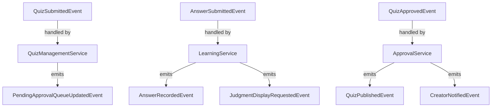
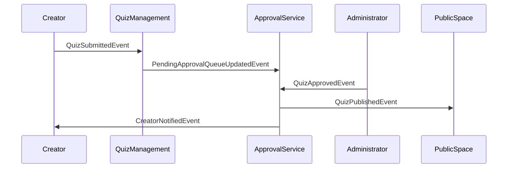
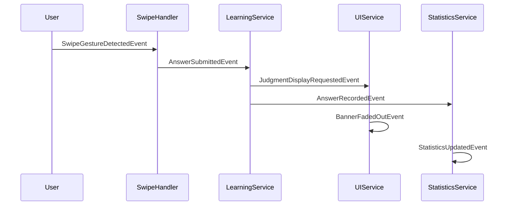
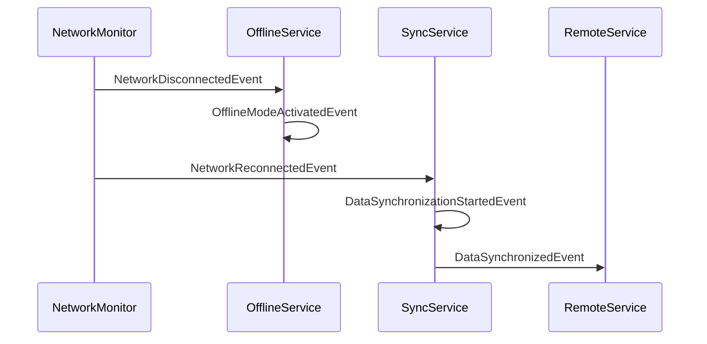

# 案4: イベント駆動分析型

## フォーマット概要

ドメインイベント（ビジネスで重要な出来事）を起点として、イベントを引き起こす・処理するドメインオブジェクトを特定。イベントの発生責任・処理責任・連鎖反応を分析し、イベントソーシング観点でのドメイン設計を行う。

## 構成

```markdown
# ドメインオブジェクト抽出・分析（イベント駆動）

## ドメインイベント洗い出し
### specifications分析からのイベント抽出
### イベントの分類（ビジネスイベント・システムイベント・UIイベント）

## イベント発生責任分析
### イベント発生源の特定
### 発生条件・タイミングの分析

## イベント処理責任分析
### イベント処理者の特定
### 処理内容・副作用の分析

## イベントチェーン分析
### イベント間の因果関係
### 連鎖反応パターンの特定

## ドメインオブジェクト抽出
### イベント中心から見たドメインオブジェクト
### イベントハンドラー・エミッター設計
```

## サンプル実装

```markdown
# ドメインオブジェクト抽出・分析（イベント駆動）

## ドメインイベント洗い出し

### specifications分析からのイベント抽出
**分析対象**: user-stories, requirements, success-scenarios

| イベント名 | 発見箇所 | イベント内容 | ビジネス影響 | 分類 |
|------------|----------|-------------|-------------|------|
| **QuizSubmitted** | success#L35 | ユーザーがクイズを投稿した | コンテンツ増加 | 🔴 ビジネス |
| **QuizApproved** | requirements#L20 | 管理者がクイズを承認した | 公開コンテンツ増加 | 🔴 ビジネス |
| **QuizRejected** | requirements#L21 | 管理者がクイズを拒否した | 品質管理 | 🔴 ビジネス |
| **AnswerSubmitted** | success#L15 | ユーザーがクイズに回答した | 学習進捗更新 | 🔴 ビジネス |
| **CorrectAnswerGiven** | success#L16 | ユーザーが正解した | 学習成果向上 | 🔴 ビジネス |
| **IncorrectAnswerGiven** | success#L16 | ユーザーが不正解した | 学習機会提供 | 🔴 ビジネス |
| **SwipeGestureDetected** | success#L15 | スワイプ操作が検出された | UI反応開始 | 🟡 システム |
| **JudgmentDisplayed** | success#L16 | 正誤判定が表示された | UI状態変更 | 🟡 システム |
| **SessionStarted** | success#L7 | ユーザーセッション開始 | セッション管理開始 | 🟡 システム |
| **OfflineModeActivated** | success#L76 | オフラインモード移行 | 可用性確保 | 🟡 システム |
| **DataSynchronized** | success#L84 | データ同期完了 | 整合性確保 | 🟡 システム |
| **TagSelected** | success#L13 | タグが選択された | フィルター適用 | 🟢 UI |
| **BannerFadedOut** | success#L17 | バナーがフェードアウト | UI遷移完了 | 🟢 UI |

### イベントの分類

#### ビジネスイベント（ドメインの核心）
- **QuizSubmitted**: クイズ投稿（コンテンツ供給）
- **QuizApproved**: クイズ承認（品質保証）
- **AnswerSubmitted**: 回答提出（学習行動）
- **CorrectAnswerGiven**: 正解獲得（学習成果）

#### システムイベント（技術実装）
- **SessionStarted**: セッション管理
- **OfflineModeActivated**: 可用性制御
- **DataSynchronized**: データ整合性

#### UIイベント（ユーザー体験）
- **SwipeGestureDetected**: 操作検出
- **JudgmentDisplayed**: フィードバック表示
- **BannerFadedOut**: UI状態遷移

## イベント発生責任分析

### イベント発生源の特定

#### QuizSubmitted（クイズ投稿）
**発生源**: Creator（作成者）
**発生条件**:
- 必須項目入力完了（Question, CorrectAnswer）
- バリデーション通過（文字数制限、サニタイズ）
- 投稿ボタンクリック

**発生タイミング**: `Quiz.submit()` メソッド実行時
**発生場所**: `CreatorService.submitQuiz()`

**イベントデータ**:
```typescript
interface QuizSubmittedEvent {
  eventId: string;
  occurredAt: Date;
  quizId: QuizId;
  creatorId: CreatorId;
  quiz: {
    question: string;
    correctAnswer: boolean;
    explanation?: string;
    tags: string[];
  };
}
```

#### AnswerSubmitted（回答提出）
**発生源**: User（ユーザー）via SwipeGesture
**発生条件**:
- 承認済みクイズの存在
- 有効なスワイプ操作検出
- セッション有効性確認

**発生タイミング**: `SwipeGesture.complete()` 時
**発生場所**: `AnswerService.processSwipe()`

**イベントデータ**:
```typescript
interface AnswerSubmittedEvent {
  eventId: string;
  occurredAt: Date;
  answerId: AnswerId;
  quizId: QuizId;
  sessionId: SessionId;
  userAnswer: boolean;
  isCorrect: boolean;
  responseTime: number;
}
```

#### QuizApproved（クイズ承認）
**発生源**: Administrator（管理者）
**発生条件**:
- 管理者権限の確認
- 承認待ち状態のクイズ存在
- 承認基準の通過

**発生タイミング**: `Administrator.approve()` 実行時
**発生場所**: `ApprovalService.approveQuiz()`

**イベントデータ**:
```typescript
interface QuizApprovedEvent {
  eventId: string;
  occurredAt: Date;
  quizId: QuizId;
  administratorId: AdministratorId;
  approvalReason?: string;
  previousStatus: QuizStatus;
}
```

#### DataSynchronized（データ同期）
**発生源**: SyncService（同期サービス）
**発生条件**:
- オフラインからオンラインへの状態変化
- 同期対象データの存在
- ネットワーク接続の確認

**発生タイミング**: `SyncService.sync()` 完了時
**発生場所**: `OfflineSyncService.performSync()`

### 発生条件・タイミングの分析

#### イベント発生の前提条件マトリックス
| イベント | 必要なドメイン状態 | 外部条件 | 権限要件 |
|----------|------------------|-----------|----------|
| QuizSubmitted | Creator識別済み | 入力値有効 | なし（匿名可） |
| QuizApproved | Quiz=PendingApproval | 管理者ログイン | Administrator権限 |
| AnswerSubmitted | Quiz=Approved | ユーザーアクセス | なし（匿名可） |
| DataSynchronized | OfflineData存在 | ネットワーク接続 | セッション有効 |

## イベント処理責任分析

### イベント処理者の特定

#### QuizSubmittedEventHandler
**処理責任者**: `QuizManagementService`
**処理内容**:
1. Quiz エンティティの永続化
2. QuizStatus を 'PendingApproval' に設定
3. ApprovalQueue への追加
4. Creator への投稿完了通知

**副作用**:
- PendingApprovalQueueUpdated イベント発生
- CreatorNotified イベント発生

```typescript
class QuizSubmittedEventHandler {
  async handle(event: QuizSubmittedEvent): Promise<void> {
    // Quiz永続化
    const quiz = await this.quizRepository.save(event.quiz);
    
    // 承認キューに追加
    await this.approvalQueue.enqueue(quiz.id);
    
    // 後続イベント発行
    await this.eventBus.publish(new PendingApprovalQueueUpdatedEvent(quiz.id));
    await this.eventBus.publish(new CreatorNotifiedEvent(event.creatorId, 'SUBMITTED'));
  }
}
```

#### AnswerSubmittedEventHandler
**処理責任者**: `LearningService`
**処理内容**:
1. Answer エンティティの生成・保存
2. AnswerHistory への追加
3. Statistics の更新
4. UI フィードバックの表示制御

**副作用**:
- AnswerRecorded イベント発生
- StatisticsUpdated イベント発生
- JudgmentDisplayRequested イベント発生

```typescript
class AnswerSubmittedEventHandler {
  async handle(event: AnswerSubmittedEvent): Promise<void> {
    // Answer記録
    const answer = new Answer(event.answerId, event.quizId, event.userAnswer, event.isCorrect);
    await this.answerRepository.save(answer);
    
    // セッション更新
    const session = await this.sessionRepository.findById(event.sessionId);
    session.addAnswer(answer);
    await this.sessionRepository.save(session);
    
    // 後続イベント発行
    await this.eventBus.publish(new AnswerRecordedEvent(answer));
    await this.eventBus.publish(new JudgmentDisplayRequestedEvent(event.isCorrect));
  }
}
```

#### QuizApprovedEventHandler
**処理責任者**: `ApprovalService`
**処理内容**:
1. Quiz.status を 'Approved' に更新
2. PublicQuizList への追加
3. ApprovalHistory の記録
4. Creator への承認通知

**副作用**:
- QuizPublishedEvent イベント発生
- ApprovalHistoryUpdatedEvent イベント発生
- CreatorNotifiedEvent イベント発生

### 処理内容・副作用の分析

#### イベント処理の責任分散


## イベントチェーン分析

### イベント間の因果関係

#### 主要イベントチェーン1: クイズ投稿-承認-公開


**チェーンの説明**:
1. Creator が QuizSubmittedEvent を発生
2. QuizManagementService が処理し PendingApprovalQueueUpdatedEvent を発行
3. Administrator が手動で QuizApprovedEvent を発生
4. ApprovalService が処理し QuizPublishedEvent + CreatorNotifiedEvent を発行

#### 主要イベントチェーン2: 回答-判定-記録-統計更新


#### 主要イベントチェーン3: オフライン-オンライン-同期


### 連鎖反応パターンの特定

#### パターン1: 成功チェーン（Happy Path）
```
UserAction → BusinessEvent → ProcessedEvent → NotificationEvent → UIUpdateEvent
```
**例**: SwipeGesture → AnswerSubmitted → AnswerRecorded → StatisticsUpdated → JudgmentDisplayed

#### パターン2: 承認チェーン（Approval Flow）
```
SubmissionEvent → QueueEvent → ApprovalEvent → PublishEvent → NotificationEvent
```
**例**: QuizSubmitted → PendingApprovalQueued → QuizApproved → QuizPublished → CreatorNotified

#### パターン3: エラー・補償チェーン（Error Handling）
```
FailureEvent → CompensationEvent → RetryEvent → RecoveryEvent
```
**例**: SyncFailed → OfflineActivated → RetryScheduled → DataSynchronized

#### パターン4: 状態遷移チェーン（State Transition）
```
StateChangeEvent → ValidationEvent → TransitionEvent → SideEffectEvent
```
**例**: QuizStatusChanged → BusinessRuleValidated → StatusTransitioned → CacheInvalidated

## ドメインオブジェクト抽出

### イベント中心から見たドメインオブジェクト

#### 1. イベント発生源オブジェクト（Event Emitters）
| オブジェクト | 発生イベント | 発生責任 | ビジネス価値 |
|-------------|-------------|----------|-------------|
| **Quiz** | QuizSubmitted, QuizApproved, QuizRejected | 投稿・承認状態管理 | コンテンツ品質保証 |
| **Answer** | AnswerSubmitted, AnswerRecorded | 回答記録・統計提供 | 学習進捗追跡 |
| **Session** | SessionStarted, SessionEnded, DataSynced | セッション管理・同期制御 | ユーザー体験継続 |
| **SwipeGesture** | SwipeDetected, SwipeInterpreted | 操作検出・解釈 | 直感的UI実現 |

#### 2. イベント処理オブジェクト（Event Handlers）
| オブジェクト | 処理イベント | 処理責任 | 協調オブジェクト |
|-------------|-------------|----------|----------------|
| **QuizManagementService** | QuizSubmitted | Quiz永続化・キュー管理 | Quiz, ApprovalQueue |
| **LearningService** | AnswerSubmitted | 学習記録・統計更新 | Answer, Session, Statistics |
| **ApprovalService** | QuizApproved/Rejected | 承認処理・通知 | Quiz, Administrator, Notification |
| **SyncService** | NetworkReconnected | データ同期・整合性確保 | Session, OfflineStorage, RemoteStorage |

#### 3. イベント媒介オブジェクト（Event Mediators）
| オブジェクト | 媒介役割 | 関与イベント | 制御責任 |
|-------------|----------|-------------|----------|
| **EventBus** | イベント配信・ルーティング | 全イベント | 配信保証・順序制御 |
| **ApprovalQueue** | 承認順序管理 | QuizSubmitted → QuizApproved | 承認待ち管理・優先度制御 |
| **StateMachine** | 状態遷移制御 | Status変更系イベント | 状態遷移規則・不正遷移防止 |
| **NotificationService** | 通知配信 | 通知系イベント | 通知方式・配信制御 |

### イベントハンドラー・エミッター設計

#### Event-Driven Architecture の実装パターン

##### 1. ドメインイベント定義
```typescript
abstract class DomainEvent {
  public readonly eventId: string;
  public readonly occurredAt: Date;
  public readonly aggregateId: string;
  
  constructor(aggregateId: string) {
    this.eventId = generateEventId();
    this.occurredAt = new Date();
    this.aggregateId = aggregateId;
  }
}

class QuizSubmittedEvent extends DomainEvent {
  constructor(
    public readonly quizId: QuizId,
    public readonly creatorId: CreatorId,
    public readonly quizData: QuizData
  ) {
    super(quizId);
  }
}
```

##### 2. イベント発生源（Aggregate Root）
```typescript
abstract class AggregateRoot {
  private uncommittedEvents: DomainEvent[] = [];
  
  protected emitEvent(event: DomainEvent): void {
    this.uncommittedEvents.push(event);
  }
  
  public getUncommittedEvents(): DomainEvent[] {
    return [...this.uncommittedEvents];
  }
  
  public markEventsAsCommitted(): void {
    this.uncommittedEvents = [];
  }
}

class Quiz extends AggregateRoot {
  public submit(): void {
    this.validateForSubmission();
    this.status = QuizStatus.PendingApproval;
    
    this.emitEvent(new QuizSubmittedEvent(
      this.id,
      this.creatorId,
      this.getQuizData()
    ));
  }
  
  public approve(administrator: Administrator): void {
    this.requiresPendingStatus();
    this.status = QuizStatus.Approved;
    
    this.emitEvent(new QuizApprovedEvent(
      this.id,
      administrator.id,
      this.status
    ));
  }
}
```

##### 3. イベントハンドラー実装
```typescript
interface EventHandler<T extends DomainEvent> {
  handle(event: T): Promise<void>;
}

class QuizSubmittedEventHandler implements EventHandler<QuizSubmittedEvent> {
  constructor(
    private readonly approvalQueue: ApprovalQueue,
    private readonly notificationService: NotificationService,
    private readonly eventBus: EventBus
  ) {}
  
  async handle(event: QuizSubmittedEvent): Promise<void> {
    // 承認キューへの追加
    await this.approvalQueue.enqueue(event.quizId);
    
    // 作成者への通知
    await this.notificationService.notifyCreator(
      event.creatorId,
      'Quiz submitted successfully'
    );
    
    // 後続イベントの発行
    await this.eventBus.publish(
      new PendingApprovalQueueUpdatedEvent(event.quizId)
    );
  }
}
```

##### 4. イベントバス・調整機構
```typescript
class EventBus {
  private handlers: Map<string, EventHandler<any>[]> = new Map();
  
  public subscribe<T extends DomainEvent>(
    eventType: new (...args: any[]) => T,
    handler: EventHandler<T>
  ): void {
    const eventName = eventType.name;
    const handlers = this.handlers.get(eventName) || [];
    handlers.push(handler);
    this.handlers.set(eventName, handlers);
  }
  
  public async publish(event: DomainEvent): Promise<void> {
    const eventName = event.constructor.name;
    const handlers = this.handlers.get(eventName) || [];
    
    // 順次処理（順序保証）
    for (const handler of handlers) {
      await handler.handle(event);
    }
  }
}
```

##### 5. サーガ・長期実行プロセス
```typescript
class QuizApprovalSaga {
  constructor(private readonly eventBus: EventBus) {
    this.eventBus.subscribe(QuizSubmittedEvent, this.handleQuizSubmitted.bind(this));
    this.eventBus.subscribe(QuizApprovedEvent, this.handleQuizApproved.bind(this));
    this.eventBus.subscribe(QuizRejectedEvent, this.handleQuizRejected.bind(this));
  }
  
  private async handleQuizSubmitted(event: QuizSubmittedEvent): Promise<void> {
    // 承認プロセス開始
    const approvalProcess = new ApprovalProcess(event.quizId);
    await approvalProcess.start();
  }
  
  private async handleQuizApproved(event: QuizApprovedEvent): Promise<void> {
    // 承認完了処理
    await this.publishQuiz(event.quizId);
    await this.notifyCreator(event.quizId, 'APPROVED');
  }
  
  private async handleQuizRejected(event: QuizRejectedEvent): Promise<void> {
    // 拒否処理
    await this.notifyCreator(event.quizId, 'REJECTED');
    await this.recordRejectionReason(event.quizId, event.reason);
  }
}
```

## 実装への示唆

### Event-Driven Architecture の設計原則

#### 1. イベントファースト設計
- ビジネスイベントを最初に定義
- イベントからドメインオブジェクトの責任を導出
- イベントハンドリングによる疎結合実現

#### 2. イベントの分離原則
- **Command**: 状態変更要求（QuizSubmitCommand）
- **Event**: 発生した事実（QuizSubmittedEvent）
- **Query**: 現在状態の照会（GetQuizQuery）

#### 3. 整合性の段階的実現
- **即座整合性**: 同一集約内
- **結果整合性**: 集約間・イベント経由
- **補償処理**: エラー時の状態復旧

### イベントストア設計
```typescript
interface EventStore {
  save(aggregateId: string, events: DomainEvent[]): Promise<void>;
  getEvents(aggregateId: string): Promise<DomainEvent[]>;
  getEventsByType(eventType: string): Promise<DomainEvent[]>;
}

class Quiz extends AggregateRoot {
  public static fromHistory(events: DomainEvent[]): Quiz {
    const quiz = new Quiz();
    
    for (const event of events) {
      quiz.applyEvent(event);
    }
    
    quiz.markEventsAsCommitted();
    return quiz;
  }
  
  private applyEvent(event: DomainEvent): void {
    if (event instanceof QuizSubmittedEvent) {
      this.status = QuizStatus.PendingApproval;
      this.createdAt = event.occurredAt;
    } else if (event instanceof QuizApprovedEvent) {
      this.status = QuizStatus.Approved;
      this.approvedAt = event.occurredAt;
    }
  }
}
```

### プロジェクションとクエリモデル
```typescript
class QuizListProjection {
  constructor(private readonly eventBus: EventBus) {
    this.eventBus.subscribe(QuizApprovedEvent, this.handleQuizApproved.bind(this));
    this.eventBus.subscribe(QuizRejectedEvent, this.handleQuizRejected.bind(this));
  }
  
  private async handleQuizApproved(event: QuizApprovedEvent): Promise<void> {
    const quiz = await this.quizRepository.findById(event.quizId);
    
    await this.publicQuizListView.add({
      id: quiz.id,
      question: quiz.question.text,
      tags: quiz.tags.map(t => t.name),
      createdAt: quiz.createdAt,
      approvedAt: event.occurredAt
    });
  }
}
```
```

## 利点・欠点

### 利点
- ✅ **ビジネス中心**: ビジネスイベントからドメイン設計
- ✅ **疎結合**: イベント経由での間接的な協調
- ✅ **拡張性**: 新しいイベントハンドラーの追加が容易
- ✅ **監査性**: イベント履歴による完全な追跡可能性
- ✅ **復旧性**: イベントリプレイによる状態復元

### 欠点
- ❌ **複雑性**: イベント処理の非同期性・順序制御
- ❌ **デバッグ困難**: 分散した処理フローの追跡難
- ❌ **結果整合性**: 即座整合性が必要な場面での制約
- ❌ **学習コスト**: Event Sourcing・CQRS の理解が必要

## 適用場面
- ビジネスイベントが重要で追跡が必要な場合
- 非同期処理・結果整合性が許容される場合
- 拡張性・スケーラビリティを重視する場合
- 監査ログ・リプレイ機能が必要な場合
- マイクロサービス・分散システムでの利用