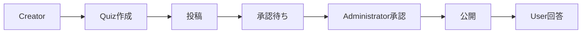

# 案5: 質問駆動反復型

## フォーマット概要

specifications分析から質問を生成し、質問への回答で理解を深めるサイクルを反復。不明点を構造化された質問として整理し、段階的に知識を蓄積してユビキタス言語を確立。

## 構成

```markdown
# ドメイン理解サイクル

## 反復サイクル概要
- サイクル期間: 1-2時間
- 1サイクル = 分析→質問生成→回答→理解更新
- 完了条件: 重要概念の理解度80%以上

## Iteration 1: 初期分析
### 分析対象
### 発見概念
### 生成質問
### 理解更新

## Iteration 2: 質問解決
### 前回からの継続
### 新規分析
### 生成質問
### 理解更新

## 最終成果物
### ユビキタス言語辞書
### ビジネスルール確定版
### 未解決事項
```

## サンプル実装

```markdown
# ドメイン理解サイクル - クイズアプリケーション

## 反復サイクル概要
- **サイクル期間**: 各1-2時間
- **1サイクル構成**: specifications分析 → 質問生成 → 回答 → 理解度更新
- **完了条件**: 核心概念（Quiz, Creator, Approval等）の理解度80%以上
- **情報源**: docs/project/specifications/

---

## 🔄 Iteration 1: 初期concepts発見 (9:00-10:30)

### 📖 分析対象
- **主要**: user-stories/user-story-quiz.md
- **補助**: requirements/requirements-quiz.md (概要のみ)

### 💡 発見概念
| 概念 | 初期理解 | エビデンス | 信頼度 |
|------|----------|------------|--------|
| **Quiz** | ◯×形式の問題 | user-story#L15 | 60% |
| **Anonymous User** | ログイン不要のユーザー | user-story#L8 | 70% |
| **Creator** | クイズを作る人 | user-story#L18 | 40% |
| **Swipe Gesture** | Tinder風操作 | user-story#L22 | 30% |

### ❓ 生成質問（優先度順）
1. **Quiz定義詳細** [高]
   - Quizの構成要素は問題文・選択肢・解説・正解？
   - 選択肢: A) ◯×のみ B) 多肢選択も C) 記述式も
   
2. **Creator特定方法** [高]
   - 匿名Creatorをどう識別・管理するか？
   - 選択肢: A) セッション管理 B) デバイス識別 C) 一意ID生成

3. **Swipe詳細仕様** [中]
   - スワイプ操作の具体的UI仕様は？
   - 選択肢: A) Tinder完全模倣 B) 簡易スワイプ C) ボタン併用

### 🔄 理解更新
- **Quiz**: ◯×問題として理解、詳細要確認
- **Anonymous User**: 概念確定、識別方法要確認
- **Creator**: 存在確認、特定・管理方法要確認

---

## 🔄 Iteration 2: ビジネスルール深掘り (10:45-12:15)

### 🔄 前回からの継続
- Creator識別方法の調査 → requirements#L35でsalt付きハッシュ発見
- Quiz定義詳細 → requirements#L22で承認フロー発見

### 📖 新規分析対象
- **主要**: requirements/requirements-quiz.md (全文)
- **補助**: success-scenarios/success-quiz.md

### 🎯 解決済み質問
- ✅ **Creator識別**: salt付きハッシュによる匿名識別
- ✅ **Quiz構成**: 問題文・正解・解説 + 承認状態

### 💡 新規発見概念
| 概念 | 理解 | エビデンス | 信頼度 |
|------|------|------------|--------|
| **Approval** | 管理者による承認プロセス | requirements#L45 | 80% |
| **Administrator** | 承認権限を持つユーザー | requirements#L45 | 30% |
| **Salt Hash** | Creator識別用ハッシュ | requirements#L35 | 70% |

### ❓ 新規生成質問
4. **Approval基準詳細** [高]
   - 承認の具体的判定基準は？
   - 選択肢: A) 内容適切性のみ B) 重複チェック含む C) 法的チェック含む

5. **Administrator管理** [高]
   - 管理者権限の付与・管理方法は？
   - 選択肢: A) 固定管理者 B) 役職ベース C) 動的権限付与

6. **Salt Hash仕様** [中]
   - ハッシュアルゴリズムと運用詳細は？
   - 選択肢: A) SHA-256+ランダムsalt B) bcrypt C) その他

### 🔄 理解更新
- **Quiz**: 承認フロー付きの◯×問題として確定
- **Creator**: salt付きハッシュで識別される匿名投稿者
- **Approval**: 管理者権限必要、基準要確認

---

## 🔄 Iteration 3: フロー・シナリオ分析 (13:00-14:30)

### 📖 分析対象
- **主要**: success-scenarios/success-quiz.md
- **補助**: error-scenarios/error-quiz.md

### 🎯 解決済み質問
- ✅ **Approval基準**: 内容適切性 + 明らかな重複チェック
- ✅ **Administrator**: 固定管理者アカウント方式

### 💡 フロー理解


### 🔍 新規発見要素
| 要素 | 理解 | エビデンス | 信頼度 |
|------|------|------------|--------|
| **Answer History** | 回答履歴の永続化 | success#L25 | 85% |
| **Offline Support** | オフライン継続利用 | success#L30 | 60% |
| **Sync Process** | オンライン復帰時同期 | success#L35 | 40% |

### ❓ 新規生成質問
7. **Answer History詳細** [中]
   - 回答履歴の保存期間・範囲は？
   - 選択肢: A) 無期限 B) 30日間 C) セッション内のみ

8. **Offline-Online同期** [中]
   - 同期時の競合解決方法は？
   - 選択肢: A) 最新優先 B) マージ処理 C) ユーザー選択

---

## 🔄 Iteration 4: ユビキタス言語確立 (15:00-16:00)

### 📝 確定用語辞書
| 日本語 | 英語 | 定義 | エビデンス | BDD表現 |
|--------|------|------|------------|---------|
| **クイズ** | Quiz | 問題文・正解・解説・承認状態を持つ◯×問題 | user-story#L15<br>req#L22 | Given クイズが承認済みである |
| **作成者** | Creator | salt付きハッシュで識別される匿名投稿者 | req#L35 | Given 作成者が存在する |
| **承認** | Approval | 管理者による投稿クイズの公開可否判定 | req#L45 | When 管理者がクイズを承認する |
| **回答** | Answer | ユーザーの◯×選択とその履歴記録 | success#L20 | When ユーザーが回答する |

### 🔄 表現統一ルール
- **動詞**: 「投稿する」「承認する」「回答する」「同期する」
- **状態**: 「承認待ち」「承認済み」「承認拒否」「オフライン」
- **UI**: 「スワイプ」「タップ」「表示」「更新」

### 📊 最終理解度
| 概念 | 最終理解度 | 確信度 | 未解決事項 |
|------|------------|--------|------------|
| Quiz | 90% | 高 | なし |
| Creator | 85% | 高 | デバイス変更時の扱い |
| Approval | 80% | 高 | 詳細基準の文書化 |
| Answer | 75% | 中 | 履歴保存期間 |

---

## 📝 最終成果物

### ✅ 確定ユビキタス言語
```markdown
# ユビキタス言語辞書 v1.0

## 核心概念
- **Quiz**: 問題文・正解・解説・承認状態を持つ◯×形式の学習問題
- **Creator**: salt付きハッシュで識別される匿名のクイズ投稿者  
- **Approval**: 管理者による投稿クイズの公開可否判定プロセス
- **Answer**: ユーザーの◯×選択とブラウザ内永続化される履歴

## 統一表現
- 動詞: 投稿・承認・回答・同期
- 状態: 承認待ち・承認済み・承認拒否・オフライン
```

### ✅ ビジネスルール確定版
1. **承認必須**: 全投稿クイズは管理者承認後のみ公開
2. **匿名識別**: Creatorはsalt付きハッシュで識別
3. **重複許可**: 同一Creator・同一問題でも個別投稿可能
4. **履歴永続化**: 回答履歴はブラウザに永続保存

### ❓ 未解決事項（低優先度）
- デバイス変更時のCreator引き継ぎ方法
- 回答履歴の具体的保存期間
- オフライン同期時の詳細競合解決
```

## 利点・欠点

### 利点
- ✅ 質問ベースで体系的な理解獲得
- ✅ 不明点の構造化と優先度管理
- ✅ 段階的な知識蓄積の可視化
- ✅ 実務的な問い合わせ準備

### 欠点
- ❌ 質問生成スキルに依存
- ❌ 反復サイクルで時間がかかる
- ❌ 同じ概念の重複調査リスク

## 適用場面
- specifications情報が豊富で段階的分析が有効
- 不明点の構造化と優先度管理が重要
- チーム内での質問・回答プロセスが確立済み