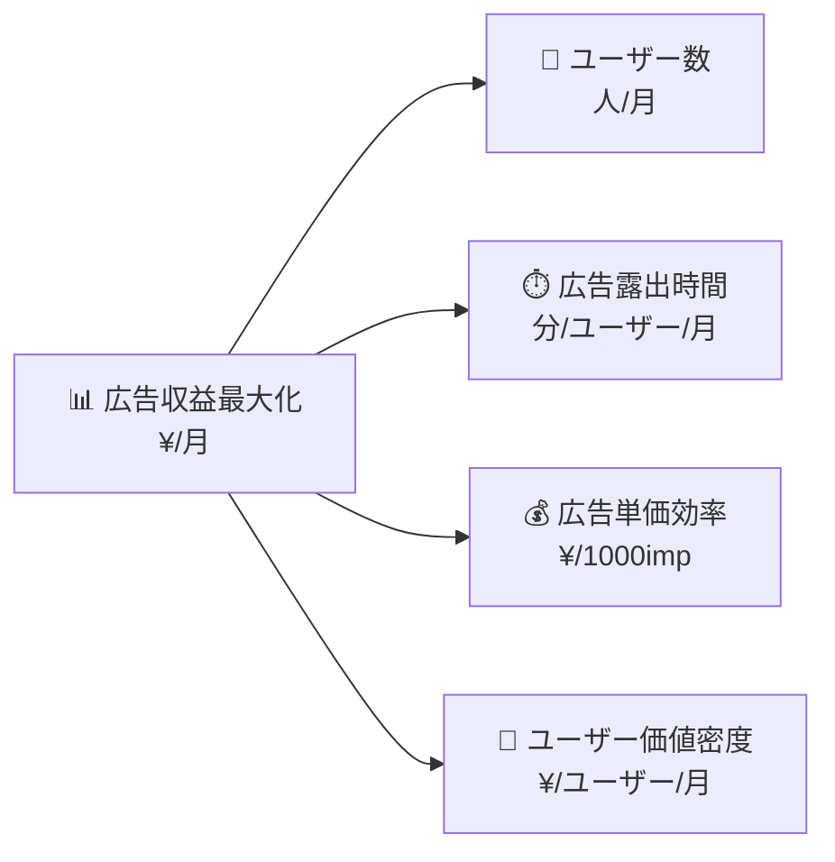

# 監視・メトリクス設計ドキュメント

## 概要

本ディレクトリでは、クイズアプリケーションの**広告収益最大化**を目標とした包括的な監視・メトリクス体系を定義しています。
事業成功に直結する指標から、技術的なサービス品質基準まで、体系的に設計された監視戦略を提供します。

## ドキュメント構成

### 📊 [kgi-kpi-tree-structure.md](./kgi-kpi-tree-structure.md)
**KGI/KPI論理ツリー構造定義**

- **ルートKGI**: 広告収益最大化（¥/月）
- **主要KPI**: ユーザー数・広告露出時間・広告単価効率・ユーザー価値密度
- **詳細指標**: 各KPIを構成する具体的測定指標（単位付き）
- **論理関係**: `収益 = ユーザー数 × 露出時間 × 単価効率 × 価値密度`



### ✅ [metrics-logical-validation.md](./metrics-logical-validation.md)
**メトリクス論理整合性検証**

- **5軸検証**: 完全性・測定可能性・因果関係・独立性・実現可能性
- **相関関係分析**: 正の相関・トレードオフ・独立関係の整理
- **実装優先度**: Phase 1（基本）→ Phase 2（成長）→ Phase 3（最適化）
- **リスク評価**: パフォーマンス・データ品質・プライバシー対応

## 設計の特徴

### 🎯 事業目標との直結
- **広告収益**を唯一のルートKGIとして明確化
- 全ての技術指標が最終的に収益向上に寄与する論理構造
- 施策の優先度判断が収益インパクトで明確に決定可能

### 📏 測定可能性の徹底
- **具体的単位**：全指標に明確な測定単位を設定
- **実装可能性**：実際のコードレベルでの計算方法を提示
- **データ存在性**：既存のログ・DBから取得可能な指標設計

### 🔄 段階的実装アプローチ
- **Phase 1（MVP）**：基本的で即効性のある指標
- **Phase 2（成長期）**：詳細分析・最適化に必要な指標
- **Phase 3（最適化期）**：高度な個人化・予測分析指標

### ⚖️ バランス重視設計
- **品質 vs スピード**：エラーバジェット管理による適切なバランス
- **詳細度 vs 実装コスト**：段階的詳細化による現実的アプローチ
- **自動化 vs 人的判断**：適切な閾値設定とエスカレーション

## 実装ガイドライン

### 🚀 クイックスタート
1. **Phase 1指標の実装**：[kgi-kpi-tree-structure.md](./kgi-kpi-tree-structure.md)のKPI-1.3, KPI-2.1を優先
2. **基本SLO設定**：[slo-sli-specification.md](./slo-sli-specification.md)のTier 1 Criticalから開始
3. **計算式実装**：[kpi-calculation-formulas.md](./kpi-calculation-formulas.md)の基本指標から着手

### 📊 監視ダッシュボード推奨構成
```typescript
interface DashboardLayout {
  executive: {
    kgi: '広告収益（日/週/月）',
    mainKPIs: ['ユーザー数', '広告露出時間', '単価効率', '価値密度']
  };

  operational: {
    slos: ['可用性', '広告表示成功率', '応答時間'],
    alerts: '違反中SLO・エラーバジェット消費状況'
  };

  analytical: {
    detailedKPIs: 'Sub-KPI レベルの詳細分析',
    correlations: 'KPI間相関・トレンド分析'
  };
}
```

### 🔧 技術実装要件
- **データ基盤**：PostgreSQL + TimescaleDB（時系列データ）
- **計算処理**：Apache Airflow（バッチ処理）+ Redis（キャッシュ）
- **監視基盤**：Prometheus + Grafana + AlertManager
- **ログ収集**：Fluent Bit + Elasticsearch

## 更新・保守指針

### 📅 定期見直しサイクル
- **週次**：SLO違反状況・エラーバジェット消費率確認
- **月次**：KPI実績評価・目標値適正性見直し
- **四半期**：指標体系の包括的検証・新指標導入検討
- **年次**：事業戦略変化に応じた根本的再設計

### 🔄 継続的改善プロセス
1. **データ品質監視**：指標の正確性・完全性の継続的検証
2. **予測精度向上**：統計モデル・機械学習手法の段階的導入
3. **自動化拡大**：手動運用の段階的自動化・効率化
4. **ステークホルダー価値向上**：各層のニーズに応じたダッシュボード最適化

## 関連ドキュメント

### 📋 プロジェクト要件・設計
- [要件定義](../../project/specifications/requirements/requirements-quiz.md)
- [非機能要件](../../project/architecture/non-functional-requirements.md)
- [システム概要](../../project/architecture/system-overview.md)

### 🏗️ アーキテクチャ・実装
- [DDD設計](../../project/ddd-design/README.md)
- [UI設計](../../project/ui-design/1.00_overview.md)
- [ADR（技術選択記録）](../../project/adr/README.md)

### 🔧 開発・運用
- [実装ガイド](../../instructions/shared/workflow/README.md)
- [テスト戦略](../../instructions/shared/tests/)
- [Git運用](../../instructions/shared/tools/git.md)

---

**作成日**: 2025-01-31
**最終更新**: 2025-01-31
**保守担当**: Development Team
**レビュー周期**: 月次
