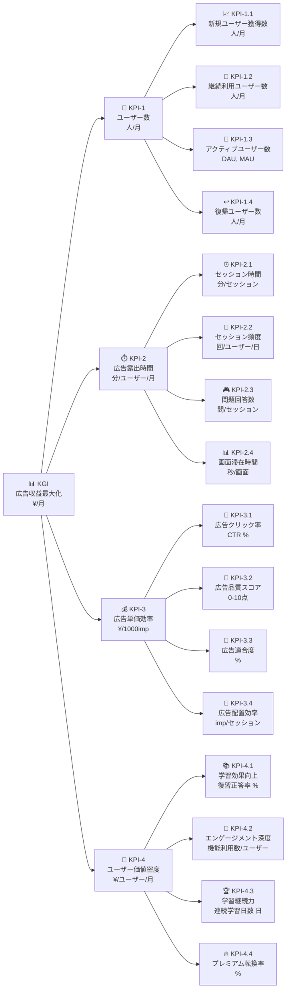

# KGI/KPI論理ツリー構造定義

## 概要

本ドキュメントでは、クイズアプリケーションの事業成功を**広告収益最大化**として定義し、それを実現するための論理的に整合性の取れたKPI構造を定義する。
広告収益を直接構成する主要KPIから、詳細な測定可能指標まで階層的に分解した指標体系を構築する。

## KGI設定方針

### 広告収益最大化をルートKGIとする理由

- **事業本質**: クイズアプリの収益源は広告収入が中心
- **測定明確性**: 広告収益は最も客観的で測定しやすい成功指標
- **意思決定直結**: 全ての施策が最終的に広告収益向上に寄与すべき

## KGI/KPI横向きツリー構造



## 主要KPI詳細定義

### KPI-1: ユーザー数（人/月）

**定義**: 広告を閲覧する可能性のあるユーザーベースの規模

**広告収益への寄与**: ユーザー数 × 広告露出 = 総広告インプレッション

**測定方法**: MAU（月間アクティブユーザー）を基準とした総合指標

### KPI-2: 広告露出時間（分/ユーザー/月）

**定義**: ユーザー1人が1ヶ月間に広告を見る可能性のある総時間

**広告収益への寄与**: 長時間利用 → 多広告露出 → 高収益

**測定方法**: セッション時間 × セッション頻度 × 広告露出係数

### KPI-3: 広告単価効率（¥/1000imp）

**定義**: 広告1000インプレッション当たりの収益額（CPM）

**広告収益への寄与**: 同じ露出数でも単価向上で収益最大化

**測定方法**: 広告プラットフォームからの実績データ

### KPI-4: ユーザー価値密度（¥/ユーザー/月）

**定義**: ユーザー1人当たりの月間収益貢献度（ARPU）

**広告収益への寄与**: 価値の高いユーザーほど広告主にとって魅力的

**測定方法**: 総広告収益 ÷ MAU

## 詳細KPI階層構造

### KPI-1階層: ユーザー数（人/月）

#### KPI-1.1: 新規ユーザー獲得数（人/月）

```
KPI-1.1 新規ユーザー獲得数
├── Sub-KPI-1.1.1: オーガニック流入ユーザー数（人/月）
├── Sub-KPI-1.1.2: SNS経由獲得ユーザー数（人/月）
├── Sub-KPI-1.1.3: 検索流入ユーザー数（人/月）
└── Sub-KPI-1.1.4: 紹介・口コミ獲得ユーザー数（人/月）
```

#### KPI-1.2: 継続利用ユーザー数（人/月）

```
KPI-1.2 継続利用ユーザー数
├── Sub-KPI-1.2.1: 2週目継続ユーザー数（人/月）
├── Sub-KPI-1.2.2: 1ヶ月継続ユーザー数（人/月）
├── Sub-KPI-1.2.3: 3ヶ月継続ユーザー数（人/月）
└── Sub-KPI-1.2.4: 6ヶ月以上継続ユーザー数（人/月）
```

#### KPI-1.3: アクティブユーザー数（DAU, MAU）

```
KPI-1.3 アクティブユーザー数
├── Sub-KPI-1.3.1: 日間アクティブユーザー数（DAU/日）
├── Sub-KPI-1.3.2: 週間アクティブユーザー数（WAU/週）
├── Sub-KPI-1.3.3: 月間アクティブユーザー数（MAU/月）
└── Sub-KPI-1.3.4: Stickiness比率（DAU/MAU, %）
```

#### KPI-1.4: 復帰ユーザー数（人/月）

```
KPI-1.4 復帰ユーザー数
├── Sub-KPI-1.4.1: 1週間離脱後復帰ユーザー数（人/月）
├── Sub-KPI-1.4.2: 1ヶ月離脱後復帰ユーザー数（人/月）
├── Sub-KPI-1.4.3: 3ヶ月離脱後復帰ユーザー数（人/月）
└── Sub-KPI-1.4.4: 復帰後の継続率（%）
```

### KPI-2階層: 広告露出時間（分/ユーザー/月）

#### KPI-2.1: セッション時間（分/セッション）

```
KPI-2.1 セッション時間
├── Sub-KPI-2.1.1: 平均セッション時間（分/セッション）
├── Sub-KPI-2.1.2: セッション時間中央値（分/セッション）
├── Sub-KPI-2.1.3: 5分以上セッション率（%）
└── Sub-KPI-2.1.4: 15分以上長時間セッション率（%）
```

#### KPI-2.2: セッション頻度（回/ユーザー/日）

```
KPI-2.2 セッション頻度
├── Sub-KPI-2.2.1: 日間平均セッション数（回/ユーザー/日）
├── Sub-KPI-2.2.2: 複数セッションユーザー率（%）
├── Sub-KPI-2.2.3: ピーク時間帯セッション集中率（%）
└── Sub-KPI-2.2.4: 習慣的利用ユーザー率（週5日以上, %）
```

#### KPI-2.3: 問題回答数（問/セッション）

```
KPI-2.3 問題回答数
├── Sub-KPI-2.3.1: セッション当たり回答数（問/セッション）
├── Sub-KPI-2.3.2: 回答完了率（%）
├── Sub-KPI-2.3.3: 連続回答数（問/連続）
└── Sub-KPI-2.3.4: 途中離脱率（%、逆指標）
```

#### KPI-2.4: 画面滞在時間（秒/画面）

```
KPI-2.4 画面滞在時間
├── Sub-KPI-2.4.1: 問題画面滞在時間（秒/問題）
├── Sub-KPI-2.4.2: 解説画面滞在時間（秒/解説）
├── Sub-KPI-2.4.3: 履歴画面滞在時間（秒/履歴表示）
└── Sub-KPI-2.4.4: 広告表示時間（秒/広告）
```

### KPI-3階層: 広告単価効率（¥/1000imp）

#### KPI-3.1: 広告クリック率（CTR %）

```
KPI-3.1 広告クリック率
├── Sub-KPI-3.1.1: バナー広告CTR（%）
├── Sub-KPI-3.1.2: ネイティブ広告CTR（%）
├── Sub-KPI-3.1.3: 動画広告完視率（%）
└── Sub-KPI-3.1.4: インタースティシャル広告CTR（%）
```

#### KPI-3.2: 広告品質スコア（0-10点）

```
KPI-3.2 広告品質スコア
├── Sub-KPI-3.2.1: 広告関連性スコア（0-10点）
├── Sub-KPI-3.2.2: ユーザー体験評価スコア（0-10点）
├── Sub-KPI-3.2.3: 広告主満足度スコア（0-10点）
└── Sub-KPI-3.2.4: 表示品質スコア（0-10点）
```

#### KPI-3.3: 広告適合度（%）

```
KPI-3.3 広告適合度
├── Sub-KPI-3.3.1: ユーザー属性適合率（%）
├── Sub-KPI-3.3.2: 学習コンテンツ関連度（%）
├── Sub-KPI-3.3.3: 時間帯適合率（%）
└── Sub-KPI-3.3.4: デバイス適合率（%）
```

#### KPI-3.4: 広告配置効率（imp/セッション）

```
KPI-3.4 広告配置効率
├── Sub-KPI-3.4.1: セッション当たり広告インプレッション数（imp/セッション）
├── Sub-KPI-3.4.2: 問題間広告表示率（%）
├── Sub-KPI-3.4.3: 最適タイミング配置率（%）
└── Sub-KPI-3.4.4: 広告疲労度（低いほど良い、0-10点）
```

### KPI-4階層: ユーザー価値密度（¥/ユーザー/月）

#### KPI-4.1: 学習効果向上（復習正答率 %）

```
KPI-4.1 学習効果向上
├── Sub-KPI-4.1.1: 24時間以内復習正答率（%）
├── Sub-KPI-4.1.2: 1週間以内復習正答率（%）
├── Sub-KPI-4.1.3: 1ヶ月以内復習正答率（%）
└── Sub-KPI-4.1.4: 弱点分野改善率（%）
```

#### KPI-4.2: エンゲージメント深度（機能利用数/ユーザー）

```
KPI-4.2 エンゲージメント深度
├── Sub-KPI-4.2.1: 利用機能数（個/ユーザー/月）
├── Sub-KPI-4.2.2: 高度機能利用率（%）
├── Sub-KPI-4.2.3: カスタマイズ機能活用率（%）
└── Sub-KPI-4.2.4: ソーシャル機能参加率（%）
```

#### KPI-4.3: 学習継続力（連続学習日数 日）

```
KPI-4.3 学習継続力
├── Sub-KPI-4.3.1: 最長連続学習日数（日）
├── Sub-KPI-4.3.2: 平均継続日数（日/ユーザー）
├── Sub-KPI-4.3.3: 7日以上継続率（%）
└── Sub-KPI-4.3.4: 30日以上継続率（%）
```

#### KPI-4.4: プレミアム転換率（%）

```
KPI-4.4 プレミアム転換率
├── Sub-KPI-4.4.1: 無料→有料転換率（%）
├── Sub-KPI-4.4.2: プレミアム機能利用率（%）
├── Sub-KPI-4.4.3: 課金ユーザー継続率（%）
└── Sub-KPI-4.4.4: ARPU向上率（¥/ユーザー/月）
```

## 広告収益最大化の数式構造

### 基本収益公式

```
広告収益 = ユーザー数 × 広告露出時間 × 広告単価効率 × ユーザー価値密度

Revenue = Users × ExposureTime × CPM × ARPU
```

**各要素の関係性**:
- **ユーザー数**: 広告を見る人数の基盤
- **広告露出時間**: 1人当たりの広告接触機会
- **広告単価効率**: 1広告当たりの収益単価
- **ユーザー価値密度**: ユーザーの価値をさらに高める要素

### KPI間の論理的必要十分性

各主要KPIは、以下の原則で設計：

- **相互独立性**: KPI間の重複・矛盾を排除
- **完全性**: 広告収益の全構成要素をカバー
- **測定可能性**: 具体的な数値で測定可能
- **因果関係**: KPI改善が直接収益向上に寄与

### 指標間の相関関係

**正の相関（synergy効果）**:
- セッション時間 ↔ 広告露出時間（長時間利用→多広告接触）
- 学習効果向上 ↔ 継続利用（効果実感→継続利用）
- エンゲージメント深度 ↔ ユーザー価値密度（深い利用→高価値）

**トレードオフ関係（バランス調整必要）**:
- 広告露出頻度 ↔ ユーザー体験（過度な広告→離脱リスク）
- 新規獲得 ↔ 獲得コスト（大量獲得→コスト増加）

**独立関係**:
- 新規ユーザー獲得 ↔ 既存ユーザーエンゲージメント（短期的に独立）

## 測定実装上の注意点

### データ収集要件

1. **ユーザー行動ログ**: 回答履歴・セッション情報・機能利用状況
2. **学習成果データ**: 正答率変化・進捗状況・弱点改善状況  
3. **継続利用データ**: ログイン履歴・利用パターン・離脱復帰行動

### プライバシー・セキュリティ配慮

- 個人識別情報の匿名化・仮名化
- 学習データの適適切な暗号化・アクセス制御
- GDPR・個人情報保護法準拠のデータ取り扱い

### リアルタイム性とバッチ処理のバランス

- **リアルタイム**: セッション継続率・即時フィードバック指標
- **バッチ処理**: 復習正答率・長期継続率・トレンド分析

---

**作成日**: 2025-01-31  
**作成者**: System  
**更新日**: 2025-01-31