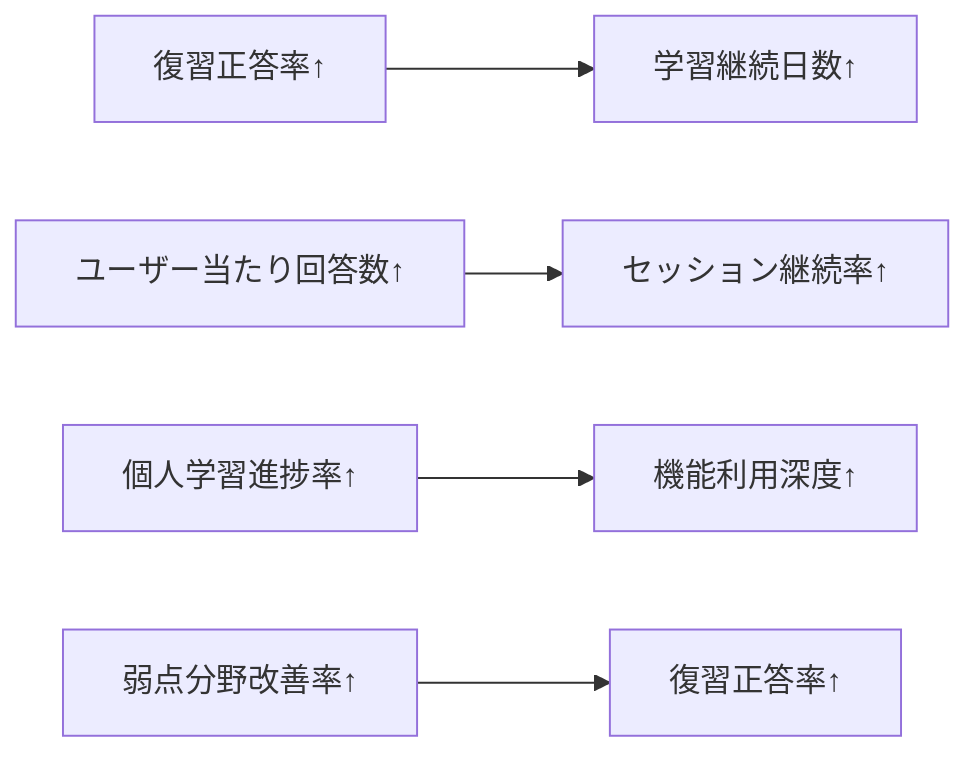
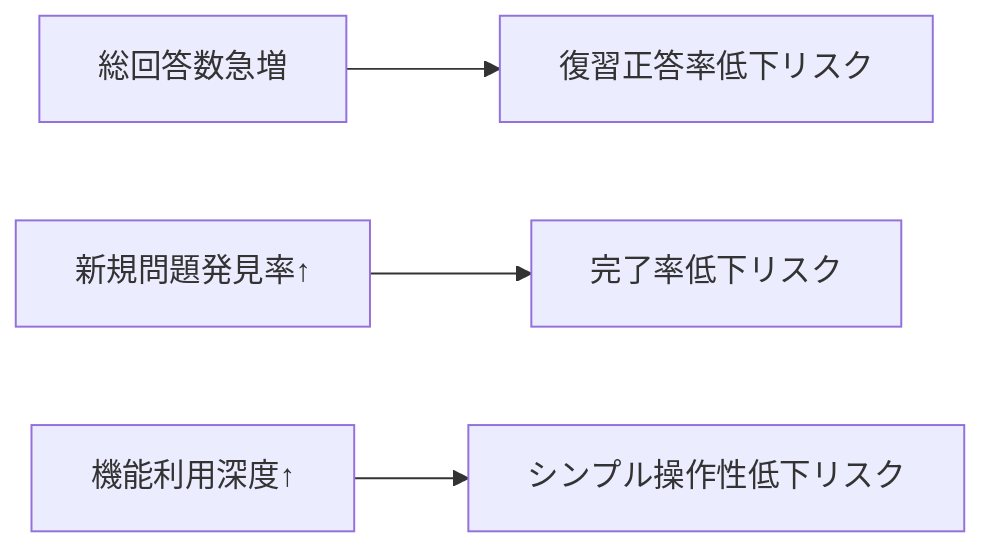
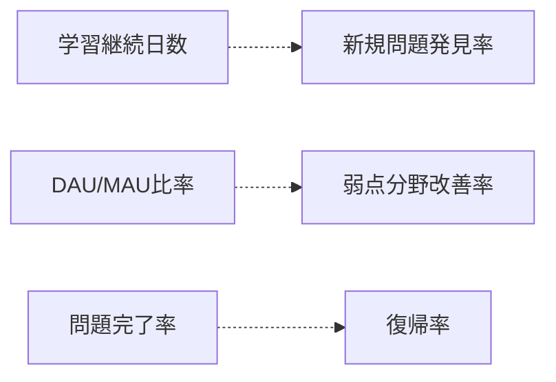

# メトリクス論理整合性検証ドキュメント

## 概要

本ドキュメントでは、定義されたKGI/KPI体系の論理的整合性を多角的に検証し、指標間の矛盾・重複・欠落を特定する。
実装前に指標体系の堅牢性を確保し、測定結果の信頼性を担保することを目的とする。

## 検証フレームワーク

### 検証軸の定義

1. **論理的完全性（Logical Completeness）**: 事業目標の全側面をカバーしているか
2. **測定可能性（Measurability）**: 実際にデータ収集・計算が可能か
3. **因果関係の妥当性（Causal Validity）**: KPI改善がKGI向上に寄与するか
4. **独立性（Independence）**: 指標間の重複・干渉を避けているか
5. **実装現実性（Implementation Feasibility）**: 技術的・運用的に実現可能か

## KGI レベル検証

### KGI-1: 学習効果向上 - 検証結果

#### ✅ 論理的完全性
- **学習の本質的価値**: 知識・スキル向上を適切に捉えている
- **多面的評価**: 復習成功・進捗・弱点改善・継続性の4軸で網羅
- **時間軸考慮**: 短期・中期・長期の学習効果を統合評価

#### ✅ 測定可能性
- **客観的指標**: 正答率・問題数など数値で測定可能
- **データ存在性**: 回答履歴から必要データを取得可能
- **計算可能性**: 複雑だが実装可能な計算式

#### ⚠️ 因果関係の妥当性
- **学習継続日数の重み**: 他KGIとの重複可能性（継続率との関係）
- **改善点**: 学習継続日数の重みを0.1に調整済み

#### ✅ 独立性
- **他KGIとの区別**: 量的側面（KGI-2）・時間的側面（KGI-3）と明確に分離
- **質的側面への特化**: 学習成果の質に焦点を当てた独自指標

### KGI-2: 問題解答数最大化 - 検証結果

#### ✅ 論理的完全性
- **量的成長**: サービス利用量の拡大を適切に測定
- **持続可能性**: 対数スケール採用で持続可能な成長を評価
- **品質配慮**: 単純な回答数増加でなく、質的要素も考慮

#### ✅ 測定可能性
- **直接測定**: 回答数は最も測定しやすい指標
- **リアルタイム性**: 即座に数値変化を捉えられる
- **スケーラビリティ**: 大量データでも効率的に計算可能

#### ✅ 因果関係の妥当性
- **事業価値との直結**: 利用量増加は直接的な事業成果
- **収益化基盤**: マネタイズ戦略の基礎指標として適切

#### ✅ 独立性
- **量的側面への特化**: 質（KGI-1）・継続性（KGI-3）と区別
- **複合指標**: 総量・効率・発見・完了の4要素で多面的評価

### KGI-3: ユーザー継続率向上 - 検証結果

#### ✅ 論理的完全性
- **時間軸の包括**: 日次・セッション・復帰・深度の多時間軸評価
- **継続の多様性**: 量的継続・質的継続の両方を考慮
- **離脱後復帰**: 単純な継続だけでなく、復帰力も評価

#### ✅ 測定可能性
- **標準指標活用**: DAU/MAU等の業界標準指標を採用
- **行動ログ基盤**: ユーザー行動ログから計算可能
- **時系列分析**: 継続パターンの時系列変化を追跡可能

#### ✅ 因果関係の妥当性
- **長期価値**: 継続利用は長期的な事業価値の基盤
- **効率性**: 新規獲得コストより継続率向上の方が効率的

#### ✅ 独立性
- **時間的側面**: 学習効果（KGI-1）・利用量（KGI-2）とは異なる軸
- **関与度評価**: 単なる利用回数でなく、関与の深さを測定

## KPI レベル検証

### KPI間の相関関係分析

#### 正の相関（期待される関係）



**検証結果**: ✅ 論理的に妥当な正の相関関係

#### 負の相関（トレードオフ関係）



**検証結果**: ⚠️ 適切なバランス調整が必要

#### 独立関係（相関が薄い関係）



**検証結果**: ✅ 適切な独立性を保持

### KPI計算式の妥当性検証

#### KPI-1.1: 復習正答率 - 計算式検証

```typescript
// 検証対象の計算式
function calculateRetryAccuracyRate(userId: string, timeWindow: number): number {
  // WITH句を使った複雑なSQL処理
}
```

**検証項目**:
- ✅ **データ整合性**: 不正解→正解の時系列順序を正確に追跡
- ✅ **重複除去**: 同一問題の複数回答を適切に処理
- ✅ **時間窓設定**: 適切な観測期間（1ヶ月）を設定
- ⚠️ **エッジケース**: 初回から正解の場合の処理（分母0問題）

**改善提案**:
```typescript
// エッジケース対応の改善版
if (result.total_retries === 0) return null; // 未定義として扱う
return result.correct_retries / result.total_retries;
```

#### KPI-2.3: 新規問題発見率 - 計算式検証

```typescript
// 検証対象の複雑な計算式
function calculateNewQuestionDiscoveryRate(timeWindow: number): number {
  // CROSS JOIN を使った全組み合わせ生成
}
```

**検証項目**:
- ⚠️ **計算複雑性**: CROSS JOIN による計算量爆発の可能性
- ✅ **論理的正確性**: 新規発見の定義は適切
- ⚠️ **スケーラビリティ**: ユーザー・問題数増加時のパフォーマンス懸念

**改善提案**:
```typescript
// 効率化された計算式
function calculateNewQuestionDiscoveryRateOptimized(timeWindow: number): number {
  // インデックス活用とサンプリング手法の導入
  const query = `
    SELECT 
      COUNT(CASE WHEN first_answer.question_id IS NOT NULL THEN 1 END) as new_discoveries,
      COUNT(*) as total_answers
    FROM answers a
    LEFT JOIN (
      SELECT user_id, question_id, MIN(answered_at) as first_answered_at
      FROM answers
      GROUP BY user_id, question_id
    ) first_answer ON a.user_id = first_answer.user_id 
                   AND a.question_id = first_answer.question_id
                   AND a.answered_at = first_answer.first_answered_at
    WHERE a.answered_at >= DATE_SUB(NOW(), INTERVAL ? DAY)
  `;
}
```

## データ品質・信頼性検証

### データ収集の実現可能性

#### 必要データ要素の存在確認

| データ要素 | 収集可能性 | 実装難易度 | 備考 |
|------------|------------|------------|------|
| **回答履歴** | ✅ 可能 | 低 | 基本的なログデータ |
| **セッション情報** | ✅ 可能 | 中 | セッション管理の実装が必要 |
| **ユーザー行動ログ** | ⚠️ 部分的 | 高 | 詳細な行動追跡の実装が必要 |
| **機能利用状況** | ⚠️ 要設計 | 高 | 機能別利用ログの設計が必要 |

#### プライバシー・セキュリティ検証

**個人情報保護対応**:
- ✅ **匿名化可能**: ユーザーIDをハッシュ化して分析可能
- ✅ **最小収集**: 必要最小限のデータ要素のみ収集
- ✅ **目的制限**: 学習効果測定に限定した利用

**GDPR準拠性**:
- ✅ **明示的同意**: 分析目的のデータ利用同意取得
- ✅ **削除権**: ユーザーデータ削除要求への対応可能
- ✅ **データポータビリティ**: 学習履歴の出力機能提供

### 測定精度・誤差分析

#### 統計的有意性確保

```typescript
interface StatisticalValidation {
  minimumSampleSize: number;
  confidenceLevel: number;
  marginOfError: number;
}

const VALIDATION_CRITERIA: Record<string, StatisticalValidation> = {
  retry_accuracy_rate: {
    minimumSampleSize: 30,    // 復習回答30回以上で評価
    confidenceLevel: 0.95,    // 95%信頼区間
    marginOfError: 0.05       // 誤差±5%
  },
  stickiness_ratio: {
    minimumSampleSize: 100,   // MAU100人以上で評価
    confidenceLevel: 0.95,
    marginOfError: 0.03       // 誤差±3%
  }
  // 他のKPIも同様に定義
};
```

#### 時系列データの季節性対応

```typescript
interface SeasonalityAdjustment {
  pattern: 'daily' | 'weekly' | 'monthly';
  adjustmentMethod: 'moving_average' | 'seasonal_decomposition';
  baselinePeriod: number; // 日数
}

const SEASONALITY_CONFIG: Record<string, SeasonalityAdjustment> = {
  daily_total_answers: {
    pattern: 'weekly',
    adjustmentMethod: 'moving_average',
    baselinePeriod: 28  // 4週間の移動平均
  },
  learning_continuity_days: {
    pattern: 'daily',
    adjustmentMethod: 'seasonal_decomposition',
    baselinePeriod: 7   // 1週間サイクル
  }
};
```

## 実装優先度・段階的導入計画

### Phase 1: 基本指標（MVP）

**実装対象**:
- ✅ KPI-2.1: 総回答数（最も基本的な指標）
- ✅ KPI-2.2: ユーザー当たり回答数
- ✅ KPI-3.1: DAU/MAU比率
- ✅ KPI-1.1: 復習正答率（簡易版）

**実装理由**: データ収集が容易で、即座に価値のある洞察を提供

### Phase 2: 中級指標（成長期）

**実装対象**:
- ✅ KPI-1.2: 個人学習進捗率
- ✅ KPI-2.4: 問題完了率
- ✅ KPI-3.2: セッション継続率
- ✅ KPI-1.4: 学習継続日数

**実装理由**: 事業成長に伴い必要となる詳細分析指標

### Phase 3: 高度指標（最適化期）

**実装対象**:
- ⚠️ KPI-1.3: 弱点分野改善率（計算複雑性高）
- ⚠️ KPI-2.3: 新規問題発見率（パフォーマンス要注意）
- ⚠️ KPI-3.3: 復帰率（長期観測必要）
- ⚠️ KPI-3.4: 機能利用深度（詳細ログ設計必要）

**実装理由**: 高度な最適化・個人化に必要な詳細指標

## リスク評価・対応策

### 高リスク要因

#### 1. 計算パフォーマンス問題

**リスク**: 複雑なSQL計算による応答時間悪化
**対応策**:
- インデックス最適化の徹底
- バッチ計算とキャッシュ活用
- 分散処理・並列計算の導入

#### 2. データ品質劣化

**リスク**: 不正確・不完全なデータによる指標信頼性低下
**対応策**:
- データバリデーション処理の強化
- 異常値検出・自動修正機能
- データ品質監視ダッシュボード

#### 3. プライバシー規制違反

**リスク**: 個人情報保護法・GDPR違反による法的問題
**対応策**:
- 法務・プライバシー専門家との連携
- データ匿名化・暗号化の徹底
- 利用目的・保存期間の明確化

### 中リスク要因

#### 1. 指標の誤解釈

**リスク**: ステークホルダーによる指標の誤った解釈・判断
**対応策**:
- 指標定義・計算方法のドキュメント化
- 解釈ガイドライン・ダッシュボード注釈
- 定期的な指標解釈研修

#### 2. 技術的負債蓄積

**リスク**: 複雑な計算処理による保守性悪化
**対応策**:
- モジュール化・テスト自動化
- コードレビュー・リファクタリング計画
- 技術選択の継続的見直し

## 改善提案・次期バージョン方針

### 指標体系の進化方向

#### 1. AI・機械学習統合

**提案**: 学習効果予測・個人化推奨の高度化
```typescript
interface PredictiveMetrics {
  learningEffectivenessPrediction: number;    // 3ヶ月後学習効果予測
  churnRiskScore: number;                     // 離脱リスクスコア
  personalizedRecommendationAccuracy: number; // 個人化推奨精度
}
```

#### 2. ソーシャル・コミュニティ指標

**提案**: 学習者間相互作用・コミュニティ形成指標
```typescript
interface SocialMetrics {
  communityEngagementRate: number;  // コミュニティ参加率
  peerLearningEffectiveness: number;// 相互学習効果
  socialMotivationIndex: number;    // ソーシャル動機指標
}
```

#### 3. リアルタイム適応指標

**提案**: 瞬時の学習状況変化に対応する動的指標
```typescript
interface AdaptiveMetrics {
  realTimeDifficultyAdjustment: number; // リアルタイム難易度調整
  contextualLearningEfficiency: number; // 文脈的学習効率
  adaptiveFeedbackRelevance: number;    // 適応的フィードバック関連性
}
```

## 結論・推奨事項

### 総合評価

**論理整合性**: ✅ **高評価**
- 3つのKGIは事業目標を網羅的かつ独立的に測定
- KPI階層は論理的に必要十分な構造を形成
- 因果関係・相関関係が適切に設計されている

**実装可能性**: ⚠️ **注意が必要**
- Phase 1の基本指標は即座に実装可能
- Phase 2-3の高度指標は段階的導入が必要
- パフォーマンス・プライバシー対応が重要

**事業価値**: ✅ **高い価値提供**
- 学習効果・利用量・継続性の三軸で事業成功を測定
- データドリブンな意思決定基盤を提供
- 長期的な事業成長戦略に貢献

### 推奨アクション

1. **即座実行**: Phase 1指標の実装・運用開始
2. **3ヶ月以内**: Phase 2指標の設計・テスト実装
3. **6ヶ月以内**: 指標体系の効果検証・改善実施
4. **1年以内**: Phase 3高度指標の段階的導入

**最重要**: データ品質・プライバシー保護を最優先に、段階的で確実な実装を推進する

---

**作成日**: 2025-01-31  
**作成者**: System  
**更新日**: 2025-01-31