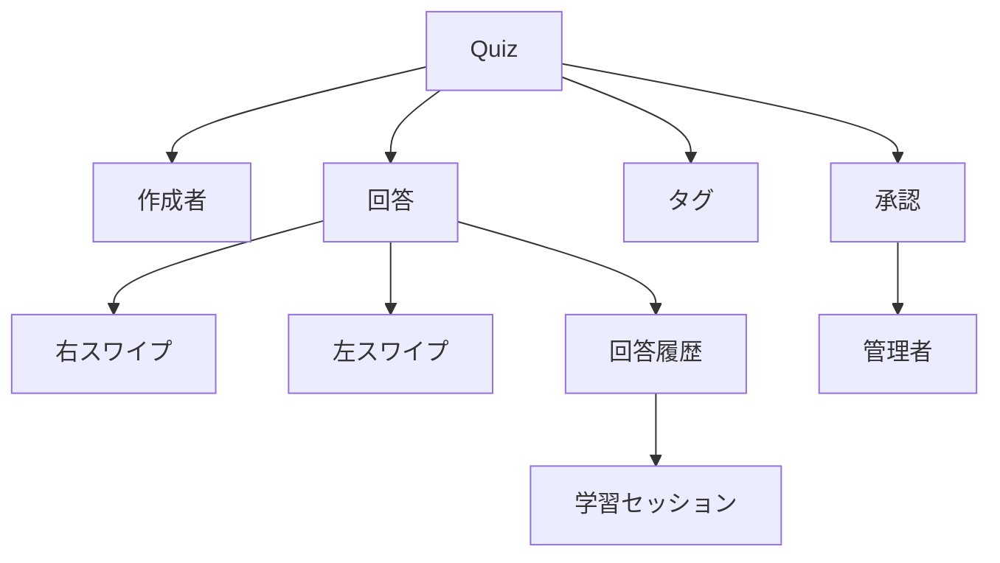

# 案5: ハイブリッド包括型

## フォーマット概要

全ての観点（ドメイン理解・BDD・実装・ビジネス）を統合した包括的な管理形式。モジュール構造で各用途に最適化された情報を提供し、プロジェクトの全フェーズで活用可能。

## 構成

```markdown
# ユビキタス言語辞書（包括版）

## モジュール構成
### Core Dictionary（基本辞書）
### BDD Module（BDD特化情報）
### Implementation Module（実装情報）
### Business Context（ビジネス文脈）

## 各モジュールの相互参照
### 概念間関係図
### 使用場面別インデックス
### 変更影響範囲マトリックス

各用語の標準形式：
- **Core**: 日本語・英語・定義・制約
- **BDD**: Gherkin表現・ステップ定義
- **Implementation**: TypeScript型・命名規則
- **Business**: ビジネス価値・制約理由
```

## サンプル実装

```markdown
# ユビキタス言語辞書（包括版）

## Core Dictionary（基本辞書）

### クイズ (Quiz)

#### 基本情報
- **日本語**: クイズ
- **英語**: Quiz
- **変数名**: quiz
- **定義**: 問題文・正解・解説・タグ・承認状態を持つ◯×形式の学習問題
- **ドメイン分類**: Entity（集約ルート）
- **ライフサイクル**: 投稿 → 承認待ち → 承認済み/承認拒否

#### 制約・ルール
- **問題文**: 必須・500文字以内・HTMLサニタイズ必須
- **正解**: ◯×の2択必須
- **解説**: 任意・1000文字以内
- **タグ**: 任意・複数設定可・日本語英数字対応
- **承認**: 管理者承認後のみ一般公開

#### BDD Module
```gherkin
Given クイズが承認済みである
When ユーザーがクイズに回答する  
Then クイズの解説が表示される
```

**ステップ定義**:
```typescript
Given('クイズが承認済みである', async function() {
  this.quiz = await testDataFactory.createApprovedQuiz({
    question: 'TypeScriptの型システムは静的型付けですか？',
    correctAnswer: true,
    explanation: 'TypeScriptはコンパイル時に型チェックを行う静的型付け言語です。'
  });
});
```

#### Implementation Module
**TypeScript型定義**:
```typescript
interface Quiz {
  readonly id: QuizId;
  question: Question;
  correctAnswer: boolean;
  explanation?: Explanation;
  tags: Tag[];
  status: QuizStatus;
  creatorId: CreatorId;
  readonly createdAt: Date;
  approvedAt?: Date;
}

type QuizStatus = 'pendingApproval' | 'approved' | 'rejected';
type QuizId = string & { __brand: 'QuizId' };
```

**命名規則**:
- ファイル名: `quiz.entity.ts`, `QuizCard.tsx`
- API: `GET /api/quizzes`, `POST /api/quizzes`
- Component: `QuizCard`, `QuizForm`, `QuizDetail`
- Hook: `useQuiz`, `useQuizList`, `useCreateQuiz`

#### Business Context
- **ビジネス価値**: 学習効率向上、知識定着促進
- **制約理由**: 
  - 500文字制限 → モバイル表示最適化
  - 承認フロー → 品質保証・不適切コンテンツ排除
  - ◯×形式限定 → シンプルさによる利用促進
- **成功指標**: 回答完了率、正答率、継続利用率

---

### 作成者 (Creator)

#### 基本情報
- **日本語**: 作成者
- **英語**: Creator
- **変数名**: creator
- **定義**: salt付きハッシュで識別される匿名のクイズ投稿者
- **ドメイン分類**: Entity
- **特徴**: 匿名性、ブラウザベース識別、重複投稿許可

#### 制約・ルール
- **識別方法**: salt付きハッシュ（SHA-256推奨）
- **匿名性**: ログイン不要、個人情報不要
- **デバイス識別**: ブラウザローカルストレージ保存
- **重複投稿**: 同一問題でも投稿可能

#### BDD Module
```gherkin
Given 作成者が存在する
When 作成者がクイズを投稿する
Then 作成者識別情報が保存される
```

**ステップ定義**:
```typescript
Given('作成者が存在する', async function() {
  this.creator = await testDataFactory.createAnonymousCreator();
  await this.browser.setLocalStorage('creatorId', this.creator.id);
});
```

#### Implementation Module
**TypeScript型定義**:
```typescript
interface Creator {
  readonly id: CreatorId;
  readonly saltHash: string;
  readonly isAnonymous: true;
  readonly createdAt: Date;
  deviceFingerprint?: string;
}

interface CreatorIdentification {
  creatorId: CreatorId;
  saltHash: string;
  expiresAt: Date;
}
```

**命名規則**:
- ファイル名: `creator.entity.ts`, `CreatorService.ts`
- Storage: `localStorage.creatorId`, `sessionStorage.creatorHash`
- Component: `CreatorProfile`, `CreatorQuizList`

#### Business Context
- **ビジネス価値**: 参加障壁低減、コンテンツ供給促進
- **制約理由**:
  - 匿名性 → プライバシー保護、参加促進
  - salt付きハッシュ → 不正防止、一意性保証
- **リスク**: 不適切投稿、スパム、なりすまし

---

### 右スワイプ (SwipeRight)

#### 基本情報
- **日本語**: 右スワイプ
- **英語**: SwipeRight
- **変数名**: swipeRight
- **定義**: ◯選択を意味する右方向のスワイプ操作
- **ドメイン分類**: User Action
- **UI分類**: Touch Gesture

#### 制約・ルール
- **方向**: 左から右（正の値）
- **閾値**: 最小移動距離100px
- **速度**: 最小速度0.3px/ms
- **デバイス**: タッチ対応デバイスのみ
- **応答**: 即座に◯判定実行

#### BDD Module
```gherkin
When ユーザーが右スワイプする
Then ◯として回答が記録される
And 正誤判定が表示される
```

**ステップ定義**:
```typescript
When('ユーザーが右スワイプする', async function() {
  await this.page.locator('[data-testid="quiz-card"]').dispatchEvent('touchstart', {
    touches: [{ clientX: 100, clientY: 200 }]
  });
  await this.page.locator('[data-testid="quiz-card"]').dispatchEvent('touchend', {
    touches: [{ clientX: 250, clientY: 200 }]
  });
  this.userAnswer = true;
});
```

#### Implementation Module
**TypeScript型定義**:
```typescript
interface SwipeGesture {
  direction: 'left' | 'right';
  startX: number;
  endX: number;
  deltaX: number;
  velocity: number;
  timestamp: number;
}

interface SwipeRightAction {
  type: 'SWIPE_RIGHT';
  payload: {
    quizId: QuizId;
    answer: true;
    timestamp: Date;
  };
}
```

**実装詳細**:
```typescript
// Hook
const useSwipeGesture = (onSwipeRight: () => void, onSwipeLeft: () => void) => {
  // 実装詳細
};

// Component
const SwipeableQuizCard = ({ quiz, onAnswer }: SwipeableQuizCardProps) => {
  const handleSwipeRight = () => onAnswer(quiz.id, true);
  const handleSwipeLeft = () => onAnswer(quiz.id, false);
  
  useSwipeGesture(handleSwipeRight, handleSwipeLeft);
  // 実装詳細
};
```

#### Business Context
- **ビジネス価値**: 直感的操作、操作効率向上、エンゲージメント向上
- **UX設計意図**: Tinder UI → 親しみやすさ、学習コスト低減
- **成功指標**: 操作成功率、操作時間、ユーザー満足度

## モジュール間参照

### 概念間関係図


### 使用場面別インデックス

#### ドメイン設計時
- **エンティティ**: Quiz, Creator, Answer
- **値オブジェクト**: Question, Tag, Explanation
- **ドメインサービス**: Approval, QuizValidation
- **集約**: QuizAggregate, LearningSessionAggregate

#### BDD実装時
- **Given句**: "クイズが承認済みである", "作成者が存在する"
- **When句**: "ユーザーが右スワイプする", "管理者が承認する"
- **Then句**: "正誤判定が表示される", "回答履歴に記録される"

#### TypeScript実装時
- **型定義**: Quiz, Creator, Answer, SwipeGesture
- **コンポーネント**: QuizCard, SwipeableCard, JudgmentBanner
- **API**: QuizAPI, CreatorAPI, AnswerAPI
- **Store**: QuizStore, UserStore, UIStore

#### ビジネス要件定義時
- **価値**: 学習効率向上, 参加障壁低減, 品質担保
- **制約**: 匿名性保持, モバイル最適化, スパム対策
- **指標**: 完了率, 正答率, 継続率, 満足度

### 変更影響範囲マトリックス

| 変更対象 | Quiz | Creator | Answer | SwipeRight | Approval |
|----------|------|---------|--------|------------|----------|
| **Quiz** | 🔴直接 | 🟡関連 | 🟡関連 | 🟢軽微 | 🔴直接 |
| **Creator** | 🟡関連 | 🔴直接 | 🟢軽微 | 🟢軽微 | 🟡関連 |
| **Answer** | 🟡関連 | 🟢軽微 | 🔴直接 | 🔴直接 | 🟢軽微 |
| **SwipeRight** | 🟢軽微 | 🟢軽微 | 🔴直接 | 🔴直接 | 🟢軽微 |
| **Approval** | 🔴直接 | 🟡関連 | 🟢軽微 | 🟢軽微 | 🔴直接 |

凡例: 🔴直接影響, 🟡関連影響, 🟢軽微影響

## 運用ガイドライン

### 更新プロセス
1. **Core Dictionary更新** → 基本情報の変更
2. **各モジュール同期** → BDD/Implementation/Business情報の更新
3. **影響範囲確認** → 変更影響マトリックスでの確認
4. **関連ドキュメント更新** → 設計書・テスト・実装コードの更新

### 品質保証
- **一貫性チェック**: 各モジュール間の情報一致確認
- **実装同期確認**: TypeScript型定義とCore辞書の同期
- **BDD実行可能性**: ステップ定義の動作確認
- **ビジネス価值確認**: 制約理由とビジネス要件の整合性

### チーム利用方法
- **ドメインエキスパート**: Business Context中心
- **BDDエンジニア**: BDD Module中心
- **実装エンジニア**: Implementation Module中心
- **プロダクトマネージャー**: Core Dictionary + Business Context
```

## 利点・欠点

### 利点
- ✅ **完全性**: 全観点を網羅した包括的情報
- ✅ **モジュール性**: 用途別に最適化された情報提供
- ✅ **一貫性**: 全モジュール間での用語統一
- ✅ **実用性**: 全開発フェーズでの活用可能
- ✅ **変更管理**: 影響範囲の明確化

### 欠点
- ❌ **文書量**: 大量の情報で管理負荷が大
- ❌ **複雑性**: 初見者には情報過多
- ❌ **更新コスト**: 一つの変更で複数箇所更新必要
- ❌ **習得コスト**: 全体構造の理解に時間要

## 適用場面
- 大規模・長期プロジェクト
- 多職種チームでの用語統一が重要
- ドメイン・BDD・実装の全てを重視
- 品質とメンテナンス性を最優先
- 包括的なドキュメント整備が必要