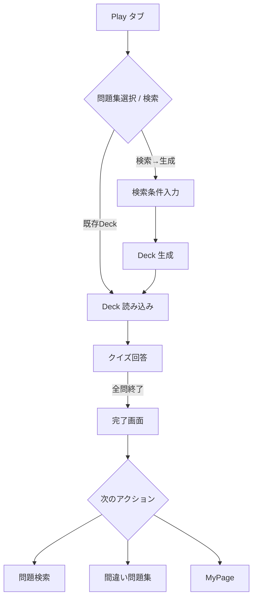
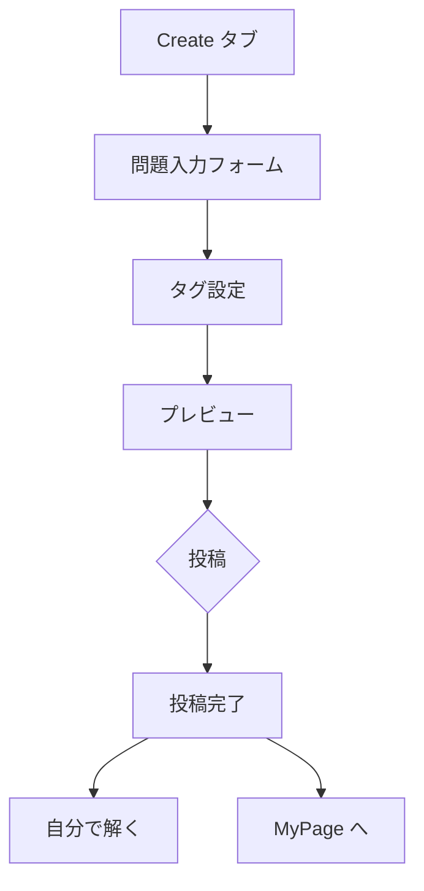
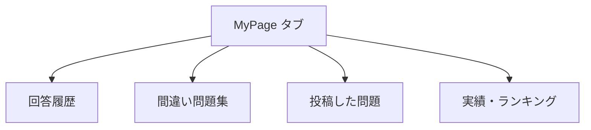

# クイズアプリ 機能要求仕様書 v1.1

> **改訂日**: 2025‑07‑31

---

## 1. 用語定義

| 用語             | 説明                        |
| -------------- | ------------------------- |
| **問題**         | 単一のクイズ（設問＋選択肢＋正答＋解説）      |
| **問題集 (Deck)** | 複数の問題を束ねた集合。最大 100 問      |
| **公認タグ**       | 運営が管理する公式タグ（例: #英単語, #歴史） |
| **ユーザタグ**      | 作問者が任意に付与できる自由タグ          |

---

## 2. 画面構成（下部メニュータブ）

1. **Play**  – 問題を解く / 問題検索
2. **Create** – 問題を作成
3. **MyPage** – 実績・投稿・履歴

> MVP では **Play / Create / MyPage** を固定ボタンで実装し、v1.x でスワイプ UI へ拡張。

---

## 3. ユーザー操作フロー

### 3.1 デッキ解答フロー

### 3.2 問題作成フロー

### 3.3 MyPage 閲覧フロー

---

## 4. 機能詳細

### 4.1 Play: 回答する

| ID   | 機能       | 詳細                                     |
| ---- | -------- | -------------------------------------- |
| P‑01 | 問題集選択    | 過去に解いた／間違えた／公開済みの Deck から選択            |
| P‑02 | 問題検索     | 公認・ユーザタグや難易度等で条件検索し、Deck を作成（最大 100 問） |
| P‑03 | クイズ回答 UI | 画面中央に問題表示。横スワイプで正誤回答／後部に解説表示           |
| P‑04 | ナビゲーション  | 上スワイプまたはタイマーで次問／下スワイプで前問／上下同時でスキップ     |
| P‑05 | 完了画面     | 全問終了後「お疲れ様でした」＋検索・間違い問題・MyPage への導線    |

> **MVP 差分**: スワイプ→ボタン操作（正 / 誤 / スキップ）。

### 4.2 Play: Deck 管理

| ID   | 機能         | 詳細                        |
| ---- | ---------- | ------------------------- |
| D‑01 | Deck 作成    | 検索結果から一括生成。後から Deck 同期も可能 |
| D‑02 | Deck キャッシュ | IndexedDB に保存（オフライン閲覧準備）  |

### 4.3 Create: 問題作成

| ID   | 機能     | 詳細                       |
| ---- | ------ | ------------------------ |
| C‑01 | 作問フォーム | 問題文・選択肢・正答・解説を入力         |
| C‑02 | タグ設定   | 公認タグ ≥1 必須 + 任意タグ複数      |
| C‑03 | プレビュー  | Play 画面ライクなプレビュー         |
| C‑04 | 投稿     | MVP は匿名投稿／v3.0.0 でユーザ紐付け |

### 4.4 MyPage

| ID   | 機能       | 詳細                   |
| ---- | -------- | -------------------- |
| M‑01 | 回答履歴一覧   | 日付・Deck・正答率を表示       |
| M‑02 | 間違い問題集   | 自動生成 Deck を再チャレンジ    |
| M‑03 | 投稿管理     | 自作問題の正答率・保存数・難易度を可視化 |
| M‑04 | 実績・ランキング | タグ別レベル・偏差値・バッジ表示     |

---

## 5. バージョンロードマップ

| Version         | 主な追加/変更                  | 完了判定                     |
| --------------- | ------------------------ | ------------------------ |
| **1.0.0 (MVP)** | 作問・検索・回答・履歴・間違い問題／ボタン UI | End‑to‑End テスト通過         |
| **1.x.y**       | スワイプ UI・アニメーション          | Storybook Visual テスト差分 0 |
| **2.0.0**       | 完全オフライン (PWA)            | 機内モードで Deck 作成〜回答可能      |
| **3.0.0**       | 認証・プロフィール                | 投稿とユーザを紐付け、データ多端末同期      |

---

## 6. 非機能要件

| 項目       | 要求                                    |
| -------- | ------------------------------------- |
| パフォーマンス  | 1 クイズ遷移 ≤ 100 ms（ローカルキャッシュ時）          |
| オフライン    | v2.0.0 以降全機能利用可                       |
| データ保全    | 回答履歴は `問題ID+バージョン` で保存し、問題改訂後も過去正誤を保持 |
| アクセシビリティ | キーボード操作互換 & ARIA ラベル完備                |

---

## 7. タグ管理仕様

| 種類    | 追加権限 | 目的                 |
| ----- | ---- | ------------------ |
| 公認タグ  | 運営   | 検索カテゴリ (#英単語)      |
| ユーザタグ | 作問者  | ニッチな絞込 (#TOEIC900) |

---

## 8. 依存ライブラリ・API

- **Frontend**: Remix / React / IndexedDB (Dexie) / Service Worker
- **UI**: Storybook / TailwindCSS / Framer‑motion
- **Backend**: Kotlin × Spring Boot × PostgreSQL

---

## 9. 関連ドキュメント

- [UI 設計ガイドライン（Markdown+Mermaid+Storybook）](sandbox:/canvas/6888449eacec8191b032841f1aea27a6)
- ページ階層: `/docs/pages.yaml`（未作成）
- ワイヤーフレーム: `/docs/wireframes/` 以下に順次追加

---

> 以上。ユーザー操作フローを追加し、ユーザ・背景に関する章は削除しました。今後の変更要求があればお知らせください。

